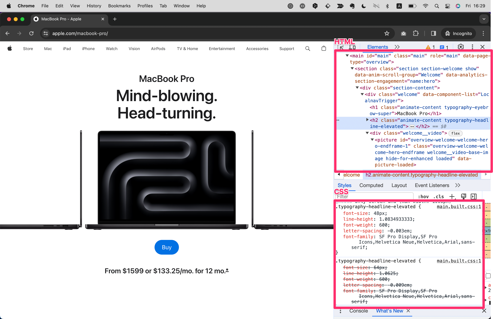

# HTMLとは？CSSとは？
HTMLとはHyperText Markup Languageの略で、Webページを作成するための言語、CSSとはCascading Style Sheetsの略で、Webページの見た目を装飾するための言語です。
マークアップ言語、スタイルシート言語とも呼ばれます。
__HTMLはWebページの骨組み__ を作成し、 __CSSはその骨組みを装飾する__ ために用いられます。

試しにAppleのWebサイトとそのソースコードを見てみましょう。
これはブラウザのGoogle Chromeに備わっている開発者ツール（Developer Tool）と呼ばれる機能を使って、Webページのソースコードを表示させた画面です。（開発者ツールについてはChapter.xで後述）
<!-- TODO -->



このように、Webページに __テキストや画像などの要素を配置するためにはHTMLを使い__ 、 __それらの大きさを変えたりレイアウトを調整したりちょっとしたアニメーションを加えるのにはCSSを使います。__

```
【コラム】HTMLとCSSはプログラミング言語ではない？
HTMLとCSSはマークアップ言語、スタイルシート言語と呼び、厳密にはプログラミング言語ではありません。  
プログラミング言語とは、コンピュータに対して何らかの処理を行うための言語のことで、アルゴリズムを作ったりすることで効率的なプログラムを書くことができるという特徴をもちます。  
HTMLやCSSは、コンピュータに対して処理を行うための言語ではなく、Webページを作成するための言語で、Webブラウザが解釈することでページを表示します。
とはいえWebブラウザ上で動くWebサイトやアプリケーションを作るには欠かせない言語ですので、本書では最低限の仕組みを理解していただくことを目的として解説していきます。
```

# HTMLとCSSのバージョン

## HTMLのバージョン
HTMLにはこれまで複数のバージョンがあり、呼び方にいまいち統一性がありません。
HTML4, XHTML, HTML5,などと進んできており、本書執筆時点（2024/1）の最新版は`HTML Living Standard`と呼ばれるものです。
HTML5は2014年に正式策定されたあと2021年1月には廃止され、以降は`HTML Living Standard`が主流です。
HTML5が廃止されてから比較的時間が経過していないため、ネット上でHTMLの情報を調べるとしばしばバージョンが混在して紹介されていますが、しかしこれらのバージョンの違いによる影響はほとんどありません。（XHTMLやHTML4はさすがに古いので参照しないほうが良いでしょう）
本書では`HTML Living Standard`に準拠して解説していきます。

## CSSのバージョン
CSSにはこれまでCSS1, CSS2, CSS3, CSS4といった呼び方がありましたが、本書執筆時点（2024/1）では呼び方が`CSS`に統一されました。
こちらもHTML同様、ネット上で情報を調べるとしばしばバージョンが混在して紹介されていますが、CSSも基本的な仕様に変わりはありません。
ざっくり流れを説明すると、CSS2までは見た目の装飾を調整することがCSSの役割でした。CSS3あたりからは表現の幅が増え、よりクリエイティブに装飾を変更したり、簡単なアニメーションであればWebページに動きをつけることもできるようになりました。
本書ではそうした仕様を踏まえ、最新の`CSS`に準拠して解説していきます。