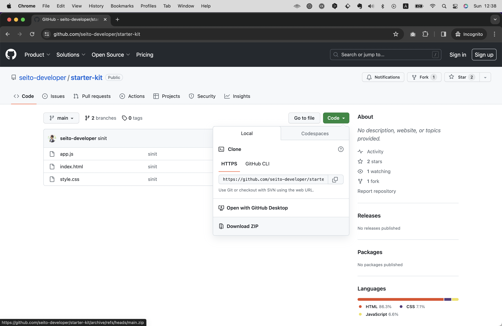
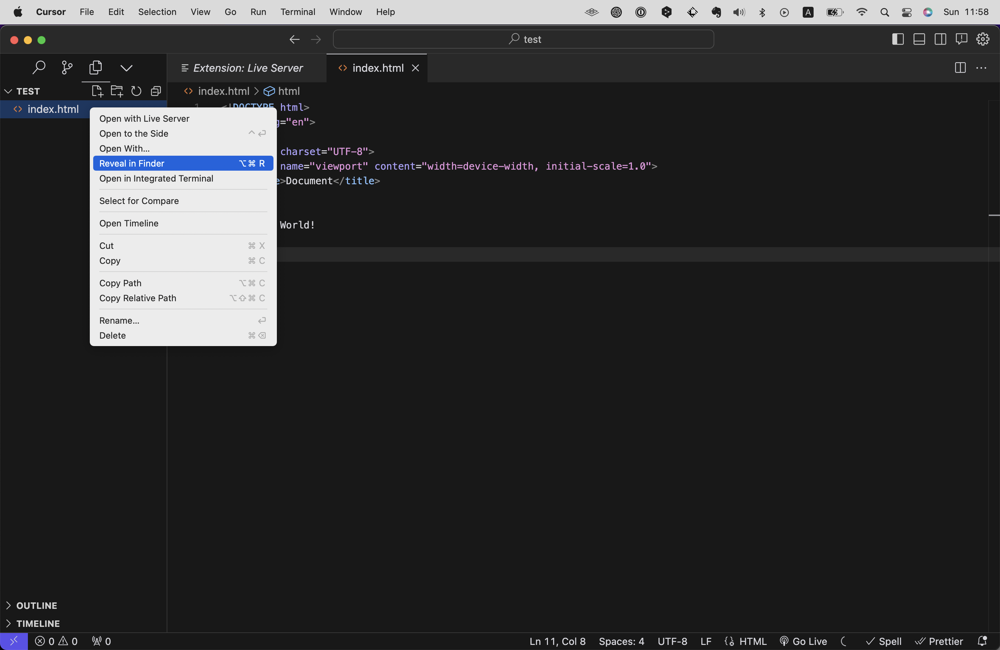
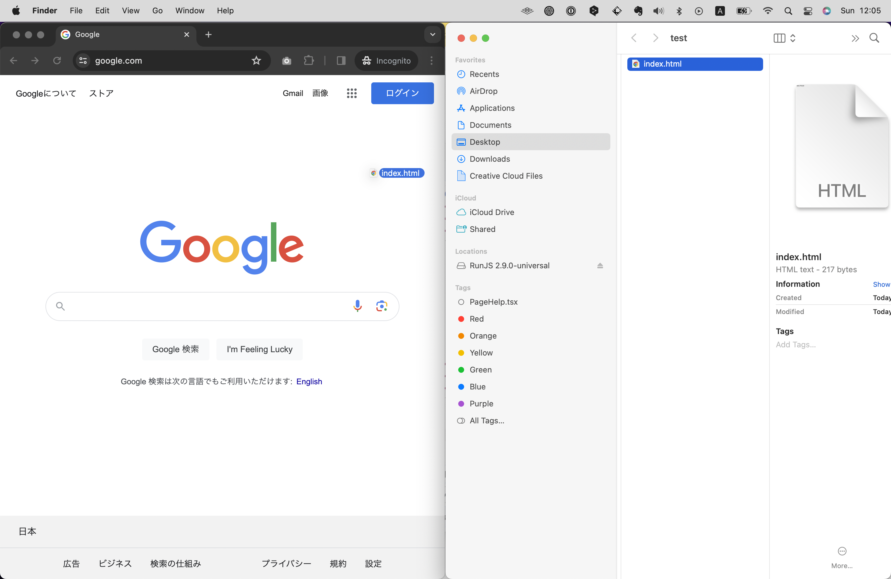
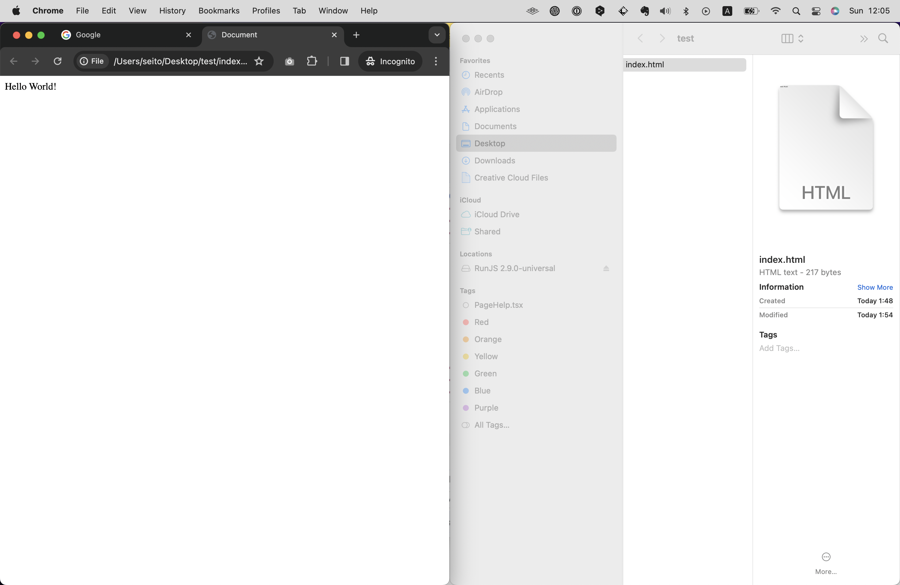
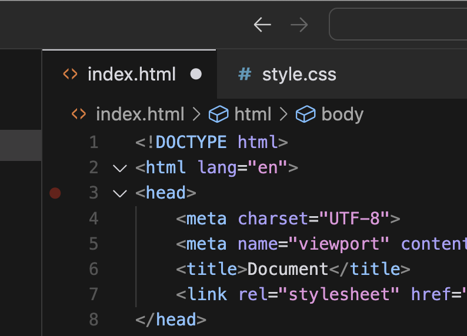

# はじめに
Chapter 2.3と2.4では読者の皆さんに大枠を知ってもらうべく、とりあえずHTMLとCSSがどんなものか触れてみてもらうことに注力して解説します。
途中、HTMLやCSSの仕様に関して意味がわからないことが多々出てくると思いますが、それらは後ほど詳しく説明していきますので、とりあえずは「こういうものがあるんだな」ということを知ってもらうことに集中してください！

また、救済措置としてサンプルコードを下記のWebページに置きました。
もし本書通りに進めてもうまくいかなければこちらからデータをダウンロードして確認しください。
htmlやcssファイルを作成するステップを省略できるので、そのままCursorで読み込みファイルを開いてください。

https://github.com/seito-developer/starter-kit




（「緑のボタン`Code`をクリック → `Download ZIP`をクリック」でZIPでデータをダウンロード後、解答してお使いください）


# サンプルのプロジェクトをつくる
まずはサンプルのプロジェクトをCursorに読み込ませたいと思います。（このフォルダをプロジェクトと呼びます。）
任意の場所、例えばデスクトップや書類フォルダ上など、任意の場所に`test`という名前で空のフォルダを作成し、Cursorに読み込ませてください。（Cursorへの読み込ませ方は前の章（Chapter 2.2）を参照してください。）

するとこのようなとくに何も表示されていない画面になるかと思います。


続いて左側サイドバーにカーソルを持っていくと、新規ファイル作成メニューのアイコンが表示されるので、これをクリックし、ファイル名を入力します。
ここでは`index.html`と入力してください。
このとき、拡張子によって自動で言語が識別されます。`.html`とつけたら自動でHTMLファイルとして認識されます。


これでHTMLファイルが作成されました。
すると右側のメインメニューで作成された`index.html`ファイルが開かれますので、ここにコードを書いてみましょう。

試しに`html:5`と入力してみてください。すると図のようにサジェスト（提案）が表示されるはずです。


`html:5`を選択しエンターまたはタブキーを押すと下記のように雛形が一気に展開されます。


これはHTML決まり文句のようなもので、ややこしい内容ですがこれがないと正しく表示されません。(この内容については後ほど詳しく説明します)

`<body>`と`</body>`の間に`Hello World!`と入力し、ファイルを保存してください。（ctrl+S/cmd+S）

``` html
<!DOCTYPE html>
<html lang="en">
<head>
    <meta charset="UTF-8">
    <meta name="viewport" content="width=device-width, initial-scale=1.0">
    <title>Document</title>
</head>
<body>
    Hello World!
</body>
</html>
```

ここまで本書どおりに進んでいれば、ブラウザでこのHTMLファイルを開けるはずです。
ブラウザで開くには、このHTMLファイルをブラウザにドラッグ＆ドロップします。

サイドメニュー上で `index.html` を右クリックし、`macOS) Reveal in Finder` / `Windows) Reveal in Explorer`を選択すると、ファイルが保存されている場所がFinder上で開きます。



あとはファイルをブラウザにドラッグ＆ドロップするだけです。



ここまでタイピングミスなどしていなければ、下記のように表示されていることでしょう。



おめでとうございます！これであなたはHTMLを書くことができるようになりました！
つづいてCSSも書いてみましょう。

------

【コラム】
更新したにも関わらずファイルを保存していない場合は下記のようにファイル名の右側に●が表示されます。（保存したらこのマークは消えます）

しかし毎回保存するのを忘れてしまわないよう、Chapter2.2で説明したように設定で自動保存機能をオンにしておくことをおすすめします。（Auto Save: afterDelay)

------