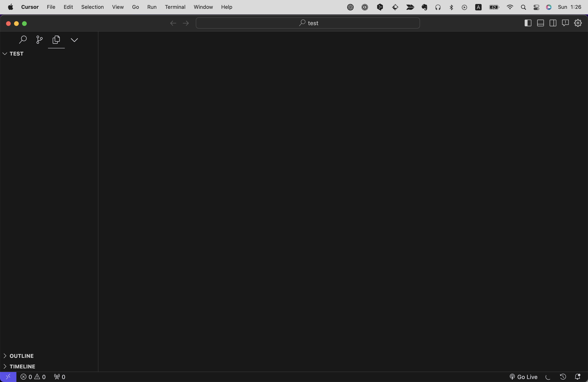
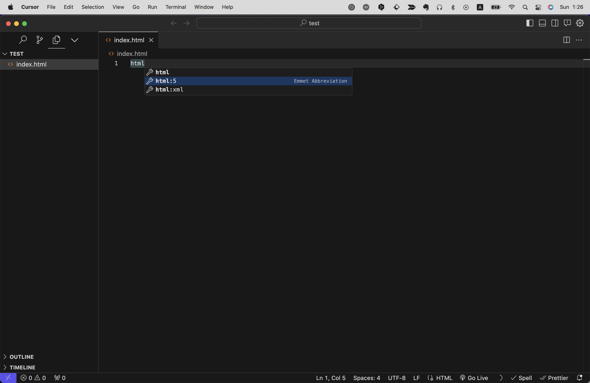
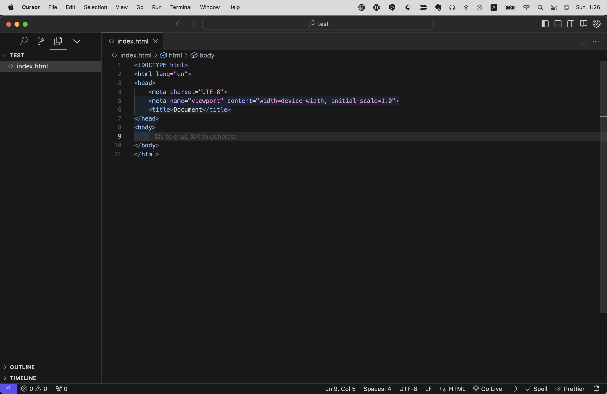

# サンプルのプロジェクトをつくる
まずはサンプルのプロジェクトをCursorに読み込ませたいと思います。（このフォルダをプロジェクトと呼びます。）
任意の場所、例えばデスクトップや書類フォルダ上など、任意の場所に`test`という名前で空のフォルダを作成し、Cursorに読み込ませてください。（Cursorへの読み込ませ方は前の章（Chapter 2.2）を参照してください。）

するとこのようなとくに何も表示されていない画面になるかと思います。

続いて左側サイドバーにカーソルを持っていくと、新規ファイル作成メニューのアイコンが表示されるので、これをクリックし、ファイル名を入力します。
ここでは`index.html`と入力してください。
このとき、拡張子によって自動で言語が識別されます。`.html`とつけたら自動でHTMLファイルとして認識されます。

これでHTMLファイルが作成されました。
すると右側のメインメニューで作成された`index.html`ファイルが開かれますので、ここにコードを書いてみましょう。

試しに`html:5`と入力してみてください。すると図のようにサジェストが表示されるはずです。
`html:5`を選択すると下記のように雛形が一気に展開されます。

これはHTMLお決まりの雛形のようなもので、ややこしい内容ですがこれがないと正しく表示されません。
（しかしCursorでは、このような雛形を先述のように簡単に作成することができます！）

`<body>`と`</body>`の間に`Hello World!`と入力し、ファイルを保存してください。（ctrl+S/cmd+S）

## ※うまくいかない人へ
私のGitHubリポジトリ上に、html,css,jsの最小限のコードが入った雛形のデータ一式の用意があります。（Chapter X参照）
これをダウンロードすればhtmlやjsファイルを作成するステップを省略できるので、そのままCursorで読み込みファイルを開いてください。
<!-- TODO -->

https://github.com/seito-developer/starter-kit

# HTMLを書いてみる

- caniuse
- devtool
- sass
- 画像
- IDE
- HtmlLint
