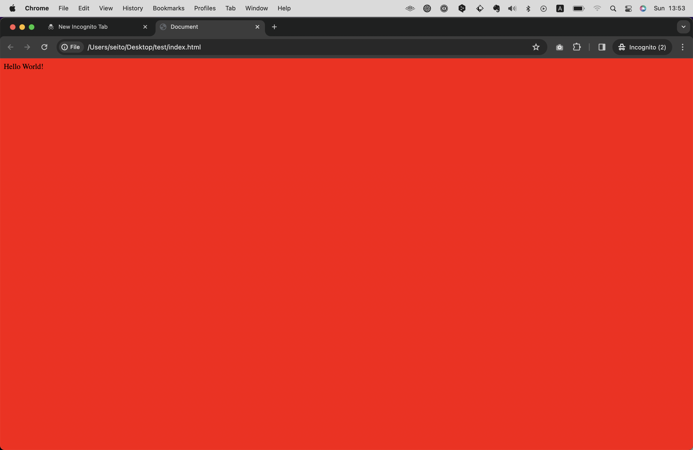

# CSSファイルを用意する
先程HTMLファイルを作った要領で、今度はCSSファイルを作ります。
ファイル名は`style.css`としてみましょう。


するとCSSファイルが作成され、編集できるようになります。


ここにCSSを書いていきます。
試しに下記のように書いてみましょう。

``` css
body {
    background-color: red;
}
```

これはWebページの背景を真っ赤にする命令ですが、これだけではまだ機能しません。
CSSをHTMLに適応させるには、HTMLファイル内でCSSを読み込ませる指示を書く必要があります。
というわけで、先ほど作成した`index.html`を開き`<head> ~ </head>`内に下記のHTMLを足してください。

```html
<link rel="stylesheet" href="./style.css">
```

このとき、全文を打ち込まずとも、`link`と入力するだけでサジェストが表示されるので、これを選択してタブキーまたはエンターキーを押します。


すると全文が展開されます。
次に、`href`を書かれた部分にCSSファイルまでのパスを記述します。ここでも、全文を打つことなく`./`とだけ入力すればサジェストが表示されるので、タブキーまたはエンターで確定させます。（パスについては後述）
<!-- TODO -->


これでCSSを読み込ませることができました。
ここまでの記述の全文は下記のようになっているはずです。

``` html
<!DOCTYPE html>
<html lang="en">
<head>
    <meta charset="UTF-8">
    <meta name="viewport" content="width=device-width, initial-scale=1.0">
    <title>Document</title>
    <link rel="stylesheet" href="./style.css">
</head>
<body>
    Hello World!
</body>
</html>
```

```css
body {
    background-color: red;
}
```

ブラウザで`index.html`を開き、更新してみましょう。下記のようにページが真っ赤になるはずです。


おめでとうございます！これであなたはCSSを書くことができるようになりました！
次のセクションからはHTMLとCSSの仕様について詳しく解説してきます。

```
【コラム】
先程のHTMLの決まり文句やlinkのように、入力が大変なコードでもCursorであればコードの一部を入力しただけでサジェストしてくれる、補完機能なるものが搭載されています。
Chapter 4.1ではこうしたCursorの機能についてより詳細に解説しているので、効率を重視されたい方は先にそちらを読んでからこのChapterに戻ってくることをオススメします。
```