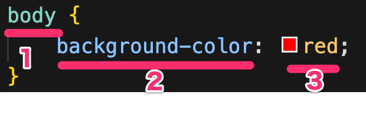

# CSSの基本ルール
つづいてCSSの基礎仕様を解説します。
CSSも先程までは体験することに重点を置いていましたが、ここからは詳しく仕様について解説していきます。

- CSSは半角英数字で書く
- `/*  */`で囲った部分はコメントになり、コードとして認識されなくなる
- CSSファイルは拡張子`.css`で保存する
- CSSは`セレクタ、プロパティ名、プロパティ値`と呼ばれる記述の集合体で構成される

半角英数字で書く、についてはHTMLの項目でも説明しましたね。
コメントはHTMLとは使う記号が異なりますが、基本的な使い方は同じです。
CSSは基本的にはHTMLとは別ファイルに記述することになるので、拡張子は`.css`となります。

# セレクタ、プロパティ名、プロパティ値の書き方
CSSの書き方として、大まかには下記の2ステップでコーディングを行います。
<!-- TODO コーディングの説明いる？ -->
1. まずHTMLのどの要素に対して装飾を当てたいのか決める
2. 1に対して任意の装飾をあてるためのCSSを書く

セレクタとは、このステップにおける`どの要素に対して`のことを指し、プロパティ名とその値は`任意の装飾`のことを指します。
具体的には下記のような構造でできており、セレクタ名の後に波括弧`{ ... }`で囲まれた部分にプロパティ名と値を記述します。



1. セレクタ
2. プロパティ名
3. プロパティ値

## セレクタ
セレクタの代表的なものとしては、例えば下記の3つがあります。

| セレクタの種類 | 例 |
| --- | --- |
| タグ名 | `div { ... }` |
| class | `.foo { ... }` |
| id | `#foo { ... }` |

タグで指定する場合はそのままHTMLで書いたタグ名をCSS上で書くだけで指定することができます。  
classの場合はまず任意のHTMLタグにclass属性を値とともに付与し、その後CSS上ではドットを先頭に持ってきて`.class名`と記述することで指定できます。  
idの場合はまず任意のHTMLタグにid属性を値とともに付与し、その後CSS上ではシャープを先頭に持ってきて`#id名`と記述することで指定できます。  

(idとclass属性についてはChapter2.3のHTMLの説明で少しだけ触れましたが、このように活用する属性でした！)

```html
<p> ... </p>
<div class="foo"> ... </div>
<div id="bar"> ... </div>
```

```css
p {
    color: red;
}

.foo {
    color: blue;
}

#bar {
    color: green;
}
``` 

この場合は上から順に、`pタグ`要素内のテキストを赤色、クラス`.foo`要素内のテキストを青色、ID`#bar`要素内のテキストを緑色にするという意味になります。

なお、 __id属性は同じ値を持つ要素はそのHTMLファイル上に1つしか存在してはいけない__ というルールがあります。（class属性は同じ値を持つ要素が複数存在してもOK）
例えば下記のような例はNGです。

```html
<div id="foo"> ... </div>
<div id="foo"> ... </div>
```

値が違う場合はOKです。

```html
<div id="foo"> ... </div>
<div id="bar"> ... </div>
```

### さまざまなセレクタの指定方法
CSSではこの他にも、セレクタの組み合わせによってさまざまな指定方法があります。

#### 1.グループ化: 
`,`で区切ることで、複数のセレクタをまとめて指定することができる。
```css
.foo, .bar {
    color: red;
}
```

#### 2.子結合子:
複数のセレクタ同士の間を小なり記号`>`で区切り、`セレクタ1 > セレクタ2`と記述することで、 __セレクタ1の直下にあるセレクタ2を指定する__ という命令にできる。
```html
<div class="foo">
    <p> ... </p>
</div>
```
```css
.foo > p {
    color: red;
}
```

#### 3.子孫結合子: 
複数のセレクタ同士の間を半角スペースで区切り、`セレクタ1 セレクタ2`と記述することで、 __セレクタ1の中にあるセレクタ2を指定する__ という命令にできる。
```html
<div class="foo">
    <p>
        <span> ... </span>
    </p>
</div>
```
```css
.foo span {
    color: red;
}
```

小結合子と子孫結合子は仕様が似ているようで違います。
小結合子はセレクタ1の直下にあるセレクタ（1つ下の階層）にしかCSSを反映させないのに対し、子孫結合子はセレクタ1の中にあるセレクタ2（階層の縛りがない）を指定します。
子孫結合子の方が影響範囲が大きく、その名の通り、子か孫か、というような違いがあります。

```html
<div class="foo">
    <p>
        <span> ... </span>
    </p>
</div>
```

例えば上記のHTMLに対してOK例とNG例を示すと下記のようになります。

NG）
```css
.foo > span {
    color: red; /* NG */
}
```

OK例）
```css
.foo > p {
    color: red; /* OK */
}
.foo p {
    color: red; /* OK */
}
.foo span {
    color: red; /* OK */
}
```

ただ、子孫結合子は小結合子と比べて影響範囲が大きいため、意図しないセレクタにまでCSSがあたってしまいやすいです。
なるべく子セレクタを使って影響範囲を縮めることをオススメします。

#### 4.疑似クラス:
セレクタの後ろにコロン`:`をつけて、`セレクタ:疑似クラス`と記述することで、セレクタに対して疑似クラスを指定することができます。
疑似クラスとは、例えばマウスオーバーしたときに反応する`:hover`や、クリックしたときに反応する`:active`などのことを指します。

```html
<a href="..."> ... </a>
```
```css
.a:hover {
    color: red;
}
```

この例ではアンカーリンク要素`<a>`に対して、マウスオーバーしたときに文字色を赤色にするというCSSを記述しています。

### その他のさまざまなセレクタや接合子
このほかにもCSSには下記のようなセレクタや接合子があります。
これまで紹介したものより使用頻度は低いですが、今後既存のプロダクトに触れる際など目にする機会があるかもしれないので軽くご紹介します。

| セレクタの種類 | 説明 | 例 |
| --- | --- | --- |
| 全称セレクタ | セレクタの前にアスタリスク`*`をつけて、`*セレクタ`と記述することで、全てのセレクタを指定する | `* { ... }` |
| 属性セレクタ | セレクタの前に波括弧`{ ... }`をつけて、`セレクタ[属性]`と記述することで、セレクタに対して属性を指定する | `a[href] { ... }` |
| 疑似要素 | セレクタの前にコロン2つ`::`をつけて、`セレクタ::疑似要素`と記述することで、セレクタに対して疑似要素を指定することができる | `a::before { ... }` |
| 複数クラス | セレクタの前にドットをつけて、`セレクタ.クラス1.クラス2`と記述することで、セレクタに対して複数のクラスを指定することができる | `.foo.bar { ... }` |

| 接合子の種類 | 説明 | 例 |
| --- | --- | --- |
| 次兄弟結合子 | セレクタの前にプラス記号`+`をつけて、`セレクタ1 + セレクタ2`と記述することで、セレクタ1の直後にあるセレクタ2を指定する | `セレクタ1 + セレクタ2 { ... }` |
| 後続兄弟結合子 | セレクタの前にチルダ記号`~`をつけて、`セレクタ1 ~ セレクタ2`と記述することで、セレクタ1の後にあるセレクタ2を指定する | `セレクタ1 ~ セレクタ2 { ... }` |

### より良いセレクタと結合子の使い方
CSSの指定法をいくつか紹介しましたが、中には役割が少々重複しているものもあり、これらの使い分けはどのようにすればいいのだろう？と思った読者の方も多いのではないでしょうか。
本書では下記のような使い分けをおすすめします。

#### classを優先して使う
まず基本的に皆さんがCSSを書く際には __classを優先して使う__ ことをおすすめします。
タグ名での指定は範囲が広すぎて意図しないところにCSSがあたってしまう可能性がありますし、idは同じ値を持つ要素が1つしか存在できないという制約があり使い勝手が悪いです。
それを踏まえるとclassによる指定は一番バランスが取れていると言えます。

また、接合子に関しては __子孫セレクタを優先して使うこと、またネストは最大でも3階層までにする__ ことをおすすめします。
子孫セレクタは影響範囲を抑えることができるため意図しない装飾を回避できるため、またネストが浅いほどCSSの読みやすさが増すためです。
※優先したほうがいいとしているだけで、それ以外を禁止しているわけではないことに注意してください。

ちなみに、ここまでの話を聞くとidは使い勝手が悪く利点がないように思われるかもしれません。
確かにCSSにおいてはidの利点は薄いですが、主にJavaScriptを使う際には利点があります。（Chapter 5.x 参照）
<!-- TODO -->

## プロパティ名とプロパティ値
プロパティ名とプロパティ値は、セレクタに対して任意の装飾を当てるためのものです。
プロパティ名とプロパティ値は`プロパティ名:プロパティ値`という形で記述します。

例）
```css
color: blue;
```
