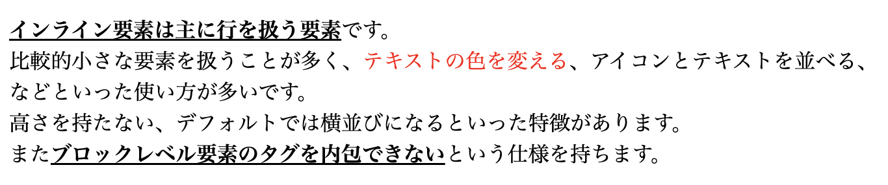
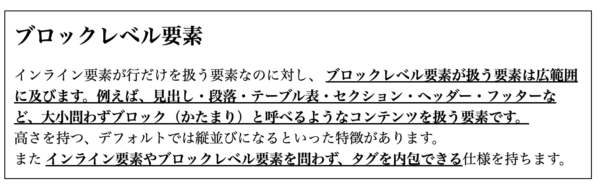
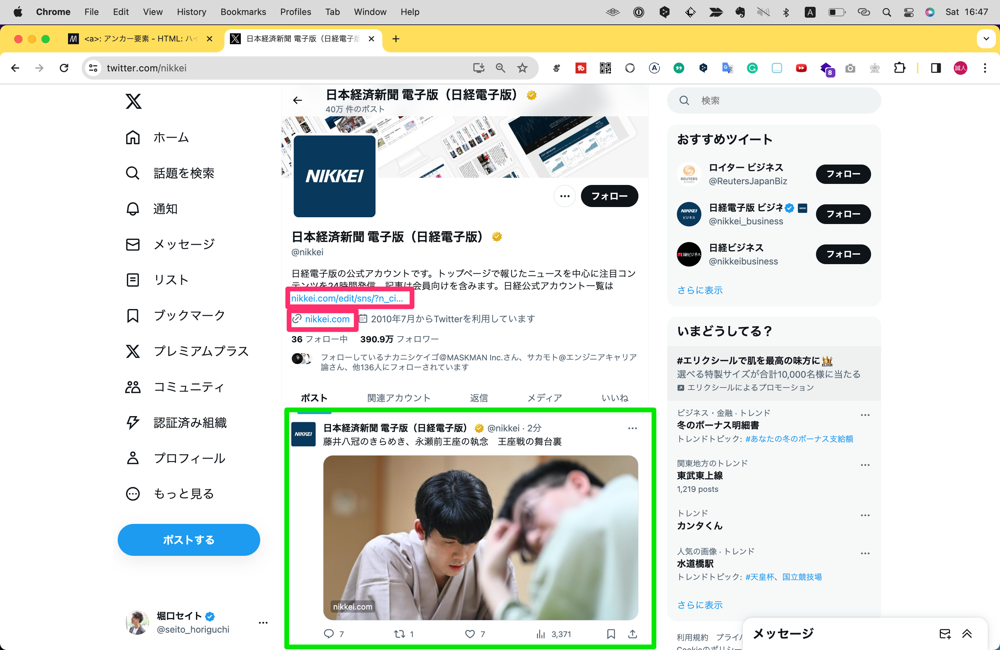
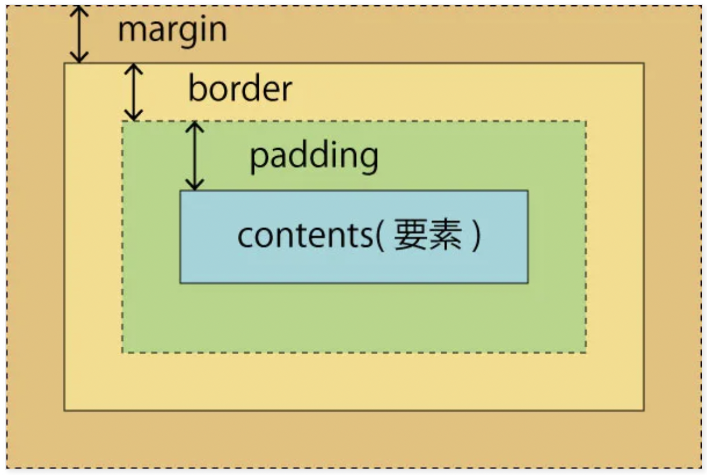

# 2.6.HTMLとCSSの仕様・発展
さて、ここまではHTMLとCSS個別に基本的な仕様を学習してきました。
このセクションではHTMLとCSSを合算してもう一歩踏み込んだ仕様について解説していきます。

## インライン要素とブロックレベル要素
実は、タグには種類によって抑制が会ったり、使える場面に制限があります。
それらをタグごとに暗記するのはとても大変ですが、比較的覚えやすい方法としてHTMLタグを __インライン要素とブロックレベル要素__ 2つに分類して考えると覚えやすいです。

| 特徴 | インライン要素 | ブロックレベル要素 |
| --- | --- | --- |
| デフォルトの並び | 横並び | 縦並び |
| 幅・高さ | 指定できない | 指定できる |
| 余白 | 左右にのみ余白を持てる | 上下左右に余白を持てる |
| 例 | `<a>`, `<span>`, ``, `<strong>` | `<div>`, `<p>`, `<h1>`, `<section>` |
| 代表的な使い方 | 文字の一部を装飾する | レイアウトを組む |

### インライン要素
__インライン要素は主に行を扱う要素__ です。比較的小さな要素を扱うことが多く、テキストの色を変える、アイコンとテキストを並べる、などといった使い方が多いです。
上下に余白を指定できない（padding-topとpadding-bottom）、横幅と高さを指定できない（widthやheigh）、デフォルトでは横並びになるといった特徴があります。
また __ブロックレベル要素のタグを内包できない__ という仕様を持ちます。

インライン要素代表的なのタグとしては、`<span>`, `<strong>`, `<br>`, ``などがあります。
例えば下記のような使い方が可能です。
`<p>`は段落の意味で用いられるブロック要素ですが、この中の行でインライン要素が使われています。

```html
<p>
    <strong class="strong">インライン要素は主に行を扱う要素</strong>です。<br>
    比較的小さな要素を扱うことが多く、<span class="red">テキストの色を変える</span>、アイコンとテキストを並べる、などといった使い方が多いです。<br>
    高さを持たない、横幅と高さを指定できない（widthやheigh）、デフォルトでは横並びになるといった特徴があります。<br>
    また<strong class="strong">ブロックレベル要素のタグを内包できない</strong>という仕様を持ちます。
</p>
```
```css
.strong {
    font-weight: bold;
}
.red {
    color: red;
}
.small {
    font-size: 12px;
}
```



このように、 __インライン要素はテキストの装飾など行におけるスタイルの調整に用いられやすいです。__

### ブロックレベル要素
インライン要素が行だけを扱う要素なのに対し、 __ブロックレベル要素が扱う要素は広範囲に及びます。例えば、見出し・段落・テーブル表・セクション・ヘッダー・フッターなど、大小問わずブロック（かたまり）と呼べるようなコンテンツを扱う要素です。__
余白、横幅、高さを指定でき、デフォルトでは横並びになるといった特徴があります。

また __インライン要素やブロックレベル要素を問わず、タグを内包できる__ 仕様を持ちます。

ブロックレベル要素代表的なのタグとしては、`<div>`, `<p>`, `<h1>`, `<section>`などがあります。
例えば下記のような使い方が可能です。

```html
<section class="section">
    <h1 class="headline">ブロックレベル要素</h1>
    <p class="paragraph">
        インライン要素が行だけを扱う要素なのに対し、 <strong class="strong">ブロックレベル要素が扱う要素は広範囲に及びます。例えば、見出し・段落・テーブル表・セクション・ヘッダー・フッターなど、大小問わずブロック（かたまり）と呼べるようなコンテンツを扱う要素です。</strong><br>
        余白、横幅、高さを指定でき、デフォルトでは横並びになるといった特徴があります。　」￥
        また <strong class="strong">インライン要素やブロックレベル要素を問わず、タグを内包できる</strong>仕様を持ちます。
    </p>
</section>
```
```css
.section {
    padding: 10px;
    border: 1px solid #000;
}
.headline {
    margin: 0 0 15px;
}
.paragraph {
    margin: 0;
}
```



このように、 __ブロックレベルの要素は複数の要素をまとめたり、レイアウトを組む目的で用いられやすいです。__

```
【コラム】
インライン要素とブロックレベル要素という考え方は、現在最新バージョンのHTMLにおいて公式の見解ではないものの、多くの開発者に支持されている考え方です。
公式ではHTMLタグをカテゴライズし分類する考え方として「コンテンツ・モデル」という概念を提唱していますが、こちらは複雑な上に、実用的かというとやや疑問が残ります。
どうしても気になる方以外は素通りしても良い仕様かと思います。
```

### 特有のルールを持つタグたち
前の項では、HTMLタグは大まかにはインライン要素とブロックレベル要素を持つこと、またインライン要素はブロックレベル要素を内包できないという話をしました。
HTMLタグは基本的にはこの法則に従いますが、一部固有で独自のルールを持つタグも少なくありません。

すべてを丁寧に紹介することは難しいので、ここでは代表的なものを紹介します。

#### `<a>`アンカーリンク
`<a>`タグはインライン・ブロックレベル要素両方の特性を持ちます。つまり、両方のタグを内包することができます。
これは、リンクはテキストや画像などの行要素に対して付与されるリンクと、複数の要素からなるブロック要素に対して付与されるリンクと両方の使い道があるためです。
例えばXのUIを見てみるとこの2つが混在していることがわかります。



#### 自身で完結するタグ
`<br>`, ``, `<input>`などのタグはインライン要素に属しますが、閉じタグがなく、自身で完結するタグです。用途が限定的なので、比較的単純に使いやすいといえるでしょう。

#### 見えないタグ
`<meta>`, `<script>`, `<style>`, `<link>`などのタグはブラウザに情報を伝えるためのタグで、ユーザーからは見えない要素なので、インライン要素とブロックレベル要素のどちらにも属しません。

#### 固有で独自のルールをもつタグ
HTMLの中には「このタグの中でしか使えない」「子要素にはこのタグ以外持てない」など特殊なルールを持つタグがあります。そしてこれに属するタグは少なくありません。
例えば代表的なものでいうと、下記のようなタグがそれにあたります。

- `<p>`タグはパラグラフを作るブロックレベル要素ですが、 __インライン要素しか内包できない。__
- リストを作る`<ul>`や`<ol>`タグは子要素に項目を意味する`<li>`タグしか持てない。
- 表組みを作る`<table>`タグは子要素に`<thead>`,`<tbody>`,`<tfoot>`,`<tr>`など表組みレイアウト関連のタグしか持てない。

これだけ説明されてもピンとこないと思うので、実際の利用シーンとあわせて後のセクションで解説します。（Chapter x.x参照）
<!-- TODO -->

## ボックスモデル
インライン要素・ブロックレベル要素のほか、もう一つ重要な概念として抑えておいていただきたいのが __ボックスモデル__ です。
ボックスモデルはすべてのHTMLタグが持つ仕様で、「contents（コンテンツ）」「padding（パディング）」「border（ボーダー）」「margin（マージン）」が存在します。
下の図は、ボックスモデルのこれらの概念を視覚的に示したものです。



- contents: 要素自体を指す領域
- padding: 要素にCSSプロパティ`padding`を設定したら作成される余白の領域
- border: 要素にCSSプロパティ`border`を設定したら作成される枠線の領域
- margin: 要素にCSSプロパティ`margin`を設定したら作成される外側の余白の領域

前の項目でインライン要素は余白を左右のみブロックレベル要素は上下左右に余白を持てると説明しましたが、これはボックスモデルの仕様によるものです。

## 英名とセットで覚える


### 単位
### ショートハンド
# devTool
# reset.css
# レシピ集
# CSSフレームワーク
Codepenも