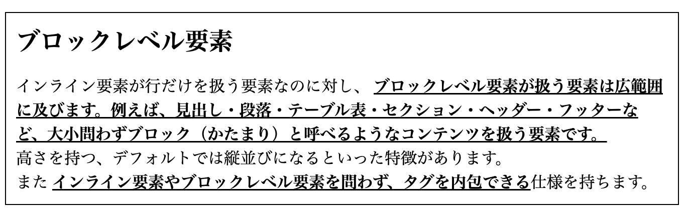
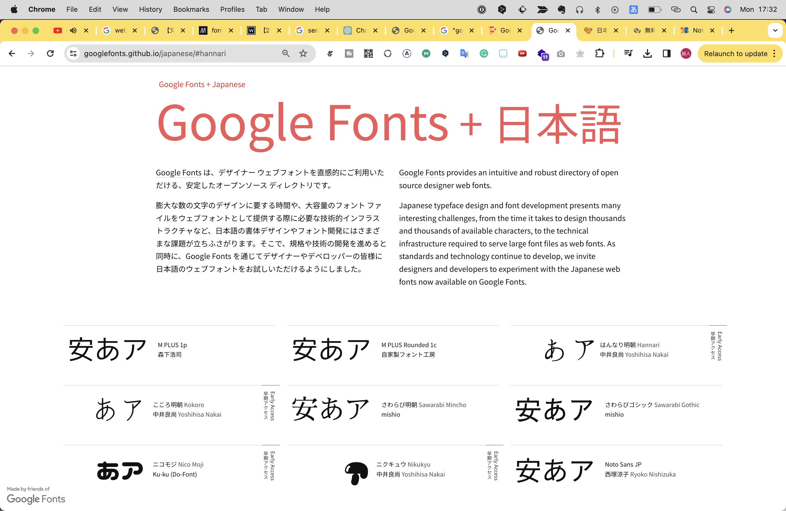

# 2.6.HTMLとCSSの仕様・発展
さて、ここまではHTMLとCSS個別に基本的な仕様を学習してきました。
このセクションではHTMLとCSSを合算してもう一歩踏み込んだ仕様について解説していきます。

## 英名の意味を知ろう
HTMLにはたくさんのタグ、CSSにはたくさんのプロパティ名・値があるため覚えるのが困難に感じるかもしれません。
さらにタグ名やは記号的で、CSSプロパティ名は聞き慣れない英単語が多く記憶しづらいと感じるかもしれません。

しかし実はこれらの名前は案外シンプルです。
HTMLタグは大本の意味となる英単語の省略形で、CSSプロパティ名はそのまま英語の意味に関連したものが多いのです。

### HTMLタグ名の例
- `<p>`: paragraph（段落）の意味
- `<h1>`: heading level1（重要度1の見出し）の意味
- `<a>`: anchor（アンカー）の意味

### CSSプロパティの例
- `padding`: 詰め物の意味
- `margin`: 余白の意味
- `display`: 表示の意味

知らない英名が出てきたら、その都度意味を調べてみると覚えやすくなるかもしれません。

## インライン要素とブロックレベル要素
実は、タグには種類によって抑制が会ったり、使える場面に制限があります。
それらをタグごとに暗記するのはとても大変ですが、比較的覚えやすい方法としてHTMLタグを __インライン要素とブロックレベル要素__ 2つに分類して考えると覚えやすいです。

| 特徴 | インライン要素 | ブロックレベル要素 |
| --- | --- | --- |
| デフォルトの並び | 横並び | 縦並び |
| 幅・高さ | 指定できない | 指定できる |
| 余白 | 左右にのみ余白を持てる | 上下左右に余白を持てる |
| 例 | `<a>`, `<span>`, ``, `<strong>` | `<div>`, `<p>`, `<h1>`, `<section>` |
| 代表的な使い方 | 文字の一部を装飾する | レイアウトを組む |

### インライン要素
__インライン要素は主に行を扱う要素__ です。比較的小さな要素を扱うことが多く、テキストの色を変える、アイコンとテキストを並べる、などといった使い方が多いです。
上下に余白を指定できない（padding-topとpadding-bottom）、横幅と高さを指定できない（widthやheigh）、デフォルトでは横並びになるといった特徴があります。
また __ブロックレベル要素のタグを内包できない__ という仕様を持ちます。

インライン要素代表的なのタグとしては、`<span>`, `<strong>`, `<br>`, ``などがあります。
例えば下記のような使い方が可能です。
`<p>`は段落の意味で用いられるブロック要素ですが、この中の行でインライン要素が使われています。

```html
<p>
    <strong class="strong">インライン要素は主に行を扱う要素</strong>です。<br>
    比較的小さな要素を扱うことが多く、<span class="red">テキストの色を変える</span>、アイコンとテキストを並べる、などといった使い方が多いです。<br>
    高さを持たない、横幅と高さを指定できない（widthやheigh）、デフォルトでは横並びになるといった特徴があります。<br>
    また<strong class="strong">ブロックレベル要素のタグを内包できない</strong>という仕様を持ちます。
</p>
```
```css
.strong {
    font-weight: bold;
}
.red {
    color: red;
}
.small {
    font-size: 12px;
}
```


このように、 __インライン要素はテキストの装飾など行におけるスタイルの調整に用いられやすいです。__

### ブロックレベル要素
インライン要素が行だけを扱う要素なのに対し、 __ブロックレベル要素が扱う要素は広範囲に及びます。例えば、見出し・段落・テーブル表・セクション・ヘッダー・フッターなど、大小問わずブロック（かたまり）と呼べるようなコンテンツを扱う要素です。__
余白、横幅、高さを指定でき、デフォルトでは横並びになるといった特徴があります。

また __インライン要素やブロックレベル要素を問わず、タグを内包できる__ 仕様を持ちます。

ブロックレベル要素代表的なのタグとしては、`<div>`, `<p>`, `<h1>`, `<section>`などがあります。
例えば下記のような使い方が可能です。

```html
<section class="section">
    <h1 class="headline">ブロックレベル要素</h1>
    <p class="paragraph">
        インライン要素が行だけを扱う要素なのに対し、 <strong class="strong">ブロックレベル要素が扱う要素は広範囲に及びます。例えば、見出し・段落・テーブル表・セクション・ヘッダー・フッターなど、大小問わずブロック（かたまり）と呼べるようなコンテンツを扱う要素です。</strong><br>
        余白、横幅、高さを指定でき、デフォルトでは横並びになるといった特徴があります。　」￥
        また <strong class="strong">インライン要素やブロックレベル要素を問わず、タグを内包できる</strong>仕様を持ちます。
    </p>
</section>
```
```css
.section {
    padding: 10px;
    border: 1px solid #000;
}
.headline {
    margin: 0 0 15px;
}
.paragraph {
    margin: 0;
}
```



このように、 __ブロックレベルの要素は複数の要素をまとめたり、レイアウトを組む目的で用いられやすいです。__

```
【コラム】
インライン要素とブロックレベル要素という考え方は、現在最新バージョンのHTMLにおいて公式の見解ではないものの、多くの開発者に支持されている考え方です。
公式ではHTMLタグをカテゴライズし分類する考え方として「コンテンツ・モデル」という概念を提唱していますが、こちらは複雑な上に、実用的かというとやや疑問が残ります。
どうしても気になる方以外は素通りしても良い仕様かと思います。
```

### 特有のルールを持つタグたち
前の項では、HTMLタグは大まかにはインライン要素とブロックレベル要素を持つこと、またインライン要素はブロックレベル要素を内包できないという話をしました。
HTMLタグは基本的にはこの法則に従いますが、一部固有で独自のルールを持つタグも少なくありません。

すべてを丁寧に紹介することは難しいので、ここでは代表的なものを紹介します。

#### `<a>`アンカーリンク
`<a>`タグはインライン・ブロックレベル要素両方の特性を持ちます。つまり、両方のタグを内包することができます。
これは、リンクはテキストや画像などの行要素に対して付与されるリンクと、複数の要素からなるブロック要素に対して付与されるリンクと両方の使い道があるためです。
例えばXのUIを見てみるとこの2つが混在していることがわかります。


#### 自身で完結するタグ
`<br>`, ``, `<input>`などのタグはインライン要素に属しますが、閉じタグがなく、自身で完結するタグです。用途が限定的なので、比較的単純に使いやすいといえるでしょう。

#### 見えないタグ
`<meta>`, `<script>`, `<style>`, `<link>`などのタグはブラウザに情報を伝えるためのタグで、ユーザーからは見えない要素なので、インライン要素とブロックレベル要素のどちらにも属しません。

#### 固有で独自のルールをもつタグ
HTMLの中には「このタグの中でしか使えない」「子要素にはこのタグ以外持てない」など特殊なルールを持つタグがあります。そしてこれに属するタグは少なくありません。
例えば代表的なものでいうと、下記のようなタグがそれにあたります。

- `<p>`タグはパラグラフを作るブロックレベル要素ですが、 __インライン要素しか内包できない。__
- リストを作る`<ul>`や`<ol>`タグは子要素に項目を意味する`<li>`タグしか持てない。
- 表組みを作る`<table>`タグは子要素に`<thead>`,`<tbody>`,`<tfoot>`,`<tr>`など表組みレイアウト関連のタグしか持てない。

これだけ説明されてもピンとこないと思うので、実際の利用シーンとあわせて後のセクションで解説します。（Chapter x.x参照）
<!-- TODO -->

## ボックスモデル
インライン要素・ブロックレベル要素のほか、もう一つ重要な概念として抑えておいていただきたいのが __ボックスモデル__ です。
ボックスモデルはすべてのHTMLタグが持つ仕様で、「contents（コンテンツ）」「padding（パディング）」「border（ボーダー）」「margin（マージン）」が存在します。
下の図は、ボックスモデルのこれらの概念を視覚的に示したものです。


- contents: 要素自体を指す領域
- padding: 要素にCSSプロパティ`padding`を設定したら作成される余白の領域
- border: 要素にCSSプロパティ`border`を設定したら作成される枠線の領域
- margin: 要素にCSSプロパティ`margin`を設定したら作成される外側の余白の領域

前の項目でインライン要素は余白を左右のみブロックレベル要素は上下左右に余白を持てると説明しましたが、これはボックスモデルの仕様によるものです。

## その他の仕様

### ショートハンド
ショートハンドとは、複数のプロパティを一つのプロパティで表現する方法です。
例えば、下記のように`margin`プロパティには`margin-top`, `margin-right`, `margin-bottom`, `margin-left`の4つのプロパティがあります。

```css
.foo {
    margin-top: 10px;
    margin-right: 20px;
    margin-bottom: 30px;
    margin-left: 40px;
}
```

このような __関連するプロパティは__ 下記のように一つのプロパティで表現することができます。

```css
.foo {
    margin: 10px 20px 30px 40px;
}
```
このように、複数のプロパティを一つのプロパティで表現することをショートハンドといいます。
ショートハンドはさまざまなプロパティで使うことができますが、プロパティによって書き方がそれぞれ異なるため、都度調べる必要があります。

その他、ショートハンドにできるプロパティ例としては、`padding`, `border`, `font`, `background`などがあります。

### 単位
CSSのプロパティには値の単位を指定することができます。
例えば、`margin`プロパティには`px`や`%`といった単位を指定することができます。

pxのような値は固定値と呼ばれそのまま指定された値が絶対的に適用されますが、%のような値は相対値と呼ばれ親要素の値に対して相対的な値が適用されます。

ざっくりとした使い分けとしては、__固定値はインライン要素、相対値はブロックレベル要素で扱う__ ことを基本に考えると良いでしょう。（あくまで基本的には、という意味ですが）
というのも、インライン要素は基本的にテキストや画像などコンテンツそれ自体を扱うことが多いわけですが、こうしたコンテンツの大きさは相対的な指定が難しいです。
逆に、ブロックレベル要素はレイアウトを組むことが多いため、相対的な指定をすることでレスポンシブ対応がしやすくなります。

## 画像データの扱い
HTMLやCSSで画像を読み込むには画像データが必要なわけですが、画像データには拡張子が複数存在し、それぞれの拡張子によって特徴があります。
そのため、それぞれの拡張子の性質を知っておくことをおすすめします。

| 拡張子 | 透過処理 | アニメーション | 特徴 | 向いている用途 |
| --- | --- | --- | --- | --- |
| jpg | × | × | 色数が比較的多く、グラデーションや写真の表現が得意 | 写真など |
| png8 | × | × | 色数が極めて少ないが軽量 | ロゴやアイコンなど |
| png24, png32 | ○ | × | 色調が多く、透過ができる | 透過した画像を柔軟に配置したい、など |
| webp | ○ | × | jpgやpngよりも軽量で高画質だが、変換処理が必要 | なんでも可 |
| gif | ○ | ○ | 画質が荒いが、アニメーションができる。容量が比較的重め | アニメーションが必要な画像 |
| svg | ○ | △ | ベクター形式の画像。拡大・縮小しても画質が劣化しない。HTMLタグで表現され、CSSで色を変えることができる | ロゴやアイコンなど |
| ico | ○ | × | faviconとして使われる | favicon |

jpgやpngは最も使用頻度が高い画像形式でしょう。基本的にはこれらの画像形式で問題ないと思います。
よりレベルの高い実装を行うなら、変換の手間が発生しますが高速処理が可能なwebpを使うなどするとよいでしょう。
また画像にアニメーションを加えたい場合、昔はgifを使うことが多かったですが、近年ではsvgを使いCSSやJSでアニメーションの動きを記述するほうがパフォーマンス的にも表現の幅的にも優れています。
（svg画像はAdobeイラストレーターなどベクター形式の画像を扱うソフトウェア上で画像をエクスポートする必要があります）

基本的にはいずれも``タグで読み込むことができますが、svg画像に関してはHTMLタグとして記述することもできます。

```html

```

```html
<svg>
    <circle cx="50" cy="50" r="40" stroke="green" stroke-width="4" fill="yellow" />
</svg>
```

このようにSVGのようなベクターファイルは画像のパスデータをHTMLとして持つことができます。
そのため、これらのタグにCSSやJSを適応させることで、色を変えたりアニメーションを加えたりすることができます。

<!-- TODO SVGどこまで説明するか -->
<!-- TODO Retinaどこまで説明するか -->

## フォントの扱い
CSSでフォントを指定することで、Webページ上でフォントを変更することができます。
Webページ全体のテキストに適応されるよう、bodyタグに指定することが多いです。
`font-family`プロパティを用い、優先度の高いフォント順にカンマ`,`で区切り指定します。

```css
body {
    font-family: 'Noto Sans JP', Helvetica, arial, sans-serif;
}
```

なぜこのように複数のフォントを指定するのだろう？と思った方は多いかもしれません。
それは、フォントに「システムフォントとWebフォント」、「フォントファミリーと総称フォント」、「対応言語」という3つの分類があるためです。
フォントにはこれらの仕様があるため、万が一1つ目のフォントが適応されなかった場合の代替手段として複数のフォントを指定する必要があるのです。

### システムフォントとWebフォント
フォントには大きく分けて2種類あります。__システムフォント__ と __Webフォント__ です。
システムフォントはOSに標準でインストールされているフォントのことで、WebフォントはWebサイト上でフォントを読み込む仕組みのことです。
システムフォントには、Windowsの場合は`Meiryo`、Macの場合は`Hiragino Kaku Gothic Pro`などがあり、OSによって異なります。
そのため、WebサイトにアクセスしたユーザーのデバイスOS次第で適応される場合とそうでない場合が発生してしまいます。

Webフォントは、フォントデータさえあればOSに依存せずにWebサイト上でフォントを適応させることができます。
ただし、データをダウンロードする必要があったり、ライセンスによっては有料だったり、日本語のサポートがなかったり...というわかりにくさがあります。

そこでおすすめなのが「Google Fonts + 日本語」というサイトです。
Webフォントを提供している事業者はほかにもありますが、このサイトに掲載されているフォントは無料で商用利用可能なもののみが載っています。



Webフォントを適応させるには、フォントのデータをダウンロードし、`@font-face`というCSSプロパティを用いて指定する必要があるのですが、なんとGoogle Fontsではそれらの手間が省けます。
そのためのデータもCSSもGoogleサーバー上にあり、それを使用するためのHTML、CSSのコードもサイト上に載っています。


この`<link>`タグをHTML上に、`font-family`の記載をCSS上にコピペするだけで、Webフォントを適応させることができます！

### フォントファミリーと総称フォント
フォントファミリー名とは具体的なフォント固有の名称で、総称フォント名とはカテゴリ別にまとめたフォント群の総称を指します。
総称フォントの例として、最もよく使われるものに`sans-serif`がありますが、これはセリフ体(※)を持たないシンプルなフォントたちのこと指します。
※セリフ体とは、文字の端に「セリフ（serif）」と呼ばれる装飾がついている欧文書体のことです。


### 対応言語
フォントによって対応している言語はさまざまです。
読者の皆さんは多くの場合日本語と英語を扱うことになると思いますが、例えば英語のみに対応したフォントを指定してしまうと日本語が文字化けしてしまいます。
先述の「Google Fonts + 日本語」では日本語に対応したフォントのみ掲載されているためその心配はありませんが、他のサイトで探すときには注意しましょう。

## リセットCSSの適応
Chapter 2.5でユーザーエージェントスタイルシートについて説明しましたが、これのせいでそのままCSSを書くとブラウザによって見え方が異なる場面に遭遇することがあります。
これを回避するために、自身で書くCSSの前にリセットCSSを適応することが一般的です。

リセットCSSとは、こうしたブラウザ間におけるCSSの差異を統一するために使われるCSSで、すべてのpaddingやmarginの値を問答無用で0にする`reset.css`や、ブラウザ間の差異を埋めることだけを意識した`normalize.css`などが有名です。ただしこれらのCSSは古くから存在するため、現在のWebサイトには適応しきれていない部分もあります。

現在は`normalize.css`を拡張し、レスポンシブデザインを意識したリセットCSSである`sanitize.css`が主流なCSSの1つです。
`sanitize.css`は公式サイトがあるので、こちらページ下部にある「Download」ボタンからダウンロードして使うことができます。

https://csstools.github.io/sanitize.css/

（npmなどのパッケージマネージャーを使ってインストールすることもできますが、この方法についてはChapter x.xで解説します。）

読み込む際にはソース順で優先度が低くなるよう、一番目に読み込ませましょう。

```html
<link rel="stylesheet" href="./sanitize.css">
<link rel="stylesheet" href="./style.css">
```

# devTool

# レシピ集
# CSSフレームワーク
# flex
# アニメーション