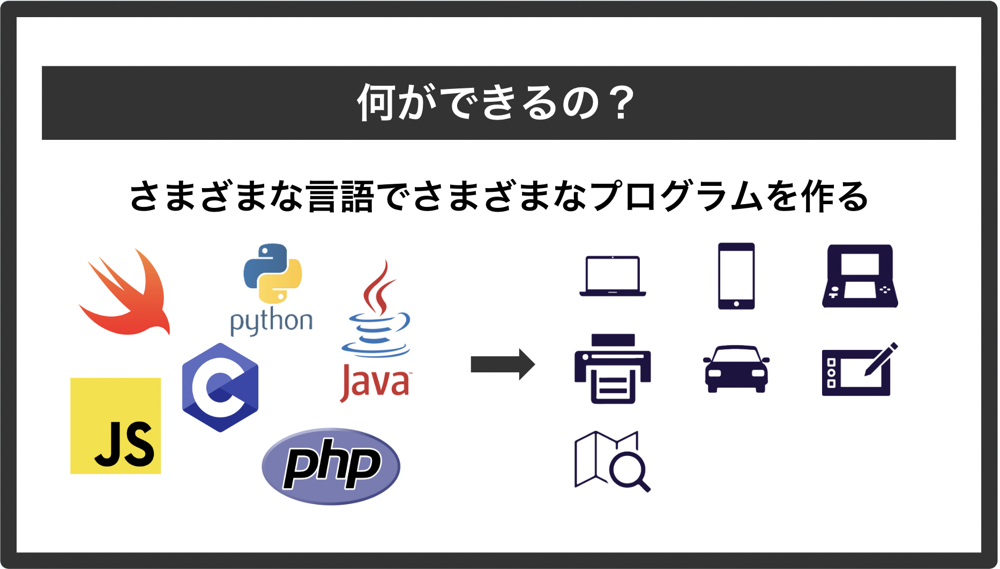
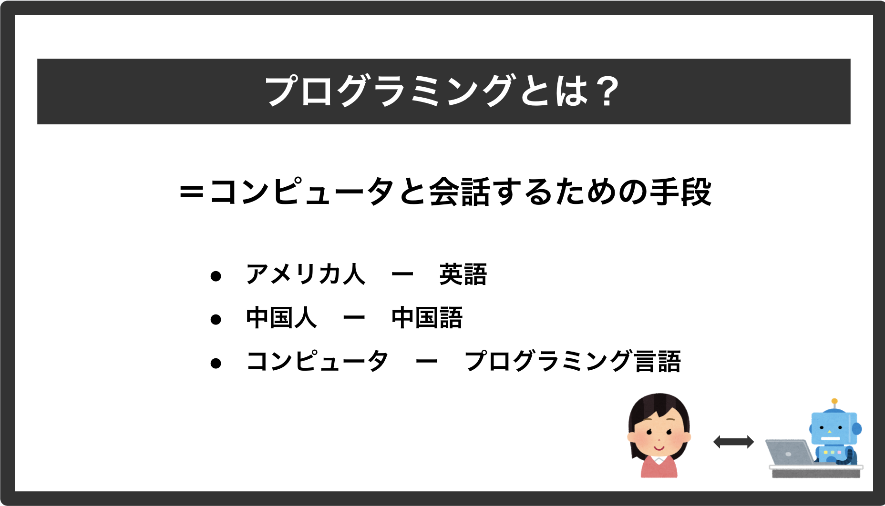
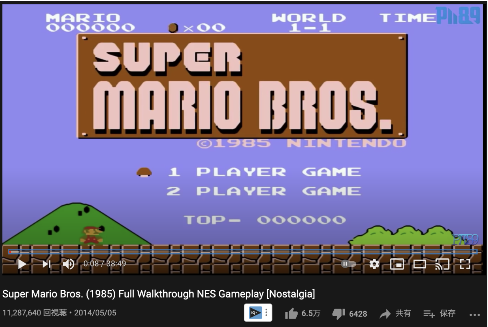
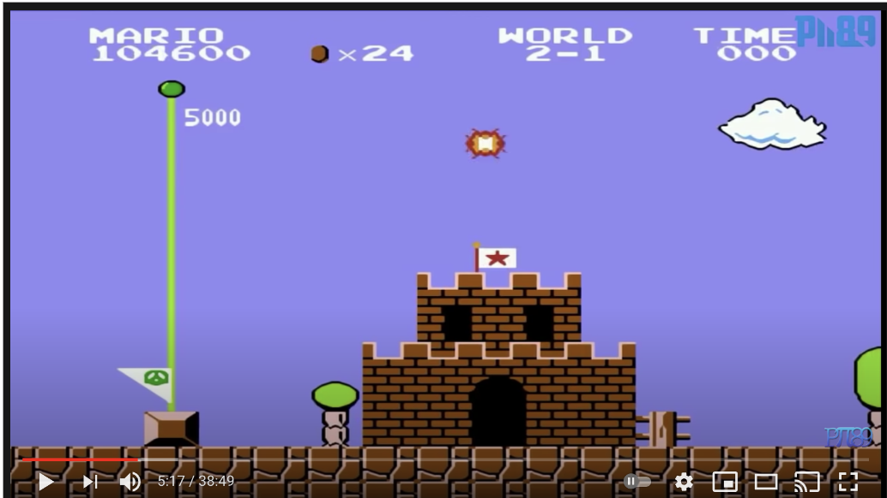

# プログラミングとは
そもそもプログラミングとはなんでしょう？
プログラミングには様々な分野があります。例えば、「ソフトウェア」と呼ばれる分野では、パソコン内で動くアプリケーションなどが含まれます。また、ハードウェアの分野では、パソコンの内部構造に焦点を当てます。そしてAIやアルゴリズムのような仕組みを使用することもあります。



つまりプログラミングとは、簡単に言うと __コンピューターと対話するための手段__ です。
日本人とコミュニケーションを取るために日本語が必要なように、コンピューターとコミュニケーションを取るためにプログラミングが必要です。
プログラミング言語を使うことで、私たちはコンピューターと会話ができ、様々なプログラムを作成することができます。
またプログラミングのことはコーディングとも呼ばれますが、これらはほとんど同じ意味で用いられます。



プログラミング言語は非常に多岐にわたります。正確な数は不明ですが、数十から数百にも及ぶ言語が存在し、それぞれ得意なことが異なります。
技術の進化に伴い、常に新しい言語が生まれたり、古い言語が使われなくなったりしています。

## 実際のプログラミング言語を見てみよう
では、実際にプログラミング言語で書かれたソースコードの例を見てみましょう！
具体的にはC言語というプログラミング言語を使用して、簡単なプログラムの例を示したいと思います。
C言語は1970年代頃に誕生した言語で、今も広く使われている古典的なプログラミング言語の一つです。
初学者には少々難易度が高い言語ですが、本書ではプログラミングの仕組みを理解するために少しだけコードを掲載しています。これらを書く必要はないので、眺めてみてイメージを掴んでください。

さて、皆さんはスーパーマリオブラザーズというゲームをご存知でしょうか？



これは任天堂を代表するキャラクター「マリオ」の初期の頃のゲームタイトルで、ジャンルは王道の横スクロールアクションです。
このゲームにはゴールをするまでに敵を倒したりコインを集めるなどすることで、スコアが加算される仕組みがあります。
ゴール時にはスコアに応じて花火が上がるようなっており、点数が高いとより多くの花火が上がります。



これをプログラミング言語を使わず、まずロジックを日本語で書いてみると下記のようになります。

```
1. スコアを設定する
2. 花火を1発上げる
3. スコアが100点以上の場合、花火を追加で2発上げる
4. スコアが150点以上の場合、花火をもうさらに追加で3発上げる
```

簡易的ではありますが、これをC言語で書くと以下のような感じになります。
（あくまでイメージなので、だいぶ簡易的なコードにしています）

```c
#include <stdio.h>

int score = 100; //1.スコアを設定する

int main (void){
    printf("  *  \n"); //2.花火を1発上げる

    if(score >= 100){ //3.スコアが100点以上の場合、花火を追加で2発上げる
        printf(" * * \n");
    }

    if(score >= 150){ //4.スコアが150点以上の場合、花火をもうさらに追加で3発上げる
        printf("* * *\n");
    }
}
```

あくまでイメージを掴んでいただくだけなのでここではC言語のコードに関して詳細は省きますが、ざっと解説すると以下のような感じです。

- `#include <stdio.h>`: 標準的な機能を使用するための記述
- `int score = 100;`: 変数をつくり、100という値を代入
- `int main (void){ ... }`: 主要な関数（プログラムのまとまり）
- `printf("  *  \n");`: 画面に`  *  `という文字を出力（\nは改行を意味する）
- `if(score >= 100){`: スコアが100点以上の場合、以下の処理を実行するという条件分岐

これをコマンドラインと呼ばれるソフトウェア（Chapter 4.3似て詳しく解説）で実行すると下記のような結果が得られます。

```
  *  
 * *
```

*は花火を表しています。（大変チープではあるが許していただきたい！）
設定したスコアが100点なので、花火が合計3発上がっていることがわかります。
`int score = 100;`の値を150以上にすれば、花火が合計6発、100未満に設定した場合は1発のみ上がります。

## プログラミングの基本・まとめ
いかかでしょう、なんとなくプログラミングの仕組みはイメージできたでしょうか？
このように、プログラミングには変数や関数、条件分岐といった仕組みがあり、これらの組み合わせでプログラムを作成していきます。  
細かい仕様や書き方は言語によって異なりますが、基本的な考え方はほとんど共通しているため、1つ言語を習得すると2つ目以降は学習スピードは早くなると言われています。

- 変数: 数字や文字列などのデータを一時的に保存しておくための箱のようなもの
- 関数: 命令の塊であり、特定のタスクを実行するためのコードの集まり。（Excelに詳しい人はExcelの関をイメージしてほしい！）
- 条件文: 条件を満たすかどうかで処理の実行を分岐させる

...などなど。  
Chapter 5ではC言語よりももっと簡単な言語であるJavaScriptを使用して、これらの仕様を詳しく解説していきます。お楽しみに！