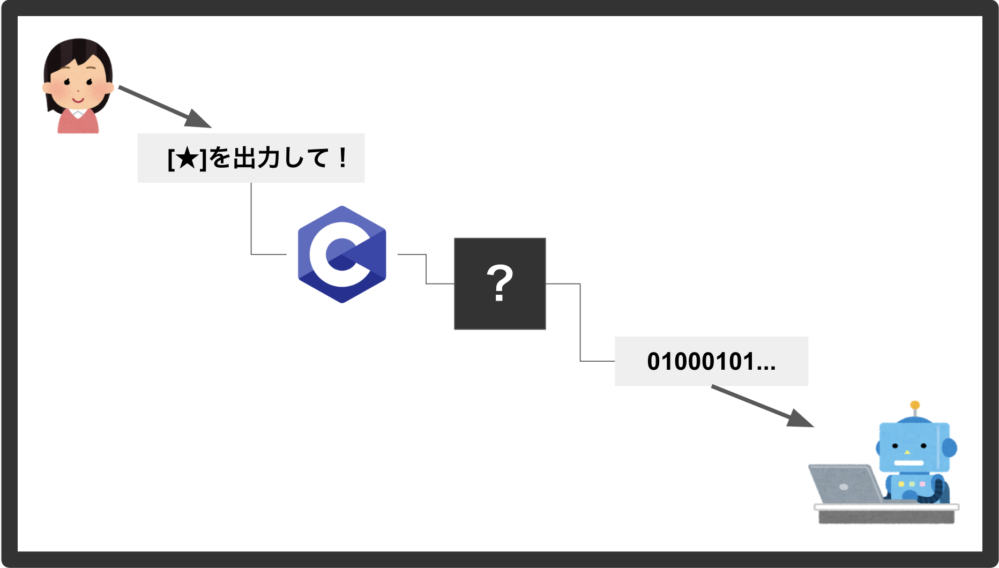
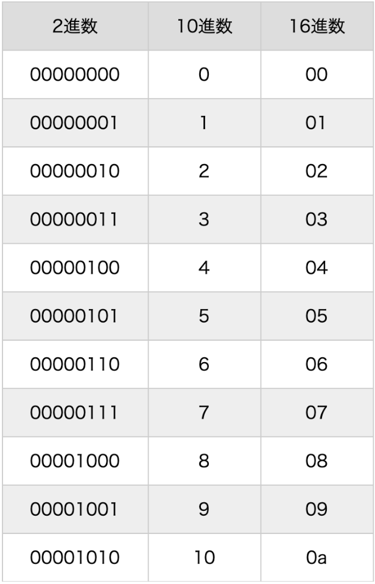
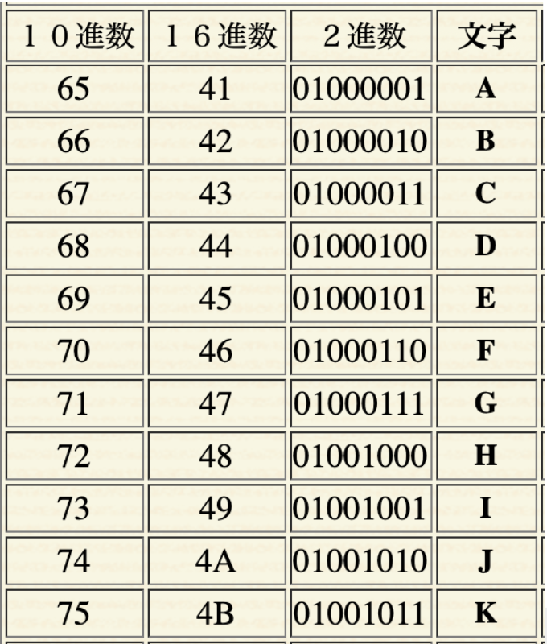
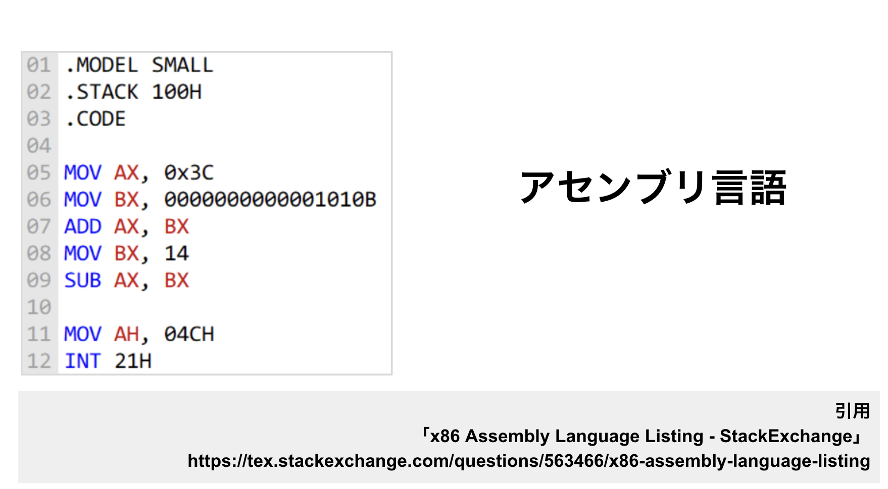
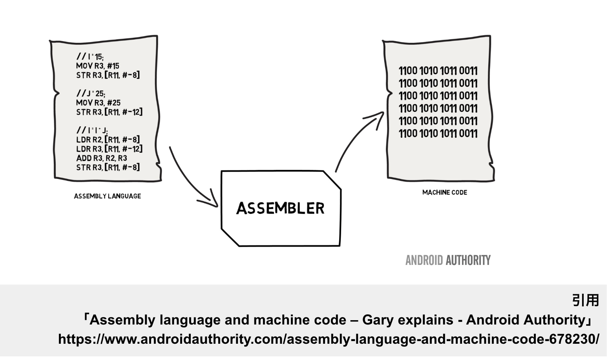
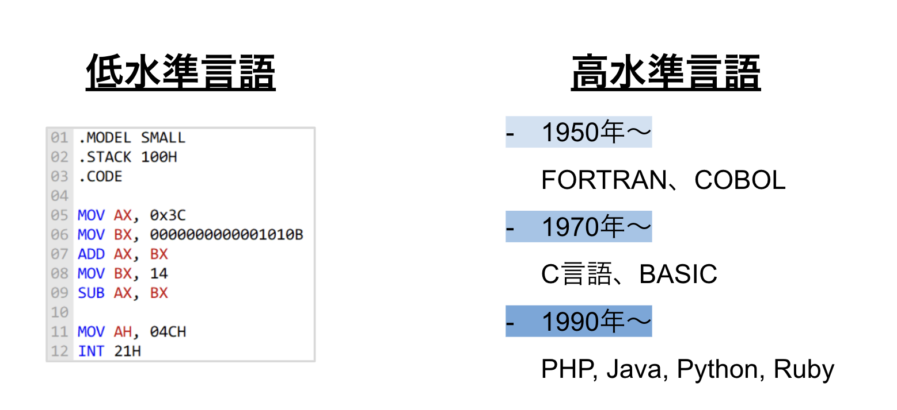
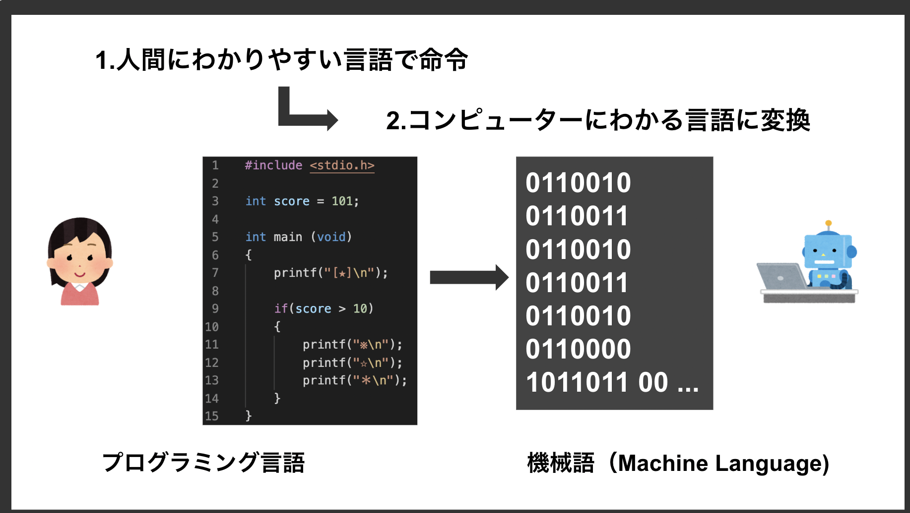

# プログラミングの仕組み
ところで、ここまでの説明を聞いてこう思った読者の方がいるかも知れません。

「そういえば、コンピューターは0と1しか理解できないという話を聞いたことがあるけれど、プログラミング言語はどうやって理解してるのだろう？」

そう思ったあなたとても鋭い！
そのとおり、コンピューターが理解する言葉のことは機械語と呼び、0と1しか理解できません。では、プログラミング言語はどうやってコンピューターに理解させているのでしょうか？

結論からいうと、プログラミング言語は最終的には0と1に変換されてからコンピューターに伝わります。
こうした0と1だけで表現される世界を2進数または2進法と呼びます。

## 2進数（2進法）とは
2進数とは、0と1だけを使って数を表現する方法で、0と1だけですべての文字、データ、命令などを表現する方法です。
英語でbinary（バイナリ）ともいいますが、この表現はよく使うので覚えておきましょう！

0と1しかないと不便だと思うかもしれませんが、実はこの2つだけでも最低限の重要な情報を表現することができます。

- True / False
- YES / NO
- ON / OFF ... etc

また、2進数を使えば0と1の組み合わせでもあらゆる数字を表現することもできます。

### 数字の場合
- 0: 00000000
- 1: 00000001
- 2: 00000010
- 3: 00000011
- 4: 00000100

### アルファベットの場合
- A: 01000001
- B: 01000010
- C: 01000011
- D: 01000100
- E: 01000101

ちなみに、コンピューターの世界には2進数の他にも8進数や10進数、16進数といった方式もあります。(10進数は我々人間が日常的に使うそのままの数字の数え方です)
8進数は0から7までの8つの数字を使用し、16進数では0から9までの数字に加え、AからFまでの6つのアルファベットを使用して0から15までを表現します。

## 文字コード
ここまでの説明で、2進数だけでも数字の表現には困らないことがおわかりいただけたかと思います。
しかし文字を表現するには、2進数だけでは不十分です。
そこで、文字を2進数で表現するための規格があります。それがASCIIコードです。

ASCII(American Standard Code for Information Interchange)コードとは、簡単言えば「文字」と「文字に割り当てた番号」の対応規格で、 __文字コード__ とも呼ばれます。これに従うことで数字だけでもコンピューター上で文字を表現することができます。

ASCIIは英語圏で使われる文字を中心に数字や記号などを含めた規格ですが、文字コードはこれ以外にも、世界中の文字を表現するために生まれたUnicodeという規格や、現在世界的に主流であるUTF-8などがあります。

## 音声や画像などのデータはどうやって表現するの？
ところで、音声や画像など、テキストデータ以外のすべてのデジタルデータは「バイナリデータ」と呼ばれ、これらは文字コードのようなものがなくとも1と0の組み合わせで表現することができます。 
これらのバイナリデータは一般的なエディタで開くと文字化けしますが、バイナリエディタとよばれる特殊なエディタで開くと文字化けせずに読むことができます。

## 低水準言語の誕生
コンピューターに文字を伝える手段を獲得したことで生まれたのがアセンブリ言語です。
アセンブリ言語は低水準言語と呼ばれるプログラミング言語の一種で、コンピュータが理解できる数字の0と1の羅列で書かれた機械語を、ほぼそのまま英語や記号に変えただけ言語です。

とはいえ、さすがに0と1だけでコンピューターを会話するのは難しい人間にとって、アセンブリ言語は人間が理解するのにわかりやすい言語でした。
アセンブリ言語の仕組みは、まず人間が理解しやす形でプログラムを書き、後にそれを機械語に変換してコンピューターに伝えるというものです。
これがプログラミング言語の基本的な仕組みになりました。

## 高水準言語の誕生
アセンブリ言語は機械語よりはるかに理解しやすいものの、依然として複雑で大規模なプログラムを書くには非効率でした。  
こうした課題から生まれたのが、現代で使われている「高水準言語」と呼ばれるプログラミング言語たちです！（前項で紹介したC言語も高水準言語の一種です。）
高水準言語は、人間の自然言語に近い形式でプログラミングが可能であり、より複雑な操作を簡単な命令で実行できるようになります。  

”人間の自然言語に近い形式でプログラミングが可能”と聞くと、「いやいや全然そうは思わないよ！」と感じられるかもしれません。
そのとおりではありますが、これでも歴史を振り返るとだいぶ人間にとって読みやすくなったといえます。

というわけで、前項で紹介したC言語も変換し、最終的には機械語になってコンピューターへ伝えられます。
人間がはじめから0と1で命令を書くのはとても大変なので、まず一旦人間が理解しやすい形で書いて、その後機械語に変換してコンピューターに伝えるという仕組みです。
この変換する仕組みのことをコンパイルと呼びます。

## コンパイラ言語とインタープリター言語
...しかし、もしすでにプログラミングを少しでも経験したことがある読者の方であれば、ここまでの説明にまだ疑問を抱いているいるかもしれません。

「私はJavaScriptやPythonを書いたことがあるが、コンパイルなんてしなかった！」

鋭いですね！そのとおりです。
JavaScriptやPythonなど、現代で流行っている言語の中には、コンパイルを行わずにコンピューターに伝えることができるものがあります。
このように、コンパイルを行わずにコンピューターに伝えることができる言語のことをインタープリター言語と呼びます。これらの言語は、実行時に内部的に自動で機械語に変換してコンピューターに伝える仕様を持っているため、コンパイルが不要です。
ただし、コンパイルを行わずにコンピューターに伝えるため、コンパイラ言語に比べて実行速度は遅くなるというデメリットがあります。

このように、コンパイルが必要な言語のことはコンパイラ言語、コンパイルを行わずにコンピューターに伝えることができる言語のことをインタープリター言語と呼び、それぞれメリット・デメリットがあります。

| | コンパイラ言語 | インタープリター言語 |
|:---|:---|:---|
| 概要 | 一度コンパイルしてから実行ファイルを元に実行する | コンパイルなしで、即座に機械語に変換・コンピューターに伝える |
| メリット | 実行速度が速い | コンパイルが不要で手間いらず |
| デメリット | コンパイルが必要で手間がかかる | 実行速度が遅い |
| 代表例 | C言語、Go、Java | JavaScript、Python、Ruby |

歴史的に昔はコンパイラ型言語しかなかったものの、時代が進みプログラムの多様化が進むに連れ、ニーズに合わせて後にインタプリタ型が登場したという形です。
一点補足ですが、コンパイラ言語とインタープリター言語はどちらかが古い、劣化版ということではありません。
現代では、コンパイラ言語とインタープリター言語の両方が活躍しており、必要な場面に応じて選択されています。