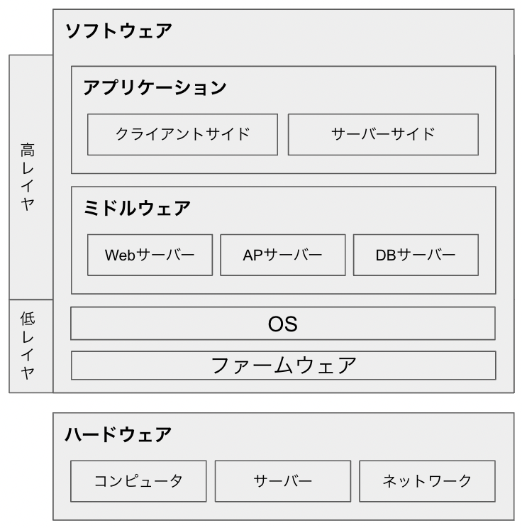
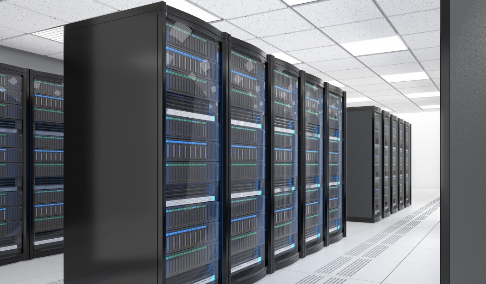

# ハードウェア~ソフトウェアの全体図
このセクションでは、プログラミングやコンピュータをとりまく、ソフトウェアからハードウェアまでを構成する要素の全貌を明らかにしたいと思います。

 

とくに __「アプリケーション」領域はプログラミングを学ぶ上で最も触れる機会が多いという意味で重要です。__
それ以外の部分も仕組みを理解する上では抑えておいていただきたいですが、ざっと抑えてイメージを掴む程度で大丈夫です。
この章で、コンピューターやプログラミングがどんな仕組みで動いているのか、どのように作られているのかを把握していただければ、プログラミングの理解がより深まると思います。

## ハードウェアとソフトウェア
こうしたシステムを構成する要素は、まず大きく「ハードウェア」と「ソフトウェア」の２つに分類されます。
ハードウェアは __コンピューターを物理的に構成する機器__ のことで、コンピューター本体のほかネットワークなども含まれます。
一方ソフトウェアは __コンピューターを動かすためのプログラム__ の総称で、ハードウェアとは対象的に物理的に存在せず、コンピューター上で動作するものです。

## ハードウェアを構成する要素
ハードウェアを構成する要素は、大きく分けて「コンピューター」「サーバー」「ネットワーク」の３つに分類されます。
プログラミングでシステムやアプリを開発するのは主にソフトウェアの分野なので、ハードウェアは関係がやや薄いですが、仕組みを理解する上でこちらの知識もざっと抑えておきましょう！

### コンピューター
 "スーパーコンピューター"
 "メインフレーム"
 "PC"
"スマートフォン"

コンピューターというと、私たちが普段触っているデスクトップやノートパソコンをイメージされるかともいます。こうしたコンピューターはパーソナルコンピューター（PC）と呼ばれ、一般的な仕事や家庭で使われることを想定して設計されたものです。
コンピューターはそのほかにも、天気予報や宇宙開発などで使われることを目的としたスーパーコンピューター、大量のデータを数億人規模のユーザーに届けることができるメインフレームコンピューターなど、市販では手に入らない業務用のものなどがあります。

またコンピューターには、CPUやメモリ、ストレージなどの部品が組み込まれており、これらによってコンピューターが動作します。CPUは計算処理を行うためのパーツ、メモリはその計算をするためのデータを一時的に記憶するためのパーツ、ストレージはデータを永続的に保存するためのパーツです。

### サーバー
サーバーとは、インターネットやLANなどのネットワークを介して、にさまざまな機能やサービスを提供することを目的としたコンピューターです。
これもコンピューターの一種ではありますが、先述のコンピューターとは用途が違うので分けて説明しています。
サーバーは普段から一定の温度に空調を保ったり、関係者以外に一切触れさせないようにするなど、繊細な扱いが必要です。そのため個人で所有する機会は少なく、通常はサーバーを管理する会社が保有し、ユーザーはネットワークを介してその機能の一部を借りて利用する形になります。

またサーバーには画像のような物理的に存在するサーバー1台をそのまま使う物理サーバーのほか、仮想化技術という仕組みを使うことで、1台のサーバーを複数のサーバーに分割して使う仮想サーバーというものがあります。
仮想サーバーは、1台の物理サーバーを複数のサーバーに分割しリソースを割る降って使うため、複数の事業者に低コストでサーバーを提供することができます。
後ほど説明するクラウドコンピューティングサービスはこの仕組み利用し、比較的安価に事業者や開発者にサーバーを提供しています。（Chapter 2.x）
<!-- TODO -->

### ネットワーク

ネットワークは、コンピューター同士を接続しするための仕組みで、これによってコンピュータ間でデータのやり取りを行うことができます。
ネットワークには、世界中のコンピューターを接続するインターネットや、一部の組織内でのみ接続を可能にするイントラネットなどがあります。
コンピュータをネットワークに繋げるには有線と無線の2つの方法があり、有線の場合はLANケーブルを使って、無線の場合はWi-Fiを使って接続するなどの方法があります。

## ソフトウェアを構成する要素
さて、次にソフトウェアを解説します。
ソフトウェアを構成する要素は、大きく「ファームウェア」「OS（オペレーティングシステム）」「ミドルウェア」「アプリケーション」の4つに分類され、いずれもコンピューター上で動作します。

ソフトウェアには低レイヤー・高レイヤー（レイヤーとは層の意味）と呼ばれる領域があり、低レイヤーはハードウェアに近い部分、高レイヤーはユーザーに近い部分を担当します。
先頬ハードウェアの説明をしたので、ここでは低レイヤーから順に説明していきます。

### ファームウェア
ファームウェアとは、コンピューターのハードウェアを制御するためのソフトウェアのことで、コンピューターの電源を入れた時に最初に動作します。
ほかのソフトウェアとは異なり、ハードウェアに密接に結びついているために、ユーザーからは閲覧・操作などができないようになっています。
ハードウェアに近いソフトウェアという意味でファーム（firm：硬い、堅固な）という名前が付けられています。

### OS（オペレーティングシステム）
OSとは、コンピューターの基本的な機能を提供するソフトウェアのことで、よくコンピューターにとっての脳みそのようなものだといわれます。
このOSの種類によって、その後のミドルウェアやアプリケーションが動作するかどうかが変わってきます。
そのため、OSのはコンピューターにとって必須の要素で、何をするにしてもこれがないと動かすことができません。

例えば、なんらかのソフトウェアを使おうとした時に、対応OSが異なるせいで動作しなかった...という経験はありませんか？（例：Windowsで動くソフトウェアをMacで動かそうとしたなど）
あるいはゲーム機でも良いです。（これも立派なコンピュータです！）

Nintendo Switchのゲームは、PlayStationでは動きませんよね。
なぜこの様なことが起こるかというと、ズバリOSが違うからです！

もちろん厳密にいえば、そもそもスペックが違う、ソフトウェアの形状が違う、という理由もありますが、一番大きな理由としてはこのOSの違いが挙げられます。

OSの種類としては、WindowsやmacOSなどのパーソナルコンピューター向けのものや、AndroidやiOSといったスマートフォン向けのものがあります。また経験豊富なエンジニアの間で人気のLinuxというOSがありますが、これはPCのほかサーバーなどでもよく使われています。
ちなみに、macOSは標準でインストールされているAppleのPCを購入するほかありませんが、WindowsなどのOSは単体で購入・入手し、手動でインストールすることもできます。
自作でPCを作る人や、業務でサーバーを扱う人は、このようにOSを別途入手して手動でインストールを行います。

## ミドルウェア
ミドルウェアとは、OSとアプリケーションの間に位置するソフトウェアのことで、両者の機能を補佐する役割を提供します。このあと説明するアプリケーションが動くには、このミドルウェアが必須です！

ミドルウェアには、Webサーバー、APサーバー(アプリケーション・サーバー)、DBサーバー(データベース・サーバー)の3つに分類することができ、それそれ異なる役割を持っています。
このミドルウェアがあるおかげでアプリケーションが動作し、Webページを表示したり、データの送受信などを行うことができます。

| | Webサーバー | APサーバー | DBサーバー |
|:---:|:---:|:---:|:---:|
| 役割 | Webページをブラウザに表示する | Webアプリケーションを動かす | データを保存する |
| 主な例| Apache、Nginx| Tomcat、JBoss| MySQL、Oracle |

### DB(データベース)
DBサーバーのDBとはデータの貯蔵庫のようなもので、ここにデータを保存することで、アプリケーションが必要な時にデータを取り出すことができる仕組みです。

例えば、皆さんがあるSNSにユーザー登録をしてアカウントを作成すると、アカウントに関するユーザー名やパスワードなどの情報はDBに保存されます。
そのため、2回目以降アクセスした際にはそのアカウント情報をDBの情報を使って認証を行うことで、ログインし前回のデータを引き継ぐことができます。

---

【コラム】ハードウェアのサーバーとミドルウェアのサーバー
「あれ？サーバーって言葉また出てきた？」と思われた読者の方もいるかもしれません。サーバーという名前がついていますが、これはハードウェアのサーバーとは異なる概念です。
例えば、「そのデータ、サーバーに上げておいて！」というような発言を聞いたことがありませんか？この場合のサーバーはミドルウェアのことを指しています。

---

## アプリケーション

アプリケーションとは、 __ユーザーが触れたり体験したりできる部分のソフトウェアのこと__ で、Webブラウザを介して動作するWebアプリケーションや、ダウンロード後にPC上で動作するデスクトップアプリ、AppleやGoogleのストアを通してダウンロードできるスマートフォンのアプリなどがこれにあたります。

【さまざまななプラットフォームで動くアプリケーションの例】
- Webアプリ: Google検索, Redmine, Shopify, freee
- デスクトップアプリ: Adobe Photoshop, Microsoft Office, Zoom
- スマホアプリ: LINE, Instagram, TikTok, メルカリ

こうしたアプリケーションは実は、裏ではミドルウェアやOS、またはそれを支えるハードウェアによって動作しています。

このアプリケーションは、さらに大きく分けて「クライアントサイド」と「サーバーサイド」の2つの領域に分類することができます。

### クライアントサイドとサーバーサイド
クライアントサイドとは、ユーザーが直接操作・閲覧できる部分のことを指します。
Webアプリケーションの場合は、Webブラウザ上で動作する画面、スマートフォンアプリの場合はスマートフォン上で動作するアプリ画面などがこれにあたります。

一方、サーバーサイドとはユーザーからは見えない領域で、クライアントサイドで受けた命令を実行し、ミドルウェアのサーバーに対してデータの取得や保存を行う領域のことを指します。

クライアントサイドでユーザーが何らかの操作を行うと、その情報はサーバーサイドに伝わり、サーバーサイドで処理が行われた後、結果がクライアントサイドに返されるという流れになります。

---

【コラム】フロントエンド・バックエンド・インフラ
ところで、こうしたソフトウェア〜ハードウェアまでの領域を「フロントエンド・バックエンド・インフラ」という3つの言葉で分類する言い方もあります。
フロントエンドはクライアントサイドのことを指し、バックエンドはやや定義が曖昧ですがサーバーサイド〜ミドルウェア〜OSあたりまでの領域を指すことが多いです。
またインフラは、ハードウェア〜OS〜ミドルウェアあたりまでの領域を指すことが多いです。

---

ちなみに、これらの開発する領域によって使用されるプログラミング言語が異なります。
例えば、Webのクライアントサイドを作るにはHTML,CSS,JavaScriptなど、スマホアプリのクライアントサイドはSwift,Kotlinなど、サーバーサイドはRuby,PHP,Javaなど、ミドルウェアやOSはCやC++などで開発されます。