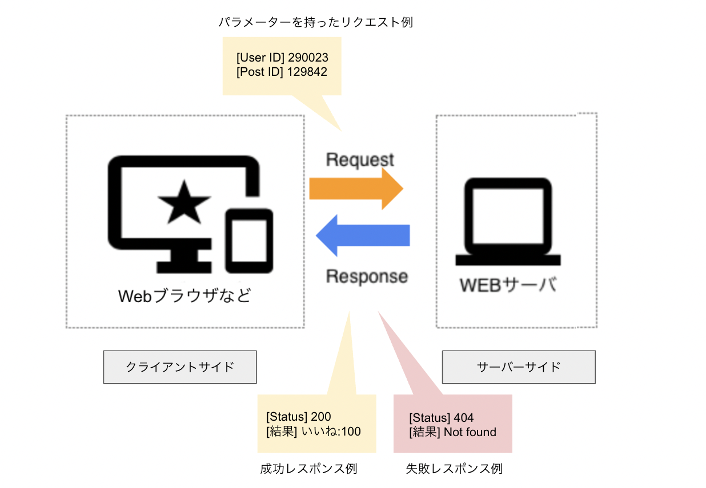

# クライアントサイド〜サーバーサイド〜ミドルウェアの関係
ここで、SNSを例にクライアントサイド〜サーバーサイド〜ミドルウェアがどのような関係で動作するか、その流れを整理してみましょう。
例えばあるSNS上で、皆さんが他ユーザーの投稿を見て「いいねボタン」を押し、カウントが1増えたときの処理について考えてみましょう。

このとき下記のような流れで処理が行われます。

1. SNSで「いいねボタン」を押す（クライアントサイド）
2. 1の情報がサーバーサイドに伝える（クライアントサイド　→　サーバーサイド）
3. 1の情報がミドルウェアに伝わる（サーバーサイド　→　ミドルウェア）
4. DB上で、いいねのカウントが+1されたことを記録する（ミドルウェア → DB）
5. 4の情報がミドルウェアに伝わる（DB → ミドルウェア）
6. 4の情報がサーバーサイドに伝わる（ミドルウェア → サーバーサイド）
7. 4の情報がクライアントサイドに伝わり、いいねが1増える（サーバーサイド → クライアントサイド）

いかがでしょう。個々の繋がりを見ていくと、クライアントサイド〜サーバーサイド〜ミドルウェアの順に処理が行われていることがわかったかと思います。

## リクエストとレスポンス
このように、クライアントサイドからサーバーサイドに情報を送ることを「リクエスト」、サーバーサイドからクライアントサイドに情報を送ることを「レスポンス」と呼びます。

先程の例みたく「いいねボタン」を押すといったアプリケーション内での操作以外にも、URLにアクセスしたりリンクをクリックしたりすることも、Webページを表示するようサーバーに”要求（リクエスト）”しているわけで、リクエストになります。

このとき、リクエストに __パラメーター__ と呼ばれる情報が必要な場合があります。例えば先程のいいねボタンを押す例であれば、「投稿のID、いいねを押したユーザーのID」などがありえます。
どんなパラメーターが必要かは、アプリケーションの開発の仕方によって異なるので、その都度仕様に合わせてプログラミングで実装します。

レスポンスには、リクエストに対する処理結果が含まれて返ってきます。いいねボタンを押す例であれば、リクエストが成功または失敗したかどうか結果に加え、成功なら合計のいいね数、失敗ならエラーの内容などが含まれます。

リクエストが成功したかどうかはこのレスポンスを見ることで判断することができるため、エンジニアはアプリケーション開発時にこのあたりの情報をよくチェックします。    
具体的には、レスポンスにはステータスコードと呼ばれる3桁の番号が含まれており、この番号でリクエストが成功したかどうかを判断することができます。例えば404の場合は「ページが見つからないエラー」の意味です。これは開発者じゃなくても比較的目にすることが多いのではないでしょうか。
ステータスコードは百の桁を見ると大まかな種類がわかり、十と一の桁を見るとより詳細なエラー内容がわかります。

| 対応する番号 | ステータスコードの種類 | 例 |
| --- | --- | --- |
| 100番台 | 処理中であることを示す | 100: リクエストを受け取り、処理を継続している途中 |
| 200番台 | 成功したことを示す | 200: リクエストに成功 |
| 300番台 | リダイレクト(他のページに飛ばすこと)を示す | 301: リクエストされたリソースの URLが永遠に変更されている(リニューアルでURLが変わった場合、など) |
| 400番台 | クライアントサイドでエラーが発生したことを示す | 404: リクエストされたリソースが見つからない |
| 500番台 | サーバーサイドでエラーが発生したことを示す | 500: サーバー内部でエラーが発生した |