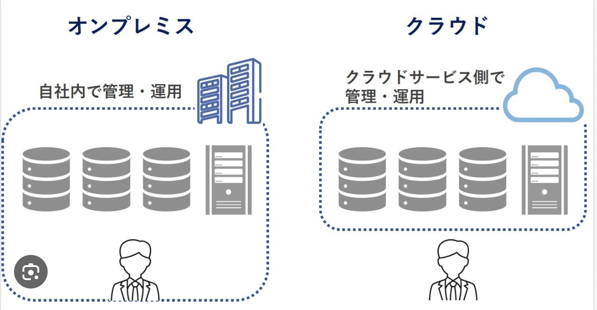
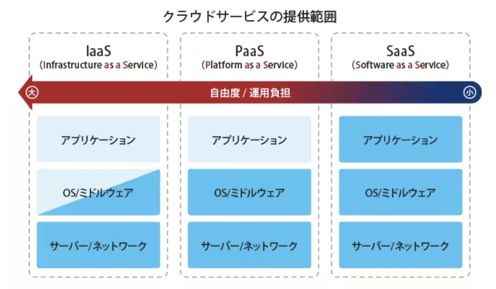

# クラウドコンピューティングサービス
Chapter 2.3ではソフトウェア〜ハードウェアの一連の仕組みを解説しましたが、この話でアプリケーションを作るには必要な技術がとても多くあることがわかったと思います。
ではこれらの技術はどうやって用意すればいいのでしょう。さすがに全てを自分1人で作るのは大変だと思いませんか？

大きな会社であれば、予算も豊富にあるでしょうし、たくさんのエンジニアを雇用してまるごと自社で完結できるかもしれません。
こうしたリソースがある場合には、すべてを自社で用意し完結する __オンプレミス__ という方法をとることができます。

しかし、中小企業や個人の場合はそうはいきません。
例えばSNSアプリを1つ作りたいと思ったときに、もしすべてのソフトウェア〜ハードウェアを自分で用意しなければならないとしたら、ハードルが高すぎます！

そこで、必要な技術の一部を外部から必要なだけ借りるという方法があります。これには __クラウドコンピューティングサービス（略してクラウド）__ を活用します。

## IaaS, PssS, SaaS
クラウドには、主に「IaaS」「PssS」「SaaS」の３つの領域があります。
他にも「MaaS」や「DaaS」などの単語もありますが、これらは上記３つの派生系で本筋からそれるので割愛します。

| | IaaS | PaaS | SaaS |
| --- | --- | --- | --- |
| 提供領域 | ハードウェア、インフラ | ハードウェア、OS、ミドルウェア | ソフトウェア、ハードウェア、インフラ |
| 主なサービス || AWS、GCP、Azure | Adobe CC、Microsoft Office 365、G suite、Slack、Zoomなど |

このうち、AWS、GCP、Azureは単体のサービス名というより、多くのサービスを内包したサービス群の総称という方がふさわしいです。そのため、ハードウェア〜ソフトウェアまで幅広く提供しているという意味で、IaaSとPaaS両方に当てはまります。
例えばAWSは、サーバーを提供する「EC2」やストレージの「S3」など、様々なサービスを保有しています。

IaaSやPaaSはある程度スペックをカスタマイズすることもできます。例えばAWSのEC2では、CPUやメモリ、ストレージの容量などを自由に設定することができます。
こうしたサービスは大抵の場合月額制の従量課金で提供されているため、設定したスペックの高さやデータの通信量などに応じて料金が変動します。

このようにIaaSやPaaSを利用することで、ハードウェア〜ソフトウェアの低レイヤー領域はクラウドに任せ、開発会社やエンジニアはアプリケーションの開発に集中することができます。

また、開発すらもほとんどせずにアプリケーション自体を利用することができるサービスもあります。これらは __SaaS__ と呼ばれ、サブスク（固定の月額費用）を払うことで利用できます。例えばAdobe CCやMicrosoft Office 365、Google Workspaceなどがそれにあたります。このほかにも、勤怠管理の「ジョブカン」、スケジュール管理の「Trello」、会計ソフトの「freee」など、様々なサービスがあります。
自社の業務効率化のためにこれらのサービスを利用する企業も多いでしょう。

