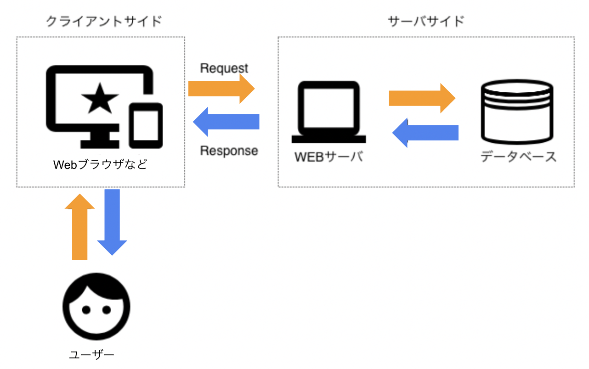
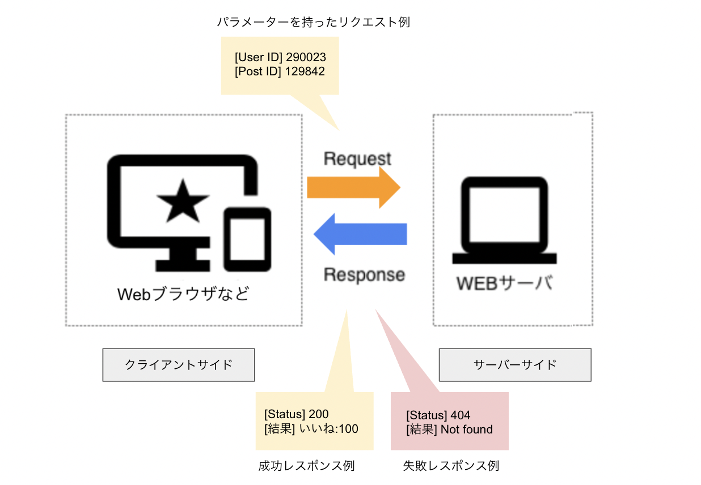

# データの通信
ここで、SNSを例にクライアントサイド〜サーバーサイド〜ミドルウェアがどのような関係で動作するか、その流れを整理してみましょう。
例えばあるSNS上で、皆さんが他ユーザーの投稿を見て「いいねボタン」を押し、カウントが1増えたときの処理について考えてみましょう。

このとき下記のような流れで処理が行われます。

1. SNSで「いいねボタン」を押す（クライアントサイド）
2. 1の情報がサーバーサイドに伝える（クライアントサイド　→　サーバーサイド）
3. 1の情報がミドルウェアに伝わる（サーバーサイド　→　ミドルウェア）
4. DB上で、いいねのカウントが+1されたことを記録する（ミドルウェア → DB）
5. 4の情報がミドルウェアに伝わる（DB → ミドルウェア）
6. 4の情報がサーバーサイドに伝わる（ミドルウェア → サーバーサイド）
7. 4の情報がクライアントサイドに伝わり、いいねが1増える（サーバーサイド → クライアントサイド）

いかがでしょう。個々の繋がりを見ていくと、クライアントサイド〜サーバーサイド〜ミドルウェアの順に処理が行われていることがわかったかと思います。

## プロトコル
コンピューターはやみくもにデータを送ったり受け取ったりできるわけではありません。
例えば私たちが宅配便を届けようと思ったら、物を梱包し、指定の用紙に住所などの情報を記載した上で料金を払うという明確なルールにのっとる必要があります。

これと同じように、コンピューター同士がデータのやり取りをするときにも、そのやり取りに関してルールが決められています。このルールのことを「プロトコル」と呼びます。
現代では、インターネット上でデータをやり取りするときには、TCP/IPというプロトコルが使われています。

TCP/IPには複数のプロトコルが含まれています。下記は代表的なものです。

| プロトコル名 | 用途 |
| --- | --- |
| HTTP、FTP、SMTP | Webページやファイルの転送、メールの送受信を行う |
| HTTPS、FTPS、SMTPS | HTTP、FTP、SMTPでの通信時、情報を暗号化して行う |
| IP | ネットワーク上のコンピューターやサーバーを識別する |
| SSH | ネットワーク上のコンピューターに暗号鍵を使ってログインする |
| DNS | ネットワーク上のコンピューターの名前をIPアドレスに変換する |

扱うデータや通信するプログラムの種類によって、これら使うプロトコルは異なりますが、いずれもコンピューター同士がデータの送受信を行う際に使われるルールだと思ってください。
このあたりの情報はChapter4でも扱うことになります。忘れたらまたこのページを見返してみてください！
<!-- TODO -->

### HTTPとHTTPS
HTTPやHTTPSはエンジニアでなくても馴染みがあるでしょう。Webサイトを閲覧する際、URLに「http://」や「https://」がついているのを見たことがあると思いますが、これはWebページというデータを送受信する際に使われるプロトコルを表しています。

HTTPSはHTTPに暗号化を加えたもので、Webページを送受信する際に情報が盗聴されることを防ぐことができます。
HTTPとHTTPSはアプリケーション上でよく使われるため、皆さんがプログラミングでアプリケーションを開発する際にはとくによく目にすることになるでしょう。

### HTTPリクエストとHTTPレスポンス
コンピューター間では様々にデータのやり取りが発生することを見てきましたが、とくにHTTPを用いてクライアントサイドからサーバーサイドに情報を送ることを「HTTPリクエスト」、サーバーサイドからクライアントサイドに情報を送ることを「HTTPレスポンス」と呼び、アプリケーション開発においてよく使われる用語です。

先程の例みたく「いいねボタン」を押すといったアプリケーション内での操作以外にも、URLにアクセスしたりリンクをクリックしたりすることも、Webページを表示するようサーバーに”要求（リクエスト）”しているわけで、リクエストになります。

このとき、リクエストに __パラメーター__ と呼ばれる情報が必要な場合があります。例えば先程のいいねボタンを押す例であれば、「投稿のID、いいねを押したユーザーのID」などがありえます。
どんなパラメーターが必要かは、アプリケーションの開発の仕方によって異なるので、その都度仕様に合わせてプログラミングで実装します。

レスポンスには、リクエストに対する処理結果が含まれて返ってきます。いいねボタンを押す例であれば、リクエストが成功または失敗したかどうか結果に加え、成功なら合計のいいね数、失敗ならエラーの内容などが含まれます。

リクエストが成功したかどうかはこのレスポンスを見ることで判断することができるため、エンジニアはアプリケーション開発時にこのあたりの情報をよくチェックします。    
具体的には、レスポンスにはステータスコードと呼ばれる3桁の番号が含まれており、この番号でリクエストが成功したかどうかを判断することができます。例えば404の場合は「ページが見つからないエラー」の意味です。これは開発者じゃなくても比較的目にすることが多いのではないでしょうか。
ステータスコードは百の桁を見ると大まかな種類がわかり、十と一の桁を見るとより詳細なエラー内容がわかります。

| 対応する番号 | ステータスコードの種類 | 例 |
| --- | --- | --- |
| 100番台 | 処理中であることを示す | 100: リクエストを受け取り、処理を継続している途中 |
| 200番台 | 成功したことを示す | 200: リクエストに成功 |
| 300番台 | リダイレクト(他のページに飛ばすこと)を示す | 301: リクエストされたリソースの URLが永遠に変更されている(リニューアルでURLが変わった場合、など) |
| 400番台 | クライアントサイドでエラーが発生したことを示す | 404: リクエストされたリソースが見つからない |
| 500番台 | サーバーサイドでエラーが発生したことを示す | 500: サーバー内部でエラーが発生した |

### IPとURLの仕組み
先程プロトコルの説明で登場したIPについて、もう少しその役割を詳しく見ていきましょう。
IP(Internet Protocol)はネットワーク上のコンピューターやサーバーを識別するためのプロトコルで、IPアドレスと呼ばれる番号でコンピューターを識別します。

IPは現在IPv4(Internet Protocol Version 4)と呼ばれるバージョンが主流で、「255.255.10.1」という具合に4つの数字のブロックをドット`.`で区切り、0〜255までの256個の数字を割り振ることで構成されています。

IPアドレスには、グローバルIPアドレスとプライベートIPアドレスの2種類があり、前者は世界中のインターネット上で重複なく割り振られるアドレスで、後者は法人や家庭など一部のエリアのネットワーク内でのみ割り振られるアドレスです。

このグローバルIPアドレスがあることで世界中のコンピューターを識別することができるため、インターネットを介してWebサイトなどのデータにアクセスすることができます。

突然ですが、この本の出版元である日経BPのWebサイトにもIPアドレスが割り振られており、その番号は「218.216.25.22」です。
しかし、このIPアドレスはただの数字の並びですから、人間にとって覚えにくいでしょう。ブラウザでURLを入力するのも大変です。

そこで、考案されたのがDNSと呼ばれる仕組みです。
DNS(Domain Name System)は、IPアドレスと任意の文字列を紐づけることができる仕組みで、この変換された文字列のことをドメインと呼びます。
つまり日経BPのWebサイトは、IPアドレスは「218.216.25.22」ですが、実際にはDNSで文字列に変換されており、「www.nikkeibp.co.jp」というドメインでアクセスすることができます。

ちなみにURL(Uniform Resource Locator)という言葉もよく聞くと思いますが、これは「プロトコル + ドメイン + パス」という構造になっています。
日経BPのWebサイト・会社概要ページ（https://www.nikkeibp.co.jp/company）の例でいえば、下記のようになります。

| プロトコル | ドメイン | パス |
| --- | --- | --- |
| https | www.nikkeibp.co.jp | /company |

なお、ドメインは提供事業者から購入することができます。
Webページを公開する際には、制作したWebサイトをサーバーにアップした後、ドメインを購入し、そのドメインとIPアドレスを紐づけて初めてURLが完成するのです。