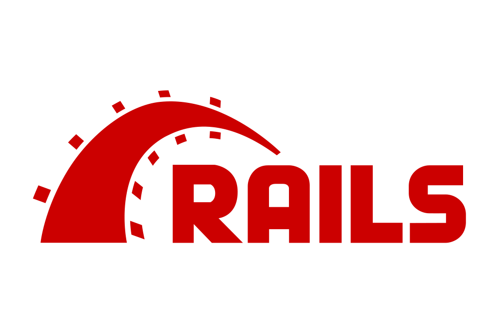

# アプリケーション開発を円滑にする仕組み
前の章では、アプリケーション開発を円滑にする手段としてクラウドコンピューティングサービスを紹介しました。これによって開発者は、アプリケーションの開発に集中することができます。

実は、アプリケーションなど何かしらのシステムを開発するとき、エンジニアがすべての機能をゼロから開発することはまずありません！
ほとんどの場合、既存の仕組みを利用することで開発効率を向上させています。
そしてその方法は、クラウドのサービスを利用する以外にも複数存在します。

## API
API（Application Programming Interface）とは、2つ以上のアプリケーション間でデータのやり取りを行うためのインターフェースのことを指します。
これを使うことで、アプリケーション開発者は、他のアプリケーションの機能を自分のアプリケーションに容易に組み込むことができます。
またAPIを使って機能を作ることを「API連携」などと呼びます。

例えば「食べログ」のような、レストラン情報を提供するアプリケーションを開発するとします。
これにはレストランの情報を登録したり検索したりする機能のほか、ユーザーのアカウント登録・ログイン機能や、お店のマップ情報を表示する機能などが必要になります。
このとき、仮にもしすべての機能を自分で開発するとなると、開発にかかる時間やコストが膨大になってしまいます。

そこで活用できるのがAPIです！似たような機能を提供するアプリケーションとそのAPIがあれば、ゼロからプログラミングすることなくその機能を取り込むことができます。
例えばユーザーアカウントの登録・ログイン機能については、FacebookやLINEのAPIを使い、ユーザーは自分のFacebookやLINEのアカウントでログインすることができるようになります。
また、マップ情報についてはGoogle MapsのAPIを使い、お店のマップ情報を表示することができるようになります。

### APIの使用条件
ただし、APIを使うにはいくつかの制約があります。
まずAPIを利用するには、アプリケーションの開発元がそれをAPI化し、公開している必要があります。
またAPIの仕様は開発元によって異なるため、それぞれのAPIに合わせてプログラミングする必要がありますし、期待する仕様をAPIが持っていない場合もあります。（例えばあるSNSのAPIを利用し、今週人気のあった投稿TOP10を表示したいと思っても、そのSNSのAPIに人気投稿のデータを取得する仕様がないかもしれません。）  

こうした仕様を確認するには、APIの提供者が公開している公式ドキュメントを読めばいいですが、英語で書いてあったり技術用語が多くてはじめのうちはなかなか読みづらく感じるかもしれません。
とはいえ、APIを選択で切ればさまざまな機能を短期間で追加できるため、開発者はAPIを使いこなせるようになることが望ましいです。

### Web API
APIの中でも、とくに普及しているのがWeb APIと呼ばれる仕様です。
Web APIでは、プロトコルにHTTP/HTTPSが採用されており、クライアントサイドとサーバーサイド間で通信を行います。プログラミング言語が異なっていても通信が可能で使いやすいのが特徴です。
Web APIは、主に以下のようなものがあります。

#### ブラウザーAPI
ChromeなどのWebブラウザーに標準的に組み込まれているAPIで、ブラウザが提供する情報を取得してさまざまな処理を行うことができます。
例えばブラウザのウィンドウサイズや閲覧履歴、ブラウザ上での音声や動画の再生などがこれにあたります。
ブラウザーAPIはJavaScriptで利用でき、特にアカウントの登録など必要なく、手軽に使うことができます。
これについてはChapter5.11で詳しく解説しているので、ぜひそちらも参照してください。

#### サードパーティAPI 
サードパーティAPIは事業者が開発・提供しているAPIで、利用するには多くの場合、アカウント登録や利用規約に同意する必要があるほか、使用料を支払う必要がある場合もあります。
先程の例にあげたFacebookやLINEのアカウントでログイン認証できるAPIや、Google Mapsでお店のマップ情報を表示するAPIなどがそれにあたります。

サードパーティAPIは事業者によって仕様が異なるため、対応する言語も事業者の仕様次第ですが、ほとんどのケースではJavaScriptで利用できます。またその他にもPHPやPython、Rubyなどがよく使われます。

## モジュール／パッケージ／ライブラリ／フレームワーク
モジュール、パッケージ、ライブラリ、フレームワークは一定のプログラムのまとまりを指す言葉です。
自分だけでなく他の開発者たちがさまざまなシチュエーションで使われることを想定して設計されるため、一定の柔軟性を持っていることが多いです。

- モジュール: ファイル単位で変数や関数をまとめたもの
- パッケージ: 複数のモジュールをフォルダ単位でまとめたもの
- ライブラリ: 複数のモジュールやパッケージをまとめたもの
- フレームワーク: 複数のライブラリやパッケージに加えて、使い方やコーディングのルールが定められているもの

これらの言葉の厳密な定義は、開発者によって異なることがあるため、そこまで神経質に覚えたいただく必要はありません。
その上でざっと紹介すると、ライブラリ以下はアプリケーション開発において一部の機能やページを実装するために局所的に用いられるのに対し、フレームワークはアプリケーションの設計から入り込み全体に影響を与えることが多いです。

Ruby on Rails(Ruby), Laravel(PHP), Django(Python), React(JavaScript)などはフレームワークの代表例です。

例えばログイン認証機能やユーザーのマイページといった機能は、アプリケーション開発において必須の機能ですが、どのプロジェクトでも似たような仕様を持つことが多いです。
同じような仕様なのにも関わらず、これを毎回ゼロから実装するのは非効率だと思いませんか？
そこで、こうした場合にモジュールやフレームワークなどのプログラムを再利用することで、開発効率を大幅に向上させることができます。

## OSS
モジュールやライブラリの説明する上でOSSについても触れないわけにはいきません！

OSSとは、Open Source Softwareの略で、オープンソースソフトウェアのことを指します。
オープンソースソフトウェアとは、ソースコードが公開されているソフトウェアのことで、誰でも自由にソースコードを閲覧・改変・再配布することができます。

OSSは、モジュールやライブラリ、フレームワークなどの形で提供されることが多く、開発者はこれらを利用することで、アプリケーションの開発効率を向上させることができます。
OSSは個人または企業などが組織単位で開発し、リリースしています。殆どの場合無料で公開されており、商用利用可能なライセンスで利用できるものが多いです。
開発者にはこのように自分で組んだプログラムをOSSとして公開したり、他の人や組織が作ったOSSを積極的に利用させてもらったり、あるいは既存のOSSの参加してバグ修正や追加機能を加える文化があります。

こうした活動はGitHubなどのプラットフォームを通して行われます。OSSに貢献することはテック企業にとっては自社のブランド価値を高めることにつながるほか、エンジニア個人にとっても経歴に箔が付いたり、就職活動や仕事を獲得する上でも有利に働くことがあるため、それをモチベーションに取り組む人も多くいます。

GitHubやOSSについてはChapter 4.4とXXで詳しく解説しているので、ぜひそちらも参照してください。
<!-- TODO -->