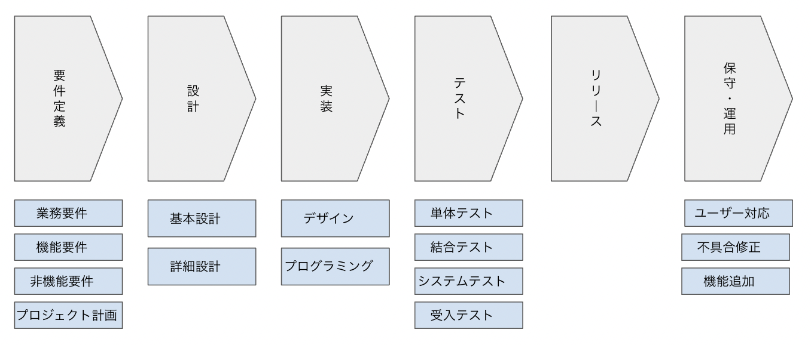
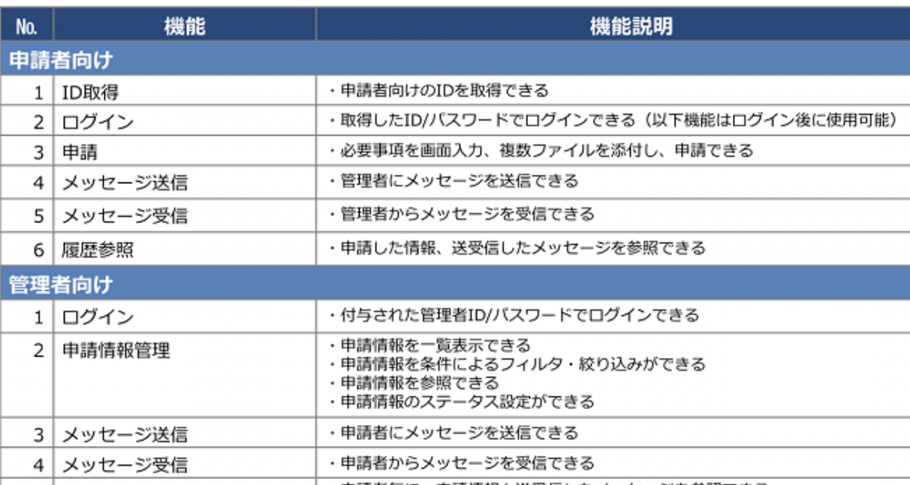
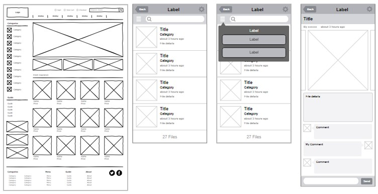
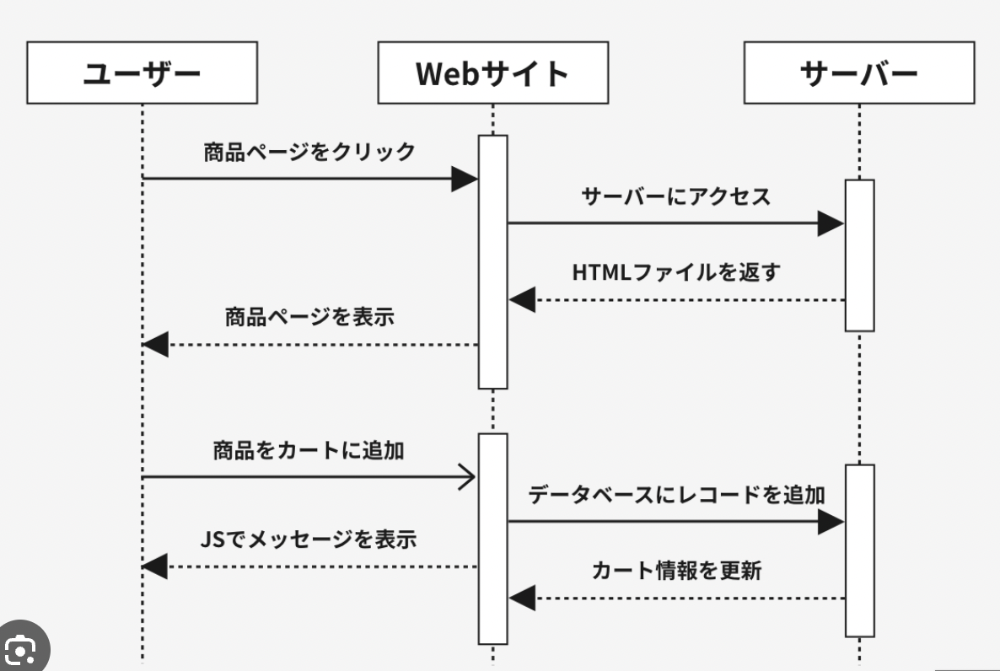
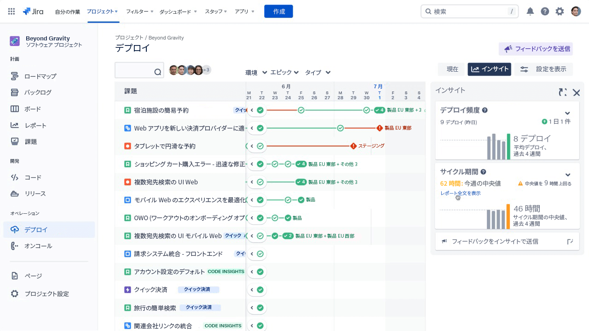
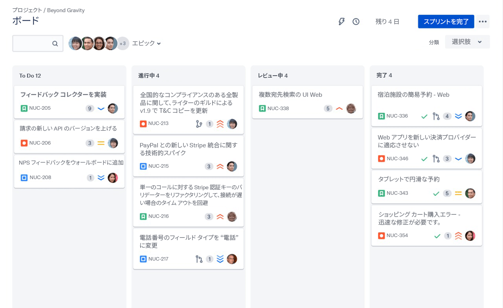
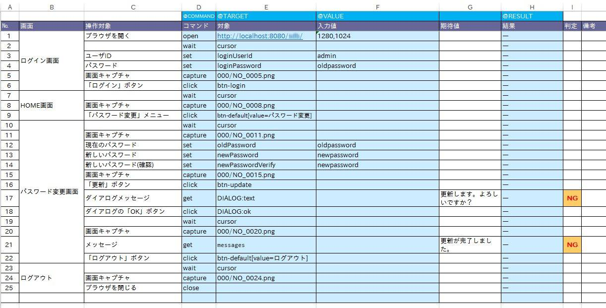
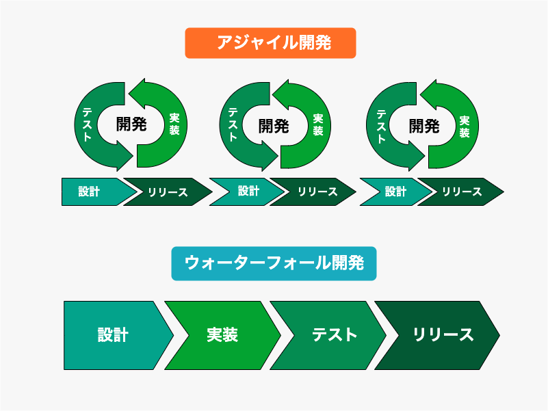

# アプリケーション開発プロジェクトの全体像
さて、これまでアプリケーションやそれを支えるソフトウェアがどのような仕組みで動作しているのかを見てきました。
ではこうしたアプリケーションを開発するにはどのような流れで行うのでしょう。
ここでは、アプリケーション開発プロジェクトでよく使われるウォーターフォール型と呼ばれる開発手法をもとに、アプリケーション開発の流れを見ていきましょう。

## アプリケーション開発の流れ
ウォーターフォール型のアプリケーション開発の流れは大きく分けて次のようなものになります。

1. 要件定義: どのようなアプリケーションを作るのかを決める
2. 設計: どのようにアプリケーションを作るのかを決める
3. 実装: 設計した内容をもとにデザイン作成・プログラミング実装を行う
4. テスト: 実装したアプリケーションが正しく動作するかを確認する
5. リリース: ユーザーが利用できる状態にする
6. 運用・保守: ユーザーが利用できる状態を維持したり、追加機能の開発や不具合修正を行う

企業がアプリケーションを開発する場合、自社で開発する場合と外部の開発会社に依頼する場合、またはそれらを組み合わせる場合がありますが、いずれのケースでも大まかにはこの流れに沿って開発が進められます。
また各プロセスでは大抵の場合、開発に関わるメンバー間で打ち合わせを重ね、ドキュメントなどのアウトプットを作成することで認識の共有を行います。

これらのプロセスは実際にはビジネス上や組織の都合により、一部のプロセスが簡略化されることもしばしばあります。
例えば、自社のメンバーだけで開発を行うスタートアップであれば要件定義のプロセスを省略したり、まず最小限の構成でプロトタイプを作ってユーザーの反応を見たいという場合は設計のプロセスを省略するなどがあり得ます。
ただ、プロジェクトが長くなればなるほどソースコードなどのアウトプットが複雑化したり、メンバーの脱退・加入があるため、そうした状況に対応するには各プロセスで共有できるドキュメントを作成し残しておくことが重要です。

### 要件定義
要件定義はアプリケーション開発を行うにあたって、まずはどのようなアプリケーションをどのような期間や体制で作るのかを決め、ドキュメント化するプロセスです。
業務に含まれるものとそうでないものを定義する「業務要件」、アプリケーションに含まれる機能を定める「機能要件」、性能や対応プラットフォームを定める「非機能要件」、誰が何を担当しどれくらいの期間をかけるかなど定める「プロジェクト計画」などが含まれます。

外注する場合はオーナー会社（発注側）と開発会社（受注側）間、自社で開発する場合はビジネスサイド(営業・経営メンバー)と開発サイド(エンジニアやデザイナーのメンバー)間が納得できるように、細かく定義しておくことが重要です。
最も上流に位置するこのプロセスは、後々のコストやスケジュールに関するトラブルを防ぐためにも欠かせません。

要件定義に関するドキュメントは決まったフォーマットはとくになく、WordやGoogle Docsなどで会社ごとに作成されるケースが多いです。

### 設計
設計は要件定義で決めた内容をもとに、どのようにアプリケーションを作るのかを決める仕様書を作成するプロセスで、基本設計と詳細設計の2つに分かれます。

基本設計は、どのようなシステムの構成(OSやミドルウェアに何を使うか、アプリケーションはどんな言語やフレームワークで開発するかなど)で開発するかをとりまとめるシステム構成図、どんな機能を含めるかをまとめた「機能一覧」、どのような画面を作るかをまとめた「画面一覧（ワイヤーフレームとも）」、どのようなデータを扱うかをまとめた「データベース設計図」などを作成します。

"機能一覧"
"画面設計書"
"データベース設計書"

詳細設計は、基本設計で決めた内容をもとに、どのようにプログラミングするのかを決めるより具体的な実装手段を取り決めるプロセスです。
例えばログイン認証機能を作る場合、どのような流れでログイン〜成功までが完了するかを示すフローチャートや、エラーにはどんなパターンがありえるか、それぞれのエラーに対してどのような処理をするのかを示した「シーケンス図」などを作成します。

"シーケンス図"

### 実装
実装は設計で決めた内容をもとに、デザイン作成・プログラミングを行うプロセスです。
デザインは、画面一覧をもとにどのような画面を作るのかを決め、FigumaやAdobe XDなどのデザインツールを使って画面のデザインを作成します。
プログラミングは、詳細設計で決めた内容をもとに、何らかのプログラミング言語を使ってアプリケーションの実装を行います。

実装中はプロジェクト管理ツール（Redmnine、JIRA、Asana、Trelloなど）を使って誰が何をいつまでに実施するのかを定めたり、Gitなどのバージョン管理ツール(Chapter 4.4参照)でプログラミングデータを保存・更新していきます。

"JIRAによるプロジェクト管理の例"
"JIRAによるプロジェクト管理の例2"

### テスト
テストは実装したアプリケーションが正しく動作するかを確認するプロセスです。
テストは主要なものでいうと、「単体テスト」「結合テスト」「システムテスト」「受入テスト」などがあります。

- 単体テスト: プログラミングコードにおける関数やクラスなど(Chapter 5参照)、最小単位のプログラムの動作確認を行うテスト。近年ではエンジニアが専用のツールを使ってプログラミングし、自動化することが多い。
- 結合テスト: 単体テストをパスしたモジュール同士を結合した機能において、一連の流れが正しく動作するかを確認するテスト。単体テストと同様に一部自動化することが可能
- システムテスト: 機能を構成するモジュール間の流れを確認する結合テストに対し、システムテストは対象の機能が要件を満たしているかを確認するテスト。開発メンバーが手動で行うことが多い。
- 受入テスト: 開発の依頼者（発注者やビジネスオーナーなど）が、システムテストをパスしたアプリケーションが要件を満たしているかを確認するテスト。これをパスして完成とすることが多い。

結合テストやシステムテストは、テストケースと呼ばれるテスト項目をドキュメントで作成した上でテストを実施し、その結果を記録することで抜け漏れを防ぎつつ行います。

"テスト仕様書"

### リリース
リリースは、テストをパスしたアプリケーションをユーザーが利用できる状態にするプロセスです。
ここで初めて開発したアプリケーションがWeb上やアプリストアで公開され、アクセスが可能になります。

---

【コラム】
ところで、リリースに近いニュアンスで使われる言葉が複数あります。
せっかくなのでまとめてご紹介しましょう
- ビルド: デプロイに必要な実行ファイルを作ること
- デプロイ: 実行ファイルを実際のWebサーバー上に配置して、利用できる状態にすること
- ホスティング: サーバーを借りること
- ローンチ: リリースとほぼ同じ意味

---

### 運用
アプリケーションは開発して終わり、ではありません。
サービスが終了しない限り、ユーザーが利用できるようWeb上やアプリストア上に維持する必要があります。
またその他にも、ユーザーからの問い合わせ対応や、不具合修正、追加機能の開発などを行うこともありますが、こうした一連の作業を総称して「運用」や「保守」などと呼びます。

## その他の開発手法
アプリケーション開発には、ウォーターフォール型以外にアジャイル型と呼ばれる開発手法もあります。
これは、ウォーターフォール型のように全体を明確に定義して進めるのではなく、要件定義〜リリースまでのサイクルを比較的小さな単位で繰り返し実施し、ユーザーの反応を見ながら修正・変更しながら開発を進めていく手法です。
主にスタートアップやベンチャー企業など、小回りの効く少数の組織で開発を行う場合に採用されることが多いです。

こうした手法はどちらもメリット・デメリットがあるため、プロジェクトの性質や組織の状況に応じて使い分けることが重要です。

| | ウォーターフォール型 | アジャイル型 |
| --- | --- | --- |
| メリット | ・要件定義で全体を把握しやすい ・ゴールが見えやすい | ・修正変更を柔軟に行いやすい ・ユーザーの反応を見ながら開発できる |
| デメリット | ・途中で仕様の変更がしづらい |　・ゴールが見えづらい |

## アプリケーション開発における契約形態や見積もり
こうしたアプリケーション開発を開発会社に委託する場合、契約形態は大きく分けて「請負契約」と「準委任契約」の2つに分類されます。
請負契約は、何を持って納品するかを契約前に明確に定義し、完成したものが納品されることで報酬を払う契約形態です。
一方準委任契約は、納品物は定義せずに開発会社の人員を一定期間借りる形で契約するもので、開発期間（人材の拘束時間）に対して報酬を支払う契約形態です。
また準委任契約の中には、契約中発注側のオフィスに常駐してもらう常駐契約というものもあります。

| | 請負契約 | 準委任契約 |
| --- | --- | --- |
| 契約形態 | 納品物を定義して納品する | 開発期間に対して人材を借りる |
| 納品義務 | 有 | 無 |
| 要件の変更 | 不可 | 可 |

どちらの契約形態を選ぶかは、プロジェクトの性質や組織の状況に応じて使い分けることが重要です。
準委任契約は納品義務がないという点でリスクに感じられるケースもありますが、では請負契約は納品に関してリスクがないのかとえばそうともいえません。現実問題、初めに仕様を正確に決めきってスケジュールと予算内に作り切るのはかなり難易度が高く、スケジュールが間に合わなかったりデスマーチが発生したりすることも少なくありません。
大事なのは発注者・受注者双方が信頼できる相手なのか、開発するプロダクトの要件に無理はないか、といった点をよく考えて契約を決めることです。

## 職種
ここまで、アプリケーション開発にはさまざまなプロセスがあることを確認しました。これらの業務は必要とするスキルや知識が異なるため、それぞれのプロセスに対応した職種が存在します。

【PM/エンジニア／デザイナーのイメージ図】

### プロジェクトマネージャー／プロダクトマネージャー
チームをリードしプロジェクトを監督する役割として、PjM(プロジェクトマネージャー), PdM(プロダクトマネージャー)と呼ばれる職種があります。
主に要件定義や設計でアウトプットを作成し、その他のプロセスでは開発チームでの打ち合わせを主導する外、メンバーの進捗管理、タスクの割り振り、品質管理を行います。

PjMはプロジェクトの進行・調整に重きがあるのに対し、PdMはプロダクトの戦略(どんな機能を盛り込むか、どう売るかなど)に重きがあります。
開発を外部に委託する場合は開発会社のPjMが発注者の意向を聞きながらプロジェクトをリードし、自社で開発する場合はPjMがビジネスサイドと開発サイドとの間でプロジェクトをリードすることが多いです。
またこれらの役割は一人が兼務し明確に役割を区別されないこともあります。

### エンジニア／プログラマー
エンジニアは主に設計・実装（プログラミング）・テスト・リリースを担う職種です。システムエンジニアやプログラマーなどとも呼ばれますが、厳密な定義はありません。
エンジニアは領域によって使用できる言語や知識が異なり、それによって呼び方も変わります。
ただし優秀なエンジニアであれば、設計などの上流工程を仕事が行えたり、複数の領域の開発が行なえる人材も存在し、その場合はフルスタックエンジニアなどという俗称で呼ばれます。

- フロントエンドエンジニア：主にクライアントサイドを実装するエンジニア
- バックエンドエンジニア：主にサーバーサイド〜ミドルウェアを実装するエンジニア
- インフラエンジニア：主にハードウェア〜ミドルウェアを構築するエンジニア
- QAエンジニア：主にテストを担うエンジニア

### デザイナー
デザイナーは主に設計における画面設計図の作成と、実装におけるデザインを担う職種で、さらにUXデザイナーとUIデザイナーに細分化できます。
UXデザイナーはUX（ユーザーエクスペリエンス＝ユーザー体験）をデザインすることが主な責務で、心理学・人間工学・マーケティングなどの知識も使いつつ「ユーザーにどのような操作を行わせるか、どうしたらユーザーが長くアプリケーションを使い続けるか」などを考え、画面設計図を作成します。

UIデザイナーは画面設計図を元に実際に実装されるであろうUI（ユーザーインターフェース＝画面）のデザインを作成します。画面設計図では大まかなレイアウト、ページの遷移図、仕様の策定などにとどまりますが、UIのデザインではより具体的にボタンやフォームの形、フォント、配色などを決め、それがこのままエンジニアによってソースコード化されます。
デザイナーも、優秀な人材であればUXデザインとUIデザインの両方を担う場合があります。