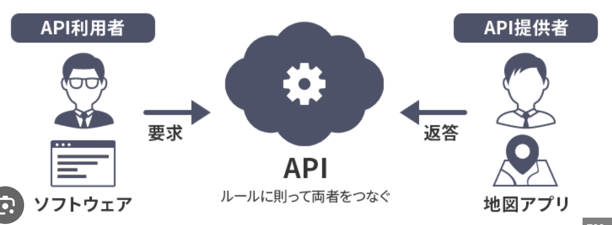

# アプリケーション開発を円滑にする仕組み
前の章では。アプリケーション開発を円滑にする手段としてクラウドコンピューティングサービスを紹介しました。
これによって開発者は、アプリケーションの開発に集中することができます。

この章では、アプリケーション領域での開発をさらに円滑にする仕組みについて紹介します。

## API
API（Application Programming Interface）とは、2つ以上のアプリケーション間でデータのやり取りを行うためのインターフェースのことを指します。
これを使うことで、アプリケーション開発者は、他のアプリケーションの機能を自分のアプリケーションに容易に組み込むことができます。
またAPIを使って機能を作ることを「API連携」などと呼びます。

例えば「食べログ」のような、レストラン情報を提供するアプリケーションを開発するとします。
これにはレストランの情報を登録したり検索したりする機能のほか、ユーザーのアカウント登録・ログイン機能や、お店のマップ情報を表示する機能などが必要になります。
このとき、仮にもしすべての機能を自分で開発するとなると、開発にかかる時間やコストが膨大になってしまいます。

そこで活用できるのがAPIです！似たような機能を提供するアプリケーションとそのAPIがあれば、ゼロからプログラミングすることなくその機能を取り込むことができます。
例えばユーザーアカウントの登録・ログイン機能については、FacebookやLINEのAPIを使い、ユーザーは自分のFacebookやLINEのアカウントでログインすることができるようになります。
また、マップ情報についてはGoogle MapsのAPIを使い、お店のマップ情報を表示することができるようになります。

### APIの使用条件
ただし、APIを使うにはいくつかの制約があります。
まずAPIを利用するには、アプリケーションの開発元がそれをAPI化し、公開している必要があります。
またAPIの仕様は開発元によって異なるため、それぞれのAPIに合わせてプログラミングする必要がありますし、期待する仕様をAPIが持っていない場合もあります。（例えばあるSNSのAPIを利用し、今週人気のあった投稿TOP10を表示したいと思っても、そのSNSのAPIに人気投稿のデータを取得する仕様がないかもしれません。）  

こうした仕様を確認するには、APIの提供者が公開している公式ドキュメントを読めばいいですが、英語で書いてあったり技術用語が多くてはじめのうちはなかなか読みづらく感じるかもしれません。
とはいえ、APIを選択で切ればさまざまな機能を短期間で追加できるため、開発者はAPIを使いこなせるようになることが望ましいです。

### Web API
APIの中でも、とくに普及しているのがWeb APIと呼ばれる仕様です。
Web APIでは、プロトコルにHTTP/HTTPSが採用されており、クライアントサイドとサーバーサイド間で通信を行います。プログラミング言語が異なっていても通信が可能で使いやすいのが特徴です。
Web APIは、主に以下のようなものがあります。

#### ブラウザーAPI
ChromeなどのWebブラウザーに標準的に組み込まれているAPIで、ブラウザが提供する情報を取得してさまざまな処理を行うことができます。
例えばブラウザのウィンドウサイズや閲覧履歴、ブラウザ上での音声や動画の再生などがこれにあたります。
ブラウザーAPIはJavaScriptで利用でき、特にアカウントの登録など必要なく、手軽に使うことができます。
これについてはChapter5.11で詳しく解説しているので、ぜひそちらも参照してください。

#### サードパーティAPI 
サードパーティAPIは事業者が開発・提供しているAPIで、利用するには多くの場合、アカウント登録や利用規約に同意する必要があるほか、使用料を支払う必要がある場合もあります。
先程の例にあげたFacebookやLINEのアカウントでログイン認証できるAPIや、Google Mapsでお店のマップ情報を表示するAPIなどがそれにあたります。

サードパーティAPIは事業者によって仕様が異なるため、対応する言語も事業者の仕様次第ですが、ほとんどのケースではJavaScriptで利用できます。またその他にもPHPやPython、Rubyなどがよく使われます。

# ライブラリ
# フレームワーク
# モジュール