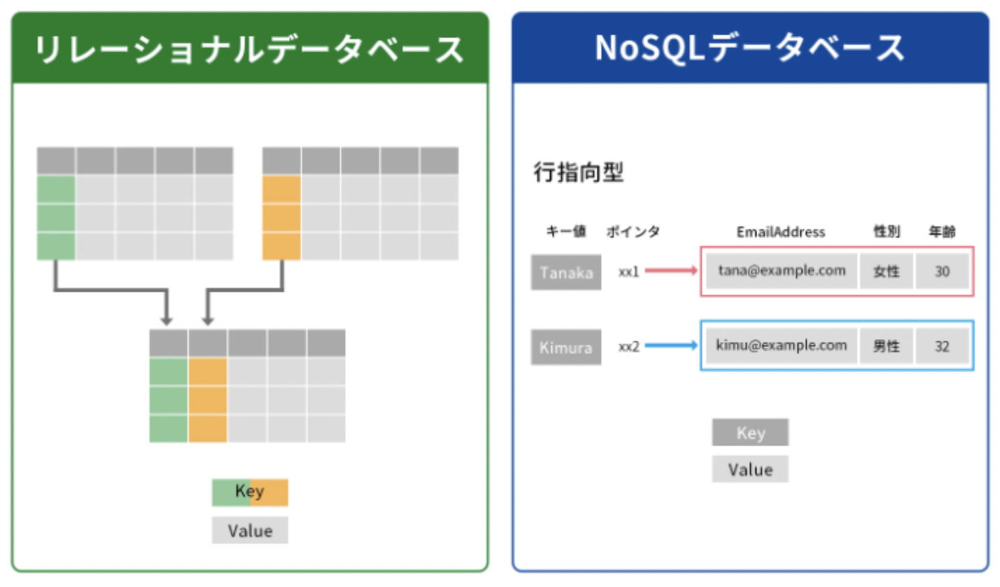

# データベースとは
データベースは、情報やデータを整理して保存するためのシステムです。これらの情報は通常、コンピューター内に電子的に保管されています。データベースは、データベース管理システム（DBMS - Data Base Management System）と呼ばれるソフトウェアで制御され、データーベースサーバーを介してデータ、DBMS、関連するアプリケーションが一緒になって利用されます。

## データベースの種類
データベースにはいくつかの種類がありますが、とくに主要なのが __リレーショナルデータベース(RDB)__ と __NoSQLデータベース__ です。



### リレーショナルデータベース(RDB)
リレーショナルデータベースはその名の通り、複雑なデータの関連性を扱えるようにしているデータベースです。（Relational = 関連付けられた）
エクセルやスプレッドシートの構造はとても近いので、これらを利用する際のシーンをイメージしてもらうと良いかもしれません。

エクセルでは複数のシートを作成し、それぞれにデータを入力しつつシート間のデータを共有しながら管理することが出来ます。例えば、顧客情報を入力したシートと、その顧客が購入した商品情報を入力したシートを作成し、それらを関連付けて利用することができます。

エクセルでいうリレーショナルデータベースにはテーブル(表)と呼ばれるものがあり、これはエクセルのシートに近い仕組みです。
リレーショナルデータベースでも同様に、複数のテーブルを作成し、それぞれにデータを入力しつつテーブル間のデータを共有しながら管理することが出来ます。

---

【コラム】構造化クエリ言語（SQL）とは
SQLは、データベース内の情報を検索したり、変更したり、定義したりするためのプログラミング言語です。データベースの操作やアクセスを助けるための非常に重要な言語で、データベースから任意のデータを抽出したり並べ替えたりするなどの操作ができます。  

ほとんどのリレーショナル・データベースで使用されており、エンジニアはもちろんコンサルタントやデータサイエンティスなどの職業でも、SQLを使ってデータ分析を行う機会があります。

ちなみにGoogleスプレッドシートではQUERY関数を使うことでSQLを使ってデータの操作を行うことができるので、気軽にSQLを勉強したり試すのにおすすめです。

SQL文の例
```
SELECT * FROM users WHERE age > 20
```
usersテーブルからageが20より大きいユーザーを全て取得する、の意味

---

### NoSQLデータベース
NoSQLとは「Not Only SQL」の略で、NoSQLデータベースは、簡単に言うとリレーショナルデータベースのようなテーブル構造を持たないデータベース総称です。
リレーショナルデータベースほど細かい構造を作ってデータを整理することは出来ませんが、その分大量のデータを高速に扱うことができるなどの利点があります。

NoSQLデータベースにもいくつか種類がありますが、主要なものをひとつ取り上げるとすると、 __ドキュメント型__ などがあります。
ドキュメント型は、データをドキュメントと呼ばれる単位で管理するデータベースで、JSON形式でデータを扱うことができるのが特徴です。
JSONとは下記のような構造のデータ形式のことを指しますが、JavaScriptにおけるオブジェクトの書き方と非常に似ていることや、また.json拡張子のファイルとして保存することができることから、JavaScriptを使ったWebアプリケーション開発において手軽に利用できます。

```
{
    [
        {
            "id": 1,
            "name": "John",
            "age": 30,
            "cars": "john@nikkei.co.jp"
        },
        {
            "id": 2,
            "name": "Sally",
            "age": 25,
            "email": "sally@nikkei.co.jp"
        }
    ]
}
```

## データベース管理システムとは
データベースを扱うにはそれを管理するデータベース管理システム（DBMS）が必要です。DBMSはアプリケーションとデータベースの間に位置し、さまざまなデータの操作を行います。

下記は少々簡略した図ですが、例えば架空のメディアサイト(media.com)の新着記事ページにユーザーがアクセスしたとき、最新の記事10件を表示させる際にDBMSやアプリケーションがどのように振る舞うのかを示した例です。
リレーのように、アプリケーションからの命令を受けてDBMSがデータベースを操作し、任意の結果をアプリケーション側に返すような流れでデータのやり取りが行われます。


DBMSには多くの種類があり、それぞれ特徴があるため開発されるアプリケーションの仕様によって使い分けがなされます。  
例えばRDBMSではMySQLやPostgreSQLといった製品がとくに有名で、これらは無料かつオープンソースで利用可能なため、個人での学習から企業での商用利用まで含めて広く利用されています。  

こうしたDBMSは公式サイトからダウンロードして自身でアプリケーション開発に組み込むことができるほか、AWSやGCPなどのクラウドサービスを利用しクラウド上利用することも出来ます。
また本書ではChapter Xにて、Googleが提供するFirebaseというサービスを使って、NoSQLデータベースを利用する方法をご紹介しますので、ぜひそちらも参考にしてみてください。