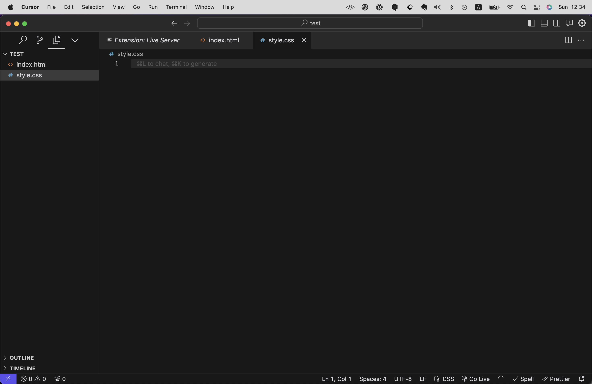
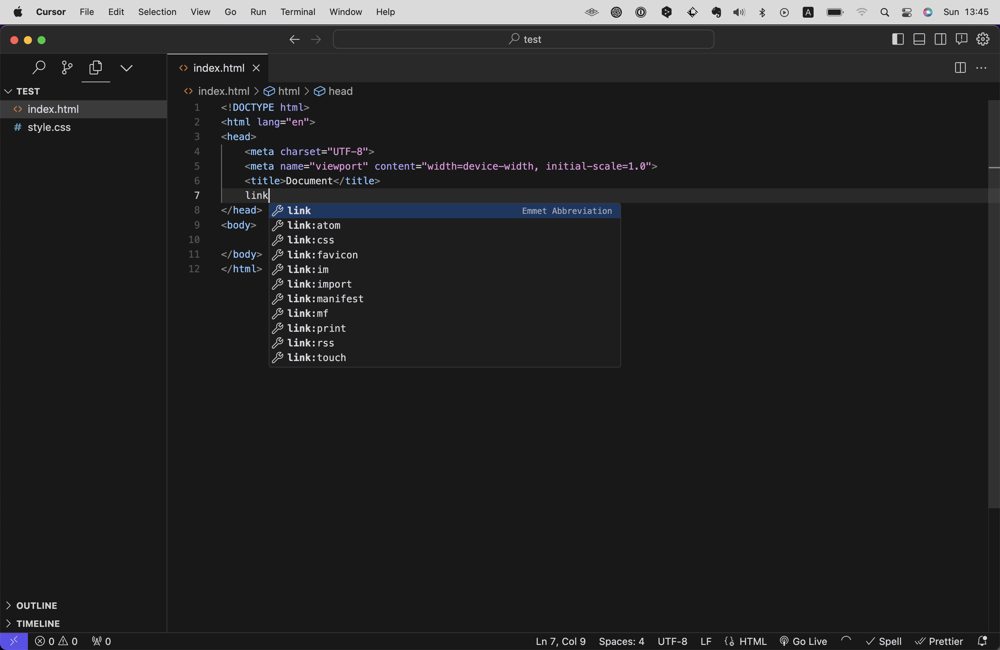

# はじめに
Chapter 3.3と3.4では読者の皆さんに大枠を知ってもらうべく、とりあえずHTMLとCSSがどんなものか触れてみてもらうことに注力して解説します。
途中、HTMLやCSSの仕様に関して意味がわからないことが多々出てくると思いますが、それらは後ほど詳しく説明していきますので、とりあえずは「こういうものがあるんだな」ということを知ってもらうことに集中してください！

また、救済措置としてサンプルコードを下記のWebページに置きました。
もし本書通りに進めてもうまくいかなければこちらからデータをダウンロードして確認しください。
htmlやcssファイルを作成するステップを省略できるので、そのままCursorで読み込みファイルを開いてください。

https://github.com/seito-developer/starter-kit


（「緑のボタン`Code`をクリック → `Download ZIP`をクリック」でZIPでデータをダウンロード後、解答してお使いください）


# サンプルのプロジェクトをつくる
まずはサンプルのプロジェクトをCursorに読み込ませたいと思います。（このフォルダをプロジェクトと呼びます。）
任意の場所、例えばデスクトップや書類フォルダ上など、任意の場所に`test`という名前で空のフォルダを作成し、Cursorに読み込ませてください。（Cursorへの読み込ませ方は前の章（Chapter 3.2）を参照してください。）

するとこのようなとくに何も表示されていない画面になるかと思います。


続いて左側サイドバーにカーソルを持っていくと、新規ファイル作成メニューのアイコンが表示されるので、これをクリックし、ファイル名を入力します。
ここでは`index.html`と入力してください。
このとき、拡張子によって自動で言語が識別されます。`.html`とつけたら自動でHTMLファイルとして認識されます。


これでHTMLファイルが作成されました。
すると右側のメインメニューで作成された`index.html`ファイルが開かれますので、ここにコードを書いてみましょう。

試しに`html:5`と入力してみてください。すると図のようにサジェスト（提案）が表示されるはずです。


`html:5`を選択しエンターまたはタブキーを押すと下記のように雛形が一気に展開されます。


これはHTML決まり文句のようなもので、ややこしい内容ですがこれがないと正しく表示されません。(この内容については後ほど詳しく説明します)

`<body>`と`</body>`の間に`Hello World!`と入力し、ファイルを保存してください。（ctrl+S/cmd+S）

``` html
<!DOCTYPE html>
<html lang="en">
<head>
    <meta charset="UTF-8">
    <meta name="viewport" content="width=device-width, initial-scale=1.0">
    <title>Document</title>
</head>
<body>
    Hello World!
</body>
</html>
```

ここまで本書どおりに進んでいれば、ブラウザでこのHTMLファイルを開けるはずです。
ブラウザで開くには、このHTMLファイルをブラウザにドラッグ＆ドロップします。

サイドメニュー上で `index.html` を右クリックし、`macOS) Reveal in Finder` / `Windows) Reveal in Explorer`を選択すると、ファイルが保存されている場所がFinder上で開きます。


あとはファイルをブラウザにドラッグ＆ドロップするだけです。


ここまでタイピングミスなどしていなければ、下記のように表示されていることでしょう。


おめでとうございます！これであなたはHTMLを書くことができるようになりました！
つづいてCSSも書いてみましょう。

------

【コラム】
更新したにも関わらずファイルを保存していない場合は下記のようにファイル名の右側に●が表示されます。（保存したらこのマークは消えます）

しかし毎回保存するのを忘れてしまわないよう、Chapter3.2で説明したように設定で自動保存機能をオンにしておくことをおすすめします。（Auto Save: afterDelay)

------

# CSSファイルを用意する
先程HTMLファイルを作った要領で、今度はCSSファイルを作ります。
ファイル名は`style.css`としてみましょう。


するとCSSファイルが作成され、編集できるようになります。



ここにCSSを書いていきます。
試しに下記のように書いてみましょう。

``` css
body {
    background-color: red;
}
```

これはWebページの背景を真っ赤にする命令ですが、これだけではまだ機能しません。
CSSをHTMLに適応させるには、HTMLファイル内でCSSを読み込ませる指示を書く必要があります。
というわけで、先ほど作成した`index.html`を開き`<head> ~ </head>`内に下記のHTMLを足してください。

```html
<link rel="stylesheet" href="./style.css">
```

このとき、全文を打ち込まずとも、`link`と入力するだけでサジェストが表示されるので、これを選択してタブキーまたはエンターキーを押します。



すると全文が展開されます。
次に、`href`を書かれた部分にCSSファイルまでのパスを記述します。ここでも、全文を打つことなく`./`とだけ入力すればサジェストが表示されるので、タブキーまたはエンターで確定させます。（パスについては後述）
<!-- TODO -->


これでCSSを読み込ませることができました。
ここまでの記述の全文は下記のようになっているはずです。

``` html
<!DOCTYPE html>
<html lang="en">
<head>
    <meta charset="UTF-8">
    <meta name="viewport" content="width=device-width, initial-scale=1.0">
    <title>Document</title>
    <link rel="stylesheet" href="./style.css">
</head>
<body>
    Hello World!
</body>
</html>
```

```css
body {
    background-color: red;
}
```

ブラウザで`index.html`を開き、更新してみましょう。下記のようにページが真っ赤になるはずです。


おめでとうございます！これであなたはCSSを書くことができるようになりました！
次のセクションからはHTMLとCSSの仕様について詳しく解説してきます。

---

【コラム】
先程のHTMLの決まり文句やlinkのように、入力が大変なコードでもCursorであればコードの一部を入力しただけでサジェストしてくれる、補完機能なるものが搭載されています。
Chapter 4.1ではこうしたCursorの機能についてより詳細に解説しているので、効率を重視されたい方は先にそちらを読んでからこのChapterに戻ってくることをオススメします。

---

【コラム】
余談ですが、CSSはHTMLファイル内に直接記述することもできます。
その場合は`<head> ... </head>`内に`<style>`タグを設置し、その中にCSSを記述します。（`src`属性は不要）

例）
```js
... 中略 ...
<head>
    <style>
        div { color: red; }
    </style>
</head>
... 中略 ...
```

ただ、ファイルを分けずにHTML内にCSSを書くメリットはあまりないため、基本的にはCSSファイルとして分けて書くことをおすすめします。

# パスとは
パスとは、コンピューター上でファイルやフォルダがどこにあるかを示す道筋のことです。
住所のようなもので、特定のファイルやフォルダがどこにあるのかを示し、見つけるために使います。パスには主に2種類あります。

## 絶対パス
絶対パスは、 __ファイルシステムの一番上から（たとえば、Windowsではドライブ名から、MacやLinuxではルートディレクトリから）ファイルやフォルダまでの完全な道筋__ です。  
例えば、「C:\Users\Username\Documents\file.txt」や「/Users/Username/Documents/file.txt」のように、始点から終点までの全てのステップを含みます。
またサーバーにアップロードしたファイルを参照する際にも、絶対パスを使用することができ、その場合は例えば`https://example.com/file.txt`のようになります。

## 相対パス
相対パスは、 __現在のファイルの位置から目的のファイルやフォルダまでの道筋__ です。絶対パスと違って、全体の道筋ではなく、ある特定のポイントからの距離や方向を示します。
相対パスは例えば下記のようなに記述できます。

- `./`：現在のフォルダ
- `../`：現在のフォルダの親フォルダ
- `../../`：現在のフォルダの親フォルダの親フォルダ

例えば、下記のようなディレクトリ構造があったとします。

```
/test
├── index.html
├── /assets
    └──  /images
        └── image.png
    └──  /styles
        └── style.css
```

このとき、ファイルを参照するには下記のようなパスになります。
- `index.html`から`image.png`を参照する場合： `./assets/images/image.png`
- `style.css`から`image.png`を参照する場合： `../images/image.png`

ちなみに、相対パスは`./`を省略することができます。
（`./assets/images/image.png`と`assets/images/image.png`は同じ意味になる）
ただ、省略しないほうが相対パスだと明確になること、またIDEでパスの補完機能を使用する際には`./`から入力することが多いため、無理に省略しないことをおすすめします。

<!-- Upadated: パスとは -->

# ディレクトリの種類
先のパスの説明で出てきたディレクトリとは、要はフォルダのことです。
厳密にいえば、LinuxやUnixなどのOSでは「ディレクトリ」、WindowsやMacなどのOSでは「フォルダ」と呼ぶことが多くありましがが、どちらも同じ意味と考えていただいて問題ありません。

ディレクトリには大きく分けて3つの種類あります。

## ルートディレクトリ
ルートディレクトリは、ファイルシステムの最上位に位置するディレクトリです。これは、ファイルシステムの階層構造の「始点」であり、すべての他のファイルやディレクトリはこのルートディレクトリの下に配置されます。

Windowsの場合、ルートディレクトリは通常ドライブレターによって表されます（例: C:\）。各ドライブ（ハードドライブ、USBドライブなど）は独自のルートディレクトリを持ちます。
macOSの場合、ルートディレクトリは単に / と表されます。このシステムは単一の階層構造を持ち、すべてのファイルとディレクトリがこの単一のルートディレクトリの下にあります。

## ホームディレクトリ
ホームディレクトリは、特定のユーザーの個人的なファイルや設定を格納するためのディレクトリです。各ユーザーは独自のホームディレクトリを持ち、他のユーザーのホームディレクトリにはアクセスできないようになっていることが多いです。

Windowsでは、ホームディレクトリは通常「C:\Users [ユーザー名]」のようなパスにあります。
macOSでは、ホームディレクトリは通常「/Users/[ユーザー名]」に位置します。

## カレントディレクトリ
カレントディレクトリとは、現在作業しているディレクトリのことを指します。
コマンドラインでの操作を行う際によく使うため、Chapter 4.3で詳しく解説します。

<!-- Upadated: ディレクトリの種類 -->