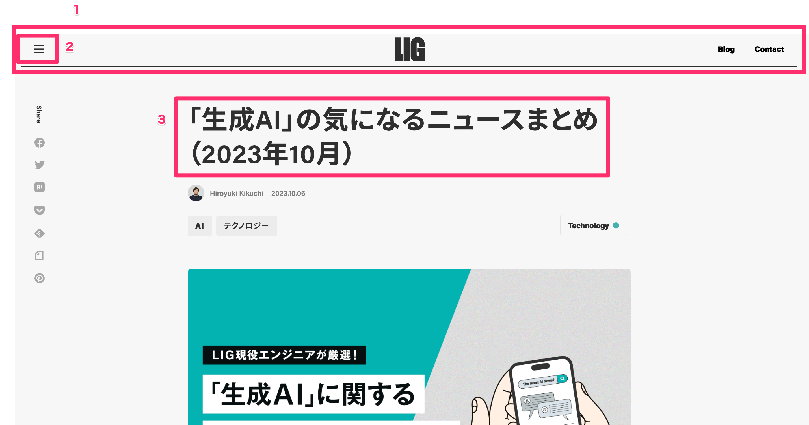

# HTMLの基本ルール
まずは真っ先に抑えておいてほしいHTMLの基礎仕様を解説します。
先程まではHTMLに触れてもらい体験することに重点を置いていましたが、ここからは詳しく書き方や意味を把握していきましょう。

- HTMLは半角英数字で書く
- `<!--  -->`で囲った部分はコメントになり、コードとして認識されなくなる
- HTMLファイルは拡張子`.html`で保存する
- HTMLはタグと呼ばれる記述の集合体で構成される

## 半角英数字で書く
HTMLやCSS、またこのあと紹介するJavaScriptのようなプログラミング言語はすべて半角英数字で書かれてます。全角で書くとエラーになりますので注意しましょう！
半角ではなく、全角の英字やスペースを誤って入力してしまいエラーになる学習者は多いです。
Cursorの補完機能を使えば間違えることはありませんので、これを使いましょう！また全角スペースを検知する拡張機能の使用もおすすめです。(Chapter4.1 参照)

## `<!--  -->`)で囲んだコードは”コメント”になり、コードとして認識されなくなる
コメントはメモ書きのようなもので、コードとして認識されません。
この特性を活かし、エンジニアはコメントで下に続くコードの説明を書いたり、一時的にコードを無効化して動作確認を行うなどができます。
（このようなコメント機能は大抵の言語に備わっています）

# HTMLタグの基本ルール
タグとは`<`と`>`で囲まれた部分の記述のことで、一部のタグを除き、基本的には開始タグと綴じタグの2つで1つのタグを構成します。
また終了タグはスラッシュを含み、たとえば `</html>`のように記述します。

```html
<div> <!-- 開始タグ -->
    Hello World
</div> <!-- 終了タグ -->
```

HTMLタグには様々な種類のタグが存在し、また何種類かの属性を持ちます。
HTMLタグは次のような構造でできています。


1. タグの名（この場合,`div`という種類のタグ）
2. 属性（この場合,`class`という属性）
3. 属性の値（この場合,`foo`という属性値）
4. タグに含めるコンテンツ（この場合はテキスト）

1つ1つどんなものがあるか、具体例を見ていみましょう！

## タグの種類
タグにはさまざまな種類があり、例えば下記のようなものがあります。

- `<div>`: 何も意味を持たないタグ
- `<p>`: 段落を表すタグ
- `<h1>`: 見出しを表すタグ
- `<a>`: リンクを表すタグ

これらのタグには意味があり、役割ごとにある程度使い分ける必要があります。
例えば、見出しのテキストには`<h1>`タグを使うべきですし、段落には`<p>`タグを使うべきです。

なぜこのように使い分ける必要があるのかというと、理由は2つあります。
1つは、そもそもそのタグでないと実現できない機能があるからです。
例えばクリック（またはタップ）で別ページに飛ばすためのリンクを作成したい場合、`<a>`タグを使わないとリンクを作成することができません。
また押したら反応するボタンを実装するには`<button>`タグを使う必要があります。

もう1つはブラウザや検索エンジンといったコンピューターにコンテンツの意味を伝えるためです。
例えばブラウザや検索エンジンは`<h1>`タグで囲まれたテキストは見出しとして認識され、`<p>`タグで囲まれたテキストは段落として認識されます。

例えばこのような見た目のWebサイトのページがあったとします。



1はヘッダー、2はメニュー、3はこのページの見出しを表している...ということが、人間の我々には直感的にわかります。  
なぜなら我々人間にはデザインを見て視覚的にその意図を理解できるからです。  
しかしコンピューターはそれができません。
それゆえ、コンピューターにこれら要素の意図を伝えるにはデザインではなく、こうしたHTMLタグの使い分けで意味を伝えます。  
ちなみに、このように要素ごとに意味づけを行いマークアップされたHTMLを「セマンティックHTML」と呼びます。

セマンティックHTMLでWebページを作ることで、検索エンジンはどの要素が何を表し、またどれくらい重要な情報なのかを理解しやすくなります。
またブラウザも例えば音声読み上げ機能が使われた場合に、どの要素が何を表しているのかを正しく読み上げることができます。

とりあえず見た目の良いWebページを作るだけであれば、先に述べたようないくつかのタグだけでコーディングは可能ですが、実際商業レベルのものを作る場合にはセマンティックHTMLになるよう要素ごとに適切なタグを使い分ける必要があります。
HTMLタグには100以上の種類がありますが（100と聞いて心配になりましたか？安心してください、実際に覚えた方がいいのは多くてもその半分程度です！）、より詳しいタグの種類や使い方に関してはまた後ほど詳しく解説します。（Chapter 3.x参照）
<!-- TODO -->

## 属性
タグには属性と呼ばれる要素を付与することができます。
属性はタグに対して`属性名="属性値"`という形で記述し、これによってさまざまな機能を実現することができます。
代表的なものを下記に示します。

| 属性名 | 付与できるタグ | 機能 | 例 |
| --- | --- | --- | --- |
| `class` | すべてのタグ | 要素にクラス名を付与する | `<div class="foo">` |
| `id` | すべてのタグ | 要素にIDを付与する | `<div id="foo">` |
| `href` | `<a>`タグ | リンク先のURLを指定する | `<a href="https://google.com">` |

`class`や`id`はCSSやJavaScriptで要素を操作する際に使われる重要な属性で、ほとんどすべてのHTMLタグに付与することができる属性です。もっとも重要な属性と言っても過言ではありません。（これについてはChapter 3.5で詳しく解説します）
`href`は`<a>`タグなど一部のタグしか付与できない属性ですが、リンク先のURLを指定するのに使うためWebサイトを作る上で使用頻度の高い属性です。

より詳しい属性の種類や使い方に関してはまた後ほど詳しく解説します。

## タグに含めるコンテンツ
HTMLタグは開始タグと綴じタグで囲うことで、中にテキストや別のタグを含めることができます。
例えば下記のように`<div>`タグの中に`<p>`タグを入れることで、段落を表す`<p>`タグを`<div>`タグの中に含めることができます。
これを入れ子（ネスト）構造と呼びます。

```html
<div>
    <p>段落1</p>
    <p>段落2</p>
</div>
```

またこのような入れ子構造はやろうと思えば無限に続けることができます。

```html
<div>
    <p>段落1</p>
    <div>
        <p>段落2</p>
        <div>
            <p>段落3</p>
        </div>
    </div>
</div>
```

タグをネストする際は1段階につきインデントを1つずつ増やすのが一般的です。
これにより、どのタグがどのタグの中に含まれているのかが一目でわかりやすくなります。

```html
【コラム】
タグの中には閉じタグがないタグも存在します。
例えば`<br>`タグは使うことでテキストを改行できるタグですが、開始タグと終了タグの両方を書く必要がありません。改行なので何かを含める必要がないからです。

また一部のタグは閉じタグを省略できるという仕様を持ちますが、これは推奨しません。
閉じタグがないことでコードが読みづらくなり、予期せぬ不具合の原因になることがあるためです。
```

# HTMLの雛形の意味
はじめにHTMLの雛形を作成しましたが、この雛形にはどのような意味があるのか、疑問に感じた方も多いんじゃないかともいます。
ここまで説明した仕様を元に、この雛形の意味を解説します。


まずHTMLファイルは大きく分けて3つのレイヤーに分けて考えることができます。

## 1.`<head> ... </head>`
ここではページのメタ情報に関するタグやテキストを記述します。
メタ情報とは要するに、ブラウザや検索エンジンに伝えるための重要な情報のことで、ユーザーからは見えないエリアです。
例えば文字コード（Chapter XX参照）の情報やCSSファイルを読み込む記述はユーザーからは見えませんが、ブラウザや検索エンジンにとっては重要な情報です。

`head`タグ内に記述されたタグは下記のような意味を持ちます。

### `<meta>`
付与する属性に応じてさまざまなメタ情報を伝えることができるタグ。文字コードの指定や、デバイスに応じてページの表示方法を指定する`viewport`などがあります。
`viewport`の`width=device-width, initial-scale=1.0`は、デバイスの幅に合わせてページの幅を自動調整する＆拡大率を1倍にするという意味です。
この記述があることで、スマートフォンなどの小さい画面で見ても最適な表示ができるようになります。

### `<title>`
ページのタイトルを指定するタグ。検索エンジンはこのタグで指定されたタイトルをページのタイトルとして認識します。SEO対策には欠かせないタグです。

### `<link>`
外部のファイルを読み込むためのタグ。CSSファイルなどを読み込むために使われます。

## 2.`<body> ... </body>`
`<body> ... </body>`はページのコンテンツに関するタグやテキストを記述することができるエリアで、HTMLのほとんどのコンテンツはここに記述します。
`<head> ... </head>`が検索エンジンやブラウザ向けの情報を記述するエリアであるのに対し、`<body> ... </body>`はユーザーに対しての情報を記述するエリアです。

## 3.その他大枠のタグ
ここでは2つのタグが使用されていますが、まず`<!DOCTYPE html>`はHTMLで書かれたファイルであることを宣言するタグで、必ずHTMLの1行目に記述する必要があります。
また2行目~最終行目には`<html lang="en">`というタグがありますが、HTMLこのタグで全体を囲むルールになっています。`lang`属性はページの言語を指定するもので、`en`は英語を意味しますが、これは例えば日本語`ja`など任意の言語を指定することができます。


また、Chapter 3.x~3.xではよく使うタグの一覧とレシピ集をまとめました。
ぜひこちらも参照してください！
<!-- TODO -->