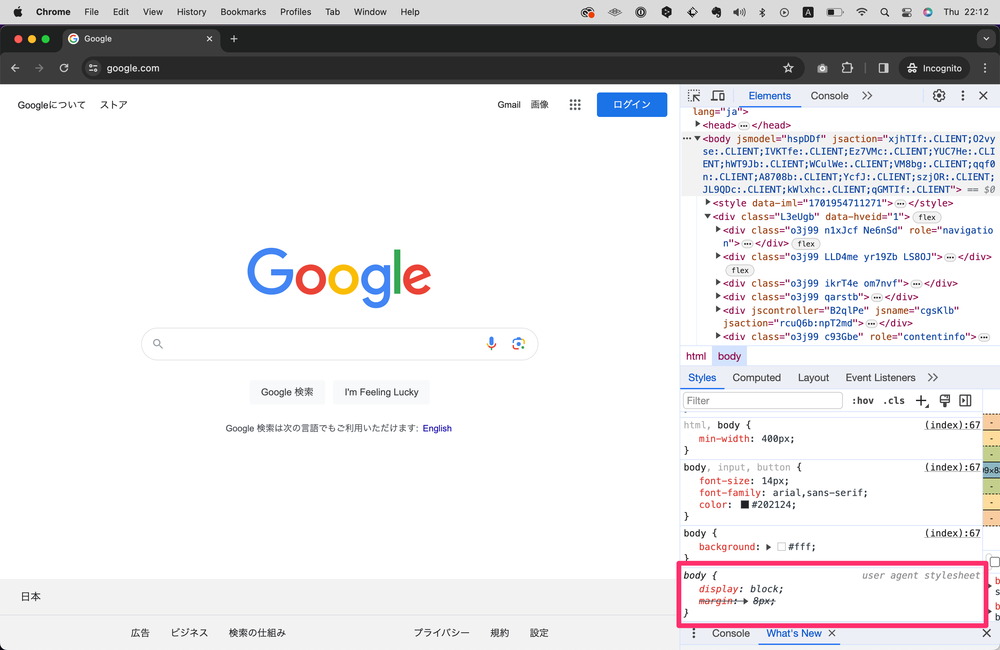
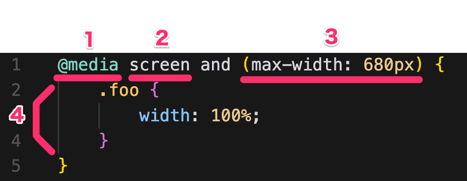

# CSSの基本ルール
つづいてCSSの基礎仕様を解説します。
CSSも先程までは体験することに重点を置いていましたが、ここからは詳しく仕様について解説していきます。

- CSSは半角英数字で書く
- `/*  */`で囲った部分はコメントになり、コードとして認識されなくなる
- CSSファイルは拡張子`.css`で保存する
- CSSは`セレクタ、プロパティ名、プロパティ値`と呼ばれる記述の集合体で構成される

半角英数字で書く、についてはHTMLの項目でも説明しましたね。
コメントはHTMLとは使う記号が異なりますが、基本的な使い方は同じです。
CSSは基本的にはHTMLとは別ファイルに記述することになるので、拡張子は`.css`となります。
またCSSのプロパティ名・プロパティ値をまとめて __スタイル__ と呼ぶことがしばしばあります。

# セレクタ、プロパティ名、プロパティ値の書き方
CSSの書き方として、大まかには下記の2ステップでコーディングを行います。
<!-- TODO コーディングの説明いる？ -->
1. まずHTMLのどの要素に対して装飾を当てたいのか決める
2. 1に対して任意の装飾をあてるためのCSSを書く

セレクタとは、このステップにおける`どの要素に対して`のことを指し、プロパティ名とその値は`任意の装飾`のことを指します。
具体的には下記のような構造でできており、セレクタ名の後に波括弧`{ ... }`で囲まれた部分にプロパティ名と値を記述します。


1. セレクタ
2. プロパティ名
3. プロパティ値

## セレクタ
セレクタの代表的なものとしては、例えば下記の3つがあります。

| セレクタの種類 | 例 |
| --- | --- |
| 要素名 | `div { ... }` |
| class | `.foo { ... }` |
| id | `#foo { ... }` |

要素名で指定する場合はそのままHTMLで書いたタグ名をCSS上で書くだけで指定することができます。  
classの場合はまず任意のHTMLタグにclass属性を値とともに付与し、その後CSS上ではドットを先頭に持ってきて`.class名`と記述することで指定できます。  
idの場合はまず任意のHTMLタグにid属性を値とともに付与し、その後CSS上ではシャープを先頭に持ってきて`#id名`と記述することで指定できます。  

(idとclass属性についてはChapter3.3のHTMLの説明で少しだけ触れましたが、このように活用する属性でした！)

```html
<p> ... </p>
<div class="foo"> ... </div>
<div id="bar"> ... </div>
```

```css
p {
    color: red;
}

.foo {
    color: blue;
}

#bar {
    color: green;
}
``` 

この場合は上から順に、`pタグ`要素内のテキストを赤色、クラス`.foo`要素内のテキストを青色、ID`#bar`要素内のテキストを緑色にするという意味になります。

なお、 __id属性は同じ値を持つ要素はそのHTMLファイル上に1つしか存在してはいけない__ というルールがあります。（class属性は同じ値を持つ要素が複数存在してもOK）
例えば下記のような例はNGです。

```html
<div id="foo"> ... </div>
<div id="foo"> ... </div>
```

値が違う場合はOKです。

```html
<div id="foo"> ... </div>
<div id="bar"> ... </div>
```

あまり利用するシーンは多くないかもしれませんが、要素名とクラスやIDを組み合わせて記述することもできます。

```html
<p class="foo"> ... </p>
<div class="foo"> ... </div>
```
```css
p.foo {
    color: red;
}
```
この場合は __pタグでかつクラスがfooの要素に対して赤色の文字色を指定する__ という意味になるため、divのfoo要素には影響がありません。

### さまざまなセレクタの指定方法
CSSではこの他にも、セレクタの組み合わせによってさまざまな指定方法があります。

#### 1.グループ化: 
`,`で区切ることで、複数のセレクタをまとめて指定することができる。
```css
.foo, .bar {
    color: red;
}
```

#### 2.子結合子:
複数のセレクタ同士の間を小なり記号`>`で区切り、`セレクタ1 > セレクタ2`と記述することで、 __セレクタ1の直下にあるセレクタ2を指定する__ という命令にできる。
```html
<div class="foo">
    <p> ... </p>
</div>
```
```css
.foo > p {
    color: red;
}
```

#### 3.子孫結合子: 
複数のセレクタ同士の間を半角スペースで区切り、`セレクタ1 セレクタ2`と記述することで、 __セレクタ1の中にあるセレクタ2を指定する__ という命令にできる。
```html
<div class="foo">
    <p>
        <span> ... </span>
    </p>
</div>
```
```css
.foo span {
    color: red;
}
```

小結合子と子孫結合子は仕様が似ているようで違います。
小結合子はセレクタ1の直下にあるセレクタ（1つ下の階層）にしかCSSを反映させないのに対し、子孫結合子はセレクタ1の中にあるセレクタ2（階層の縛りがない）を指定します。
子孫結合子の方が影響範囲が大きく、その名の通り、子か孫か、というような違いがあります。

```html
<div class="foo">
    <p>
        <span> ... </span>
    </p>
</div>
```

例えば上記のHTMLに対してOK例とNG例を示すと下記のようになります。

NG）
```css
.foo > span {
    color: red; /* NG */
}
```

OK例）
```css
.foo > p {
    color: red; /* OK */
}
.foo p {
    color: red; /* OK */
}
.foo span {
    color: red; /* OK */
}
```

ただ、子孫結合子は小結合子と比べて影響範囲が大きいため、意図しないセレクタにまでCSSがあたってしまいやすいです。
なるべく子セレクタを使って影響範囲を縮めることをオススメします。

#### 4.疑似クラス:
セレクタの後ろにコロン`:`をつけて、`セレクタ:疑似クラス`と記述することで、セレクタに対して疑似クラスを指定することができます。
疑似クラスとは、例えばマウスオーバーしたときに反応する`:hover`や、クリックしたときに反応する`:active`などのことを指します。

```html
<a href="..."> ... </a>
```
```css
.a:hover {
    color: red;
}
```

この例ではアンカーリンク要素`<a>`に対して、マウスオーバーしたときに文字色を赤色にするというCSSを記述しています。

### その他のさまざまなセレクタや接合子
このほかにもCSSには下記のようなセレクタや接合子があります。
これまで紹介したものより使用頻度は低いですが、今後既存のプロダクトに触れる際など目にする機会があるかもしれないので軽くご紹介します。

| セレクタの種類 | 説明 | 例 |
| --- | --- | --- |
| 全称セレクタ | セレクタの前にアスタリスク`*`をつけて、`*セレクタ`と記述することで、全てのセレクタを指定する | `* { ... }` |
| 属性セレクタ | セレクタの前に波括弧`{ ... }`をつけて、`セレクタ[属性]`と記述することで、セレクタに対して属性を指定する | `a[href] { ... }` |
| 疑似要素 | セレクタの前にコロン2つ`::`をつけて、`セレクタ::疑似要素`と記述することで、セレクタに対して疑似要素を指定することができる | `a::before { ... }` |
| 複数クラス | セレクタの前にドットをつけて、`セレクタ.クラス1.クラス2`と記述することで、セレクタに対して複数のクラスを指定することができる | `.foo.bar { ... }` |

| 接合子の種類 | 説明 | 例 |
| --- | --- | --- |
| 次兄弟結合子 | セレクタの前にプラス記号`+`をつけて、`セレクタ1 + セレクタ2`と記述することで、セレクタ1の直後にあるセレクタ2を指定する | `セレクタ1 + セレクタ2 { ... }` |
| 後続兄弟結合子 | セレクタの前にチルダ記号`~`をつけて、`セレクタ1 ~ セレクタ2`と記述することで、セレクタ1の後にあるセレクタ2を指定する | `セレクタ1 ~ セレクタ2 { ... }` |

### より良いセレクタと結合子の使い方
CSSの指定法をいくつか紹介しましたが、中には役割が少々重複しているものもあり、これらの使い分けはどのようにすればいいのだろう？と思った読者の方も多いのではないでしょうか。
本書では下記のような使い分けをおすすめします。

#### classを優先して使う
まず基本的に皆さんがCSSを書く際には __classを優先して使う__ ことをおすすめします。
タグ名での指定は範囲が広すぎて意図しないところにCSSがあたってしまう可能性がありますし、idは同じ値を持つ要素が1つしか存在できないという制約があり使い勝手が悪いです。
それを踏まえるとclassによる指定は一番バランスが取れていると言えます。

また、接合子に関しては __子孫セレクタを優先して使うこと、またネストは最大でも3階層までにする__ ことをおすすめします。
子孫セレクタは影響範囲を抑えることができるため意図しない装飾を回避できるため、またネストが浅いほどCSSの読みやすさが増すためです。
※優先したほうがいいとしているだけで、それ以外を禁止しているわけではないことに注意してください。

ちなみに、ここまでの話を聞くとidは使い勝手が悪く利点がないように思われるかもしれません。
確かにCSSにおいてはidの利点は薄いですが、主にJavaScriptを使う際には利点があります。（Chapter 5.x 参照）
<!-- TODO -->

<!-- Updated -->

---

【コラム】新機能・CSSのネスト  
比較的新しい機能ですが、2023年以降全ブラウザでセレクタをネストして書くことができるようになりました。
例えば下記は同じように反映されます。

```css
/* 従来のネスト */
.list {
    padding: 20px;
}
.list li {
    font-weight: bold;
}

/* 新しいネスト */
.list {
    padding: 20px;
    li {
        font-weight: bold;
    }
}
```

このように書くことで、親セレクタの記述が1回で済ませることができます。

---

## プロパティ名とプロパティ値
プロパティ名とプロパティ値は、セレクタに対して任意の装飾を当てるためのものです。
プロパティ名とプロパティ値は`プロパティ名:プロパティ値`という形で記述します。

例）
```css
color: blue;
```

プロパティにはさまざまな種類があり、また年々新しいものが増えていく関係上、全部でどれほどの種類があるのか正確な数は不明です。
また値はプロパティによって指定できるものが異なり、単位も多種多様です。

【代表的なプロパティ】
- `color`: 色名やカラーコードなどで色を指定する（例：`red`, `#333333`）
- `font-size`: フォントサイズを指定する（例： `10px`, `10em`）
- `width`: 要素の横幅を指定する（例： `100px`, `100%`）
- `height`: 要素の縦幅を指定する（例： `100px`, `100%`）
- `display`: 要素の表示方法を指定する（例： `block`, `inline`, `none`）

Chapter 3.x~3.xではよく使うCSSの一覧とレシピ集をまとめました。
ぜひこちらも参照してください！
<!-- TODO -->

## 継承
CSSには __継承__ という仕様があります。これは、親要素に指定したCSSが子要素にも適用されるという仕様です。

例えば下記のようなHTMLとCSSがあったとします。

```html
<div class="foo">
    <p> ... </p>
</div>
```
```css
.foo {
    color: red;
}
```

この場合、`.foo`に対して赤色の文字色を指定していますが、子要素の`<p>`要素にも同じ赤色の文字色が適用されます。
このように、毎度個別にセレクタにCSSを指定する必要がなく、親要素に指定したCSSが子要素にも適用されるという仕様が継承です。

ただし、すべてのプロパティが継承されるわけではありません。（もしそうだったらかえって意図しない反映だらけで大変なことになるでしょう...）
どのプロパティが継承されてどのプロパティが継承されないかは、それぞれのプロパティの仕様によって決まっているため一概には言えないのですが、継承されるプロパティは決して多くはなく、また傾向としてフォントに関するプロパティは継承されやすいです。（例：`font-size`, `font-weight`, `color`など）

## カスケード
カスケードとは、CSSがどのように反映されるかの優先度に関わるルールです。
皆さんが「タイピングミスもなく書いてるはずなのに、正しく反映されない...」などと感じるシーンがあった場合、まずはこのルールを思い出してみてください。

### 詳細度
詳細度とは、セレクタの書き方によって適応されるスタイルの優先順を決めるCSSのアルゴリズムです。
1つの要素に対して複数の異なるスタイルが指定され競合した場合、どのルールが優先されるかはこの「詳細度」によって決まります。

例えば下記のようなCSSがあったとします。

```html
<p class="foo"> ... </p>
```
```css
p {
    color: red;
}
.foo {
    color: blue;
}
p.foo {
    color: green;
}
```

このとき適応されるのはどのスタイルでしょう？
正解は`p.foo`の`color: green`ですが、これは詳細度のアルゴリズムによって決まっています。

（下記に詳細度の詳しい説明と計算式を記載しますが、先に申し上げておくと、あまりこの計算式を覚える必要はありません。ただざっくりとした理解をしておくだけで十分です。）

セレクタの詳細度がいくつかは下記のルールに従って決まり、これらの数字が高いほど詳細度が高くなります。
- 要素セレクタの数 × 1
- classセレクタや属性セレクタの数 × 10
- IDセレクタの数 × 100
<!-- TODO: classセレクタなのか -->

先ほどの例の場合、`p`は要素セレクタ1つからなるセレクタなので、詳細度は1となります。
`.foo`はclassセレクタ1つからなるセレクタなので、詳細度は10となります。
`p.foo`は要素セレクタ1つとclassセレクタ1つからなるセレクタなので、詳細度は11となります。
よって、もっとも詳細度の高い`p.foo`の`color: green`が適応されるというわけです！

### 重要度
重要度とは、プロパティ値の後ろに`!important`というキーワードをつけることで、そのスタイルを最優先に適応させることができる仕様です。
先ほどのCSSを例に追記すると下記のようになります。

```html
<p class="foo"> ... </p>
```
```css
p {
    color: red !important;
}
.foo {
    color: blue;
}
p.foo {
    color: green;
}
```

先ほどの例ではもっとも詳細度が高い`.foo`のスタイルが優先されていましたが、このケースでは`!important`がついたことで`p`の`{ color: red }`スタイルが最優先で適応されます。

このように、`!important`を使うとあらゆる詳細度を無視してそのスタイルを優先させるために多用すると、後々CSSのメンテナンスが大変になる可能性があります。
よって、時間がないときにあとで修正することを前提に使うなど、特殊なケースを除き`!important`はなるべく使わないようにしましょう。

### ソース順
ソース順とは、CSSがHTMLに記述されている順番によって、どのCSSが優先されるかを決めるルールです。
例えば下記のHTMLとCSSがあったとしたらCSSはどのプロパティが優先されるでしょう？

```html
<link rel="stylesheet" href="style1.css">
<link rel="stylesheet" href="style2.css">

... 中略 ...

<p class="foo> ... </p>

```
```css
/* style1.css */
.foo {
    color: red;
}
```
```css
/* style2.css */
.foo {
    color: blue;
}
```

正解は`style2.css`の`color:blue`です。
HTMLがこのようにCSSファイルを2つ読み込んでいた場合、 __後から読み込まれたファイルに記述されたCSSが優先されます。__ 
よってこの場合は`style2.css`が優先され、`.foo`には青色の文字色が適用されます。

ちなみに同一ファイルにCSSを書く場合には、後に書いたものほど優先されます。

#### ユーザーエージェントスタイルシート
ところで、ブラウザにはデフォルトで備わっている __ユーザーエージェントスタイルシート__ というCSSがあります。  
ChromeやSafariなどブラウザによって微妙に違いはありますが、基本的には下記のようなCSSが適用されています。
（これは自動的にソース順で言えば一番初めに読み込まれるCSSなので、優先度はもっとも低く、上書きがしやすいです。）



このようにユーザーエージェントスタイルシートはデベロッパーツール上で確認することができます。（デベロッパーツールの詳細はChapter x.xで解説します。）
<!-- TODO -->

## メディアクエリとレスポンシブデザイン
メディアクエリとは、CSSの中で特定の条件を満たした場合にのみ適応されるCSSを記述するための記述で、`@media`から始まる命令で任意のセレクタを囲うことで実現できます。
サンプルコードを見てみましょう。

```css
@media screen and (max-width: 680px) {
    .foo {
        width: 100%;
    }
}
```



1. `@media`でメディアクエリを指定する
2. メディア種別
3. メディア特性
4. メディアクエリが適応されるCSSの範囲

まず`@media`から始めるのはお約束で、メディアクエリを指定する場合は必ずこのキーワードから始めます。

その後、メディア種別とメディア特性を指定しますが、「これはどんなときにCSSを適応させるか」の条件を指定するものです。
例えば上記の例では、`screen`というメディア種別と、`(max-width: 680px)`というメディア特性を指定しています。

メディア種別とはユーザーデバイスの分類のことで、もっともよく使われるであろう`screen`はPCやスマートフォンなどのコンピューター環境を指します。
その他には、印刷時のプレビュー画面で使われる`print`や音声ブラウザの`speech`、全環境を対象にする`all`などがあります。

メディア特性とは、ユーザーデバイスの閲覧環境のことで、メディア種別よりは狭義の意味で使われます。
例えば先述のサンプルコードで指定した`(max-width: 680px)`は閲覧環境（ブラウザのウィンドウなど）の横幅が最大でも680pxのときに対して、すなわち680px以下のときにCSSを適応させるという条件を指定しています。

このようにメディアクエリを指定することで、PCやスマートフォンやタブレットなど多種多様なデバイス環境に最適化させたWebページを __レスポンシブデザイン__ と呼び、2024年現在主流の構築方法となっています。

メディアクエリには様々なメディア種別、メディア特性があり、andで繋げることで複数の条件を指定することもできますが、多くのケースではPCかスマートフォンか（強いて言うなら+タブレット）に最適化するくらいでしか使いません。
そのため、`@media screen and (max-width: 680px){ ... }`この書き方だけ抑えておけばしばらくは問題ないでしょう。

### メディアクエリが適応される優先度
ところで、メディアクエリは詳細度に影響を与えません。
そのため、メディアクエリ外とメディアクエリ内で条件を満たすCSSがあった場合、メディアクエリの有無関係なしにソース順や詳細度で優先度が決まります。

```css
.foo {
    width: 50%;
}

@media screen and (max-width: 680px) {
    .foo {
        width: 100%;
    }
}
```

例えばこのようなCSSがあったとして、ユーザーがPCなど横幅が681px以上の画面で閲覧したとき、このCSSはともに条件を満たすことになります。
この場合はメディアクエリで書かれたCSSが後に記述されているため、こちらの方が優先されることになります。

---

【コラム】
メディアクエリのように、CSSにはアットルールと呼ばれるアットマーク`@`から始まる命令がいくつかあります。
CSSファイル全体または一部のコードに適応させ、CSSの振る舞いを操作するために使われます。
この他によく使うものとしては下記のようなものがあります。どちらかといえば使用頻度は多くはなく、中級者向け以上の知識として覚えておくと良いでしょう。

- @charset — スタイルシートで使用される文字セット(Shift_JISなど)を定義する
- @keyframes - 複雑なアニメーションを定義する
- @font-face - フォントを定義する
- @import - CSSにCSSをインポートする