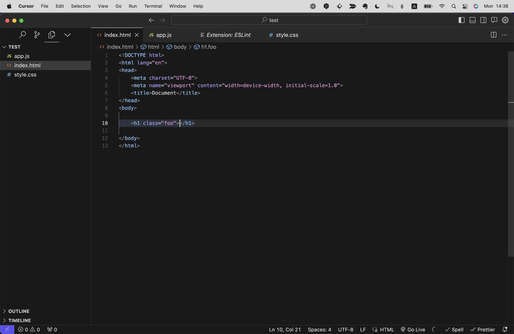

# 基本的な機能
さて、Chapter2でインストールしたCursorですが、前の章ではコードを書き始める上で最低限の説明しかしていませんでした。
Cursorの機能はまだまだそんなものではありません！
ここではCursorを使ってさらにプログラミング学習がはかどる方法を解説していきます。

## クイック・オープン
Cursorでは同じプロジェクト内のファイルであれば、クイック・オープンからファイル名の一部を少し入力するだけで素早く開くことができます。
クイック・オープンは画面左上の`File`メニューから`Quick Open`を選択するか、ショートカットキー(cmd+P/ctrl+P)で開くことができます。


## Command Pallette(コマンドパレット)
コマンドパレットを開くと、入力欄にコマンド名の一部を少し入力するだけで素早くCursorの機能を素早く実行することができます。
例えば後述する`Format Document`機能はコマンドパレットから`Format Document`と入力することで実行できます。実際は命令文すべてを入力する前に候補が表示されるので、それを選択するだけ（エンターキー）で実行できます。

コマンドパレットは画面左上の`View`メニューから`Command Pallette`を選択するか、ショートカットキー(cmd+shift+P/ctrl+shift+P)で開くことができます。


## コード補助・スニペット
Curosorはコード補助機能を標準で備えているため、楽にコードを書くことができます。
単純にタイピング数が減らせることでスピードアップが図れるほか、タイピングミスを避けることができるため、コードの品質も向上させることができます。

### 使用例:HTML
html:5と入力しエンターキーを押すと、下記のようなHTMLの雛形が展開されます。


そのほかにも、`タグ名`を入力→エンターキー、`タグ名 + セレクタ名`を入力→エンターキー、などとすることで、タグやセレクタを展開し閉じタグまで自動で入力してくれます。



### 使用例:CSS
CSSでは、`プロパティ名の一部 + 値の一部`を入力→エンターキーで、プロパティ名と値を自動で入力してくれます。
CSSの補完でとくにすごいのが、プロパティ名や値の単位をすべて入力する必要がなく、”なんとなく”の略称で補完されるところです。

例えば`display: block;`なら`db`、`margin-top: 10px;`なら`mt10`、`font-size: 16px;`なら`fs16`といった具合です。


### 使用例:JS
JSでは`const`や`for`など、キーワードの一部を入力するだけで、そのキーワードに関するコードを自動で入力してくれます。


## 全角・半角を見分ける
全角入力は文字列以外で使うとエラーの原因になります。とくにスペースは全角なのか半角なのか見分けが難しいですが、Cursorでは下記のように全角スペースは黄色くハイライトされるため、全角・半角を見分けることができます。


## Compare(ファイル比較)
何らかの教材を使いお手本となるコードを書いたとき、そのコードと自分のコードを比較することで、自分のコードの問題点を発見することができます。
Cursorでは下記のように、2つのファイルを比較することができます。

1. 自分が書いたコードのファイルを開いておく（アクティブ状態）
2. 比較したいコードをクリップボードにコピー
3. Cursorでコマンドパレットを開き、`Compare`と入力し、`Compare Active File with Clipboard`を選択


比較時は下記のように、左側に自分のコード、右側にクリップボードにコピーしたのコードが表示されます。
差分がある箇所のみハイライトされるため、問題点を素早く発見することができます。


# 主要なAI機能

## AIへ質問する
Cursorに標準搭載されたAIと会話することができます。中身はChatGPTなので、精度やできること自体はChatGPTとさほど変わりません。
基本的には右側のチャット入力画面に質問を入力し、エンターキーを押すだけです。（cmd+Y/alt+Yで素早くチャット入力画面にカーソルを移動できる）


また、質問したい箇所をハイライトし、ショートカットキー（shift+cmd+L/shift+alt+L）を入力すると、自動でチャット入力画面にハイライトした部分がペーストされるので、わざわざコピー＆ペーストする手間が省けます。


コマンドライン領域でも質問することができます。
先述の操作同様、ハイライトしたらショートカットキー（shift+cmd+L/shift+alt+L）でチャット入力画面にペーストできるほか、もしエラーログが発生している場合にはカーソルを乗せると表示される「Debug with AI」ボタンを押すと、該当箇所がペーストされるだけでなく「このエラーを解決してほしい」というようなプロンプトとセットで送信まで行われるため、AIによる解決を素早く試すことができます。


## エラーの検知+AIによる解決
Cursorでは使われていない変数や関数名はグレーでハイライトされるため、これを利用して不要なコードを素早く見抜くことができます。


また問題になりそうな部分は波線でハイライトされるため、エラーを素早く発見することができます。
英文ですが、波線にカーソルを当てるとエラーメッセージも出してくれるので、これを解決の手がかかりにすることができます。


このとき、Cursorではエラーを検知するだけでなくそのまま該当箇所をAIに質問することができます。
使い方は簡単で、波線にカーソルを当てたままショートカットキー（shift+cmd+E/shift+ctrl+E）か、「AI Fix in Chat」ボタンをクリックするだけです。
するとエラー文とそれの解決を求めるプロンプトが画面右側のAIチャット領域に自動入力・送信され、下記のように返答を受け取ることができます。


## AIによるコード編集
任意の部分をハイライトし、Editボタン（またはショートカットキーcmd+K/alt+K）を押すと、AIによるコード編集を行うことができます。
これはエラーの解決というより、コードの書き方の変更や改善をAIに相談するというものです。

例えば下記の例では、JSのif文が書かれた箇所を似たような構文であるSwitch文（意味は同じ）に書き直してもらう操作を行っています。


元のコードは赤、提案されたコードは緑でハイライトされます。この状態で提案されたコードを良しとするならcmd+Y/shit+Yを入力すると緑の提案されたコードが、却下する場合はcmd+N/shit+Nを入力すると赤の元のコードが採用されます。


## COPILOT
Copilotとは副操縦士の意味で、AIがコーディングをサポートしてくれる機能です。
前後のコードから開発者の意図を推測し、コードを自動生成してくれます。

使い方は任意の場所にカーソルをあわせて、ショートカットキー（option+エンター/alt+エンター）を押します。
このとき、AIによるコード生成に若干の時間がかかりますが、その間option/altキーは押したままにします。
提案されたコードを採用する場合はもう一度エンターキーを押し、却下する場合はoption/altキーを離します。

例えば下記の例は現在の時刻に合わせて挨拶文を生成するJavaScriptの関数のコードです。


ここまでは私が自分でコーディングしました。
このプログラムはかいつまんで説明すると「0~10時なら挨拶を"Good morning"にする」という命令だけ書かれています。
ここでCursorのCOPILOT機能を使ってみます。


すると「18時までなら挨拶を"Good afternoon"にする」「それ以外の時間は挨拶を"Good evening"にする」という意味のコードが自動生成されました。
前後のコードから私の意図を推測してくたのです！

```
【コラム】GitHub Copilot
Copilotの類似のサービスとして、GitHub Copilotという拡張機能があります。
正直、執筆時点(2024/1)ではGitHub Copilotの方が使いやすいのですが、そちらを使う場合はまた別途有料プランに入る必要があります。（月額$10~）
Cursorはまだベータ版ですが、今後もっと使いやすく、賢くなっていくことでしょう。
```

# 拡張機能
CursorおよびVS Codeは便利な拡張機能を多数提供しています。デフォルトの状態ではなく、効率を劇的に上げるためにぜひこうしたものを取り入れて使い倒していきましょう。
拡張機能をインストール・利用するたには、左メニューの`Extensions`をクリックします。
RECOMMENDED（おすすめ一覧）から任意のものを選ぶか、検索ボックスから拡張機能名で検索・クリックし、`install`をクリックします。
インストール完了後は`Enable/Disable`でオン／オフが切り替えられます。


ここでは、特におすすめの拡張機能を紹介します。

## Live Server


ローカルサーバーを立ち上げて、HTMLやCSSの変更をリアルタイムに反映してくれる拡張機能です。
インストール後は画面右下の「Go Live」をクリックするとローカルサーバーが立ち上がります。


## Code Spell Checker


英語のスペルミスを指摘してくれる拡張機能です。例えば”配列”という意味の英単語`array`ですが、`aray`などとスペルミスしてしまった場合に、波線で指摘してくれます。

## Prettier - Code formatter


コードのフォーマット（インデントや改行、クォーテーションなど）を統一したスタイルで整えてくれる拡張機能です。
インストール後は、クイックメニューから`Format Document`を選択すると、フォーマットが整えられます。
どのようなルールでカスタマイズするかは設定で変更できますが、デフォルトのままでも十分使えます。


## XXX snippets
スニペットとは直訳すると「断片」という意味ですが、要するによく使うコードのまとまりを数語のショートカットキーで呼び出せるようにしたものです。
HTML, CSS, JSなどの基本的なプログラミング言語のスニペットは標準である程度入っているためあまり必要性はないかもしれませんが、皆さんが今後別の言語やフレームワークを使った開発を行う場合は、その言語やフレームワークに対応したスニペットをインストールすることをおすすめします。
例えば、CSSのフレームワークであるBootstrapのスニペットなら「Bootstrap v4 Snippets」、フレームワークであるReactのスニペットなら「ES7+ React/Redux/React-Native snippets」などがあります。


## HTML Checker


HTMLのコードをチェックし改善点を示してくれる拡張機能です。間違ったタグの使い方などがあれば指摘してくれます。
使用するには、対象のHTMLファイルを開きアクティブな状態にした上で、クイックメニューから"Check HTML"を選択します。


## GitHub Copilot


こちらもAIによるコーディング支援機能ですが、Cursorの機能ではなく、GitHub社が提供している別物の拡張機能です。
執筆時点（2023/11）ではCursorのCOPILOTよりも使いやすく、現役エンジニアの中でも愛用者が多です。
ただし月額$19の有料プランに加入する必要があります。


こちらが実際の操作画面で、グレーの部分はAIによって提案されたコードです。
前後のコードから開発者の意図を推測し、コードを提案してくれます。タブキーを押せばAIの提案を採用し、そのまま提案されたコードが反映されます。
これによって開発者はタイピングや思考する時間を大幅に節約できるでしょう！