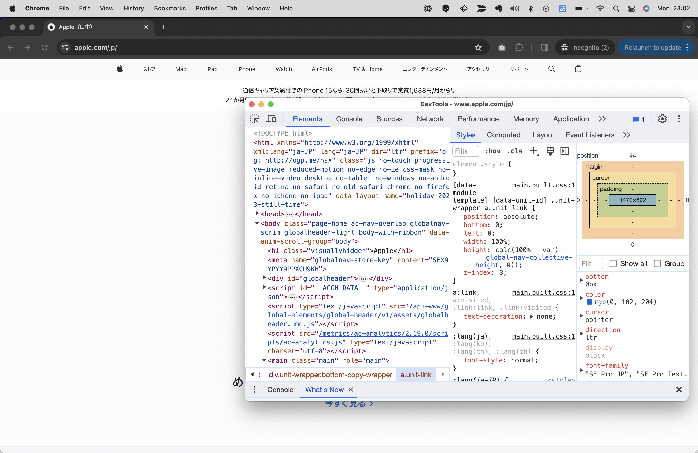
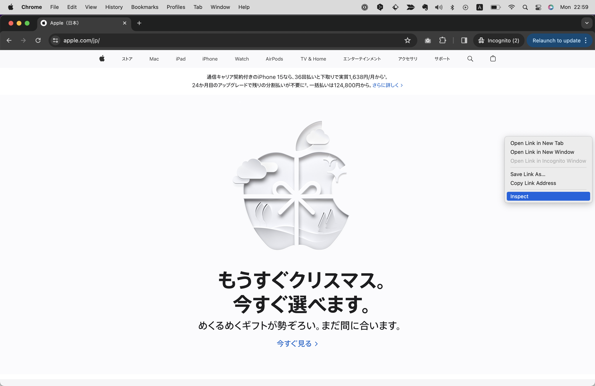
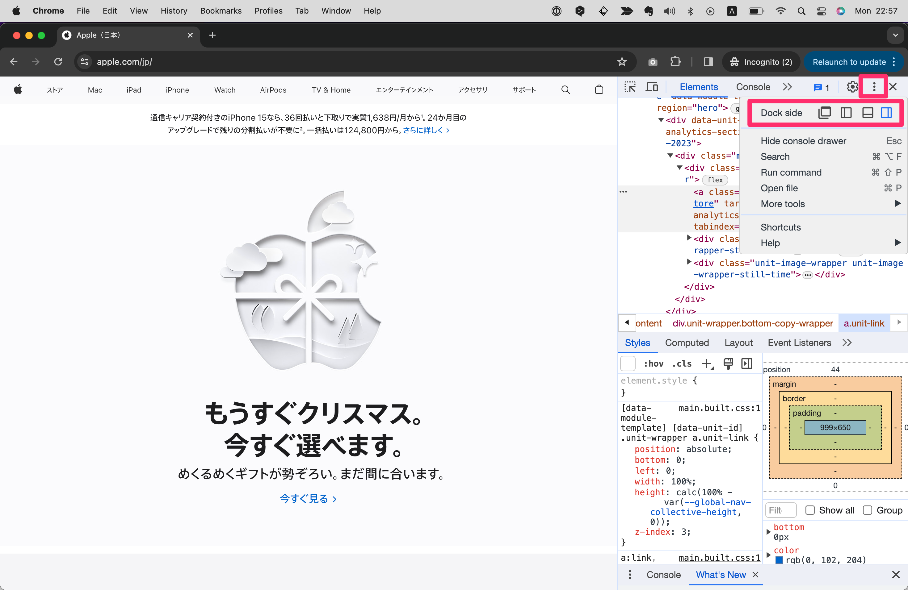
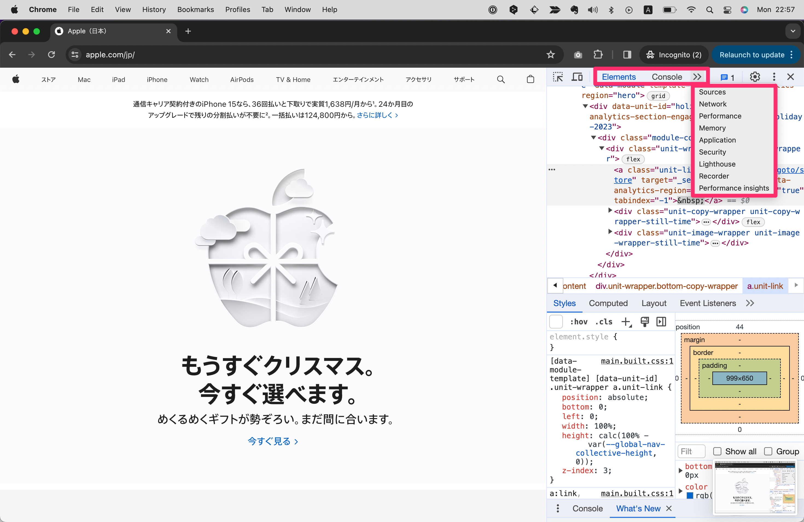
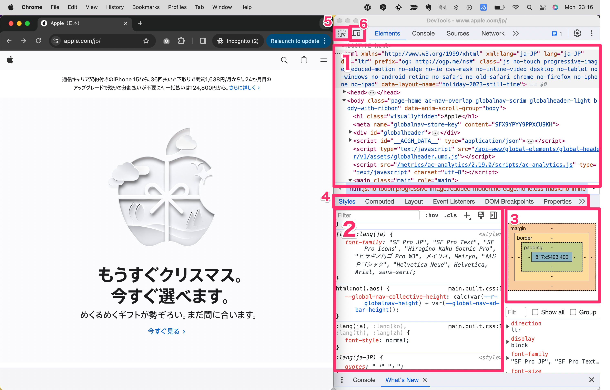
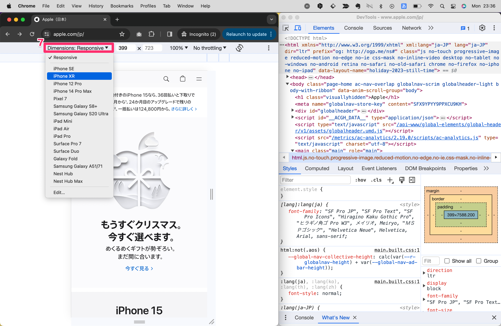
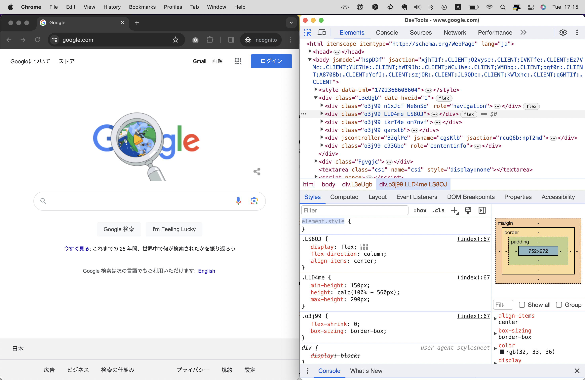
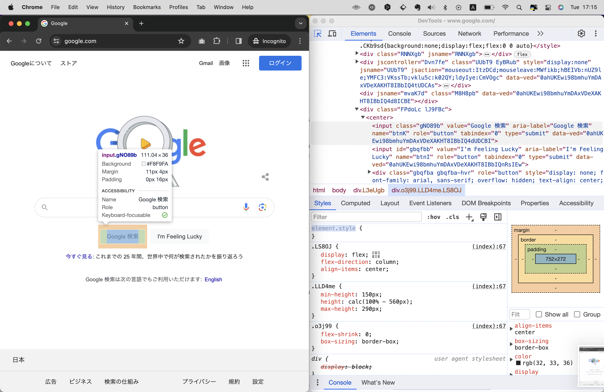
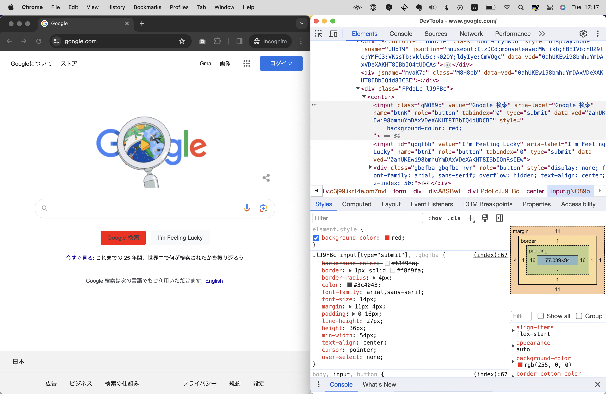
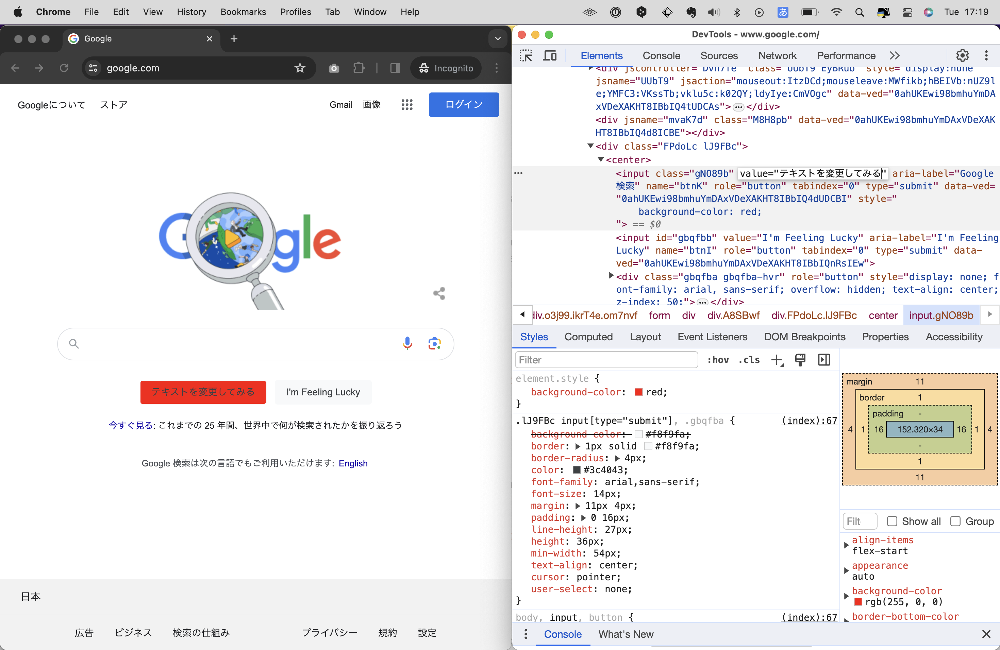

# 開発者ツール
開発者ツールとは、ブラウザに標準で搭載されている、Webページのデバッグや解析を行うためのツールです。
任意のWebページにアクセスしたあとこれを開くことで、そのページの細かい情報を確認したり、実験的にコードを書き換えたりすることができます。

とくにHTML、CSS、JavaScriptの開発においては必須のツールです！これの有無で生産性は劇的に変わるでしょう。

開発者ツールはどのブラウザにも搭載されていますが、ここでは使いやすさとシェア率の高さからGoogle Chromeの開発者ツールを使って説明していきます。
Webページを開き、`command+option+i`（macOS）または`F12`（Windows）を押すと開くことができます。
Webページ上で適当なエリアを右クリックし、`検証(Inspect)`を選択することでも開くことができます。

開発者ツールのメニューはとても多く、初心者の内はどれが何を意味しているのかわからないかもしれません。
そのためここでは初心者でも使う機会が多いであろう主要なメニューを中心に解説していきます。

## 画面と各種メニューの説明

### 表示の切り替え

右上の3点リーダーをクリックすると「Dock side」というメニューが表示されます。このアイコンをクリックすると、開発者ツールの表示位置を変更することができます。
柔軟にサイズを変更したりできるため、個人的にはウィンドウを切り離せる表示（一番左）がおすすめです。

### 主要メニュー一覧

画面上部には主要なパネルのメニューがあり、矢印アイコンをクリックするとすべてのメニューが表示されます。
この内、本書ではElements, Console, Nework, Lighthouseを重点的に解説していきます。

1. Elements: HTML要素やCSSを確認・操作できる
2. ConsoleL: JavaScriptを実行できる
3. Nework: 通信のログを確認できる
4. Lighthouse: Webページのパフォーマンスを可視化できる

## 主要メニュー

### 1.Elements
Elementsは主にHTMLとCSSの確認・デバッグで使うメニューです。
この画面上では現在開いているWebページのHTMLとCSSのソースコードが表示されます。
そして一時的ではあるものの、これらを編集することができます！

自分が開発中のWebページはもちろん、全く関係のない既存のWebサイト相手にも操作可能です。
表示を確認しながらとりあえず試しにコードを書いてみたいときに便利です。（リロードしたりウィンドウを閉じると元に戻ります）

1. HTMLの構造を確認できる領域
2. 選択中の要素のCSSを確認できる領域
3. 選択中の要素のボックスモデルを確認できる領域
4. サブメニュー。ほとんどStylesしか使わない
5. 「要素を選択する」ボタン
6. 閲覧環境（デバイス）を変更できるモードへ移行
7. デバイスを選択するメニュー

例えば、「Googleのサイトでボタンの色を複数試したり、中に入れるテキストを変えてみたい」という場合、下記のように操作します。

1. 「要素を選択する」ボタンをクリック

2. その状態でWebページ内にある対象のボタンをクリック

3. 「選択中の要素のCSSを確認できる領域」に`background-color`プロパティを追記・変更(このとき、クラスセレクタではなく`element.style`と表記がある部分にCSSを加えると選択した要素にだけCSSをあてることができます)

4. 「HTMLの構造を確認できる領域」にて任意のテキストを変更

### 2.Console
ConsoleはJavaScriptを実行できるパネルです。開発中のWebページに組み込んだJavaScriptの動作確認を行うほか、とりあえずで何かしらのJavaScriptプログラムを書く際にも使うことができます。

また、JavaScriptには`console.log`という関数がありますが、これに引数を与えて実行すると結果がこのConsoleパネル上に表示されます。これを使って容易にデバッグを行うことができます。(Chapter 5.13参照)
<!-- TODO -->

## Nework
## Lighthouse