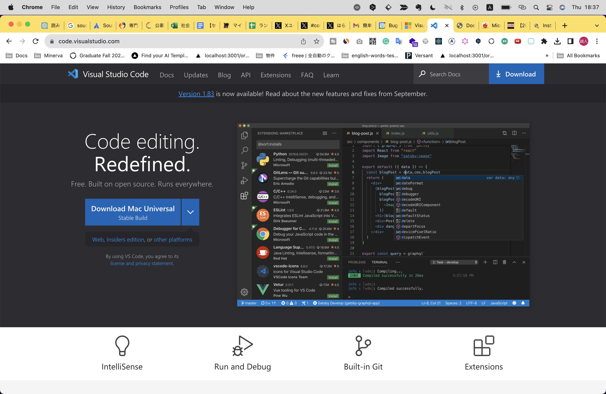
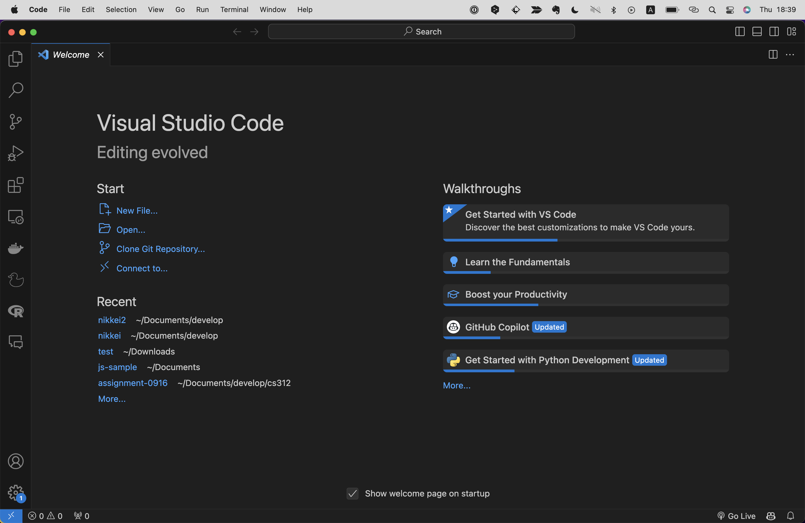
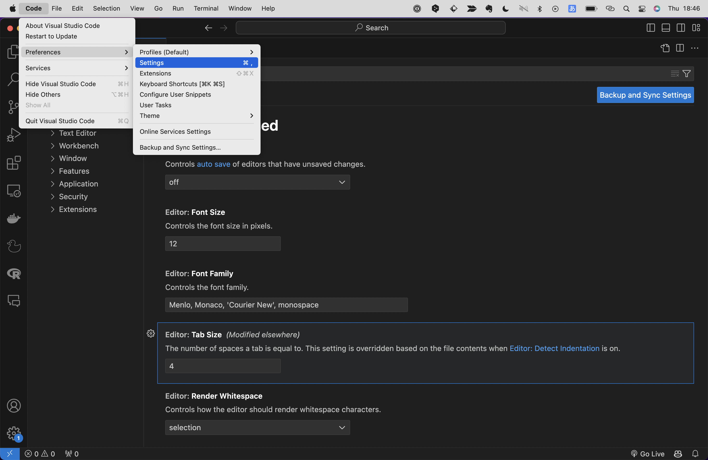
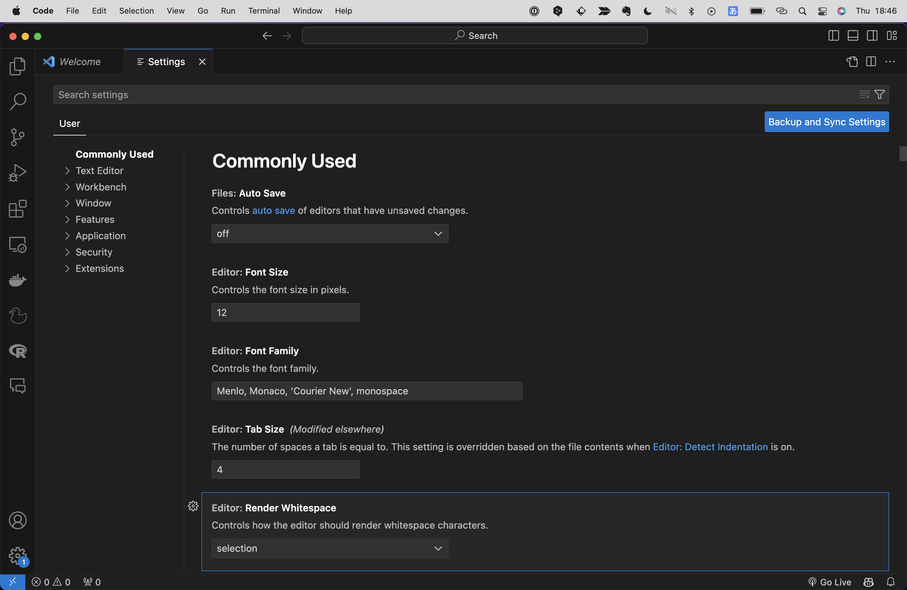

# IDEとは
IDE(Integrated Development Environment)とは、開発に必要なツールを一つにまとめたソフトウェアです。
単にテキストやコードを書くだけのシンプルなソフトウェアのことはテキストエディアと呼びますが、IDEはそれに加えて多種多様な機能を有しており、それらを活用することで作業効率を何百倍にも加速させることができます！
プログラミングを行う上でIDEは必須と言っても過言ではありません。

# Cursorとは
CursorはIDEの一種で、2023年11月現在もっとも注目度が高いIDEといっても過言ではありません。
CursorはAnysphere社というスタートアップが開発するIDEで、その最大の特徴はなんといってもAI(ChatGPT)が標準搭載されていることです。
それまではIDEといえばマイクロソフト社のVisual Studio Code(以下VS Code)がデファクトスタンダードでしたが、Cursorの登場によりその地位は揺らぎつつあります。

AI搭載というと敷居が高そうに見えるかもしれませんが、そんなことはありません。
また操作性もよくほかのIDE同様に無料で簡単に使うことができます。（有料プランもありますが、無料プランでも十分に使えます。）

# Cursorのインストール
まずは公式サイト（https://cursor.sh/）にいき、任意のOSのインストーラーをダウンロードしてください。

"VS Code公式サイト"

インストーラーを起動し、指示に従います。

{イメージ図}

ダウンロードが完了し、VS Codeを起動すると下記のような画面が表示されます。

この`Welcome`というタブは起動時に毎回表示されますが、閉じてしまって問題ありません。

### 設定
設定はメニューの`Code` -> `Preferences` -> `Settings`を選択するかショートカットキー`Win:ctrl + ,` or `macOS:cmd + ,`で開くことができます。

"Code -> Preferences -> Settings"
"設定画面"

設定できる項目は多岐にわたるのですべてをチェックはせずに、重要なものだけいじってみましょう。
下記は主要な設定項目です。

| 項目名 | デフォルト値 | 説明 |
| ---- | ---- | ---- |
| Auto Save | off | ファイルを変更した際に自動で保存するかどうかの設定。おすすめはファイル変更時の若干後に自動で保存される"afterDelay" |
| Font Size | 12 | ---- |
| Tab Size | 4 | ---- |