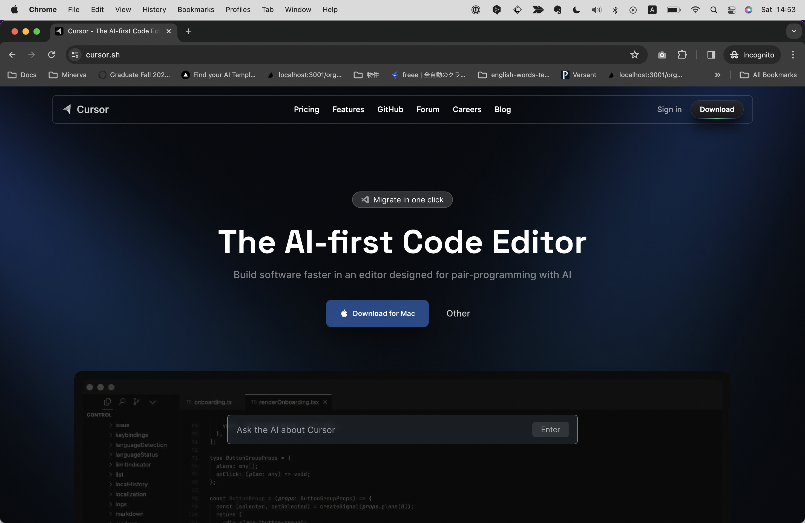
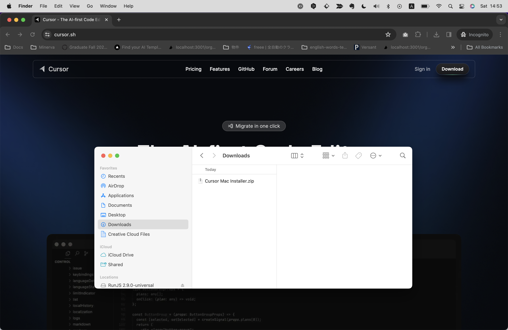

# IDEとは
IDE(Integrated Development Environment)とは、開発に必要なツールを一つにまとめたソフトウェアです。
単にテキストやコードを書くだけのシンプルなソフトウェアのことはテキストエディアと呼びますが、IDEはそれに加えて多種多様な機能を有しており、それらを活用することで作業効率を何百倍にも加速させることができます！
プログラミングを行う上でIDEは必須と言っても過言ではありません。

# Cursorとは
CursorはIDEの一種で、2023年11月現在もっとも注目度が高いIDEといっても過言ではありません。
CursorはAnysphere社というスタートアップが開発するIDEで、その最大の特徴はなんといってもAI(ChatGPT)が標準搭載されていることです。
それまではIDEといえばマイクロソフト社のVisual Studio Code(以下VS Code)がデファクトスタンダードでしたが、Cursorの登場によりその地位は揺らぎつつあります。

AI搭載というと敷居が高そうに見えるかもしれませんが、そんなことはありません。
また操作性もよくほかのIDE同様に無料で簡単に使うことができます。（有料プランもありますが、無料プランでも十分に使えます。）

# Cursorのインストール
まずは公式サイト（https://cursor.sh/）にいき、任意のOSのインストーラーをダウンロードしてください。
このWebサイトは自動でOSの種類を判別し、ユーザーのOSに合わせて一つだけダウンロードのボタンを表示してくれますので、それをクリックしましょう。

するとMacの場合はzip、windowsの場合はexeファイルがダウンロードされるので、これをダブルクリックします。

途中、下記のようにセキュリティの警告が表示されることがありますが、そのまま進めてください。

インストール後、はじめにCursorを起動すると下記のような設定画面が表示されますので、任意のものを選択してください。
LanguageはAIの対応言語に関する設定です。日本語でやり取りをしたい場合は"Japanese"または"日本語"と入力します。
その他はデフォルトのままで問題ありません。設定を確認したら`Continue`をクリックします。

VS Codeをインストールしている人の場合は、拡張機能を引き継ぐかどうか聞かれる画面が表示されるので`Use Exetnsions`をクリックします。
（なんと、CursorはVS Codeの拡張機能を1クリックでそのまま使うことができるのです！）

続いてアカウントの登録・ログインを求められるので、初回は`Sign Up`を選択します。

遷移先の画面でメールアドレスまたはGoogleかGitHubアカウントにて、アカウント登録を済ませましょう。

アカウント登録を済ませると、自動でログインしCursorのデスクトップアプリに戻るためのダイアログが表示されます。

これでインストールは完了です！下記のような画面が表示されていればCursorのセットアップは成功しています。
初回に表示されるこのタブウィンドウは閉じてしまって問題ありません。

# 設定
# 画面とメニューの説明
# AI機能
# 拡張機能
# ショートカットキー
# ユースケース