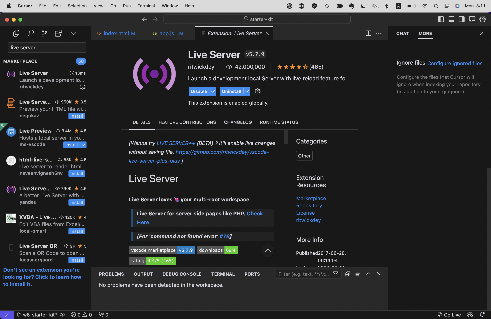
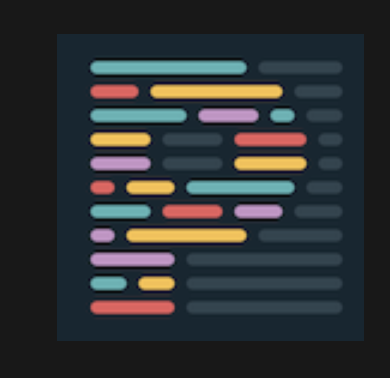
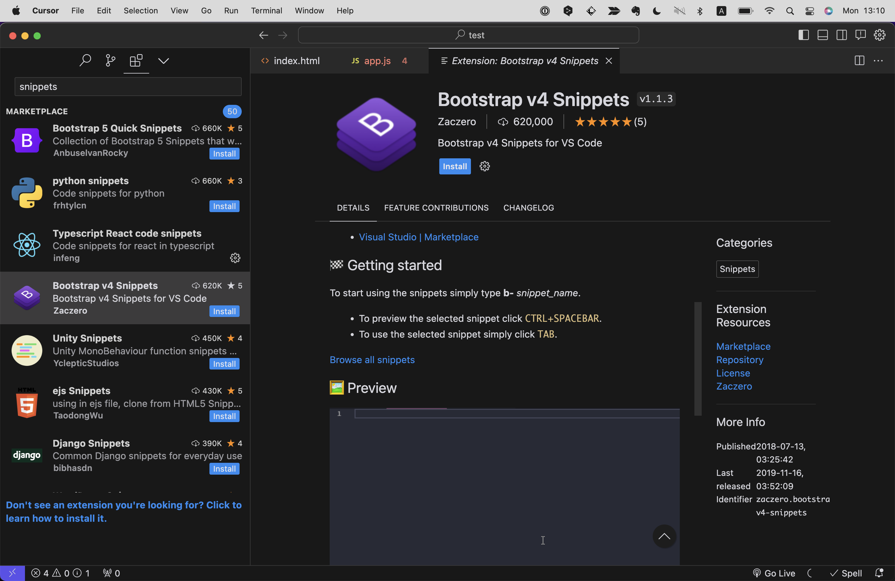

# IDEとは
IDE(Integrated Development Environment)とは、開発に必要なツールを一つにまとめたソフトウェアです。
単にテキストやコードを書くだけのシンプルなソフトウェアのことはテキストエディアと呼びますが、IDEはそれに加えて多種多様な機能を有しており、それらを活用することで作業効率を何百倍にも加速させることができます！
プログラミングを行う上でIDEは必須と言っても過言ではありません。

# Cursorとは
CursorはIDEの一種で、2023年11月現在もっとも注目度が高いIDEといっても過言ではありません。
CursorはAnysphere社というスタートアップが開発するIDEで、その最大の特徴はなんといってもAI(ChatGPT)が標準搭載されていることです。
それまではIDEといえばマイクロソフト社のVisual Studio Code(以下VS Code)がデファクトスタンダードでしたが、Cursorの登場によりその地位は揺らぎつつあります。

AI搭載というと敷居が高そうに見えるかもしれませんが、そんなことはありませんし、操作性もよくほかのIDE同様に無料で簡単に使うことができます。
VS Codeを初めとした従来のIDEが持っている機能に加え、Cursorはとくに下記のような特徴を持っています。

1.ChatGPTが標準搭載されており、とてもスムーズに質問できる操作性
2.プロジェクトを横断的に分析・質問できるCODEBASE機能
3.AIがコーディングをサポートしてくれるCOPILOT機能（要有料プラン）

無料版だとChatGPTに質問できる回数に月額制限がある、COPILOT機能が使えない、などの制限はありますが、そうした縛りがあったとしても他のIDE以上の性能のため、導入しない理由はありません！

## プランによる機能の違い

| 項目 | Free | Pro | Business |
| --- | --- | --- | --- |
| 費用 | 無料 | 月額$20 | 月額$40 |
| ChatGPT-4 | 低速・50回/月 | 高速・200回/月 | 月間無制限 |

# セキュリティに問題はないの？
とくに会社支給のPCでCursorを使う場合や仕事でCursorを使う場合、セキュリティ的に大丈夫だろうか？と心配する方もいるかもしれません。
結論からいうと、お努めの会社のポリシーなどでこうしたAIツールの仕様が禁止されている場合、CursorのAI機能は使わない、またはVS Codeなどの従来のIDEを使うことをオススメします。
VS CodeはほぼCursorと同じ機能・同じUI画面なので、VS Codeだとしても以降の本書の説明はAI機能を除きほぼそのまま適用できます。

VS Codeのインストールは簡単で、公式サイトへアクセスすると閲覧者のOSによってダウンロードボタンが対応したOSのものに変わるので、それをクリックするだけです。

https://code.visualstudio.com/

公式サイトの説明によれば、Cursorは設定で「プライバシーモード」を有効にすることで、コードの情報はCursorを運営するAnysphere社のサーバーに保存されなくなります。（後述）
ただし、FreeまたはProプランの場合はそれでもChatGPTを開発するOpenAIは送信したプロンプトを30日間保持するとしています。
Businessプランの場合、Cursorは一切プロンプトデータを保存しないとしています。
ただし、そうはいってもAnySphere社やOpenAIを信頼するかどうかは個人の判断に委ねられます。

AI機能の有無によって学習効率や生産性は確実に何倍にも跳ね上がり周りと差がつくでしょうから、できることならAI機能が使えるような環境を作っておきたいところです。

# Cursorのインストール
まずは公式サイト（https://cursor.sh/）にいき、任意のOSのインストーラーをダウンロードしてください。
このWebサイトは自動でOSの種類を判別し、ユーザーのOSに合わせて一つだけダウンロードのボタンを表示してくれますので、それをクリックしましょう。

するとMacの場合はzip、windowsの場合はexeファイルがダウンロードされるので、これをダブルクリックします。

途中、下記のようにセキュリティの警告が表示されることがありますが、そのまま進めてください。

インストール後、はじめにCursorを起動すると下記のような設定画面が表示されますので、任意のものを選択してください。
LanguageはAIの対応言語に関する設定です。日本語でやり取りをしたい場合は"Japanese"または"日本語"と入力します。
その他はデフォルトのままで問題ありません。設定を確認したら`Continue`をクリックします。

VS Codeをインストールしている人の場合は、拡張機能を引き継ぐかどうか聞かれる画面が表示されるので`Use Exetnsions`をクリックします。
（なんと、CursorはVS Codeの拡張機能を1クリックでそのまま使うことができるのです！）

続いてアカウントの登録・ログインを求められるので、初回は`Sign Up`を選択します。

遷移先の画面でメールアドレスまたはGoogleかGitHubアカウントにて、アカウント登録を済ませましょう。

アカウント登録を済ませると、自動でログインしCursorのデスクトップアプリに戻るためのダイアログが表示されます。

これでインストールは完了です！下記のような画面が表示されていればCursorのセットアップは成功しています。
初回に表示されるこのタブウィンドウは閉じてしまって問題ありません。

# Cursorの基本的な使い方
Cursorでコーディングを行うにはまず、プロジェクト（※）があるフォルダを開く必要があります。
プロジェクトを開くには、左上の`File`メニューから`Open Folder`を選択し、プロジェクトがあるフォルダを選択します。これでCursorにプロジェクトが読み込まれます。

※1つのアプリケーションに関するhtmlやjsなどのファイルがまとまって格納されたディレクトリのことをプロジェクトと呼びます。

ファイルを直接開くこともできますが、フォルダごと開いてプロジェクトをCursorに認識させることで、プロジェクト内の検索など様々な恩恵を受けられます。そのため、基本的にプロジェクト単位で開くことをおすすめします。

# 画面とメニューの説明

- a.主要なメニューがあります。一番右の矢印アイコンをクリックすると全メニューが表示され、ピンのアイコンをクリックすると目立つ位置にとどめておくことができます。（導入した拡張機能次第でこのメニューは増えたりします）
  - Explorer（shift+cmd+E/shift+alt+E）：プロジェクト内全体のファイルを一覧化
  - Search(shift+cmd+F/shift+alt+F)：プロジェクト内全体で検索
  - Source Control（shift+cmd+G/shift+alt+G）：Gitが扱える
  - Extentions（shift+cmd+X/shift+alt+X）：拡張機能を探す　... など
- b.aで選んだメニューが表示される領域。この画像はエクスプローラーの表示
- c.現在アクティブ（選択中の意味）のファイルの中身を表示
- d.コマンドラインなどが使える領域
- e.AIやそれに関わる設定領域
 - CHAT: AIとのチャット領域
 - MORE:
   - RULES FOR AI: AIとの会話で使う言語。「Always respond in 言語」の”言語”の部分を変えることで変更可能
   - COPILOT++: enabledでAIによるペアプログラミングモードをオンにする（要有料プラン）
   - CODEBASE INDEXING: CODEBASE機能（プロジェクトのファイル全体について横断的に分析・質問できる機能）を使用するためにファイル全体の読み込みを行う
- f.画面を分割・表示するメニュー
- g.設定

なお、各メニューの表示・非表示はグローバルメニューの`View -> Appearance`内で行えます。

# 設定

## 主要な設定
Cursorの主要な設定はグローバルメニューの`Cursor -> Preferences -> Settings`またはショートカットキー(cmd+,/ctrl+)で変更できます。

ほとんどの設定はデフォルトのままで問題ありませんが、主に下記の設定は把握しておくと良いでしょう。

- Commonly Used
  - Files: Auto Save
    - デフォルト: `off`
    - 推奨: `afterDelay`
    - 説明: ファイルに変更を加えたときに自動で保存する機能です。`off`だと手動で毎回保存する必要があるため、保存忘れによる変更の消失を防ぐことができます。
  - Editor: Font Size
    - デフォルト: 12
    - 推奨: 任意の値
    - 説明: エディターのフォントを変更できます。
  - Editor: Tab Size
    - デフォルト: 4
    - 推奨: 4
    - 説明: インデントで使うタブの幅を変更できます。タブの幅は4または2が一般的です。自分がリーダーのプロジェクトはさておき、既存のプロジェクトに合わせるのであれば、そのプロジェクトのコーディング規約に従って変更しましょう。

## アカウント設定
Cursorのアカウント設定は画面右上の歯車アイコン（先程の画面図の`g`）をクリックすると開けます。

- Account
 - Log Out: 現在ログイン中のアカウントからログアウトします。
 - Manage: アカウントの管理画面（Webページ）を開きます。ここからプランや支払い方法の変更・停止などができます。
- Privacy mode
 - デフォルト: disabled
 - 推奨: enabled
 - 説明: AIに質問する際に、質問内容をAnySphere社のサーバーに送信するかどうかを設定できます。`enabled`にすると、質問内容はAnySphere社のサーバーに送信されず、OpenAIのサーバーにのみ送信されます。ただし、OpenAIは送信したプロンプトを30日間保持します。`disabled`にすると、質問内容はAnySphere社のサーバーに送信されますが、データを収集することでAIの精度が改善されることがあります。

# 主要な機能

## コード補助・スニペット
## 全角・半角を見分ける
## エラーの検知+AIによる解決

## 1.AI機能
Cursor最大の特徴はAI機能です。さまざまな箇所でAIに質問することができます。
これを使用するには常にインターネットに接続している必要があります。

# 主な操作とショートカットキー
- クイックメニュー
- Format

# 拡張機能
CursorおよびVS Codeは便利な拡張機能を多数提供しています。デフォルトの状態ではなく、効率を劇的に上げるためにぜひこうしたものを取り入れて使い倒していきましょう。
拡張機能をインストール・利用するたには、左メニューの`Extensions`をクリックします。
RECOMMENDED（おすすめ一覧）から任意のものを選ぶか、検索ボックスから拡張機能名で検索・クリックし、`install`をクリックします。
インストール完了後は`Enable/Disable`でオン／オフが切り替えられます。

ここでは、特におすすめの拡張機能を紹介します。

## Live Server

ローカルサーバーを立ち上げて、HTMLやCSSの変更をリアルタイムに反映してくれる拡張機能です。
インストール後は画面右下の「Go Live」をクリックするとローカルサーバーが立ち上がります。

## Code Spell Checker

英語のスペルミスを指摘してくれる拡張機能です。例えば”配列”という意味の英単語`array`ですが、`aray`などとスペルミスしてしまった場合に、波線で指摘してくれます。

## Prettier - Code formatter

コードのフォーマット（インデントや改行、クォーテーションなど）を統一したスタイルで整えてくれる拡張機能です。
インストール後は、クイックメニューから`Format Document`を選択すると、フォーマットが整えられます。
どのようなルールでカスタマイズするかは設定で変更できますが、デフォルトのままでも十分使えます。

## XXX snippets
スニペットとは直訳すると「断片」という意味ですが、要するによく使うコードのまとまりを数語のショートカットキーで呼び出せるようにしたものです。
HTML, CSS, JSなどの基本的なプログラミング言語のスニペットは標準である程度入っているためあまり必要性はないかもしれませんが、皆さんが今後別の言語やフレームワークを使った開発を行う場合は、その言語やフレームワークに対応したスニペットをインストールすることをおすすめします。
例えば、CSSのフレームワークであるBootstrapのスニペットなら「Bootstrap v4 Snippets」、フレームワークであるReactのスニペットなら「ES7+ React/Redux/React-Native snippets」などがあります。

## HTMLHint

HTMLのコードをチェックし改善点を示してくれる拡張機能です。例えばタグの閉じ忘れや、不要なタグなどを指摘してくれます。
※似たような名前の拡張機能が複数ありますが、このアイコンのもの以外は更新が止まっているなどの理由で非推奨とされています。ご注意ください。

## GitHub Copilot

AIがコーディングをサポートしてくれる拡張機能。有料プランに加入する必要がありますが、2023/11執筆時点ではCursorのCOPILOTより使いやすいです。

