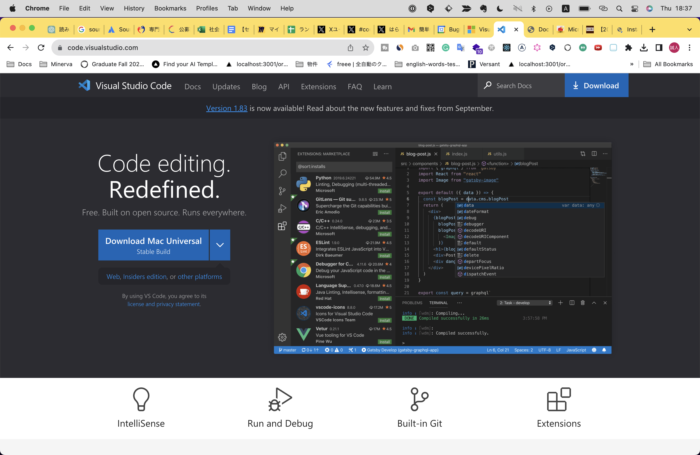
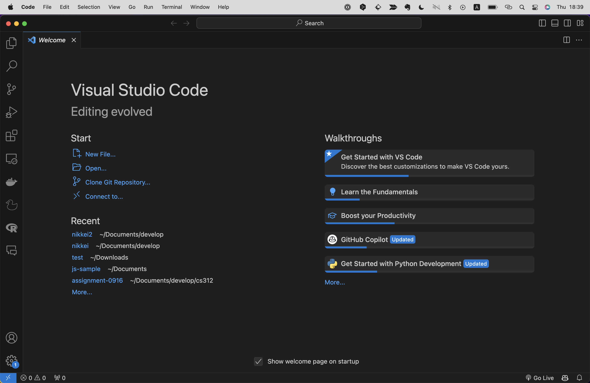
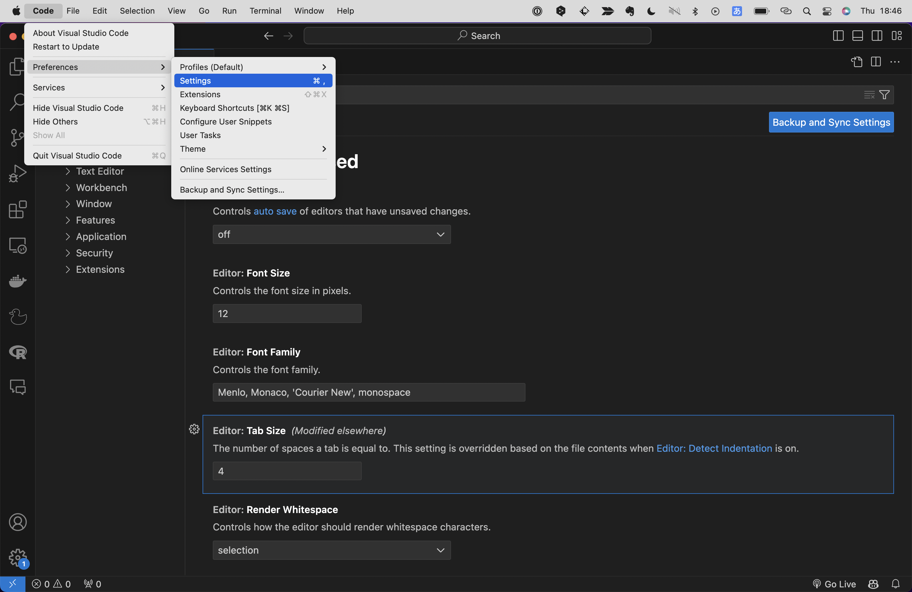
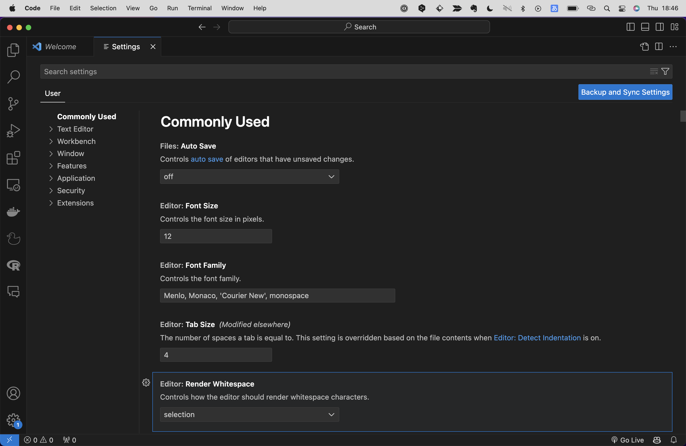

## Visual Studio Code
Visual Studio Codeはマイクロソフト社製のIDEです。（以降VS Codeと表記します。）
IDE(Integrated Development Environment)とは、開発に必要なツールを一つにまとめたソフトウェアです。
単にテキストやコードを書くだけのシンプルなソフトウェアのことはテキストエディアと呼びますが、IDEはそれに加えて多種多様な機能を有しており、それらを活用することで作業効率を何百倍にも加速させることができます！
本稿ではそんなIDEの中でももっともシェア率が高く、無料で使える製品であるVS Codeの紹介をします。

### VS Codeのインストール
まずは公式サイト（https://code.visualstudio.com/download）にいき、任意のOSのインストーラーをダウンロードしてください。

"VS Code公式サイト"

インストーラーを起動し、指示に従います。

{イメージ図}

ダウンロードが完了し、VS Codeを起動すると下記のような画面が表示されます。

この`Welcome`というタブは起動時に毎回表示されますが、閉じてしまって問題ありません。

### 設定
設定はメニューの`Code` -> `Preferences` -> `Settings`を選択するかショートカットキー`Win:ctrl + ,` or `macOS:cmd + ,`で開くことができます。

"Code -> Preferences -> Settings"
"設定画面"

設定できる項目は多岐にわたるのですべてをチェックはせずに、重要なものだけいじってみましょう。
下記は主要な設定項目です。

| 項目名 | デフォルト値 | 説明 |
| ---- | ---- | ---- |
| Auto Save | off | ファイルを変更した際に自動で保存するかどうかの設定。おすすめはファイル変更時の若干後に自動で保存される"afterDelay" |
| Font Size | 12 | ---- |
| Tab Size | 4 | ---- |