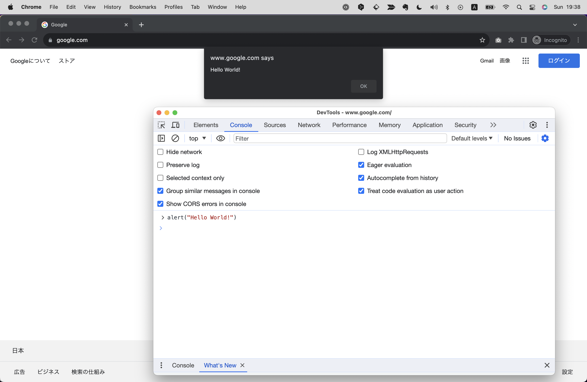
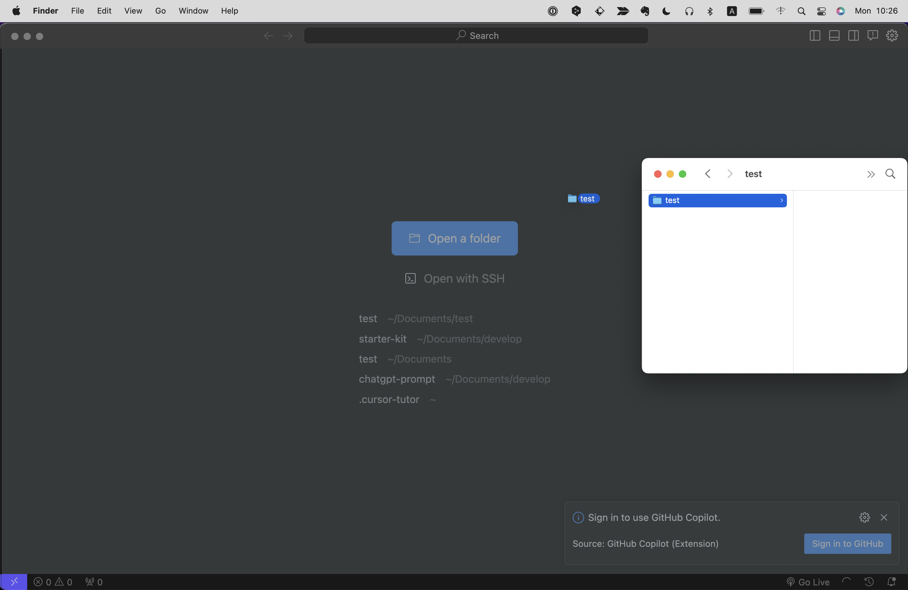
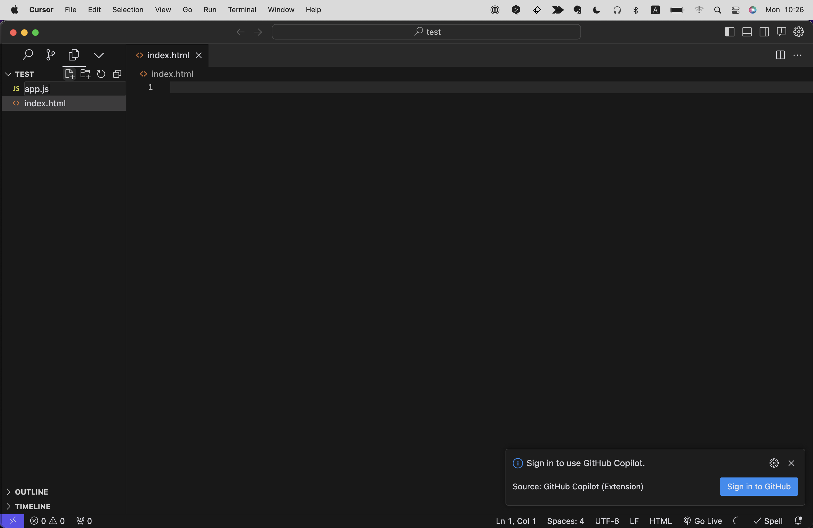
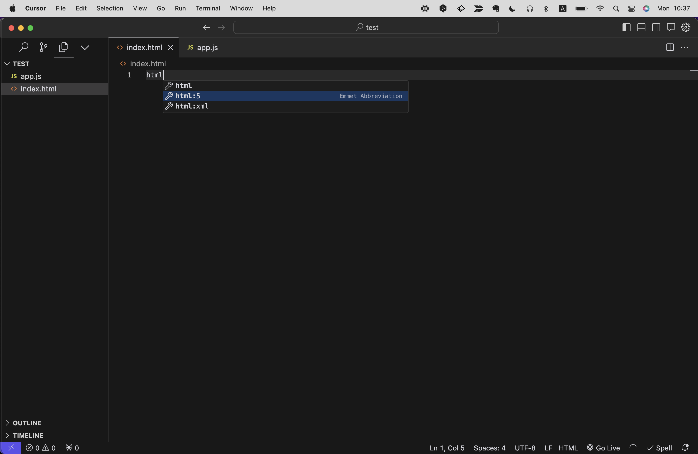
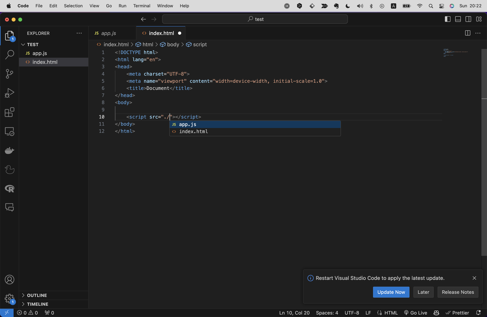
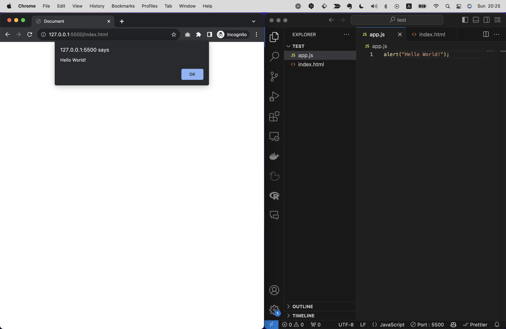

# JSを試す
JSをもっとも簡単に試す方法は、Webブラウザにある開発者ツールのコンソールを使うことです。
Chapter 4で登場した開発者ツールのコンソールは、JSのコードを実行することができます。
試しに、コンソールを開き、`alert("Hello World!")`と入力してみましょう！
すると、画面に「Hello World!」という文字とともにダイアログが表示されるはずです。



いかがでしょう？簡単ですね！
他のプログラミング言語はまずコーディング前に環境をセットアップする必要がありますが、このようにWebブラウザさえあればすぐに試すことができる敷居の低さもJSの魅力です。

# Webページ上でJSを実行する
さて、コンソール上でJSを実行するのもいいですが、本来のJSはWebサイトやWebアプリケーションなどページ上で動作させてこそです。
というわけで、ここではWebページ上でJSを実行する方法を解説します。

## プロジェクトを作成する
まず、任意の場所（デスクトップや書類ディレクトリなど）にプロジェクトのディレクトリとなる空のフォルダを作成しましょう。
その後、作成したフォルダをCursorで開きます。（Chapter 4.2参照）

プロジェクトを開くには、左上の`File`メニューから`Open Folder`を選択し、プロジェクトがあるフォルダを選択します。
または新規ウィンドウ（shift+cmd+N/shict+ctrl+N）を開いた状態であれば、フォルダをドラッグ＆ドロップするだけで読み込みができます。



JSを書く際は拡張子が.jsで終わるJSファイルを作成します。
ここでは試しに、テスト用のフォルダを作成し、そこに`app.js`というファイル名でJSファイルを作成してみましょう。
CursorやVS Codeであればサイドバーのメニューからファイル作成が可能です。その際、ファイル名の末尾に`.js`をつけてください。



続いて作成したJSファイルをHTMLに読み込みます。
`index.html`を作成し、雛形のHTMLを記述しましょう。

```html
<!DOCTYPE html>
<html lang="en">
<head>
    <meta charset="UTF-8">
    <meta name="viewport" content="width=device-width, initial-scale=1.0">
    <title>Document</title>
</head>
<body>
    
</body>
</html>
```

CursorやVS Codeでは`index.html`上で`html:5`とだけ入力→エンターキーで下記のようなHTMLが展開されます。



その後、HTML内に`</body>`タグ内直前に以下のように`<script>`タグを記述し、`src`属性に`app.js`までのパスを記述します。

```html
<!DOCTYPE html>
    ... 

    <script src="./app.js"></script> 
</body>
</html>
```

`script`タグは`src属性(ソース属性)`を持つことができます。ここにJSファイルのパスを指定することで、そのJSファイルを読み込むことができます。
パスを指定する際はCursorの補完機能を使いましょう！(Chapter 4.2参照)パスの入力で間違える学習者は大変多いですが、これを使えば間違えることはありません。



これで準備は完了です！
続いて、正しくJSが実行されるかどうか確認するためのコードを書きます。

## JSを書いてみる
試しに`app.js`に`alert("Hello World!")`と記述してみましょう。

```js
alert("Hello World!");
```

そして、`index.html`をブラウザで開いてみましょう。
開く際はLiver Server(Chapter 4.2参照)を使うことをおすすめします。
ちなみに、index.htmlファイルをブラウザにドラッグ＆ドロップするだけでもこの程度のコードであれば動作確認はできます。JSのコードによってはそれだと動作しない場面も出てくるため、基本的にはLiver Serverによるローカルサーバー上で確認するのが確実です。

成功した場合は、画面に「Hello World!」という文字とともにダイアログが表示されるはずです。



さて、次項からはJSの基礎文法について解説します！
例えば英語学習には主語、述語、代名詞、基本5文型、過去形、未来形、といったような文法がありますが、プログラミング言語にもそうした文法があります。
少々とっつきづらいかもしれませんが、このような土台となる基礎知識はプログラムを書く力に直結します。
すぐにアウトプットができるよう最低限の内容にしぼっているので、ぜひ最後まで読み進めてください！

---
【コラム】
先ほどJSを書くには別途JSファイルを作成して読み込む、という手順を解説しましたが、JSはHTMLファイル内に直接記述することもできます。
その場合は`<script>`タグの中にJSを記述します。（`src`属性は不要）

例）
```js
<script>
    alert("Hello World!");
</script>
```

ただ、ファイルを分けずにHTML内にJSを書くメリットはあまりないため、基本的にはJSファイルとして分けて書くことをおすすめします。

---