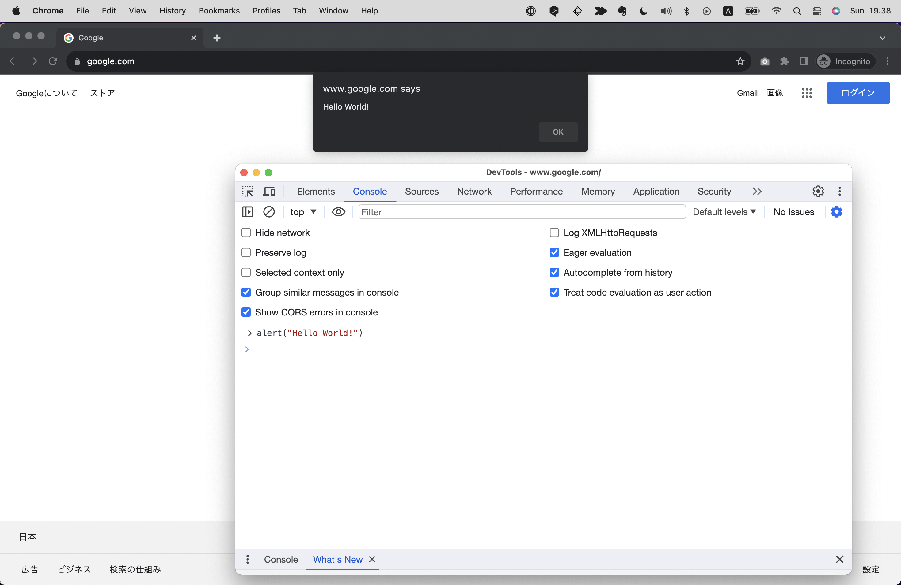

# JSを試す
JSをもっとも簡単に試す方法は、Webブラウザにある開発者ツールのコンソールを使うことです。
Chapter 4で登場した開発者ツールのコンソールは、JSのコードを実行することができます。
試しに、コンソールに`alert("Hello World!")`と入力してみましょう！
すると、画面に「Hello World!」という文字とともにダイアログが表示されるはずです。



いかがでしょう？簡単ですね！
他のプログラミング言語はまずコーディング前に環境をセットアップする必要がありますが、このようにWebブラウザさえあればすぐに試すことができる敷居の低さもJSの魅力です。

# Webページ上でJSを実行する
さて、コンソール上でJSを実行するのもいいですが、本来のJSはWebサイトやWebアプリケーションなどページ上で動作させてこそです。
というわけで、ここではWebページ上でJSを実行する方法を解説します。

まず、JSを書く際は拡張子が.jsで終わるJSファイルを作成します。
ここでは試しに、テスト用のフォルダを作成し、そこに`app.js`というファイル名でJSファイルを作成してみましょう。
VSCodeであればサイドバーのメニューからファイル作成が可能です。その際、ファイル名の末尾に`.js`をつけてください。


続いて作成したJSファイルをHTMLに読み込みます。
`index.html`を作成し、雛形のHTMLを記述したら、`</body>`タグ内直前に以下のように`<script>`タグを記述します。

```html
<!DOCTYPE html>
<html lang="en">
<head>
    <meta charset="UTF-8">
    <meta name="viewport" content="width=device-width, initial-scale=1.0">
    <title>Document</title>
</head>
<body>

    <script src="./app.js"></script> 
</body>
</html>
```

scriptタグはsrc属性(ソース属性)を持つことができ、ここにJSファイルのパスを指定することで、そのJSファイルを読み込むことができます。
パスを指定する際はVS Codeの補完機能を使いましょう！パスの入力で間違える学習者は大変多いですが、これを使えば間違えることはありません。


これで準備は完了です！正しくJSが実行されるかどうか、試しに`app.js`に`alert("Hello World!")`と記述してみましょう。
成功した場合は、画面に「Hello World!」という文字とともにダイアログが表示されるはずです。

