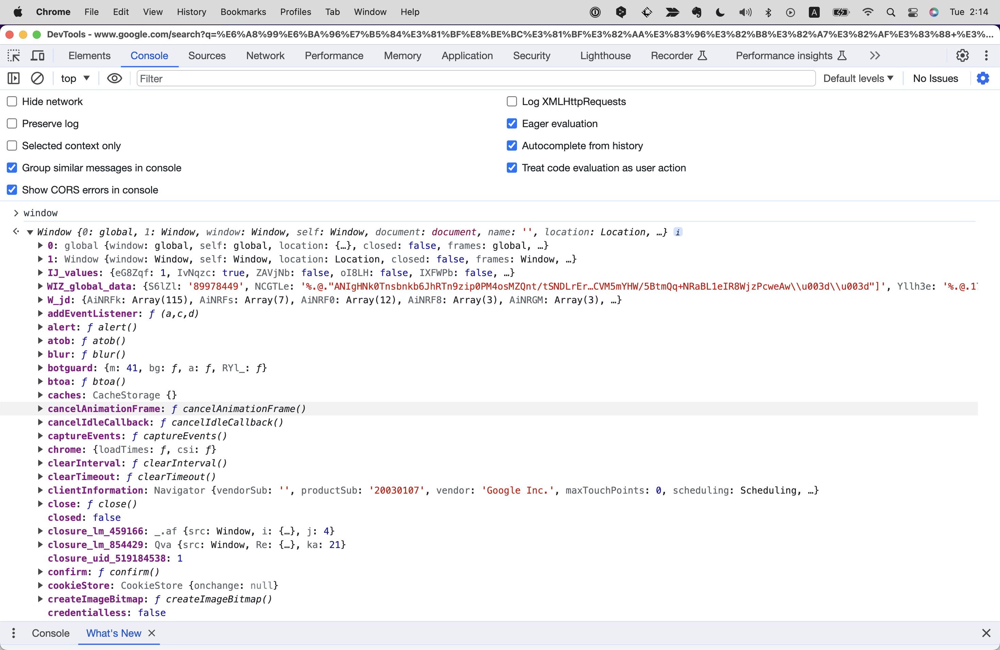
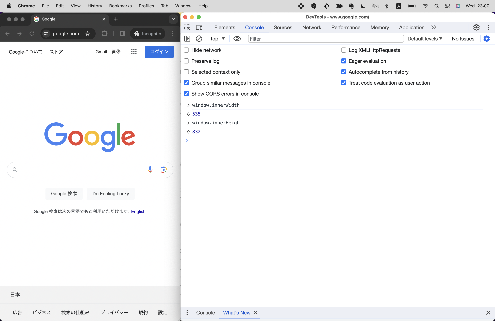
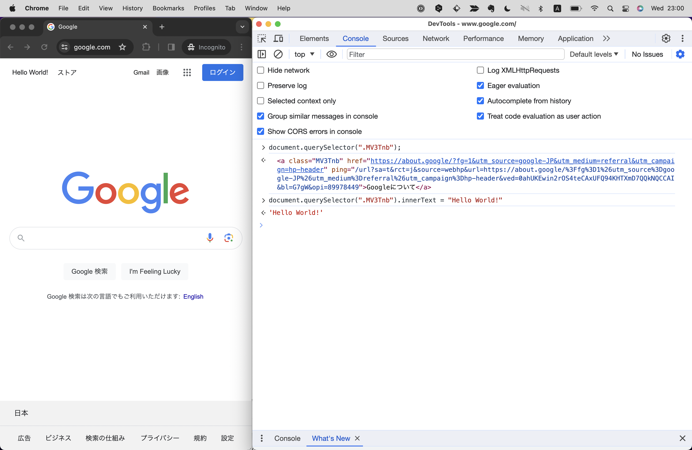
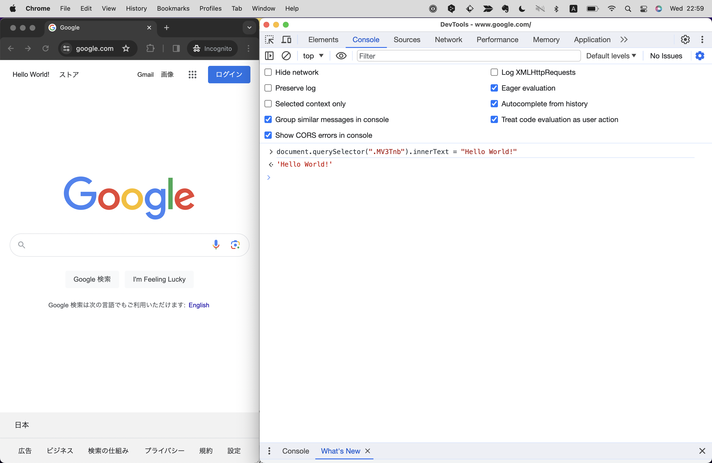

# ブラウザーAPI
ブラウザーAPIとは、Google Chrome, Safari, EdgeなどWebブラウザ上でJSを実行し、Webページを操作することを可能にするAPIです。
（APIについてはChapter 2で解説しました。）<!-- TODO -->
これを扱うことで、よりリッチなWebページを作ったり、ユーザーの操作に応じて動的にWebページを変化させたりすることができます。

ブラウザーAPIでできることの一例としては下記のようなものがあります。
- ブランディングWebサイト：ユーザーのスクロールに合わせてリッチなアニメーションを表示する
- SNSのタイムライン：ユーザーが投稿した内容をリアルタイムで表示し、スクロールしたら新しい投稿を読み込む
- 動画・音声：動画や音声コンテンツの再生・停止・巻き戻し・早送り・ループ再生操作を可能にする

## windowオブジェクトについて
ブラウザAPIには`window`という標準組み込みオブジェクトがあり、基本的にはこれに紐づくプロパティやメソッドを使ってブラウザを操作します。
試しにコンソール画面上で`window`と入力してみてください。さまざまなプロパティやメソッドが確認できます。
※windowにドットを入力して`window.`とすると、Chomeの場合は補完機能が働き、windowが持つプロパティやメソッドが表示されます。ぜひどんな値があるか色々試してみてください！



例えば簡単なものでいうと、`innerWidth`と`innerHeight`というプロパティがあります。これらを使うと、ブラウザのウィンドウの幅と高さを取得することができます。

```js
window.innerWidth); // 画面の幅を取得
window.innerHeight); // 画面の高さを取得
```

【Googleのサイトで上記の命令を実行した例】


この2つは大変よく使うプロパティです！
例えばWebサイトにはレスポンシブデザインという手法があります。
これは、PCやスマートフォンなどデバイスの画面サイズと比率に合わせてWebページのレイアウトを最適化し、表示を変える手法です。
PCは基本的に横長、スマートフォンは縦長の画面サイズなので、これらの値を比較することでユーザーがどのデバイスでWebページを見ているかを判定することができます。

```js
if(window.innerWidth > window.innerHeight){
  "PC");
} else {
  "スマートフォン");
}
```

これを応用してPCならPC用、スマートフォンならスマートフォン用に操作を加えることができます。

```
【コラム】ブラウザによる挙動の違い
ブラウザAPIはブラウザによって一部異なる挙動をすることがあります。
それもそのはず、ChromeはGoogle社、Edgeはマイクロソフトなど、開発しているチームも使用されている開発エンジンも異なるためです。
全く同じ挙動をさせるのは難しく、その場合は目視で複数のブラウザを確認しつつ、場合によってはブラウザごとにコードを微妙に書き分ける必要性があります。

また、ブラウザやブラウザのバージョンによってはサポートしているAPIとそうでないAPIがあります。
そう聞くと「どうやってサポートしているかを調べるの？」と思うかもしれませんが、その場合はcanniuseやMDNというサイトですぐに調べることができます。
https://caniuse.com
https://developer.mozilla.org/ja/docs/Web/API
```

### windowは省略が可能
本来メソッドやプロパティを呼び出すには`オブジェクト名.メソッド名`という形で記述しますが、windowオブジェクトに関しては`window`を省略し、メソッド名やプロパティ名だけの記述で呼び出すことができます。

本章の序盤から紹介していた`alert()`や`)`といった命令も、実はwindowオブジェクトのメソッドです！
そのため、`window.alert()`や`window.)`という記述も可能ですが、`window`は省略して`alert()`や`)`と書くことができます。

## documentオブジェクトについて
`document`とは`window`オブジェクトが持つプロパティの1つです。これ自体もオブジェクトで、WebページのHTML,CSSの情報を持っています。
`document`オブジェクトを使うことでHTMLやCSSの操作を行うことができるため、HTMLとCSSだけではできないようなインタラクティブ性のある処理をWebページに加えることができるようになります。

こちらも、試しにコンソール画面上で`document`と入力してみてください。さまざまなプロパティやメソッドが確認できます。
下記はgoogle.comのページを開いた状態での例です。
HTMLにアクセスできているほか、補完機能によってdocumentがさまざまなプロパティやメソッドを持つことがわかるかと思います。


例えば、特定のHTML要素を取得するには`querySelector()`メソッド、
HTMLタグ内のテキスト要素を取得したり変更するなら`.innerText`プロパティ、
HTMLタグのCSSを取得したり変更するなら`.style`プロパティを使うことで実現できます。

```js
document.querySelector(".MV3Tnb"); // ”MV3Tnb”というクラス名の要素を取得
document.querySelector(".MV3Tnb").innerText; // ”MV3Tnb”というクラス名の要素内のテキストを取得
document.querySelector(".MV3Tnb").innerText = "Hello World"; // ”MV3Tnb”というクラス名の要素内のテキストを"Hello Worldに"変更
```

【Googleのサイトで上記の命令を実行した例】



ところで、このようにHTMLで作られたWebページをJSなどのプログラミング言語で操作するための仕組みをDOMと呼びます。
今後ほかの書籍や動画などでJSやHTMLを勉強する際、DOMというキーワードはよく目にすることになるので、覚えておきましょう！

## windowオブジェクトとdocumentオブジェクトがもつ主要なプロパティとメソッド
ここで、windowオブジェクトとdocumentオブジェクトがもつ主要なプロパティとメソッドをまとめました。
これらはよく使うものなので、ぜひ覚えておきましょう！

### windowオブジェクトがもつ主要なメソッド
| メソッド名 | 説明 | 例 | 例の結果 |
| ---- | ---- | ---- | ---- |
| alert(メッセージ) | ダイアログを表示する | ```alert("Hello")``` | "Hello"と表示される |
| console.log(メッセージ) | コンソールにメッセージを表示する | ```console.log(Hello)``` | "Hello"と表示される |
| setTimeout(関数, ミリ秒) | 指定した時間後に関数を実行する | ```setTimeout(() => { "Hello") }, 5000)``` | 5秒後に"Hello"と表示 |
| clearTimeout(対象タイマー) | setTimeout()で設定したタイマーを解除する | ```const timer = setTimeout(() => { "Hello") }, 1000); clearTimeout(timer);)``` | 1秒後に"Hello"と表示されない |
| addEventListener(イベント名, 関数) | イベントを設定する | ```document.addEventListener("click", () => { "Hello") })``` | クリックすると"Hello"と表示される |

実はこれまでのサンプルコードで度々登場した`alert`や`console.log`も、windowオブジェクトのメソッドでした！
setTimeoutは時間差でなにか関数を実行したいときに、またclearTimeoutはsetTimeoutで設定したタイマーを解除したいときに使います。
addEventListenerはもっとも重要なメソッドの1つなので、このあと詳しく解説します。

### windowオブジェクトがもつ主要なプロパティ
| プロパティ名 | 説明 | 例 | 例の結果 |
| ---- | ---- | ---- | ---- |
| innerWidth | 画面の幅を取得・変更する | ```window.innerWidth``` | 画面の幅を表示 |
| innerHeight | 画面の高さを取得・変更する | ```window.innerHeight``` | 画面の高さを表示 |
| location | URLを取得・変更する | ```window.location``` | URLを表示 |
| navigator | ブラウザの情報を取得・変更する | ```window.navigator``` | ブラウザの情報を表示 |

locationはURLを操作できるのでリダイレクト（他のページに自動で飛ばすこと）を設定したり、
navigatorはブラウザの情報（ChromeなのかSafariなのか、など）を取得できるので、ブラウザ固有の不具合が見つかった場合にそれを回避するための処理を書くことができます。

### documentオブジェクトがもつ主要なメソッド
| メソッド名 | 説明 | 例 | 例の結果 |
| ---- | ---- | ---- | ---- |
| getElementById(セレクタ) | セレクタにマッチする要素を取得する | ```document.getElementById("hplogo")``` | ”hplogo”というID名の要素を表示 |
| getElementsByClassName(セレクタ) | セレクタにマッチする要素を全て取得する | ```document.getElementsByClassName("foo")``` | ”foo”というクラス名の要素を全て表示 |
| parentElement | HTMLタグの親要素を取得する | ```document.querySelector(".foo").parentElement)``` | ”foo”というクラス名の要素の親要素を表示 |
| nextElementSibling | HTMLタグの次の要素を取得する | ```document.querySelector(".foo").nextElementSibling)``` | ”foo”というクラス名の要素の次の要素を表示 |
| previousElementSibling | HTMLタグの前の要素を取得する | ```document.querySelector(".foo").previousElementSibling)``` | ”foo”というクラス名の要素の前の要素を表示 |
| appendChild(要素) | HTMLタグの子要素を追加する | ```document.querySelector(".foo").appendChild(document.createElement("div"))``` | ”foo”というクラス名の要素の子要素にdiv要素を追加 |
| removeChild(要素) | HTMLタグの子要素を削除する | ```document.querySelector(".foo").removeChild(document.querySelector(".foo").children[0])``` | ”foo”というクラス名の要素の子要素の1つ目を削除 |
| insertBefore(要素, 挿入位置) | HTMLタグの子要素を挿入する | ```document.querySelector(".foo").insertBefore(document.createElement("div"), document.querySelector(".foo").children[0])``` | ”foo”というクラス名の要素の子要素の1つ目の前にdiv要素を挿入 |
| createElement(要素名) | HTMLタグを作成する | ```document.createElement("div")``` | div要素を作成 |
| getAttribute(属性名) | HTMLタグの属性を取得する | ```document.querySelector(".foo").getAttribute("class")``` | ”foo”というクラス名の要素のclass属性を取得 |
| setAttribute(属性名, 値) | HTMLタグの属性を設定する | ```document.querySelector(".foo").setAttribute("class", "foo")``` | ”foo”というクラス名の要素のclass属性を"foo"に設定 |
| addEventListener(イベント名, 関数) | イベントを設定する | ```document.addEventListener("click", () => { "Hello") })``` | クリックすると"Hello"と表示される |

HTML要素になにか操作を加えたい場合は、まずgetElementByIdやgetElementsByClassNameといったメソッドを使い対象の要素を取得する必要があり、その後にappendChildやremoveChildといったメソッドを使って操作を行います。

```html
<div id="foo"></div>
```

```js
document.getElementById("foo").innerText = "Hello World"; // ”foo”というid名の要素内のテキストを"Hello Worldに"変更
```

ただし、このふたつは間違えやすい点がいくつかあるため注意が必要です！
まず、ElementとElement(s)で単数形・複数形が異なります。加えて、IDは同じ名前のものは1ページに1つしか存在してはいけないルールがありますが、クラスの場合は複数存在できるため`getElementsByClassName`で取得したHTML要素は配列扱いになります。そして配列の場合は`[インデックス番号]`を後ろに付ける必要があるため、これをつけずにそのあとメソッドやプロパティ操作を行うとエラーになってしまいます。

```html
<div class="foo"></div>
<div class="foo"></div>
<div class="foo"></div>
```

```js
// NG
document.getElementsByClassName("foo").innerText = "Hello World"; // エラーになる
// OK
document.getElementsByClassName("foo")[0].innerText = "Hello World"; // 1つ目のfoo要素のテキストを"Hello Worldに"変更
```

HTML要素を取得するメソッドはほかにも、getElementByTagName, querySelector, querySelectorAllといったものがありますが、上記の2つだけでほとんどのケースでは事足りるためここでは割愛します。
ピンポイントで要素を取得するのではなく、親・子・前後など周辺の要素を取得する場合は、parentElement, nextElementSibling, previousElementSiblingといったメソッドが有効です。
HTML要素を作ったり挿入・削除する場合は、createElement, ppendChild, removeChild, insertBeforeといったメソッドが有効です。
クラス名を取得したり、変更・追記・削除する場合は、getAttribute, setAttributeといったメソッドが有効です。
addEventListenerはwindowオブジェクトだけでなく、documentオブジェクトも有するメソッドです。こちらも重要なメソッドなので、このあと詳しく解説します。

### documentオブジェクトがもつ主要なプロパティ
| プロパティ名 | 説明 | 例 | 例の結果 |
| ---- | ---- | ---- | ---- |
| innerHTML | HTMLタグ内のHTMLを取得・変更する | ```document.querySelector(".foo").innerHTML``` | ”foo”というクラス名の要素内のHTMLを表示 |
| innerText | HTMLタグ内のテキストを取得・変更する | ```document.querySelector(".foo").innerText``` | ”foo”というクラス名の要素内のテキストを表示 |
| style | HTMLタグのCSSを取得・変更する | ```document.querySelector(".foo").style``` | ”foo”というクラス名の要素のCSSを表示 |
| classList | HTMLタグのクラスを取得・変更する | ```document.querySelector(".foo").classList``` | ”foo”というクラス名の要素のクラスを表示 |

innerHTMLとinnerTextは似ていますが、対象の要素がテキストとHTML要素両方を持っていた場合に、innerHTMLはHTML要素含めすべての文字列を操作できるのに対し、innerTextはテキストのみを操作できます。

```js
document.getElementById("foo").innerHTML = "<div>foo</div>"; // ”foo”というid名の要素内のHTMLを”<div>foo</div>”に変更
document.getElementById("foo").innerText = "<div>foo</div>"; // ”foo”というid名の要素内のテキストを”<div>foo</div>”に変更
```

style, classListは情報として目にする機会はよくあると思いますが、近年の実際のコーディングでは使用頻度は少ないでしょう。
JSでCSSのスタイルを直接操作する機会は少なく、その場合はクラスを操作することで実現します。（参照：<!--TODO: 対象Chapeter -->)
またクラスを操作する場合は先述のgetAttribute, setAttributeの方が使い勝手がよいため、そちらの使用をオススメします。

## イベント


## 

