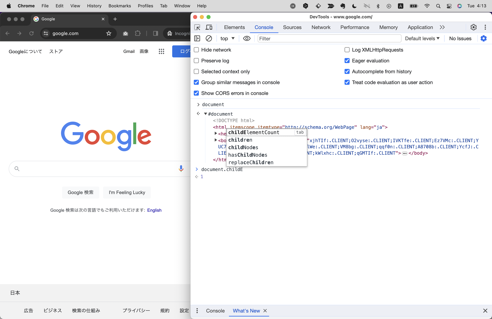

# ブラウザーAPI
ブラウザーAPIとは、Google Chrome, Safari, EdgeなどWebブラウザ上でJSを実行し、Webページを操作することを可能にするAPIです。
（APIについてはChapter 2で解説しました。）<!-- TODO -->
これを扱うことで、よりリッチなWebページを作ったり、ユーザーの操作に応じて動的にWebページを変化させたりすることができます。

ブラウザーAPIでできることの一例としては下記のようなものがあります。
- ブランディングWebサイト：ユーザーのスクロールに合わせてリッチなアニメーションを表示する
- SNSのタイムライン：ユーザーが投稿した内容をリアルタイムで表示し、スクロールしたら新しい投稿を読み込む
- 動画・音声：動画や音声コンテンツの再生・停止・巻き戻し・早送り・ループ再生操作を可能にする

## windowオブジェクトについて
ブラウザAPIには`window`という標準組み込みオブジェクトがあり、基本的にはこれに紐づくプロパティやメソッドを使ってブラウザを操作します。
試しにコンソール画面上で`window`と入力してみてください。さまざまなプロパティやメソッドが確認できます。
※windowにドットを入力して`window.`とすると、Chomeの場合は補完機能が働き、windowが持つプロパティやメソッドが表示されます。ぜひどんな値があるか色々試してみてください！


例えば簡単なものでいうと、`innerWidth`と`innerHeight`というプロパティがあります。これらを使うと、ブラウザのウィンドウの幅と高さを取得することができます。

```js
window.innerWidth); // 画面の幅を取得
window.innerHeight); // 画面の高さを取得
```

【Googleのサイトで上記の命令を実行した例】


この2つは大変よく使うプロパティです！
例えばWebサイトにはレスポンシブデザインという手法があります。
これは、PCやスマートフォンなどデバイスの画面サイズと比率に合わせてWebページのレイアウトを最適化し、表示を変える手法です。
PCは基本的に横長、スマートフォンは縦長の画面サイズなので、これらの値を比較することでユーザーがどのデバイスでWebページを見ているかを判定することができます。

```js
if(window.innerWidth > window.innerHeight){
  "PC");
} else {
  "スマートフォン");
}
```

これを応用してPCならPC用、スマートフォンならスマートフォン用に操作を加えることができます。

```
【コラム】ブラウザによる挙動の違い
ブラウザAPIはブラウザによって一部異なる挙動をすることがあります。
それもそのはず、ChromeはGoogle社、Edgeはマイクロソフトなど、開発しているチームも使用されている開発エンジンも異なるためです。
全く同じ挙動をさせるのは難しく、その場合は目視で複数のブラウザを確認しつつ、場合によってはブラウザごとにコードを微妙に書き分ける必要性があります。

また、ブラウザやブラウザのバージョンによってはサポートしているAPIとそうでないAPIがあります。
そう聞くと「どうやってサポートしているかを調べるの？」と思うかもしれませんが、その場合はcanniuseやMDNというサイトですぐに調べることができます。
https://caniuse.com
https://developer.mozilla.org/ja/docs/Web/API
```

### windowは省略が可能
本来メソッドやプロパティを呼び出すには`オブジェクト名.メソッド名`という形で記述しますが、windowオブジェクトに関しては`window`を省略し、メソッド名やプロパティ名だけの記述で呼び出すことができます。

本章の序盤から紹介していた`alert()`や`)`といった命令も、実はwindowオブジェクトのメソッドです！
そのため、`window.alert()`や`window.)`という記述も可能ですが、`window`は省略して`alert()`や`)`と書くことができます。

## documentオブジェクトについて
`document`とは`window`オブジェクトが持つプロパティの1つです。これ自体もオブジェクトで、WebページのHTML,CSSの情報を持っています。
`document`オブジェクトを使うことでHTMLやCSSの操作を行うことができるため、HTMLとCSSだけではできないようなインタラクティブ性のある処理をWebページに加えることができるようになります。

こちらも、試しにコンソール画面上で`document`と入力してみてください。さまざまなプロパティやメソッドが確認できます。
下記はgoogle.comのページを開いた状態での例です。
HTMLにアクセスできているほか、補完機能によってdocumentがさまざまなプロパティやメソッドを持つことがわかるかと思います。



例えば、特定のHTML要素を取得するには`querySelector()`メソッド、
HTMLタグ内のテキスト要素を取得したり変更するなら`.innerText`プロパティ、
HTMLタグのCSSを取得したり変更するなら`.style`プロパティを使うことで実現できます。

```js
document.querySelector(".MV3Tnb"); // ”MV3Tnb”というクラス名の要素を取得
document.querySelector(".MV3Tnb").innerText; // ”MV3Tnb”というクラス名の要素内のテキストを取得
document.querySelector(".MV3Tnb").innerText = "Hello World"; // ”MV3Tnb”というクラス名の要素内のテキストを"Hello Worldに"変更
```

【Googleのサイトで上記の命令を実行した例】


ところで、このようにHTMLで作られたWebページをJSなどのプログラミング言語で操作するための仕組みをDOMと呼びます。
今後ほかの書籍や動画などでJSやHTMLを勉強する際、DOMというキーワードはよく目にすることになるので、覚えておきましょう！

## windowオブジェクトがもつ主要なプロパティとメソッド
ここで、windowオブジェクトがもつ主要なプロパティとメソッドをまとめました。
これらはよく使うものなのでぜひ覚えておきましょう！

| 名称 | 種類 | 説明 |
| ---- | ---- | ---- |
| alert(メッセージ) | メソッド | ダイアログを表示する |
| console.log(メッセージ) | メソッド | コンソールにメッセージを表示する |
| setTimeout(関数, ミリ秒) | メソッド | 指定した時間後に関数を実行する |
| setInterval(関数, ミリ秒) | メソッド | 指定した時間ごとに関数を実行する |
| clearTimeout(対象タイマー) | メソッド | setTimeout()で設定したタイマーを解除する |
| addEventListener(イベント名, 関数) | メソッド | イベントを設定する |
| innerWidth | プロパティ | 画面の幅を取得・変更する |
| innerHeight | プロパティ | 画面の高さを取得・変更する |
| location | プロパティ | URLを取得・変更する |
| navigator | プロパティ | ブラウザの情報を取得・変更する |

<!-- Update: setInterval -->

### 使用例(各メソッド)

```js
alert("Hello"); // ダイアログで"Hello"と表示する
console.log(Hello); // コンソールに"Hello"と表示する
```
```js
// タイマーを設定し、5秒後にダイアログで"Hello"と表示する
const timer = setTimeout(() => { 
  alert("Hello");
}, 5000)
```
```js
clearTimeout(timer); // タイマーをキャンセル
```
```js
// Webページのロードが完了したらダイアログで"Hello"と表示される
window.addEventListener("load", () => { 
  alert("Hello");
});
```

実はこれまでのサンプルコードで度々登場した`alert`や`console.log`も、windowオブジェクトのメソッドでした！
setTimeoutは時間差でなにか関数を実行したいときに、またclearTimeoutはsetTimeoutで設定したタイマーを解除したいときに使います。
addEventListenerはもっとも重要なメソッドの1つなので、このあと詳しく解説します。

### 使用例(各プロパティ)

```js
window.innerWidth // 画面の幅を数値で取得（単位はpx）
window.innerHeight // 画面の高さを数値で取得（単位はpx）
window.location // URLの情報をもつオブジェクトを取得
window.navigator // ブラウザの情報をもつオブジェクトを取得
```

locationはURLに関する複数のプロパティを有しているためURLを操作でき、ダイレクト（他のページに自動で飛ばすこと）を設定するなどの実装が行なえます。
navigatorはブラウザの情報（ChromeなのかSafariなのか、など）に関する複数のプロパティを有しているため、ユーザーがどのブラウザを使っているかなどを特定できます。これにより、例えばChromeだけブラウザ固有の不具合が見つかった場合にそれを回避するための処理を書くことができます。（ブラウザはChromeだけでなく、SafariやEdgeなど複数の種類があり、それぞれ開発エンジンなが異なるため、同じコードでもブラウザによっては挙動が異なることがしばしばあります。）

## documentオブジェクトがもつ主要なプロパティとメソッド
次にdocumentオブジェクトがもつ主要なプロパティとメソッドをみてみましょう。
こちらもよく使うものだけに厳選しピックアップしました。

| 名称 | 種類 | 説明 |
| ---- | ---- | ---- |
| getElementById(id名) | メソッド | id名にマッチする要素を取得する | 
| getElementsByClassName(クラス名) | メソッド | クラス名にマッチする要素を全て取得する | 
| appendChild(要素) | メソッド | HTMLタグの子要素を追加する | 
| removeChild(要素) | メソッド | HTMLタグの子要素を削除する | 
| insertBefore(要素, 挿入位置) | メソッド | HTMLタグの子要素を挿入する |
| createElement(要素名) | メソッド | HTMLタグを作成する | 
| getAttribute(属性名) | メソッド | HTMLタグの属性を取得する | 
| setAttribute(属性名, 値) | メソッド | HTMLタグの属性を設定する | 
| addEventListener(イベント名, 関数) | メソッド | イベントを設定する | 
| parentElement | プロパティ | HTMLタグの親要素を取得する | 
| nextElementSibling | プロパティ | HTMLタグの次の要素を取得する | 
| previousElementSibling | プロパティ | HTMLタグの前の要素を取得する | 
| innerHTML | プロパティ | HTMLタグ内のHTMLを取得・変更する |
| innerText | プロパティ | HTMLタグ内のテキストを取得・変更する |
| style | プロパティ | HTMLタグのCSSを取得・変更する |
| classList | プロパティ | HTMLタグのクラスを取得・変更する |

### 使用例(HTMLを取得するメソッド, プロパティ)

HTML要素になにか操作を加えたい場合は、まずgetElementByIdやgetElementsByClassNameといったメソッドを使い対象の要素を取得する必要があります。
特定のHTML要素を指定したあと、それに対してHTMLを操作するメソッドやプロパティ（appendChildやinnerTextなど）が使用可能になります。

```html
<div id="foo"></div>
<div class="foo"></div>
```

```js
document.getElementById("foo"); //”foo”というID名の要素を取得
document.getElementsByClassName("foo"); //”foo”というクラス名の要素全てを取得（配列扱い）
document.getElementById("foo").innerText = "Hello World"; // ”foo”というid名の要素内のテキストを"Hello World"にする
```

ただし、このgetElementByIdやgetElementsByClassNameというメソッド2つは間違えやすい点がいくつかあるため注意が必要です！
まず、メソッド名自体が長く複数の英単語が組み合わさってできています。キャメルケースが使われており各単語の先頭が大文字になっているため、大文字小文字を正確に区別する必要があります。（キャメルケースに関する詳細はChapter.Xで解説しました。）<!-- TODO -->
メソッド名に含まれるElementとElement(s)は単数形・複数形が異なります。加えて、IDは同じ名前のものは1ページに1つしか存在してはいけないルールがありますが、クラスの場合は複数存在できるため`getElementsByClassName`で取得したHTML要素は配列扱いになります。
そして配列の場合は`[インデックス番号]`を後ろに付ける必要があるため、これをつけずにそのあとメソッドやプロパティ操作を行うとエラーになってしまいます。

```html
<div class="foo"></div>
<div class="foo"></div>
<div class="foo"></div>
```

```js
// NG
document.getElementsByClassName("foo").innerText = "Hello World"; // エラーになる
// OK
document.getElementsByClassName("foo")[0].innerText = "Hello World"; // 1つ目のfoo要素のテキストを"Hello Worldに"変更
```

また、HTML要素を取得するメソッドはほかにも`getElementByTagName, querySelector, querySelectorAll`といったものがありますが、上記の2つだけでほとんどのケースでは事足りるためここでは割愛します。
ピンポイントで要素を取得するのではなく、親・子・前後など周辺の要素を取得する場合は、`parentElement, nextElementSibling, previousElementSibling`といったメソッドが有効です。

```html
<div class="parent">
  <div class="foo"></div>
  <div class="bar"></div>
  <div class="baz"></div>
</div>
```

```js
//”foo”というクラス名の要素の親要素（つまり、クラス"parent"）を取得
document.getElementsByClassName("foo").parentElement; 

//”foo”というクラス名の要素の次の要素（つまり、クラス"bar"）を取得
document.getElementsByClassName("foo").nextElementSibling; 

//”foo”というクラス名の要素の前の要素（つまり、クラス"baz"）を取得
document.getElementsByClassName("foo").previousElementSibling; 
```

---

【コラム】取得したHTMLは変数に格納しよう
HTML要素を取得したあと、そのままメソッドやプロパティをつなげて操作することもできますが、可読性が悪くなるためあまりオススメしません。
例えば上の例では`document.getElementsByClassName("foo")`が3回繰り返されていますが、これを変数に格納することで1回で済ませることができます。

```js
const $foo = document.getElementsByClassName("foo");
$foo.parentElement;
$foo.nextElementSibling;
$foo.previousElementSibling;
```

なお、変数名の先頭に`$`をつけるのは、変数がHTML要素を格納していることを明示するためのプレフィックスです。
こうしたクラス名や変数名の冒頭に何らかの文字列を付与することは`プレフィックス`と言い、プログラミングにおいてよく使われる手法です。
プレフィックスを付けることで、明示的にその要素がどのような役割を持つのかを示すことができます。

---

<!-- Updated: プレフィックス -->

### 使用例(HTML要素を取得してさまざまな操作を行う)
ではここで、これまで登場したプロパティやメソッドを使ったサンプルコードを示したいと思います。
試しにSNSでよく見るタイムラインにポストする簡易的な例を見てみましょう。
下記の例では、timelineの要素を取得し、その子要素として新たに作成したpost要素を追加しています。

```js
// 1.div要素のHTML要素を作成し、クラス”child”を追加。テキスト”Hello World”をもたせる
const $post = document.createElement("article");
$post.setAttribute("class", "post")
$post.innerText = "お腹減ったなあ。近所にできたラーメン屋行ってみるか";

// 1.で作成したHTML要素をID”timeline”の子要素として追加
const $timeline = document.getElementById("timeline");
$timeline.appendChild($post);
```

#### 出力結果

Before)
```html
<div class="timeline"></div>
```

After)
```html
<div class="timeline">
  <article class="post">お腹減ったなあ。近所にできたラーメン屋行ってみるか</article>
</div>
```

なお、documentにおけるaddEventListenerも重要なメソッドの1つなので、このあと詳しく解説します。

## イベント
イベントとは、ユーザーの操作やWebページの状態の変化など、何らかのきっかけによって発生するものを指します。
例えば、ユーザーがボタンをクリックしたときに発生するイベントや、Webページの読み込みが完了したときに発生するイベントなどがあります。

イベントは、windowオブジェクトやdocumentオブジェクトがもつ`addEventListener`というメソッドを使って設定することができます。
`addEventListener`は引数を2つ持ち、1つ目に「イベントのタイプ」、2つ目に「イベント時に実行する関数」を設定します。例えばWebページにアクセスしたとき読み込みが完了したときにダイアログを表示したい場合は、下記のように記述します。

```js
window.addEventListener("load", () => { 
  alert("読み込み完了");
});
```

イベントを使うと双方向性（インタラクティブ性）のあるWebページを作ることができるため、よりリッチな表現を持つWebサイトや多機能なWebアプリケーションを作ることができます。

以下は代表的なイベントの例です。
windowオブジェクトはWebページ全体に関するイベント、documentオブジェクトはボタンや画像など個々のHTML要素に関するイベントを設定することができます。
またdocumentオブジェクトに対するイベントの中でも、touchstartやtouchmoveなどはスマートフォンなどタッチ操作に関するイベントです。

### windowオブジェクトに対するイベント
| イベント名 | 発生タイミング |
| ---- | ---- |
| load | window | Webページの読み込みが完了したとき |
| scroll | window | ユーザーがスクロールしたとき |
| resize | window | ユーザーが画面サイズを変更したとき |

### documentオブジェクトに対するイベント
| イベント名 | 発生タイミング | 使用例 |
| ---- | ---- | ---- |
| click | ユーザーがクリックしたとき |
| keydown | ユーザーがキーを押したとき |
| keyup | ユーザーがキーを離したとき |
| mouseover | ユーザーがマウスを要素の上に乗せたとき |
| mouseout | ユーザーがマウスを要素の上から離したとき |
| mousemove | ユーザーがマウスを動かしたとき |
| touchstart | ユーザーがタッチしたとき |
| touchmove | ユーザーがタッチしたまま動かしたとき |
| touchend | ユーザーがタッチを離したとき |

### イベントの使用例
ではイベントでどのようなことができるか、実際のWebページでよく見かける機能を元にいくつか例を示してみたいと思います。

#### ロードが完了するまで「ローディング中」の画面を表示し、完了したら非表示にする例
【イメージ図】

```js
window.addEventListener("load", () => { 
  document.getElementById("loading").style.display = "none";
});
```

#### ボタンがクリックされたらカウントを1増やすカウンターの例
【イメージ図】

```js
let count = 0; // カウントを0で初期化
document.getElementById("button").addEventListener("click", () => {  // ボタンがクリックされたイベント
  count++; // countを1増やす(インクリメント演算子)
  document.getElementById("count").innerText = count; // countの値をHTMLに反映
});
```