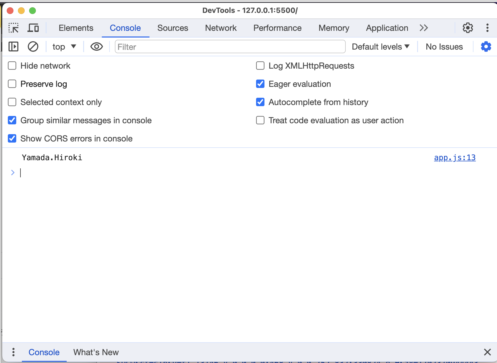
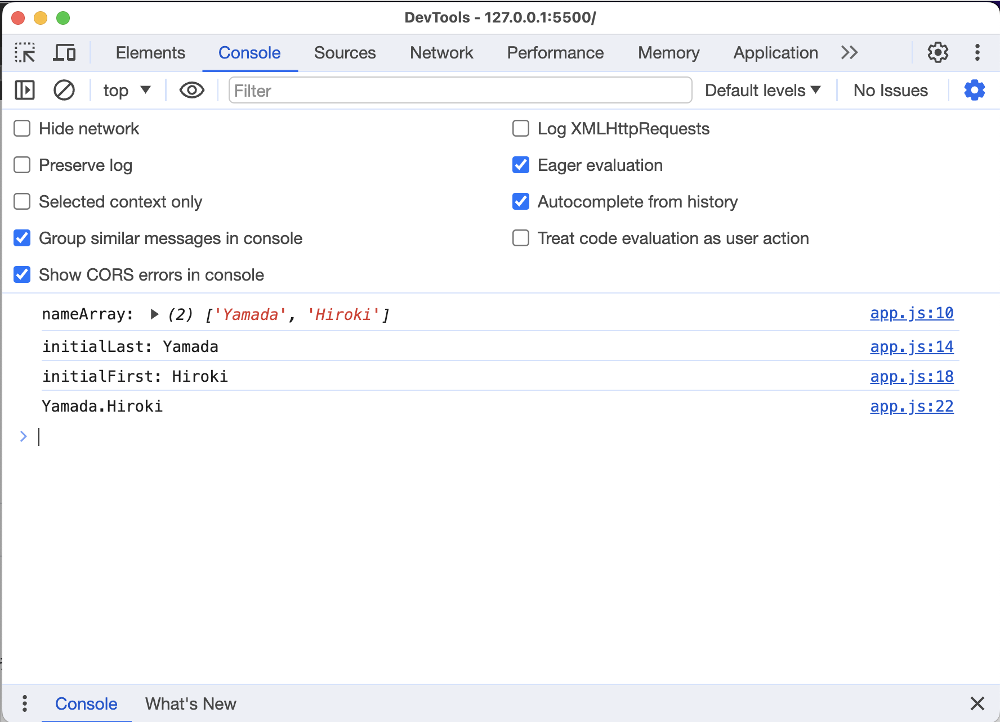
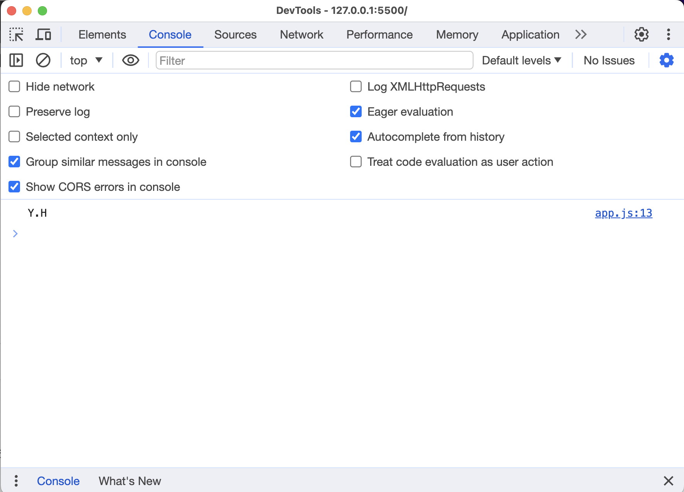

# JSのデバッグ方法
Chapter 4.1では開発者ツールを紹介しましたが、それのConsoleパネルを使ってJSのデバッグを容易に行うことができます。

これまで見てきたように、JSには`console.log`という関数がありますが、これに引数を与えて実行すると結果がこのConsoleパネル上に表示されます。
ちなみに引数はいくつでも与えることができますが、1つか2つ与えて確認するケースがほとんどかと思います。

これらを使うことで、自身が書いたプログラムに何らかのエラーが発生したり、または意図しない挙動が起きたとき、すぐに確認することができます。
実際に試してみましょう。

例えば、「引数に姓名を半角スペース区切りで渡すとイニシャルを返す」という関数のプログラムを書いてみるとします。

```js
const getInitialName = (name) => {
  const nameArray = name.split(" ");
  const initialLast = nameArray[0].slice(0);
  const initialFirst = nameArray[1].slice(0);
  return initialLast + "." + initialFirst;
}
```

この関数には例えば、「Yamada Hiroki」という引数を渡したら「Y.H」と返ってくることを期待します。
内容をざっくり説明すると、値を分割できるメソッド`split()`でまず半角スペースを基準に引数を姓と名に分け、その後値を抽出できるメソッド`slice()`で姓名それぞれの頭文字だけを抽出する、という流れです。
では実際に期待どおりに動くかどうか、console.logを追記して確認してみます。

```js
const getInitialName = (name) => {
  const nameArray = name.split(" ");
  const initialLast = nameArray[0].slice(0);
  const initialFirst = nameArray[1].slice(0);
  return initialLast + "." + initialFirst;
}
console.log(getInitialName("Yamada Hiroki")); // console.logを追記
```



console上で実行結果が確認できましたね。
しかし、予想に反して結果は`Yamada.Hiroki`でした。問題はどこにあるでしょうか？

これを確認するために、プログラムの途中にconsole.logを仕込むことで、 __どこまでが問題なくて、どこからが問題あるか__ を確認し原因を切り分けて考えることができます。

```js
const getInitialName = (name) => {
  const nameArray = name.split(" ");
  
  console.log('nameArray:', nameArray);// さらにconsole.logを追記

  const initialLast = nameArray[0].slice(0);

  console.log('initialLast:', initialLast);// さらにconsole.logを追記

  const initialFirst = nameArray[1].slice(0);

  console.log('initialFirst:', initialFirst);// さらにconsole.logを追記
  
  return initialLast + "." + initialFirst;
}
console.log(getInitialName("Yamada Hiroki"));
```

追加で3箇所に`console.log`を追記しました。実行途中でこれらの変数にどんな値が入っているか確認してみます。



すると、`nameArray`に姓名が分かれて格納されているところまで良いのですが、変数`initialLast`と`initialFirst`に名前の文字列がまんま入っていることが確認できます。
つまり、この部分に問題があると特定できるわけです。

```js
const initialLast = nameArray[0].slice(0);
const initialFirst = nameArray[1].slice(0);
```

よく見ると`slice()`が引数を1つしか持っていません。`slice()`は抽出したい値の開始値と終了値の2つの引数を渡す必要があるので、ここが修正ポイントだと推測できます。

```js
const getInitialName = (name) => {
  const nameArray = name.split(" ");
  const initialLast = nameArray[0].slice(0,1);
  const initialFirst = nameArray[1].slice(0,1); 
  return initialLast + "." + initialFirst;
}
console.log(getInitialName("Yamada Hiroki"));
```



無事にイニシャル文字が取れていることが確認できました！
このように、開発者ツールのConsoleを使うとプログラムを細かく見てデバッグすることができます。
このようなデバッグ方法は他の言語でも使えるので、ぜひ参考にしてください。
（他の言語の場合はprint関数+コマンドライン上で確認する、などが考えられます）