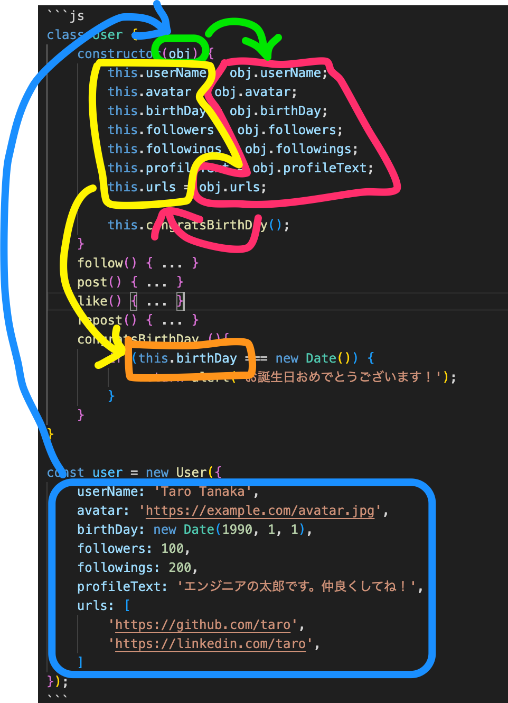

# 【発展】クラスとインスタンス
さて、JSの章の最後はクラスとインスタンスについて解説します。
クラスとインスタンスは、オブジェクト指向プログラミングにおいて核となる重要な概念で、これを理解することでプログラミングの幅が大きく広がります。
近年の開発現場で用いられているようなReactやVueといったJSのフレームワークではこの概念なしに学習することはできません。
また、JSに限らずPHP,Ruby,Pythonなど他のオブジェクト指向プログラミング言語にもある概念ですので、ぜひ理解しておきましょう。
ただし、これまでの項目よりも難易度は少々高いです。プログラミングを用いた本格的な仕事をしたい人は必須ですが、そうでない人は飛ばしても構いません。（オブジェクト指向については後述）

## クラスとインスタンスの一般的だけどわかりにくい説明
クラスとはオブジェクトの一種で、ほかのオブジェクトのようにプロパティやメソッドを持ちます。
ほかのオブジェクトと違う仕様が複数ありますが、その最大の特徴はクラスを元にインスタンスを生成できることです。
インスタンスとはクラスから生成されたオブジェクトのことで、クラスのプロパティやメソッドを継承します。

クラスを定義するには`class`キーワードから初め、下記のように`constructor`メソッドやその他のメソッド、プロパティを定義します。

```js
class クラス名 {
  constructor(引数) {
    // インスタンス化されたときに実行される処理
  }
  メソッド名() {
    // メソッドの処理
  }
}
```

クラスからインスタンスを生成するには`new`演算子を使い、関数のようにクラス名の後に`()`をつけて実行します。

```js
new クラス名(引数);
```

クラスは関数のように引数をもたせることもできるので、インスタンス生成時には引数を渡すことで値を変えて様々なインスタンスを生成することができます。

...と、いうのがクラスの一般的な説明ですが、おそらくこの解説は大変わかりづらいかと思いますので、一旦身近なものを題材に言い換えて説明したいと思います。

## クラスとインスタンスのわかりやすい説明
例えばX（旧Twitter）のようなSNSをイメージしてください。
Xのタイムラインにはさまざまなユーザーがいます。
いずれのユーザーもユーザー名やアバター画像、フォロワー数、フォロー数、過去の投稿など、さまざまなデータを持っていて、また新規で投稿したり他人の投稿に「いいね」するなど、同じアクションを行うことができます。
しかし、1つとして同じユーザーはいません。似たようなユーザー名やアバターのユーザーはいるかもしれませんが、ユーザーIDは重複が許されていないため、すべての情報が全く同じユーザーがいないことは想像しやすいかと思います。

このように、同じような構造を持ちながらも、値が異なるオブジェクトを作ることができるのがクラスとインスタンスです。
クラスはテンプレート（別の言い方をするならば、設計図、型板、雛形などといえます）のようなもので、インスタンスはクラスを元に作られたオブジェクトです。

【クラスからインスタンスが作られるイメージ図】

## クラスの例
では実際のコードを見てみましょう。
上記のようなSNSのユーザーを例にクラスとインスタンスのコードを書くと、下記のようになります。
これまでと見慣れない形のため戸惑うかもしれませんが、1つ1つ丁寧に解説していきますので、まずはコードを眺めてみてください！
※下記のコードは実際には不足している部分がありますが、わかりやすさを優先しているため、あえて省略しています。

```js
class User {
    constructor(obj) {
        this.userName = obj.userName;
        this.avatar = obj.avatar;
        this.birthDay = obj.birthDay;
        this.followers = obj.followers;
        this.followings = obj.followings;
        this.profileText = obj.profileText;
        this.urls = obj.urls;

        this.congratsBirthDay();
    }
    follow() { ... }
    post() { ... }
    like() { ... }
    repost() { ... }
    congratsBirthDay (){
        if (this.birthDay === new Date()) {
            return alert('お誕生日おめでとうございます！');
        }
    }
}

const user = new User({
    userName: 'Taro Tanaka',
    avatar: 'https://example.com/avatar.jpg',
    birthDay: new Date(1990, 1, 1),
    followers: 100,
    followings: 200,
    profileText: 'エンジニアの太郎です。仲良くしてね！',
    urls: [
        'https://github.com/taro',
        'https://linkedin.com/taro',
    ]
});
```

### クラスの宣言
まず1行目では`User`という名前でクラスを宣言しています。
クラスは `class クラス名 { ... }` という形式で宣言できます。

### constructorの定義
2~11行目ではコンストラクター`constructor`を定義しています。
コンストラクターはメソッドの1種ですが、 __インスタンス生成時に自動的に実行される__ という特別な仕様を持ちます。
そのため、19行目でインスタンスが生成されていますが、この時点で`constructor`が実行され、中身の`this.userName`や`this.avatar`、などが定義されます。

一方、他のユーザーの投稿に「いいね！」をするメソッド`like`や投稿をリポストするメソッド`repost`など、通常のメソッドはどこでも呼ばれていないため、このコードでは実行されません。

### this演算子
続いて、3行目以降で使われている`this`について解説します。
`this`演算子にはさまざまな複雑な仕様があるのですが、クラス内での振る舞いに限定して説明すると、`this`はクラスのインスタンスそのものを参照するため、これを通じて同じクラス内のプロパティやメソッドを参照することができます。

引数として渡った値は、`constructor`の中で`this`演算子を使ってプロパティとして定義されます。
これまでの変数やオブジェクトの書き方に従うなら`const`や`let`が思いつくかもしれませんが、それだと同じクラス内であっても異なるメソッド同士では参照できません。（この仕組みついてはChapter 5.8のスコープについてを参照ください）

```js
// NG例
class User {
    constructor(obj) {
        ...
        const birthDay = obj.birthDay; //変数birthdayにobj.birthDayを格納
        ...
    }
    ...
    congratsBirthDay (){
        if (birthDay === new Date()) { // 変数birthDayは参照できず、エラーになる
            ...
        }
    }
}

// OK例
class User {
    constructor(obj) {
        ...
        this.birthDay = obj.birthDay; //this.birthdayにobj.birthDayを格納
        ...
    }
    ...
    congratsBirthDay (){
        if (this.birthDay === new Date()) { // thisを通じてthis.birthDayは参照できる
            ...
        }
    }
}
```

### 引数を渡す
19行目のインスタンス生成時、引数を渡していることに注目してください。
クラスも関数のように引数を渡し、柔軟なプログラムを作ることができます。
この例では引数がオブジェクトとして渡されています。オブジェクトを使わずに書くこともできますが、オブジェクトを使うことで可読性が上がり、引数の順番を気にする必要がなくなるためおすすめです。（Chapter 5.8参照）

例として`birtrhDay`プロパティとその値`new Date(1990, 1, 1)`にフォーカスして説明すると、引数はクラス・インスタンス・this演算子を通じて下記の図のように渡っていき、最終的に`congratsBirthDay`メソッドまで渡っています。



### メソッドの実行
メソッドを実行するにはインスタンスを生成したあと、インスタンス名の後に`.`をつけてメソッド名を記述します。
例のように可読性を良くするために一度変数に入れてから実行することをおすすめします。

```js
const user = new User({...});

user.follow(); // followメソッドを実行
user.post(); // postメソッドを実行
```

またコンストラクタの中でメソッドを実行することもできます。
コンストラクタはインスタンス生成時に自動で実行されるため、上記のようにわざわざ呼び出さずとも、インスタンス生成時に実行されます。

```js
class User {
    constructor(obj) {
        ...
        this.congratsBirthDay(); // コンストラクタ内で実行
    }
    ...
    congratsBirthDay (){
        if (this.birthDay === new Date()) {
            return alert('お誕生日おめでとうございます！');
        }
    }
}

const user = new User({
    ...
    birthDay: new Date(1990, 1, 1),
    ...
}); // この時点でcongratsBirthDayメソッドが実行される
```

--- 

## 継承
クラスには継承という仕様もあります。
これを使うと、例えば元となるクラスAから派生クラスBを作ることができ、クラスBはクラスAのプロパティやメソッドを継承することができます。
継承を定義するには`class クラス名 extends 継承元クラス名 { ... }`という形式で定義します。

```js
class User {
    constructor(obj) {
        this.userName = obj.userName;
        ...
    }
    ...
}

class AdminUser extends User {
    constructor(obj) {
        super(obj); // 継承元クラスのコンストラクタを実行
        this.isAdmin = obj.isAdmin;
    }
    ...
}

const adminUser = new AdminUser({
    userName: 'Taro Tanaka', // 
    ...
    isAdmin: true,
});

console.log(adminUser.userName); // Taro Tanaka
```

この例では、`AdminUser`クラス内に`userName`プロパティの記述はありませんが、継承元の`User`クラスには`userName`プロパティがあり、それを継承しています。
そのため、`AdminUser`クラスのインスタンスである`adminUser`から`userName`プロパティを参照することができます。

`AdminUser`クラスのコンストラクタ内で`super(obj)`という記述がありますが、これは継承元クラスのコンストラクタを実行するための記述です。

実際にSNSを作るとなると、この例のようにユーザーは管理者と一般ユーザーなど複数の種類をと用意することになるでしょう。
権限やできることなど微妙に違いつつも、共通する部分も多いでしょうから、継承を使ってクラスを作ることでコードの重複を防ぐことができます。

クラスはほかにも仕様が多いですが、初学者の内は使う機会が少ないため、本書では多くを割愛し基本コンセプトの説明のみにとどめました。
継承もどちらかというとそういった仕様の一つですが、クラスの重要なコンセプトであるためここで触れておきました。知識程度にでも抑えておく良いでしょう。

---

【コラム】オブジェクト指向プログラミング
オブジェクト指向プログラミングとは、オブジェクトの集合によってシステムを構築することが根幹にあるプログラミング手法です。JSにおけるオブジェクトとは、このセクションで解説したクラスやインスタンス、Chapter 5.5で登場したオブジェクトなどがそれにあたります。  
英名Object-Oriented Programmingの頭文字を取ってOOPと呼ばれたりもします。  

オブジェクト指向がベースの仕様にあるプログラミング言語は、オブジェクト指向プログラミング言語と呼ばれ、JSのほかJava,PHP,Ruby,Python,C#など多くの言語がこの仕様に沿っています。  

---

<!-- Updated -->