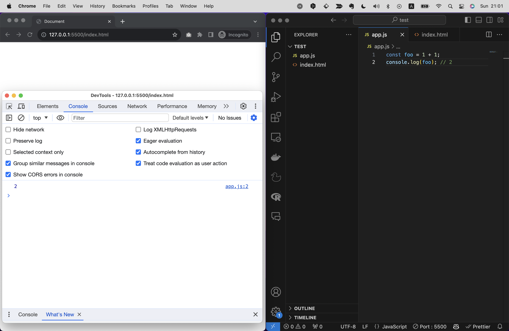

# JSの基本ルール
まずは真っ先に抑えておいてほしいJSの基礎仕様を解説します。
ここで解説する仕様はほかのプログラミング言語でも共通する内容が多いため、抑えておくことで他の言語の学習にも役立ちます。

- JSは半角英数字で書く
- スラッシュ２つ(`//`)を先頭に書くと”コメント”になり、コードとして認識されなくなる
- セミコロン(`;`)で文の終わりを示す
- ダブルクオーテーションまたはシングルクォーテーションで囲まれた文字列は文字列として認識される
- 命令は上から順に実行される

これだけだとなんの事かわからないですよね。
では例として以下のサンプルコードを見てみましょう。

```js
// 変数fooを定義
const foo = 1 + 1;
```
これはfooという変数を定義しているコードです。
変数については後述するので、現時点では意味が分からなくてOKです。

## JSは半角英数字で書く
このコードはすべて半角英数字で書かれています。
このようにプログラミングにおいては半角英数字での記述が必須です。全角で書くとエラーになりますので注意しましょう！
半角ではなく、全角の英字やスペースを誤って入力してしまいエラーになる学習者は多いです。
VS Codeの補完機能を使えば間違えることはありませんので、これを使いましょう！またChapter3で紹介したような、全角スペースを検知するVS Codeの拡張機能の使用もおすすめです。<!-- TODO　要確認 -->

## スラッシュ２つ(`//`)を先頭に書くと”コメント”になり、コードとして認識されなくなる
次に一行目に注目してください。この部分（変数fooを定義）はコメントになっています。コメントはメモ書きのようなもので、コードとして認識されません。
この特性を活かし、エンジニアはコメントで下に続くコードの説明を書いたり、一時的にコードを無効化して動作確認を行うなどができます。

## セミコロン(`;`)で文の終わりを示す
続いて二行目ですが、文の終わりにセミコロン(`;`)がついています。これで文の終わりを表しています。
正直な話をすると、JSにおいてセミコロンは必須ではなく、これがなくても問題なく動作します。
が、セミコロンをつけることで明確に文の終わりを示せるため、読みやすいコードとなります。
読みやすさはコードを書く上で非常に重要な要素ですので、とくに初学者の内はセミコロンはつけるようにしましょう！

## 文字列はダブルクオーテーションまたはシングルクォーテーションで囲む
サンプルコード例ではシンプルな数字の足し算を行っていますが、例えばもしJSで日本語や英語の文字を扱いたい場合であれば、ダブルクオーテーションで囲む必要があります。

```js
const foo = "Hello World"; 
```

シングルクォーテーションで 'Hello World' としても同じ意味になります。
プログラミング中、このように文字列を扱いたい場面が多々発生します。例えばHTMLページに出力するテキストをJSで扱いたい場合などです。
そうした場合にこれらの記号で囲まないとエラーになってしまいます！

```js
const foo = Hello World;
```

この場合はエラーとなり、動作しません。
（なお文字列については次の項でも詳しく解説します）


## 命令は上から順に実行される
JSは基本的に上から書いた順番で命令が実行されます。（厳密にいうとそうではない場面もありますが、それに関しては今は一旦考えなくてOKです）
順番が支離滅裂だと思ったように動かないことがあるため、順番には注意しましょう！
例えば下記は足し算`1 + 1` を行い、その結果を出力する例です。

NG例）
```js
console.log(foo); 
const foo = 1 + 1;
```

しかし、このコードは動作しません。演算よりも先に出力する命令（console.log）を先に記述してしまっているからです。
「命令は上から順に実行される」という仕様にならって下記のように書けば、正しく動作します。

OK例）
```js
const foo = 1 + 1;
console.log(foo); 
```

# console.logについて
JSのコードを書く際には、`console.log`という命令を使うことが多いです。
これは引数に渡した値を開発者ツールなどのコンソール画面に出力する関数というものなんですが、関数や引数については後述するとして、なぜこれをまっさきに紹介するのかといえば、動作確認でとても重宝するからです！

```js
const foo = 1 + 1;
console.log(foo); // 2
```

例えばこのコードでは、開発者ツールでコンソール画面を開くと、`2`という値が出力されているはずです。
このように都度実行結果をコンソール画面で都度確認できるため、コードの動作確認にとても便利です。



冒頭で`alert`という命令を紹介しましたが、`alert`はダイアログを表示する命令です。
これでも動作確認はできますが、いちいち閉じるのが面倒ですし複数の実行結果を一度に確認するのには向いていません。
というわけで、JSファイルに書いたコードが正しく動作するかを確認するには、`console.log`を使うのが一般的です。
また短いコードを試すのであれば、コンソール画面に直接コードを書いて実行することもできます。

実際の開発現場でもエンジニアは動作確認やデバッグにconsole.logを使うことが多いです！
本書ではたくさんのサンプルコードを紹介しますが、都度console.log()を使って動作確認してみてください。
（ちなみにPHPやPythonなどの他の言語では、`echo`や`print`という命令を使って同じように動作確認を行います。）

```
【コラム】fooとbar
プログラミングの教材にはよくfooやbarという文字が登場します。
これはダミーテキストでとくに意味はありません。
別に「test」でも「x」でも「aaa」でも何でも構わないのですが、慣例としてfooやbarは使われることが多いため、このように書いておくと開発者は「ああ、これはダミーテキストだな」と理解しやすいです。
本書でもこれにならってfooやbarを使っているので、これらが登場したら特に意味のないコードだと思ってください。
```

```
【コラム】Hello World
プログラミングの教材にはよくHello Worldという文字が登場します。
プログラミングを学ぶ際の初期段階によく登場しますが、「まず何らかの文字列を出力して動作確認を行いたい」ときなどにとりあえずで使われる適当なテキストです。
とくに意味はなく、文字を出力させたいなら別に「テスト」でも「あああ」でもいいのですが、慣例としてHello Worldが使われることが多いため、このように書いておくと開発者は「ああ、これは初期段階の動作確認のサンプルコードなんだな」と理解しやすいです。
Hello Wolrdの由来は諸説ありますが、学習者がプログラミングという新しい世界へ踏み込んだ際、一番最初に出力するテキストとして、Hello Worldはなかなか粋なメッセージですよね。
```

# 抑えておくと望ましいお作法
JSにはこれを守ってコードを書くほうが望ましいとされるお作法がいくつかあります。
ここでは代表的なものを3つご紹介しましょう。

## 1.インデントを揃える
インデントとは文章の行頭に空白を挿入して先頭の文字を右に押しやることですが、これを厳守することで構造が理解しやすくなります。

NG例）
```js
const bar = () => {
const foo = 1 + 1;
console.log(foo);
}
```

OK例）
```js
const bar = () => {
    const foo = 1 + 1;
    console.log(foo);
}
```

インデントは1つのインデントにつき、タブ1つ（Tabキーで入力できる）か、半角スペース2個か、半角スペース4個で揃えるのが一般的です。
どれを選択しても構いませんが、統一したものを使うようにしましょう。

## 2.キーワードの前後には半角スペースを入れる
例えば下記のように、イコールの前後や記号と値の間はくっつけてもコード自体は問題なく動きます。
しかしこれでは読みづらいので、常に前後に半角スペースを設けておくのがよいとされています。

NG例）
```js
const foo=1+1;
```

OK例）
```js
const foo = 1 + 1;
```

## 3.書き方を統一する
書き方を統一することで読みやすく美しいコードになります。
統一されたコードは法則性が生まれるため、エラーが発生した際にも原因を特定しやすくなります。

例えば簡単な例でいうと、先程文字列を扱う際にはダブルクォーテーションでもシングルクォーテーションでもどちらでも構わないという話をしましたが、両方を一つのプロジェクト内で混在せるのはNGです。
もしあなたが何らかのシステム開発プロジェクトに配属されたとして、そのシステムでダブルクォーテーションで囲むことが決まっていたのだとしたらそれに合わせるべきでしょう。
もしあなたがこれから新たになにかシステムを作ろうとしているのであれば、どちらかをはじめに決めて以降統一したルールで書き始めるべきです。

## お作法を守ることのメリット
これらのルールを守らなくてもJSは実行されますが、こうしたお作法を守ることでコードが読みやすくなります。
コードが読みやすいとエラーなどのトラブルに見舞われたときに解決しやすかったり、他の人がコードを読む際に混乱しにくくなります。
また、未来の自分のためにも役立ちます！字が汚い人が手書きでメモをとったものの、後から見返すと何が書いてあるのかわからない......なんてことがありますが、これはプログラミングでも同じです。

またこれらのお作法はJSでは守らずとも動きますが、他のプログラミング言語では動作しなかったりします。
例えばPythonやRubyではインデントが正しく揃ってないとエラーになります。
JSでもこれらのお作法を抑えておくことで、他の言語の学習にも役立ちます。

```
【コラム】
実際の開発の現場では、プロジェクトや企業単位でしばしばコーディングルールというドキュメントが作られます。
例えばインデントは半角スペース2つ、文字列はダブルクォーテーションで統一する、などといったルールを定めておくのです。
これはコードの読みやすさを保つためだけでなく、複数人で開発する際にコードの統一性を保つためにも重要です。
例えばGoogleなど一部の有名な企業では自社のコーディングルールを公開していますので、興味のある方は調べてみてください。

参考）GoogleのHTML/CSSのコーディングルール
https://google.github.io/styleguide/htmlcssguide.html
```
