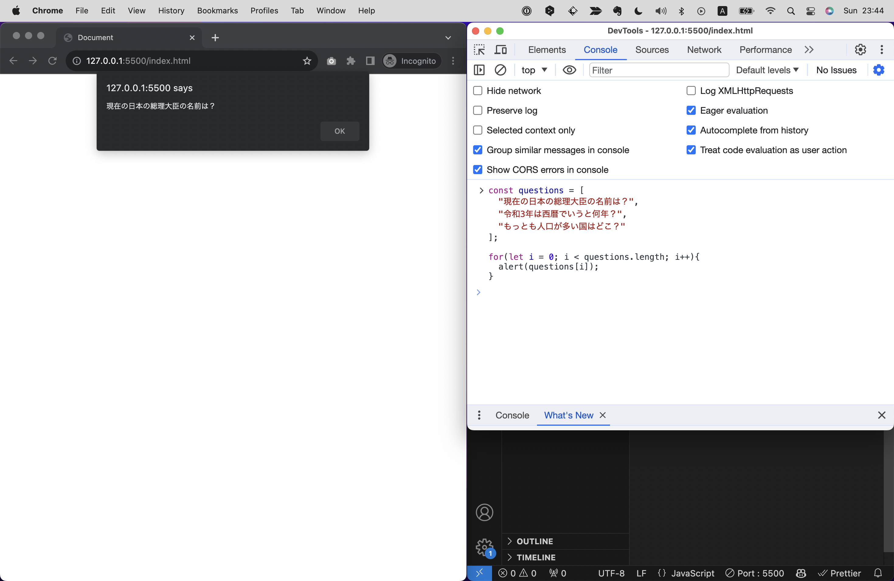
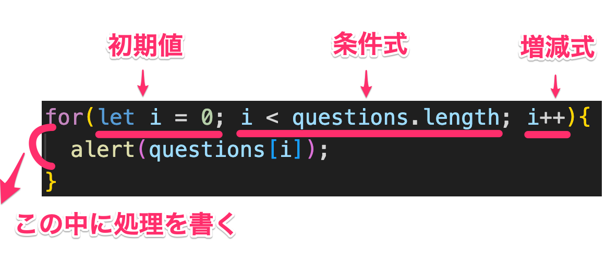

# 基礎文法
さて、ここからはJSの基礎文法について解説します！
例えば英語学習には主語、述語、代名詞、基本5文型、過去形、未来形、といったような文法がありますが、プログラミング言語にもそうした文法があります。
少々とっつきづらいかもしれませんが、このような土台となる基礎知識はプログラムを書く力に直結します。
すぐにアウトプットができるよう最低限の内容にしぼっているので、ぜひ最後まで読み進めてください！

# 演算
まずは演算について解説します。
演算とは数値や文字列などの値を計算することですが、JSではとてもシンプルに四則演算子を使って計算を行うことができます。

- +: 足し算
- -: 引き算
- *: 掛け算
- /: 割り算
- %: 割り算の余り
- **: べき乗

例えば以下のように書くと、計算結果がコンソールに出力されます。

```js
console.log(1 + 1); //2 
console.log(1 - 1); //0
console.log(2 * 2); //4
console.log(2 / 2); //1
```

割り算の余りとべき乗については少々聞き慣れないかもしれません。
割り算の余りは、例えば`5 / 2`という計算をすると、商は`2`で余りは`1`になります。
`%`を使うと、この余りを出力することができます。
べき乗は、例えば`2 ** 3`という計算をすると、`2`の`3`乗である`8`になります。
このように、べき乗は`**`という記号を使って計算します。

```js
console.log(3 % 2); //1
console.log(2 ** 3); //8
```

カッコを使ったり、もう少し長い式を繋げての計算も可能です。

```js
console.log((1 + 1) * (2 - 4)); //-4
```

# データ型
これまで数字(1や2など)や文字列("Hello"や"World"など)といった値をサンプルコードで示してきたように、JSにはデータ型と呼ばれる様々な値の種類があります。
これらの値はそれぞれ異なる性質を持っており、それぞれの値に対してできることが異なります。
ここでは代表的なデータ型を紹介します。

| データ型 | 英語表記 | 説明 | 例 |
| --- | --- | --- | --- |
| 数値 | Number | 数字を表す | 1, 2, 3, 4, 5 |
| 文字列 | String | 文字列を表す | "Hello", "World" |
| 真偽値 | Boolean | 真偽値を表す | true, false |
| null | null | 値が存在しないことを表す | null |
| undefined | undefined | 値が未定義であることを表す | undefined |
| 配列 | Array | 複数の値をまとめて管理する | [1, 2, 3] |
| 関数 | Function | 処理をまとめて管理する | () => { console.log("Hello World!"); } |
| オブジェクト | Object | 複数の値をまとめて管理する | {foo: 1, bar: 2} |

## 数値(Number)と文字列(String)
ではまず、数値と文字列について見ていきましょう。
数値は先程演算の項で説明したように、足し算や引き算などの計算ができる数字の値を指します。
（※ほかのプログラミング言語では値が整数か少数かでさらに型が分かれたりしますが、JSではこれらを区別せずに数値型として扱います。）

```js
console.log(1 + 1); //2
```

では文字列はどうかというと、その名の通り文字を表す値で、ダブルクオーテーションまたはシングルクォーテーションで囲むことで文字列として認識されます。
なお、ダブルクオーテーションとシングルクォーテーションはどちらを使っても構いません。意味は同じです。（以降、本書ではダブルクオーテーションを使います）

```js
"Hello World";
```

もしJSの仕様にはないキーワードをダブルクオーテーションやシングルクォーテーションで囲まずに書いてしまうと、エラーになります。

```js
Hello World; //この場合はエラーとなり、動作しません
```

数字も変数も関数も、どんなキーワードもダブルクオーテーションで囲むことで文字列として認識されます。
また文字列同士での演算はできませんが、文字列同士を結合することは可能です。

```js
console.log("Hello" + "World"); //HelloWorld
console.log("Hello" + " " + "World" + "!"); //Hello World!
```

では問題です！次の例を見てください。

```js
"1" + "1";
```

この場合の実行結果はどうなると思いますか？
`2`だと思いますか？正解は`11`になります。
ダブルクオーテーションで囲まれているため、JSが値を`文字列`として認識するためです。

JSを初めとしたプログラミング言語では、文字列と数値は別物として扱われます。
そのため、文字列と数字を足し算すると、文字列としての結合が行われます。

数字以外にも変数、関数、クラスなどなど、JSには後述する様々な概念がありますが、いずれもダブルクオーテーションで囲むと文字列として認識されるので使い方には注意しましょう。

## 真偽値(Boolean)
真偽値はわずか2種類で、`true`と`false`の2つの値を持ちます。
真偽値は条件分岐に使われることが多く、「条件を満たすか？　→　満たすならtrue、満たさないならfalse」というような使い方をします。

例えば大きなニュースサイトの検索フォームに何らかのキーワードを入力して検索ボタンを押した際、そのキーワードがニュース記事に含まれているかどうかを判定する処理を考えてみましょう。
（便宜上まだ登場していないif文などを使いますが、コード全体を理解できる必要はありません。）

```js
if(posts.length > 0 === true){
  return posts;
} else {
  return "投稿がありません";
}
```

この例では記事の件数が0件より多い場合（つまり最低でも1件はある場合）、記事のデータを返し、1件もなかった場合は"投稿がありません"という文字列を返す処理を行っています。
`posts.length > 0`は条件 `記事の件数が0件より多い場合` を表しており、これに対してJSはtrueかfalseかを判定します。

## nullとundefined
nullとundefinedはどちらも値がないことを表すために使われますが、微妙に意味が異なります。
nullは値が存在しないことを示しますが、undefinedは値が未定義であることを示すので、値が存在しないことを明確にすることはできません。

これらの使い分けに関しては開発者の間や言語によっても議論がありますが、少なくとも初学者の内はなるべくnullを使うことをオススメします。
というのも、nullは開発者が意図的に指定した場合のみ設定される一方、undefinedは開発者が意図的に指定しなくても設定される場合があります。
そのため、undefinedは開発者が意図しない挙動を引き起こす可能性があります。

nullは例えば下記のようなシーンで使うことができます。

```js
let errorMessage = null;
if(posts.length > 0 === true){
  return posts;
} else {
  errorMessage = "投稿がありません";
}
```

この例では、まず`errorMessage`という変数をnullで初期化しています。
そして記事の件数が0件より多い場合は記事のデータを返し、1件もなかった場合は`errorMessage`に"投稿がありません"という文字列を代入しています。

もし例えば、変数を宣言したものの意図せず値を入れ忘れてしまった場合はundefinedが入ってしまいます。

```js
let = errorMessage; //undefined
```

## 配列(Array)
配列は複数の値をまとめて管理するためのものです。
変数同様に`const`か`let`で配列名を定義し、値を`[](ブラケットまたは角括弧)`で囲んで定義します。

```js
const array = [1, 2, 3];
```

この例は`array`という配列に`1`、`2`、`3`という値を入れていることを意味します。
配列の中には数値だけでなく、文字列や変数など様々な値を入れることができます。

```js
const array = [1, "Hello", foo];
```

配列を呼ぶ際には、`配列名[インデックス番号]`という形で呼び出します。

```js
const array = [1, 2, 3];
console.log(array[0]); //1
console.log(array[1]); //2
console.log(array[2]); //3
```

Chapter2の内容を覚えているでしょうか？コンピューターはモノを数えるときに0から始めるので、配列の1つめの値を呼び出す際は`配列名[0]`となります。
インデックス番号は0から始まります。
<!-- TODO:Chapter 2？ -->

初学者の内は使う機会はあまりないかもしれませんが、配列の中にさらに配列を入れることもできます。こうした構造の配列は多次元配列と呼ばれます。

```js
const groups = [
  ["Taro", "Yumi", "Takashi"], 
  ["Kouta", "Toma"],
  ["Yuki", "Miki", "Emi"]
];
```

※ちなみに、JSの場合このように値が長い場合にはコードの途中で改行して読みやすくすることもできます。

## 配列の利用シーン例
配列は同じようなジャンルの値をまとめて管理し、効率よく呼び出すために使われます。
例えば、クイズゲームのようなアプリケーションを作るとして、あらかじめ問題文を配列に入れておき順に出題するというような処理を考えてみましょう。

```js
const questions = [
  "現在の日本の総理大臣の名前は？", 
  "令和3年は西暦でいうと何年？", 
  "もっとも人口が多い国はどこ？"
];

alert(questions[0]) //現在の日本の総理大臣の名前は？
```

（少々長いので読みやすくするために改行してみました。このように配列はカンマの後など途中で改行しても問題ありません。）
このように問題文を配列にしておくと、まとまりのよいコードになります。
またループ文と組み合わせて使うことで、配列の中身を効率よく順番に呼び出すこともできます。(これについては後述)

## 関数とオブジェクト
関数とオブジェクトに関しては他の型に比べて比較的情報量が多いため、後の項で詳しく解説します。

# 変数と宣言
変数とは、値を入れておく箱のようなもので、数字や文字列など様々な値を入れることができます。
`const`または`let`というキーワードで宣言することができ、`const {変数名} = {値}`のように左に変数名、右に値を書き、`=`でつなぐことで変数を定義することができます。

```js
const foo = 1;
```

つまり、この例は「`foo`という変数を宣言し、その値を`1`にする」という意味になります。
これをconsole.logで出力すると、`1`という値が出力されます。

```js
console.log(foo); //1
```

## 変数を使う意義
ここまでの説明で、なぜわざわざ変数を使うのか？さっきのように`console.log(1)`と書いてしまえばいいのでは？と思われるかもしれません。
たしかにこれまで紹介したようなコードはとても短いので変数を使う必要性はありません。
しかし、もっと長い複雑なコードを書こうと思った際には、変数を使うことでいくつかのメリットを受けることができます！

### 1.値を単純化できる
変数を使うことで値を単純化したりわかりやすいコードにすることができます。
例えば以下のようなコードを考えてみましょう。

```js
if(new Date().getHours() > 20){
  document.body.style.backgroundColor = "#000";
}
```
これは現在の時間が20時を超えている場合、背景色をブラックにするという意味のコードです。（ダークモードというやつです）
`#000`という値は黒を意味するカラーコードですが、デザイナーでもない限りはこの文字列が黒を意味することを知っている人は少ないでしょう。
これを変数を使って書き換えてみると以下のようになります。
(`new Date()`が何を指すかは後述) 
<!-- TODO:どこで後述するか明記 -->

```js
const colorDark = "#000";
if(new Date().getHours() > 20){
  document.body.style.backgroundColor = colorDark;
}
```
このようにすると、`#000`という値が何を意味しているのかが明確になり意味を推測する手助けになります。

### 2.同じ値を何度も書かなくて済む
変数を使うことで同じ値を何度も書く必要がなくなり、修正が楽になります。
例えば以下のようなコードを考えてみましょう。

```js
if(new Date().getHours() > 20){
  document.body.style.backgroundColor = "#000";
}
if(user.setting.darkMode === true){
  document.body.style.backgroundColor = "#000";
}
```

これは先のコードを拡張したサンプルコードです。
現在の時間が20時を超えている場合背景色をブラックにするという条件に加え、ユーザーが設定によってダークモードを常に指定している場合も背景色をブラックにするという条件を加えました。
しかしこのコードを実装した後で、デザイナーが「やっぱり#000はちょっと暗すぎるな。若干明るめの黒にしたいから、#333に修正して！」と言ってきた場合、このコードを修正するには2箇所の`#000`を修正する必要があります。（このサンプルではわずか2箇所ですが、実際の開発ではもっと多くの箇所を修正することになるでしょう）
こんなとき変数を設定していればどれだけ多くの箇所で`#000`が使われていたとしても、修正箇所は常に1箇所...変数の値を変えるだけで済みます！

```js
const colorDark = "#000"; // ← ここを#333に修正
if(new Date().getHours() > 20){
  document.body.style.backgroundColor = colorDark;
}
if(user.setting.darkMode === true){
  document.body.style.backgroundColor = colorDark;
}
```

いかがでしょう。これで変数を使うメリットが少しはイメージできたでしょうか？
ところでforループなどJSの一部の構文ではそもそも変数を使わないといけないケースもあるので、いずれにせよ変数は必須です。

## const, let
先ほど変数を宣言するには`const`または`let`というキーワードを使うと説明しましたが、この２つには値の再代入（上書きともい）ができる・できないという違いがあります。
`const`は値の再代入ができない変数、`let`は値の再代入ができる変数を定義します。

例えば下記のようなコードを見てみましょう。
```js
const foo = 1;
foo = 2; //1
```

この例では1行目で`foo`という変数を定義し、2行目で`foo`に`2`を代入しています。
しかし`const`で宣言された変数は再代入が不可なので、この結果はエラーになりfooは1のままです。
一方、`let`を使った場合には再代入が可能です。

```js
let foo = 1;
foo = 2; //2
```

このように、変数を定義する際は再代入が必要かどうかを考えて`const`または`let`を使い分けましょう。

### 使い分けの基準
ここまでの説明を聞くと、「だったらとりあえず選択肢の多い`let`を使っておけば間違いないのでは？」と思われるかもしれません。
しかし、実は`const`を使うことを推奨するエンジニアが多いです。
`const`を使うことで値の再代入を防ぐことができ、コードの安全性を高めることができるからです。
実は選択肢は少ないほうがいいのです。あれもこれもできてしまうコードだと、どこでどんな値が代入されているのかわかりにくくなるため読みづらく、エラーが起きやすいコードとなってしまいます。
というわけで、基本的には`const`を使い、再代入が必要な場合に限って`let`を使うようにしましょう！
ちなみに再代入が必要な場面の例としては、forループのカウンタ変数があります。（後述）

### varについて
`var`というキーワードを使って変数を宣言することもできますが、これは`let`と同じように値の再代入が可能な変数を定義します。
（厳密にいうと`let`とは異なる仕様を持っていますが、ここでは詳細は割愛します。）
`var`での変数宣言は以前はよく使われていましたが、現在のJSのバージョンでは`let`と`const`が主流であまり使われません。。

```
【コラム】JSのバージョンについて
厳密にいうと、JSには2014年まで主流だったES5と、2015年以降主流のES6(ES2015ともいう)という2つのバージョンが存在します。
2015年以降は毎年バージョンが更新されており、2023年の段階ではES14(ES2023)が最新バージョンとなっています。
ES6以降のバージョンでは基本的に大きく仕様が変わることはなく、新しい機能が追加されることが多いため、JSを学習する際にはES6以降のバージョンで勉強することをオススメします。本書もES6以降のバージョンで解説しています。

なお、先述の`var`はES5での書き方です。Webブラウザは後方互換性を持っているため、現在でも`var`を使ってコーディングすることは可能ですが、基本的にはES6で追加された`let`と`const`を使うようにしましょう。
```

## 変数の活用例

変数には値を入れるだけでなく、配列やオブジェクト、関数などを入れることもできます。
これらについては後で詳しく解説するので、この部分は読み飛ばしていただいて構いませんが、例えば下記のような書き方が可能です。

```js
// 配列
const array = [1, 2, 3];

// オブジェクト
const obj = {
  foo: 1,
  bar: 2
};

// 関数
const func = () => {
  console.log("Hello World!");
};
```


# 条件文
条件文とは、条件によって処理を分岐させるためのものです。
JSにはswitchという条件分岐の書き方もありますが、if文より使用頻度は下がるのでここでは割愛し、本書ではもっともメジャーなif文に焦点をあてて解説します。

```js
if(条件式){
  //条件が真の場合に実行される処理
}
```

書き方としては`if`から始め、`() 丸括弧(パーレンとも呼ぶ)`内に条件式を書き、その後`{} 波括弧(カーリーブラケット)`内に処理を書きます。
条件式が当てはまれば波括弧内の処理が実行され、当てはまらなければ実行されません。
例えば下記の例を見てみましょう。

```js
const questions = [
  "現在の日本の総理大臣の名前は？", 
  "令和3年は西暦でいうと何年？", 
  "もっとも人口が多い国はどこ？"
];

if(questions.length > 3 === true){
  alert(questions[0]);
}
```

この例では`questions`という配列の長さが3より大きい場合、`questions`の1つめの値をダイアログで表示するという処理を行っています。
`questions.length` は配列の長さを表します。この例ではquestionsには3つの値が含まれているため、3となります。（`.length`が何なのかは後述します）
条件式はquestions.lengthが3より大きいことが条件のため、この条件式は当てはまらず `alert(questions[0]);`は実行されません。

ちなみに、条件式の`=== true`はいちいち書かずとも省略することができます。

```js
if(questions.length > 3){
  alert(questions[0]);
}
```

## 比較演算子
先の例では`>`という記号を使って条件式を書きましたが、これは数学でもおなじみの比較演算子と呼ばれるものです。
比較演算子には以下のようなものがあります。これらを使うことで条件分岐の条件を決めることができます。

- `>`: 大なり
- `<`: 小なり
- `>=`: 以上
- `<=`: 以下
- `===`: 等しい
- `!==`: 等しくない

例）
```js
if(questions.length === 0){ ... } //配列の数が0
if(questions.length >= 0){ ... } //配列の数が0以上
if(questions.length !== 0){ ... } //配列の数が0ではない
```

## 論理演算子
論理演算子は複数の条件を組み合わせるためのもので、代表的なものは以下の2つです。

- `&&`: かつ
- `||`: または

例）
```js
if(questions.length > 0 && questions.length < 100){ ... } //配列の数が0より多く、100より小さい
if(questions.length === 0 || questions.length === null){ ... } //配列の数が0またはnull
```

上記の例では2つの条件を組み合わせてみましたが、やろうと思えば3つ以上加えることもできます。（ただし、条件が増えるほどコードが読みにくくなるので、あまり多くは使わない方が良いです）

## else
if文の場合は条件を満たしたときのみ処理が実行されますが、ここにelse文を加えることで「もし条件を満たさない場合」の処理を書くことができます。

```js
if(条件式){
  //条件式が当てはまった場合の処理
} else {
  //条件式が当てはまらなかった場合の処理
}
```

また、else文はif文と組み合わせて使うことで、複数の条件を指定することもできます。

```js
if(条件式1){
  //条件式1が当てはまった場合の処理
} else if(条件式2){
  //条件式2が当てはまった場合の処理
} else {
  //条件式1も2も当てはまらなかった場合の処理
}
```

この例では合計3つの条件分岐を行っていますが、`else if`をさらに追記して4つ以上の条件分岐を行うこともできます。

## 三項演算子
三項演算子はif文の簡略版ともいえるもので、if文と同じように条件分岐を行うことができます。
書き方は以下のようになります。

```js
条件式 ? 条件式が当てはまった場合の処理 : 条件式が当てはまらなかった場合の処理
```

例えば先のif文の例を三項演算子で書き換えると以下のようになります。

```js
questions.length > 0 ? alert(questions[0]) : null;
```

この例では`questions.length > 0`という条件式が当てはまった場合、`alert(questions[0])`という処理が実行され、当てはまらなかった場合は`null`が返されます。

# ループ文
ループ文とは、同じ処理を繰り返し行うためのものです。
ループ文にはwhile文やmap文、forEach文、do-while文など複数の書き方がありますが、ここではもっともオーソドックスな`for`に焦点をあてて解説します。
for文は下記のような構造です。

```js
for(初期値; 条件式; 増減式){
  //処理
}
```

キーワード`for`からはじめ、`() 丸括弧(パーレンとも呼ぶ)`の中に実行条件（初期値、条件式、増減式）を書き、`{} 波括弧(カーリーブラケット)`内に繰り返し行う処理を書きます。
実行条件が当てはまれば波括弧内の処理が繰り返し実行される、という仕組みです。
初期値はループを開始する際の値、条件式はループを継続するかどうかの条件、増減式はループを繰り返す際に値をどれだけ増減させるかを表します。

きっとこの説明では意味がまだわからないはずです！具体例を示しましょう。
例えば先ほど配列の例で示した問題文を、for文を使って順番に出題すると以下のようになります。

```js
const questions = [
  "現在の日本の総理大臣の名前は？", 
  "令和3年は西暦でいうと何年？", 
  "もっとも人口が多い国はどこ？"
];

for(let i = 0; i < questions.length; i++){
  alert(questions[i]);
}
```

試しにこれを実行してみてください。Chapter 5.1で示したapp.jsに書くでも、コンソール画面に直接書くでも構いません。
そうすると図のようにダイアログが表示され、OKを押すと次の問題が表示されるはずです。



このときのforループ文の構造を分解すると下記のようになります。



1.まず初期値で `let i = 0` が定義されています。この初期値はletで宣言されているため、iは再代入可能な変数となります。
2.次に条件式で `i < questions.length` とありますが、これは「iがquestionsの配列の長さよりも小さいこと」という条件を示しています。配列questionsが持つ値は3つなので`questions.length`は3となり、この条件式は「iが0から2までの間であること」という意味になります。
3.次に増減式で `i++` とあります。この`++`はインクリメントと呼ばれ、1を足すことを意味します。（ちなみに`i--`という1を引くことを意味するデクリメントと呼ばれるものもありますが、for文ではこれを使うこともできます）。
4.最後に波括弧内の処理が実行されます。この例では`alert(questions[i])`という処理が実行されますが、これは「配列questionsのi番目の値をダイアログで表示する」という意味になります。
5.処理が終わったら、再び条件式に戻り、条件式が当てはまる限り処理を繰り返します。条件式が当てはまらなくなったらループを終了します。

つまり、このfor文は「iが0から2までの間であること」という条件を満たす限り、`alert(questions[i])`という処理を繰り返し実行する、という意味になります。

ちなみにもしfor文を使わない場合、以下のように書くことになります。

```js
const questions = [
  "現在の日本の総理大臣の名前は？", 
  "令和3年は西暦でいうと何年？", 
  "もっとも人口が多い国はどこ？"
];

alert(questions[0]);
alert(questions[1]);
alert(questions[2]);
```

これだと同じようなコードが3つも続き、スマートじゃないですよね。
3つくらいならまだ耐えられますが、もし100個の問題があったらとんでもない行数になり、またメンテナンスも大変です。
というわけで、同じような処理を繰り返す場合はfor文を使うとスマートに書くことができます。

# 関数
関数とは、複数の処理からなるプログラムまとめておくためのもので、2つの書き方があります。
1つは`function`というキーワードで宣言することができ、`{}`波括弧内に処理を書く方法、もう1つは`=>`という記号で変数し変数に代入するアロー関数という方法です。

```js
function 関数名(){
  //処理
}

const 関数名 = () => {
  //処理
}
```

これらの書き方はどちらも同じように使うことができますが、アロー関数の方が短く書けるため、現在ではアロー関数の方が主流となっています。本書でも以降はアロー関数を使って解説していきます。
（厳密に言うと微妙に仕様が異なりますが、ほとんど同じように扱えるためそれに関しては割愛します）

関数はよく料理のレシピに例えられます。
例えば、お好み焼きを作るときには「①キャベツを切る」「②小麦粉と卵を混ぜる」「③キャベツと②を混ぜる」「④フライパンで焼く」というように、複数の処理を順番に行います。
このとき、①〜④までの処理を「お好み焼きを作る」という関数にまとめておくことで、次にお好み焼きを作るときには「お好み焼きを作る」という関数を呼び出すだけで、①〜④までの処理をまとめて実行することができます。

実際のプログラムにおいても例を出してみましょう。
先述の変数のサンプルコードでは現在の時刻に合わせてWebサイトの背景を変えるダークモードを実装しましたが、これを関数を使って書き換えると以下のようになります。

元のコード）
```js
if(new Date().getHours() > 20){
  document.body.style.backgroundColor = "#000";
}
```

関数化したコード）
```js
const changeDarkMode = () => {
  if(new Date().getHours() > 20){
    document.body.style.backgroundColor = "#000";
  }
}
changeDarkMode();
```

この例では`changeDarkMode`という関数を定義し、その中にダークモードの処理をまとめています。
関数化しない場合、同じ処理を複数の箇所で実行しようと思ったら3行からなる元のコードを毎回コピペすることになりますが、関数にしておけば一行だけ`changeDarkMode()`と記述すれば処理が行われるようになります！

## 関数の呼び出し方
関数を定義したら、任意の場所で呼び出すための記述をお忘れなきよう！
関数を呼び出すには、関数名の後に`()`をつけるだけです。
これをせずに関数を定義しただけだと処理は実行されません。

```js
//これだけでは処理は実行されない
const changeDarkMode = () => {
  if(new Date().getHours() > 20){
    document.body.style.backgroundColor = "#000";
  }
} 
```

```js
//これで処理が実行される
changeDarkMode();
```

またこれまでの条件文やループ文などと組み合わせることももちろんできます。

```js
// 条件文の例
if(条件式){
  changeDarkMode();
}

// ループ文の例
for(let i = 0; i < 3; i++){
  changeDarkMode();
}
```

## 引数
関数は引数と組み合わせることでより強力になります。
引数とは、関数に渡す値のことで、関数を呼び出す際に`()`内に記述します。
関数でまとめた処理の一部を、利用シーンに応じて変更したい場合などに使います。

```js
const 関数名 = (引数) => {
  //引数を伴った処理
}
```

先程の料理のレシピを用いて説明してみましょう。
例えばお好み焼きを作るときには「①キャベツを切る」「②小麦粉と卵を混ぜる」「③キャベツと②を混ぜる」「④フライパンで焼く」というように、複数の処理を順番に行います。
このとき、①〜④までの処理を「お好み焼きを作る」という関数にまとめておくことで、次にお好み焼きを作るときには「お好み焼きを作る」という関数を呼び出すだけで、①〜④までの処理をまとめて実行することができます。
しかし、お好み焼きを作るときにはキャベツの代わりにキャベツ以外の野菜を使いたい場合もあるでしょう。
このとき、関数の引数にキャベツ以外の野菜を渡すことで、キャベツ以外の野菜を使ったお好み焼きを作ることができます。

実際のプログラムにおいても例を出してみましょう。
先程ダークモードの関数を作りましたが、このとき背景色が変わる時刻は20時と決め打ちになっていました。
もしダークモードを適用する時刻を変えたい場合はどうすればいいでしょうか？
例えば冬は18時で、それ以外の季節は20時にダークモードにしたい場合、関数の引数に時刻を渡すことでダークモードを適用する時刻を変更することができます。

```js
const changeDarkMode = (time) => {
  if(new Date().getHours() > time){
    document.body.style.backgroundColor = color;
  }
}

if(season === "winter"){
  changeDarkMode(18);
} else {
  changeDarkMode(20);
}
```

さらに、関数には複数の引数を持たせることもできます。
例えば先程の関数の背景色も引数にしておき、時間と背景色をいっぺんに変えることもできます。

```js
const changeDarkMode = (time, color) => {
  if(new Date().getHours() > time){
    document.body.style.backgroundColor = color;
  }
}

changeDarkMode(20, "#333");
```

引数には関数宣言時にデフォルト値を設定することもできます。
通常、引数を持つ関数が引数なしで呼び出された場合エラーが発生しますが、デフォルト値を設定しておくことでエラーを防ぐことができます。

```js
const changeDarkMode = (time = 20, color = "#333") => {
  if(new Date().getHours() > time){
    document.body.style.backgroundColor = color;
  }
}

changeDarkMode(); //time=20とcolor=#333のデフォルト値が適用される
```

## 戻り値
関数には戻り値というものを設定しておくこともできます。
戻り値とは関数の処理結果を返すためのもので、関数内に `return` というキーワードを使って記述します。
関数の処理結果を変数に代入したり、他の関数の引数にしたりすることができます。

```js
const 関数名 = () => {
  //処理
  return 戻り値;
}
```

例えばこれを活用して、今日の日付から季節を判定する関数を作ってみると下記のようになります。

```js
const getSeason = () => {
  const month = new Date().getMonth() + 1;
  if(month >= 3 && month <= 5){
    return "spring";
  } else if(month >= 6 && month <= 8){
    return "summer";
  } else if(month >= 9 && month <= 11){
    return "autumn";
  } else {
    return "winter";
  }
}
```

これを先程作成したダークモードの関数と組み合わせて、時期が冬なら18時、それ以外の季節なら20時にダークモードにするという処理を書くことができます。

```js
const season = getSeason(); //seasonにはspring, summer, autumn, winterのいずれかが入る
if(season === "winter"){
  changeDarkMode(18);
} else {
  changeDarkMode(20);
}
```

## 関数のスコープ
関数のスコープとは、関数内で定義された変数がどこから参照できるかを表します。
関数内で定義された変数は、関数の外からは参照できません。
例えば下記の例を見てみましょう。

```js
const bar1 = 1;
const foo = () => {
  const bar2 = 2;
}
console.log(bar1); //1が表示される
console.log(bar2); //エラーになる
```

この例では、bar1とbar2という2つの変数を定義し、`console.log()`で呼び出しています。
`bar1`は関数の外で定義されているため、関数の外から参照することができますが、bar2は関数内で定義されているためスコープ外となり、関数の外から参照することができません。
もし`bar2`を参照したい場合は、`foo`関数内で`console.log()`を使う必要があります。

```js
const bar1 = 1;
const foo = () => {
  const bar2 = 2;
  console.log(bar2); //2が表示される
}
console.log(bar1); //1が表示される
```


このように、スコープを使わずに書かれた変数をグローバル関数、スコープを使って書かれた変数をローカル変数と呼びます。
上の例では`bar1`はグローバル変数、`bar2`はローカル変数となります。

スコープが違えば同じ変数名を別のものとして扱うこともできます。

```js
const bar = 1;
const foo = () => {
  const bar = 2;
  console.log(bar); //2が表示される
}
console.log(bar); //1が表示される
```

```
【コラム】なんでもかんでもグローバル変数にしない！
グローバル変数はどこからでも参照できるため、意図せずとも容易に変数の値が書き換えられてしまう可能性があります。
そのため、例えばもしある変数がある関数でしか使用されないものであれば、その変数はその関数内で定義するべきです。
また関数単位でまとめておけば、ひとつのまとまったプログラムとして読みやすいコードにもなります。
```

関数内に入れ子でさらに関数を定義することもできます。その場合、変数と同様に関数内ではその関数を呼び出せますが、関数の外からはできません。

```js
const foo1 = () => {
  console.log("Hello world 1");
  const foo2 = () => {
    console.log("Hello world 2");
  }
}

foo1(); //実行され、Hello world1が表示される
foo2(); //実行されず、エラーになる
```

## 標準組み込み関数
標準組み込み関数とは、JSの仕様に初めから定義されている関数です。
そのため自分でわざわざ自作する必要がなく、いつでもどこでも呼び出すことができます。

例えば`alert()`や`console.log()`などは組み込み関数の一種です。
標準組み込み関数はJSを使う上でよく使うものが多いため、覚えておくと便利です！

（付録に使いやすい主要な標準組み込む関数の一覧を掲載しています。コーディングする際にぜひチートシートとしてご活用ください！）

```
【コラム】予約後に気をつけよう
JSには予約語と呼ばれる特別な意味を持つ単語が存在します。
例えば`const`や`let`、標準組み込み関数など、JSの仕様に初めから定義されているものがそれにあたります。
こうした予約語は変数名や関数名として使用することができず、設定した場合はエラーになります。
```

### 文法（基礎）
- オブジェクト(+ イベント) 自作・勝手に生成
- DOM操作
- メソッド, プロパティ, オブジェクトについて（ググろう）


# 上から順に実行される
## 賢い変数の代入法
- +=: 足し算して代入
- -=: 引き算して代入
- *=: 掛け算して代入
- /=: 割り算して代入
- %=: 割り算の余りを代入
- **=: べき乗して代入

### クラスとインスタンス
- 概念
- constructor
- プロパティ
- メソッド
- this
- 引数

### モジュール化
- import/export/from/as/default
- 使い方
  - 定数を入れておく
  - 使いまわしたい関数やクラスを分けておく
- ディレクトリ構造

### API連携・aJax
- await/async
- Promise
- try/catch
- Json-server

### 文法（おまけ）
- 三項演算子
- fetch/then/catch
- [...]
- よく使うメソッド（
- よく使うプロパティ（length,
- よく使うオブジェクト（String, Number, Math)