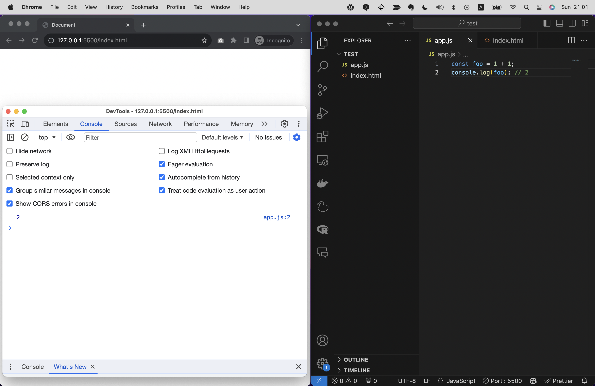

# JSの基礎仕様
さて、JSのセットアップが終わったところで、JSのコードについて勉強していきましょう！
まずは真っ先に抑えておいてほしいJSの基礎仕様を解説します。

- JSは半角英数字で書く
- スラッシュ２つ(`//`)を先頭に書くと”コメント”になり、コードとして認識されなくなる
- イコール(`=`)は右辺の値を左辺の変数に代入することを意味する
- ダブルクオーテーションまたはシングルクォーテーションで囲まれた文字列は文字列として認識される

これだけだとなんの事かわからないですよね。
では例として以下のサンプルコードを見てみましょう。

```js
// 変数fooを定義
const foo = 1 + 1;
```

これはfooという変数(後述)を定義しているコードです。
すべて半角英数字で書かれていますね。
このようにプログラミングにおいては半角英数字での記述が必須です。全角で書くとエラーになりますので注意しましょう！
半角ではなく、全角の英字やスペースを誤って入力してしまいエラーになる学習者は多いです。
VS Codeの補完機能を使えば間違えることはありませんので、これを使いましょう！またChapter3で紹介したような、全角スペースを検知するVS Codeの拡張機能の使用もおすすめです。<!-- TODO　要確認 -->

次に一行目に注目してください。この部分（変数fooを定義）はコメントになっています。コメントはメモ書きのようなもので、コードとして認識されません。
この特性を活かし、エンジニアはコメントで下に続くコードの説明を書いたり、一時的にコードを無効化して動作確認を行うなどができます。

続いて二行目ですが、文の終わりにセミコロン(`;`)がついています。これで文の終わりを表しています。
正直な話をすると、JSにおいてセミコロンは必須ではなく、これがなくても問題なく動作します。
が、セミコロンをつけることで明確に文の終わりを示せるため、読みやすいコードとなります。
読みやすさはコードを書く上で非常に重要な要素ですので、とくに初学者の内はセミコロンはつけるようにしましょう！

```
【コラム】fooとbar
プログラミングの教材にはよくfooやbarという文字が登場します。
これはダミーテキストでとくに意味はありません。
別に「test」でも「x」でも「aaa」でも何でも構わないのですが、慣例としてfooやbarは使われることが多いため、このように書いておくと開発者は「ああ、これはダミーテキストだな」と理解しやすいです。
本書でもこれにならってfooやbarを使っているので、これらが登場したら特に意味のないコードだと思ってください。
```

続いて次のコードを見てください。

```js
const foo = "Hello World";
```

"Hello World"というのはJSの仕様にはないキーワードですが、ダブルクオーテーションで囲われているため文字列として認識されます。
こように、任意の文字列をプログラムに組み込みたい場合は、ダブルクオーテーションまたはシングルクォーテーションで囲む必要があります。
（ダブルクオーテーションとシングルクォーテーションはどちらを使っても構いません。意味は同じです。）
もしJSの仕様にはないキーワードをダブルクオーテーションやシングルクォーテーションで囲まずに書いてしまうと、エラーになります。

```js
const foo = Hello World; //この場合はエラーとなり、動作しません
```

```
【コラム】Hello World
プログラミングの教材にはよくHello Worldという文字が登場します。
プログラミングを学ぶ際の初期段階によく登場しますが、「まず何らかの文字列を出力して動作確認を行いたい」ときなどにとりあえずで使われる適当なテキストです。
とくに意味はなく、文字を出力させたいなら別に「テスト」でも「あああ」でもいいのですが、慣例としてHello Worldが使われることが多いため、このように書いておくと開発者は「ああ、これは初期段階の動作確認のサンプルコードなんだな」と理解しやすいです。
Hello Wolrdの由来は諸説ありますが、学習者がプログラミングという新しい世界へ踏み込んだ際、一番最初に出力するテキストとして、Hello Worldはなかなか粋なメッセージですよね。
```

# console.logについて
JSのコードを書く際には、`console.log`という命令を使うことが多いです。
これは引数に渡した値を開発者ツールなどのコンソール画面に出力する関数というものなんですが、関数や引数については後述するとして、なぜこれをまっさきに紹介するのかといえば、動作確認でとても重宝するからです！

例えば先程のサンプルコードにconsole.logを追記すると以下のようになります。

```js
const foo = 1 + 1;
console.log(foo); // 2
```

開発者ツールでコンソール画面を開くと、`2`という値が出力されているはずです。
このように都度実行結果をコンソール画面で都度確認できるため、コードの動作確認にとても便利です。



冒頭で`alert`という命令を紹介しましたが、`alert`はダイアログを表示する命令です。
これでも動作確認はできますが、いちいち閉じるのが面倒ですし複数の実行結果を一度に確認するのには向いていません。
というわけで、JSファイルに書いたコードが正しく動作するかを確認するには、`console.log`を使うのが一般的です。
また短いコードを試すのであれば、コンソール画面に直接コードを書いて実行することもできます。

実際の開発現場でもエンジニアは動作確認やデバッグにconsole.logを使うことが多いです！
本書ではたくさんのサンプルコードを紹介しますが、都度console.log()を使って動作確認してみてください。
（ちなみにPHPやPythonなどの他の言語では、`echo`や`print`という命令を使って同じように動作確認を行います。）

# 演算
さて、次に演算について解説します。
演算とは数値や文字列などの値を計算することですが、JSではとてもシンプルに四則演算子を使って計算を行うことができます。

- +: 足し算
- -: 引き算
- *: 掛け算
- /: 割り算
- %: 割り算の余り
- **: べき乗

例えば以下のように書くと、計算結果がコンソールに出力されます。

```js
console.log(1 + 1); //2
console.log(1 - 1); //0
console.log(2 * 2); //4
console.log(2 / 2); //1
```

割り算の余りとべき乗については少々聞き慣れないかもしれません。
割り算の余りは、例えば`5 / 2`という計算をすると、商は`2`で余りは`1`になります。
`%`を使うと、この余りを出力することができます。
べき乗は、例えば`2 ** 3`という計算をすると、`2`の`3`乗である`8`になります。
このように、べき乗は`**`という記号を使って計算します。

```js
console.log(3 % 2); //1
console.log(2 ** 3); //8
```

カッコを使ったり、もう少し長い式を繋げての計算も可能です。

```js
console.log((1 + 1) * (2 - 4)); //-4
```

また足し算で文字列を結合することもできます。

```js
console.log("Hello" + "World"); //HelloWorld
console.log("Hello" + " " + "World" + "!"); //Hello World!
```

# データ型
これまで数字(1や2など)や文字列("Hello"や"World"など)といった値をサンプルコードで示してきたように、JSにはデータ型と呼ばれる様々な値の種類があります。
これらの値はそれぞれ異なる性質を持っており、それぞれの値に対してできることが異なります。
ここでは代表的なデータ型を紹介します。

| データ型 | 英語表記 | 説明 | 例 |
| --- | --- | --- | --- |
| 数値 | Number | 数字を表す | 1, 2, 3, 4, 5 |
| 文字列 | String | 文字列を表す | "Hello", "World" |
| 真偽値 | Boolean | 真偽値を表す | true, false |
| 配列 | Array | 複数の値をまとめて管理する | [1, 2, 3] |
| オブジェクト | Object | 複数の値をまとめて管理する | {foo: 1, bar: 2} |
| 関数 | Function | 処理をまとめて管理する | () => { console.log("Hello World!"); } |
| null | null | 値が存在しないことを表す | null |
| undefined | undefined | 値が未定義であることを表す | undefined |

## 数値と文字列

数値は先の
例えば数字は足し算や引き算などの計算ができますが、文字列で足し算や引き算などの計算はできません。
ダブルクオーテーション（またはシングルクォーテーション）で囲んだテキストは数字でも文字列として扱われます
```js
console.log("1" - 1) //エラーになります
```
また真偽値は条件分岐に使われることが多く、配列やオブジェクトは複数の値をまとめて管理することができます。
関数は処理をまとめて管理することができ、nullやundefinedは値が存在しないことを表すために使われます。
（これらのデータ型は後ほど詳しく解説します！）

# 変数と宣言
変数とは、値を入れておく箱のようなもので、数字や文字列など様々な値を入れることができます。
`const`または`let`というキーワードで宣言することができ、`const {変数名} = {値}`のように左に変数名、右に値を書き、`=`でつなぐことで変数を定義することができます。

```js
const foo = 1;
```

つまり、この例は「`foo`という変数を宣言し、その値を`1`にする」という意味になります。
これをconsole.logで出力すると、`1`という値が出力されます。

```js
console.log(foo); //1
```

## 変数を使う意義
ここまでの説明で、なぜわざわざ変数を使うのか？さっきのように`console.log(1)`と書いてしまえばいいのでは？と思われるかもしれません。
たしかにこれまで紹介したようなコードはとても短いので変数を使う必要性はありません。
しかし、もっと長い複雑なコードを書こうと思った際には、変数を使うことでいくつかのメリットを受けることができます！

### 1.値を単純化できる
変数を使うことで値を単純化したりわかりやすいコードにすることができます。
例えば以下のようなコードを考えてみましょう。

```js
if(new Date().getHours() > 20){
  document.body.style.backgroundColor = "#000";
}
```
これは現在の時間が20時を超えている場合、背景色をブラックにするという意味のコードです。（ダークモードというやつです）
`#000`という値は黒を意味するカラーコードですが、デザイナーでもない限りはこの文字列が黒を意味することを知っている人は少ないでしょう。
これを変数を使って書き換えてみると以下のようになります。

```js
const colorDark = "#000";
if(new Date().getHours() > 20){
  document.body.style.backgroundColor = colorDark;
}
```
このようにすると、`#000`という値が何を意味しているのかが明確になり意味を推測する手助けになります。

### 2.同じ値を何度も書かなくて済む
変数を使うことで同じ値を何度も書く必要がなくなり、修正が楽になります。
例えば以下のようなコードを考えてみましょう。

```js
if(new Date().getHours() > 20){
  document.body.style.backgroundColor = "#000";
}
if(user.setting.darkMode === true){
  document.body.style.backgroundColor = "#000";
}
```

これは先のコードを拡張したサンプルコードです。
現在の時間が20時を超えている場合背景色をブラックにするという条件に加え、ユーザーが設定によってダークモードを常に指定している場合も背景色をブラックにするという条件を加えました。
しかしこのコードを実装した後で、デザイナーが「やっぱり#000はちょっと暗すぎるな。若干明るめの黒にしたいから、#333に修正して！」と言ってきた場合、このコードを修正するには2箇所の`#000`を修正する必要があります。（このサンプルではわずか2箇所ですが、実際の開発ではもっと多くの箇所を修正することになるでしょう）
こんなとき変数を設定していればどれだけ多くの箇所で`#000`が使われていたとしても、修正箇所は常に1箇所...変数の値を変えるだけで済みます！

```js
const colorDark = "#000"; // ← ここを#333に修正
if(new Date().getHours() > 20){
  document.body.style.backgroundColor = colorDark;
}
if(user.setting.darkMode === true){
  document.body.style.backgroundColor = colorDark;
}
```

いかがでしょう。これで変数を使うメリットが少しはイメージできたでしょうか？
ところでforループなどJSの一部の構文ではそもそも変数を使わないといけないケースもあるので、いずれにせよ変数は必須です。

## const, let
先ほど変数を宣言するには`const`または`let`というキーワードを使うと説明しましたが、この２つには値の再代入（上書きともい）ができる・できないという違いがあります。
`const`は値の再代入ができない変数、`let`は値の再代入ができる変数を定義します。

例えば下記のようなコードを見てみましょう。
```js
const foo = 1;
foo = 2; //1
```

この例では1行目で`foo`という変数を定義し、2行目で`foo`に`2`を代入しています。
しかし`const`で宣言された変数は再代入が不可なので、この結果はエラーになりfooは1のままです。
一方、`let`を使った場合には再代入が可能です。

```js
let foo = 1;
foo = 2; //2
```

このように、変数を定義する際は再代入が必要かどうかを考えて`const`または`let`を使い分けましょう。

### 使い分けの基準
ここまでの説明を聞くと、「だったらとりあえず選択肢の多い`let`を使っておけば間違いないのでは？」と思われるかもしれません。
しかし、実は`const`を使うことを推奨するエンジニアが多いです。
`const`を使うことで値の再代入を防ぐことができ、コードの安全性を高めることができるからです。
実は選択肢は少ないほうがいいのです。あれもこれもできてしまうコードだと、どこでどんな値が代入されているのかわかりにくくなるため読みづらく、エラーが起きやすいコードとなってしまいます。
というわけで、基本的には`const`を使い、再代入が必要な場合に限って`let`を使うようにしましょう！
ちなみに再代入が必要な場面の例としては、forループのカウンタ変数があります。（後述）

### varについて
`var`というキーワードを使って変数を宣言することもできますが、これは`let`と同じように値の再代入が可能な変数を定義します。
（厳密にいうと`let`とは異なる仕様を持っていますが、ここでは詳細は割愛します。）
`var`での変数宣言は以前はよく使われていましたが、現在のJSのバージョンでは`let`と`const`が主流であまり使われません。。

```
【コラム】JSのバージョンについて
厳密にいうと、JSには2014年まで主流だったES5と、2015年以降主流のES6(ES2015ともいう)という2つのバージョンが存在します。
2015年以降は毎年バージョンが更新されており、2023年の段階ではES14(ES2023)が最新バージョンとなっています。
ES6以降のバージョンでは基本的に大きく仕様が変わることはなく、新しい機能が追加されることが多いため、JSを学習する際にはES6以降のバージョンで勉強することをオススメします。本書もES6以降のバージョンで解説しています。

なお、先述の`var`はES5での書き方です。Webブラウザは後方互換性を持っているため、現在でも`var`を使ってコーディングすることは可能ですが、基本的にはES6で追加された`let`と`const`を使うようにしましょう。
```

## 変数の活用例

変数には値を入れるだけでなく、配列やオブジェクト、関数などを入れることもできます。
これらについては後で詳しく解説するので、この部分は読み飛ばしていただいて構いませんが、例えば下記のような書き方が可能です。

```js
// 配列
const array = [1, 2, 3];

// オブジェクト
const obj = {
  foo: 1,
  bar: 2
};

// 関数
const func = () => {
  console.log("Hello World!");
};
```

# 配列
配列は複数の値をまとめて管理するためのものです。
変数同様に`const`か`let`で配列名を定義し、値を`[](ブラケットまたは角括弧)`で囲んで定義します。

```js
const array = [1, 2, 3];
```

この例は`array`という配列に`1`、`2`、`3`という値を入れていることを意味します。
配列の中には数値だけでなく、文字列や変数など様々な値を入れることができます。

```js
const array = [1, "Hello", foo];
```

配列を呼ぶ際には、`配列名[インデックス番号]`という形で呼び出します。

```js
const array = [1, 2, 3];
console.log(array[0]); //1
console.log(array[1]); //2
console.log(array[2]); //3
```

Chapter1の内容を覚えているでしょうか？コンピューターはモノを数えるときに0から始めるので、配列の1つめの値を呼び出す際は`配列名[0]`となります。
インデックス番号は0から始まります。
<!-- TODO:Chapter 1？ -->

## 配列の利用シーン例
配列は同じようなジャンルの値をまとめて管理し、効率よく呼び出すために使われます。
例えば、クイズゲームのようなアプリケーションを作るとして、あらかじめ問題文を配列に入れておき順に出題するというような処理を考えてみましょう。

```js
const questions = [
  "現在の日本の総理大臣の名前は？", 
  "令和3年は西暦でいうと何年？", 
  "もっとも人口が多い国はどこ？"
];

alert(questions[0]) //現在の日本の総理大臣の名前は？
```

（少々長いので読みやすくするために改行してみました。このように配列はカンマの後など途中で改行しても問題ありません。）
このように問題文を配列にしておくと、まとまりのよいコードになります。
またループ文と組み合わせて使うことで、配列の中身を効率よく順番に呼び出すこともできます。(これについては後述)

# 条件文
条件文とは、条件によって処理を分岐させるためのものです。
複数の書き方がありますが、本書ではもっともメジャーなif文に焦点をあてて解説します。

```js
if(条件式){
  //条件が真の場合に実行される処理
}
```

書き方としては`if`から始め、`() 丸括弧(パーレンとも呼ぶ)`内に条件式を書き、その後`{} 波括弧(カーリーブラケット)`内に処理を書きます。
条件式が当てはまれば波括弧内の処理が実行され、当てはまらなければ実行されません。
例えば下記の例を見てみましょう。

```js
const questions = [
  "現在の日本の総理大臣の名前は？", 
  "令和3年は西暦でいうと何年？", 
  "もっとも人口が多い国はどこ？"
];

if(questions.length > 3){
  alert(questions[0]);
}
```

この例では`questions`という配列の長さが3より大きい場合、`questions`の1つめの値をダイアログで表示するという処理を行っています。
`questions.length` は配列の長さを表します。この例ではquestionsには3つの値が含まれているため、3となります。（`.length`が何なのかは後述します）
条件式はquestions.lengthが3より大きいことが条件のため、この条件式は当てはまらず `alert(questions[0]);`は実行されません。

## 比較演算子
先の例では`>`という記号を使って条件式を書きましたが、これは数学でもおなじみの比較演算子と呼ばれるものです。
比較演算子には以下のようなものがあります。これらを使うことで条件分岐の条件を決めることができます。

- `>`: 大なり
- `<`: 小なり
- `>=`: 以上
- `<=`: 以下
- `===`: 等しい
- `!==`: 等しくない
- `&&`: かつ
- `||`: または

例）
```js
if(questions.length === 0){ ... } //配列の数が0
if(questions.length === 0){ ... } //配列の数が0
if(questions.length === 0){ ... } //配列の数が0
```

## さまざま条件式
if文の条件式にはさまざまな条件を設定することができます。


# ループ文
ループ文とは、同じ処理を繰り返し行うためのものです。
ループ文には複数の書き方がありますが、ここではもっともオーソドックスな`for`に焦点をあてて解説します。
for文は下記のような構造です。

```js
for(初期値; 条件式; 増減式){
  //処理
}
```

キーワード`for`からはじめ、`() 丸括弧(パーレンとも呼ぶ)`の中に実行条件（初期値、条件式、増減式）を書き、`{} 波括弧(カーリーブラケット)`内に繰り返し行う処理を書きます。
実行条件が当てはまれば波括弧内の処理が繰り返し実行される、という仕組みです。
初期値はループを開始する際の値、条件式はループを継続するかどうかの条件、増減式はループを繰り返す際に値をどれだけ増減させるかを表します。

きっとこの説明では意味がまだわからないはずです！具体例を示しましょう。
例えば先ほど配列の例で示した問題文を、for文を使って順番に出題すると以下のようになります。

```js
const questions = [
  "現在の日本の総理大臣の名前は？", 
  "令和3年は西暦でいうと何年？", 
  "もっとも人口が多い国はどこ？"
];

for(let i = 0; i < questions.length; i++){
  alert(questions[i]);
}
```

試しにこれを実行してみてください。Chapter 5.1で示したapp.jsに書くでも、コンソール画面に直接書くでも構いません。
そうすると図のようにダイアログが表示され、OKを押すと次の問題が表示されるはずです。


このときのforループ文の構造を分解すると下記のようになります。


1.まず初期値で `let i = 0` が定義されています。この初期値はletで宣言されているため、iは再代入可能な変数となります。
2.次に条件式で `i < questions.length` とありますが、これは「iがquestionsの配列の長さよりも小さいこと」という条件を示しています。配列questionsが持つ値は3つなので`questions.length`は3となり、この条件式は「iが0から2までの間であること」という意味になります。
3.次に増減式で `i++` とあります。この`++`はインクリメントと呼ばれ、1を足すことを意味します。（ちなみに`i--`という1を引くことを意味するデクリメントと呼ばれるものもありますが、for文ではこれを使うこともできます）。
4.最後に波括弧内の処理が実行されます。この例では`alert(questions[i])`という処理が実行されますが、これは「配列questionsのi番目の値をダイアログで表示する」という意味になります。
5.処理が終わったら、再び条件式に戻り、条件式が当てはまる限り処理を繰り返します。条件式が当てはまらなくなったらループを終了します。

つまり、このfor文は「iが0から2までの間であること」という条件を満たす限り、`alert(questions[i])`という処理を繰り返し実行する、という意味になります。

ちなみにもしfor文を使わない場合、以下のように書くことになります。

```js
const questions = [
  "現在の日本の総理大臣の名前は？", 
  "令和3年は西暦でいうと何年？", 
  "もっとも人口が多い国はどこ？"
];

alert(questions[0]);
alert(questions[1]);
alert(questions[2]);
```

これだと同じようなコードが3つも続き、スマートじゃないですよね。
3つくらいならまだ耐えられますが、もし100個の問題があったらとんでもない行数になり、またメンテナンスも大変です。
というわけで、同じような処理を繰り返す場合はfor文を使うとスマートに書くことができます。


### 文法（基礎）
- 変数
- 配列
- if/else文
- ループ文(for)
 - ++: インクリメント（1を足す）
 - --: デクリメント（1を引く）
- 関数
- DOM操作
- オブジェクト(+ イベント) 自作・勝手に生成
- メソッド, プロパティ, オブジェクトについて（ググろう）


# 上から順に実行される
## 賢い変数の代入法
- +=: 足し算して代入
- -=: 引き算して代入
- *=: 掛け算して代入
- /=: 割り算して代入
- %=: 割り算の余りを代入
- **=: べき乗して代入

### クラスとインスタンス
- 概念
- constructor
- プロパティ
- メソッド
- this
- 引数

### モジュール化
- import/export/from/as/default
- 使い方
  - 定数を入れておく
  - 使いまわしたい関数やクラスを分けておく
- ディレクトリ構造

### API連携・aJax
- await/async
- Promise
- try/catch
- Json-server

### 文法（おまけ）
- 三項演算子
- switch文
- fetch/then/catch
- while, map
- [...]
- よく使うメソッド（
- よく使うプロパティ（length,
- よく使うオブジェクト（String, Number, Math)