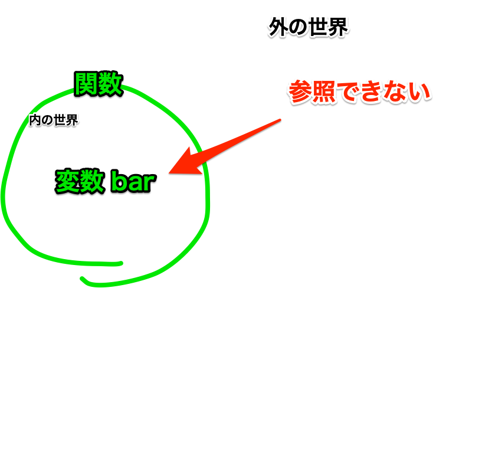

# 関数
関数とは、複数の処理からなるプログラムまとめておくためのもので、2つの書き方があります。
1つは`function`というキーワードで宣言することができ、`{}`波括弧内に処理を書く方法、もう1つは`=>`という記号で変数し変数に代入するアロー関数という方法です。

```js
function 関数名(){
  //処理
}

const 関数名 = () => {
  //処理
}
```

これらの書き方はどちらも同じように使うことができますが、アロー関数の方が短く書けるため、現在ではアロー関数の方が主流となっています。本書でも以降はアロー関数を使って解説していきます。
（厳密に言うと微妙に仕様が異なりますが、ほとんど同じように扱えるためそれに関しては割愛します）

関数はよく料理のレシピに例えられます。
例えば、お好み焼きを作るときには「①キャベツを切る」「②小麦粉と卵を混ぜる」「③キャベツと②を混ぜる」「④フライパンで焼く」というように、複数の処理を順番に行います。
このとき、①〜④までの処理を「お好み焼きを作る」という関数にまとめておくことで、次にお好み焼きを作るときには「お好み焼きを作る」という関数を呼び出すだけで、①〜④までの処理をまとめて実行することができます。

実際のプログラムにおいても例を出してみましょう。
先述の変数のサンプルコードでは現在の時刻に合わせてWebサイトの背景を変えるダークモードを実装しましたが、これを関数を使って書き換えると以下のようになります。

元のコード）
```js
if(new Date().getHours() > 20){
  document.body.style.backgroundColor = "#000";
}
```

関数化したコード）
```js
const changeDarkMode = () => {
  if(new Date().getHours() > 20){
    document.body.style.backgroundColor = "#000";
  }
}
changeDarkMode();
```

この例では`changeDarkMode`という関数を定義し、その中にダークモードの処理をまとめています。
関数化しない場合、同じ処理を複数の箇所で実行しようと思ったら3行からなる元のコードを毎回コピペすることになりますが、関数にしておけば一行だけ`changeDarkMode()`と記述すれば処理が行われるようになります！

## 関数の呼び出し方
関数を定義したら、任意の場所で呼び出すための記述をお忘れなきよう！
関数を呼び出すには、関数名の後に`()`をつけるだけです。
これをせずに関数を定義しただけだと処理は実行されません。

```js
//これだけでは処理は実行されない
const changeDarkMode = () => {
  if(new Date().getHours() > 20){
    document.body.style.backgroundColor = "#000";
  }
} 
```

```js
//これで処理が実行される
changeDarkMode();
```

またこれまでの条件文やループ文などと組み合わせることももちろんできます。

```js
// 条件文の例
if(条件式){
  changeDarkMode();
}

// ループ文の例
for(let i = 0; i < 3; i++){
  changeDarkMode();
}
```

## 引数
関数は引数と組み合わせることでより強力になります。
引数とは、関数に渡す値のことで、関数を呼び出す際に`()`内に記述します。
関数でまとめた処理の一部を、利用シーンに応じて変更したい場合などに使います。

```js
const 関数名 = (引数) => {
  //引数を伴った処理
}
```

先程の料理のレシピを用いて説明してみましょう。
例えばお好み焼きを作るときには「①キャベツを切る」「②小麦粉と卵を混ぜる」「③キャベツと②を混ぜる」「④フライパンで焼く」というように、複数の処理を順番に行います。
このとき、①〜④までの処理を「お好み焼きを作る」という関数にまとめておくことで、次にお好み焼きを作るときには「お好み焼きを作る」という関数を呼び出すだけで、①〜④までの処理をまとめて実行することができます。
しかし、お好み焼きを作るときにはキャベツの代わりにキャベツ以外の野菜を使いたい場合もあるでしょう。
このとき、関数の引数にキャベツ以外の野菜を渡すことで、キャベツ以外の野菜を使ったお好み焼きを作ることができます。

実際のプログラムにおいても例を出してみましょう。
先程ダークモードの関数を作りましたが、このとき背景色が変わる時刻は20時と決め打ちになっていました。
もしダークモードを適用する時刻を変えたい場合はどうすればいいでしょうか？
例えば冬は18時で、それ以外の季節は20時にダークモードにしたい場合、関数の引数に時刻を渡すことでダークモードを適用する時刻を変更することができます。

```js
const changeDarkMode = (time) => {
  if(new Date().getHours() > time){
    document.body.style.backgroundColor = color;
  }
}

if(season === "winter"){
  changeDarkMode(18);
} else {
  changeDarkMode(20);
}
```

さらに、関数には複数の引数を持たせることもできます。
例えば先程の関数の背景色も引数にしておき、時間と背景色をいっぺんに変えることもできます。

```js
const changeDarkMode = (time, color) => {
  if(new Date().getHours() > time){
    document.body.style.backgroundColor = color;
  }
}

changeDarkMode(20, "#333");
```

引数には関数宣言時にデフォルト値を設定することもできます。
通常、引数を持つ関数が引数なしで呼び出された場合エラーが発生しますが、デフォルト値を設定しておくことでエラーを防ぐことができます。

```js
const changeDarkMode = (time = 20, color = "#333") => {
  if(new Date().getHours() > time){
    document.body.style.backgroundColor = color;
  }
}

changeDarkMode(); //time=20とcolor=#333のデフォルト値が適用される
```

関数にはオブジェクト形式で引数を渡すこともできます。
オブジェクトについての解説はChapter 5.9のため、今の段階ではさっぱりかもしれませんが、以降後々登場するので頭の片隅に置いておいてください。

```js
const changeDarkMode = (obj) => {
  if(new Date().getHours() > obj.time){
    document.body.style.backgroundColor = obj.color;
  }
}
```

オブジェクトで引数を渡す場合は、関数を呼び出す際に`{}`波括弧内にプロパティと値を記述します。

```js
changeDarkMode({time: 20, color: "#333"});
```

引数をオブジェクトにするメリットは、引数の順番を気にしなくてよくなること、またどの値がどの引数に対してのものかわかりやすくなることです。
例えばオブジェクトを使ってない関数と使っている関数を呼び出したときの例を比較してみましょう。
```js
// オブジェクトを使った場合
changeDarkMode({time: 20, color: "#333"});

// オブジェクトを使っていない場合
changeDarkMode(20, "#333");
```
オブジェクトを使った場合は20がtimeに、#333がcolorに対応していることがわかりますが、オブジェクトを使っていない場合はそれぞれの値がその引数に対応しているのかわかりません。
また、オブジェクトを使った場合は引数の順番を気にする必要がなくなりますが、使っていない場合は引数の順番は常に同じでなければなりません。

引数が2,3以内であればオブジェクトを使わなくても問題ありませんが、引数が多くなってくるとオブジェクトを使った方が可読性が高くなります。

### コールバック関数  
関数の引数にさらに関数を渡すことも出来ます。

```js
const foo = (callback) => {
  console.log("work A");
  callback();
}
const bar = () => {
  console.log("work B");
}
foo(bar);

// ↓実行結果
// work A
// work B
```

この例の場合、関数`foo`の引数に関数`bar`を渡しています。渡された関数`bar`は関数`foo`内の`console.log("work A");`のあとで実行されるように記述されているため、実行結果としてはまず`work A`が表示され、あとに`work B`が表示されています。  
このように関数の引数に渡され、連続した処理を可能とする関数を __コールバック関数__ と呼びます。
こうすることで関数1つ1つの処理はシンプルに分けて記述しておき、必要に応じて組み合わせることで可読性が高く、柔軟な実装を行うことが出来ます。

## 戻り値
関数には戻り値というものを設定しておくこともできます。
戻り値とは関数の処理結果を返すためのもので、関数内に `return` というキーワードを使って記述します。
関数の処理結果を変数に代入したり、他の関数の引数にしたりすることができます。

```js
const 関数名 = () => {
  //処理
  return 戻り値;
}
```

例えばこれを活用して、今日の日付から季節を判定する関数を作ってみると下記のようになります。

```js
const getSeason = () => {
  const month = new Date().getMonth() + 1;
  if(month >= 3 && month <= 5){
    return "spring";
  } else if(month >= 6 && month <= 8){
    return "summer";
  } else if(month >= 9 && month <= 11){
    return "autumn";
  } else {
    return "winter";
  }
}
```

これを先程作成したダークモードの関数と組み合わせて、時期が冬なら18時、それ以外の季節なら20時にダークモードにするという処理を書くことができます。

```js
const season = getSeason(); //seasonにはspring, summer, autumn, winterのいずれかが入る
if(season === "winter"){
  changeDarkMode(18);
} else {
  changeDarkMode(20);
}
```

## 関数のスコープ
関数のスコープとは、関数内で定義された変数がどこから参照できるかを表します。
関数内で定義された変数は、関数の外からは参照できません。
例えば下記の例を見てみましょう。

```js
const bar1 = 1;
const foo = () => {
  const bar2 = 2;
}
console.log(bar1); //1が表示される
console.log(bar2); //エラーになる
```

この例では、bar1とbar2という2つの変数を定義し、`console.log()`で呼び出しています。
`bar1`は関数の外で定義されているため、関数の外から参照することができますが、bar2は関数内で定義されているためスコープ外となり、関数の外から参照することができません。
もし`bar2`を参照したい場合は、`foo`関数内で`console.log()`を使う必要があります。

```js
const bar1 = 1;
const foo = () => {
  const bar2 = 2;
  console.log(bar2); //2が表示される
}
console.log(bar1); //1が表示される
```



このように、スコープを使わずに書かれた変数をグローバル関数、スコープを使って書かれた変数をローカル変数と呼びます。
上の例では`bar1`はグローバル変数、`bar2`はローカル変数となります。

スコープが違えば同じ変数名を別のものとして扱うこともできます。

```js
const bar = 1;
const foo = () => {
  const bar = 2;
  console.log(bar); //2が表示される
}
console.log(bar); //1が表示される
```

```
【コラム】なんでもかんでもグローバル変数にしない！
グローバル変数はどこからでも参照できるため、意図せずとも容易に変数の値が書き換えられてしまう可能性があります。
そのため、例えばもしある変数がある関数でしか使用されないものであれば、その変数はその関数内で定義するべきです。
また関数単位でまとめておけば、ひとつのまとまったプログラムとして読みやすいコードにもなります。
```

関数内に入れ子でさらに関数を定義することもできます。その場合、変数と同様に関数内ではその関数を呼び出せますが、関数の外からはできません。

```js
const foo1 = () => {
  console.log("Hello world 1");
  const foo2 = () => {
    console.log("Hello world 2");
  }
}

foo1(); //実行され、Hello world1が表示される
foo2(); //実行されず、エラーになる
```