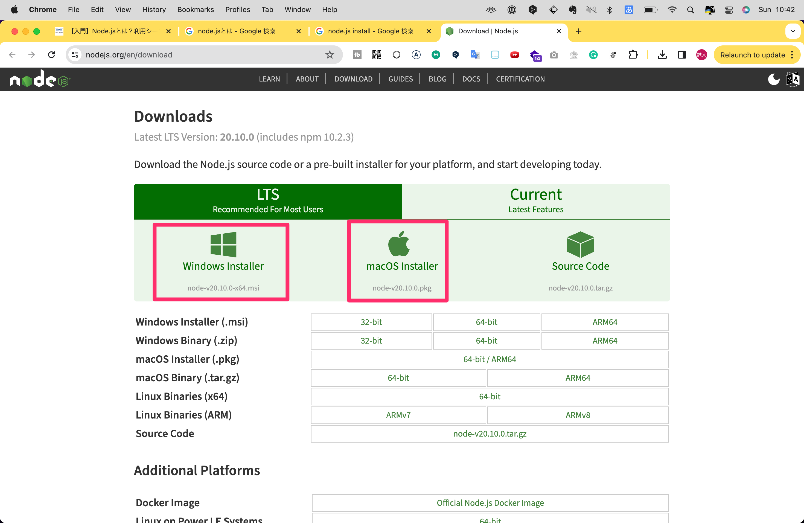
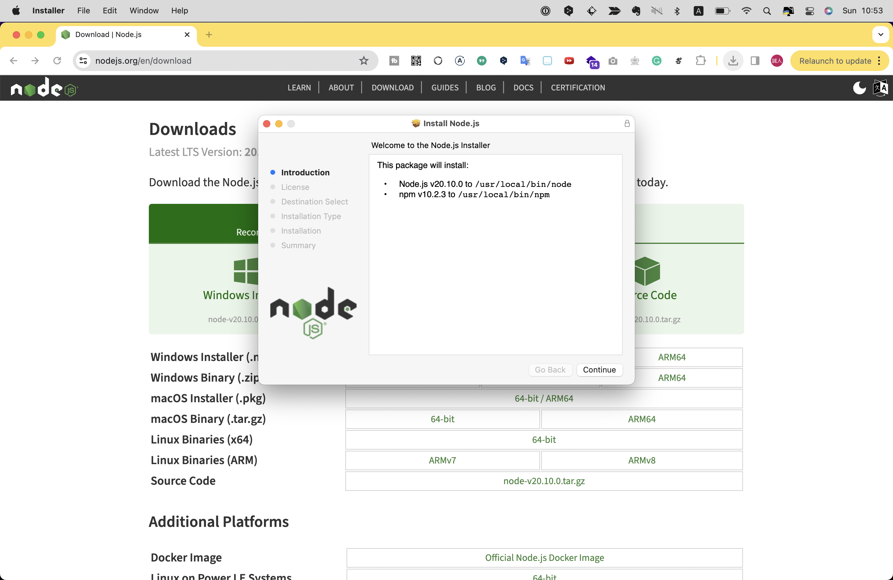
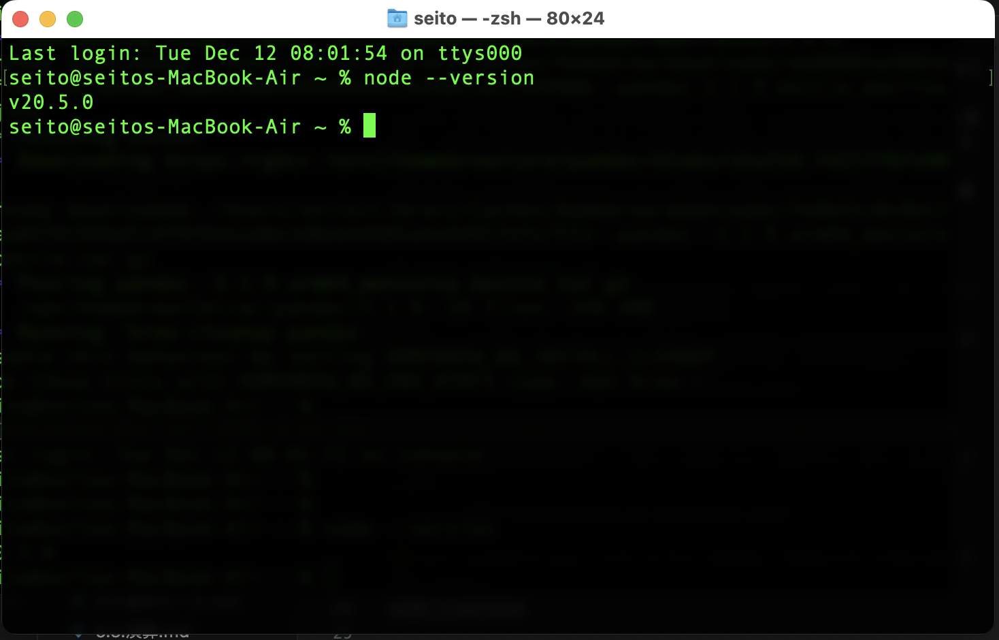

# Node.js
Chapter2でプログラミング言語には大きくクライアントサイドとサーバーサイドで動く言語の2種類があると説明しました。
例えばJavaScriptはクライアントサイドで動く言語で、PHPはサーバーサイドで動く言語で、PHPでクライアントサイドの処理を書くことはできません。
しかし、JavaScriptはある方法を使うとクライアントサイド、サーバーサイド両方で使うことができるようになるのです！
その方法というのが、 __Node.js__ というプログラムを使うことです。
Node.jsとは、JavaScriptをサーバーサイドで実行することを可能にするためのツールで、開発の現場でも一般的によく使われています。
Node.jsを使うとJavaScriptで新たに下記のようなことができるようになります。

- サーバーサイドでの処理を実行できる
- 他のサーバーサイド言語のように、コマンドライン上でプログラムを実行できる
- npmが使えるようになる
- TypeScriptやSaSSなどの拡張言語が扱えるようになる

npmに関しては詳しくは後述しますが、便利なパッケージ、ライブラリ、フレームワークなど（Chapter 2.6参照）をインストールできるツールで、これを使うことで開発効率を劇的に上げることができます。
TypeScriptはJavaScriptを元に拡張した言語、SaSSはCSSを元に拡張した言語で、どちらも開発効率をさらに上げるために現在の開発現場ではよく用いられています。
どちらかといえば中級以上のエンジニア職として働く人のための範囲なので本書ではこれらについては割愛しますが、興味がある方は調べてみてください。

## Node.jsのインストール
Node.jsを最も簡単にインストールする方法は、公式サイトからインストーラーをダウンロードしてインストールする方法です。
公式サイトのダウンロードページ（https://nodejs.org/en/download）にアクセスし、OSをに応じたインストーラーをダウンロードしてください。


インストーラーを起動し、指示に従ってインストールを進めてください。
とくに特別な設定は必要なく、「次へ」を押していくだけでインストールが完了します。


インストールが完了したら、コマンドライン（windowsはコマンドプロンプト、macOSはターミナル）を開き、下記のコマンドを入力してみたください。

```
node --version
```

バージョン番号が表示されればインストールは成功です。



これは私のコマンドライン（ターミナル）での実行例です。
私の場合は「v20.5.0」と表示されていますが、バージョン番号はインストールする時期によって異なり、その都度最新のものが表記されるはずなのでこの番号は異なっていても問題ありません。