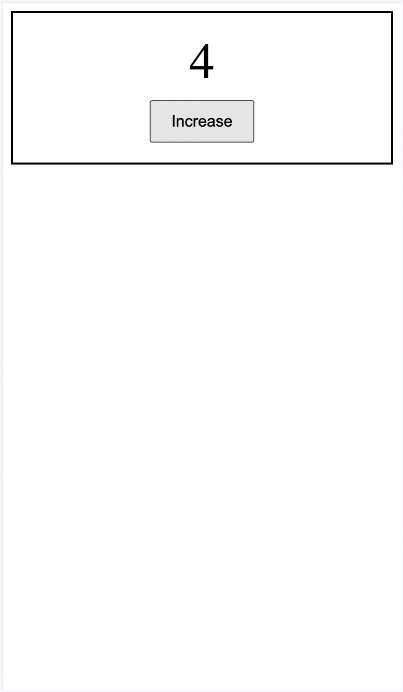

# カウンター・プログラムの概要
まずはWebブラウザ上で動く、シンプルなカウンターのプログラムを作ってみましょう。
このプログラムの仕様は下記のとおりです。

- ボタンを押すと+1ずつカウントアップされ、数字が画面に表示される
- カウンドダウンなどの機能はなし

デモページ： https://seito-developer.github.io/demo-pages/counter

  
(画面のウィンドウサイズをスマートフォンサイズ程度に縮小して表示しています)

1.ディレクトリの用意, 2.HTML, 3.CSS, 4.JSの順でコーディングしていきます！
また、完成ソースコードはXXXにあるので、こちらも参考にしてください。
<!-- TODO -->

## 1.ディレクトリの用意
まずはフォルダ`counter`をつくり、その中にHTMLファイルなどを作っていきます。

```
/counter
├── index.html
├── style.css
└── script.js
```

## 2.HTML
つづいてHTMLをコーディングしましょう！ `index.html` に下記の要素を記述します。

```html
1 <!DOCTYPE html>
2 <html lang="en">
3 <head>
4     <meta charset="UTF-8">
5     <meta name="viewport" content="width=device-width, initial-scale=1.0">
6     <title>Simple Counter</title>
7     <link rel="stylesheet" type="text/css" href="./style.css">
8 </head>
9 <body>
10     <div class="counter">
11         <div class="counter-number" id="js-counter">0</div>
12         <button type="button" class="button" id="js-buttton">Increase</button>
13     </div>
14     <script src="./script.js"></script>
15 </body>
16 </html>
```

### 雛形とファイルの読み込み（全体）
雛形のHTMLスニペットはCursorで`html:5`と入力すると展開されますので、それを使いましょう。（Chapter 3.3参照）

6行目、`<title>`タグの中身のテキストを`Simple Counter`に変更します。
7行目、`<link>`タグでCSSを読み込みます。読み込むファイルがCSSなので、それに合わせて`rel`属性は`stylesheet`,`type`属性は`text/css`とします。href属性にCSSファイルまでのパスを指定しますが、このときCursorの補完機能を使うと便利です。（Chapter 3.3参照）
同様に、14行目では`<script>`タグで`src`属性を設定の上、JSファイルを読み込みます。

---

【コラム】
JSファイルはHTMLファイルの`</body>`タグの直前に読み込むのが一般的です。
理由を簡単に説明すると、ブラウザがJSを読み込み始めると、その間はHTMLファイルの読み込みが止まるので画面が真っ白になってしまい、ユーザーにページの読み込みが遅いと感じさせてしまいます。
またHTMLの方がJSよりも単純でブラウザにとって処理が楽なため、先にHTMLファイルの読み込みを完了させてからJSファイルを読み込むことで、より高速にページを表示することができます。

---

###  カウンターとボタンの設置（10 ~ 13行目）
10 ~ 13行目では、カウンターの数字とボタンを配置します。

まずは`<div>`タグで`counter`というクラス名を持つ大枠の要素を作成し、その中に数字を表示させる要素として`<div>`タグで`counter-number`というクラス名を持つ要素を作成します。
その下にボタンを配置するために`<button>`タグで`button`というクラス名を持つ要素を作成し、ユーザーがクリックできるよう`type`属性は`button`とします。

またこの後、JSで各種操作を行うために`id`属性を設定します。
ボタンがクリックされたときのクリックイベントを取得するよう、ボタン要素のidに`js-buttton`、カウンターの数字を表示する要素のidに`js-counter`という名前をつけます。

```html
10 <div class="counter">
11     <div class="counter-number" id="js-counter">0</div>
12     <button type="button" class="button" id="js-buttton">Increase</button>
13 </div>
```

---

【コラム】
id属性はHTML内で一意である必要がありますが、このルールのおかげでJS実行時にはクラスやタグよりも高速に処理することが出来ます。idであれば同じ名前の要素はそのHTML内に1つしか存在しないことが確定しているため、ブラウザはその要素を1つ見つけてさえしまえばそれ以上探すのに時間をかける必要がないからです。
そのため、JSで要素を操作する際はなるべくid属性を使うとよいでしょう！

---

---

【コラム】
`js-counter`, `js-buttton`という名前に違和感を感じたでしょうか？
Chapter 5.11ではJSにおける`$`というプレフィックスについて説明しましたが、クラス名の`js-`プレフィックスは、その要素がJSで操作する対象であることを示すためによく使われます。

---

## 3.CSS
つづいてCSSをコーディングしましょう！ `style.css` に下記の要素を記述します。

```css
1 .counter {
2     text-align: center;
3     padding: 20px;
4     border: 2px solid #000;
5 }
6 
7 .counter-number {
8     font-size: 50px;
9     margin-bottom: 10px;
10 }
11 
12 .button {
13     font-size: 16px;
14     padding: 10px 20px;
15 }
```

### 全体
それぞれのプロパティの意味は下記のとおりです。

- `text-align`: テキストの配置を指定する（centerは中央揃え）
- `padding`: 要素の内側の余白を指定する
- `border`: 要素の枠線を指定する
- `font-size`: フォントサイズを指定する
- `margin-bottom`: 要素の外側かつ下側の余白を指定する

なおpaddingとborderにはショートハンドで値を指定しています。(3.6 Chapter参照)
`padding: 20px;`は上下左右すべてに20px、`padding: 10px 20px;`は上下に10px, 左右に20pxを指定するという意味です。
`border: 2px solid #000;`は`border-width: 2px;`, `border-style: solid;`, `border-color: #000;`をまとめて指定しています。

CSSでの色の指定は複数方法がありますが、ここではカラーコードで指定しています。
カラーコードとは、16進数で表す色のコードのことで、例えば`#000`は黒色、`#fff`は白色を表します。
正確には`#000`は`#000000`、`#fff`は`#ffffff`の省略形ですが、6桁のコードのうち、3桁が同じ数字の場合は省略することができます。

## 4.JS
さいごにJSをコーディングしましょう！ `script.js` に下記の要素を記述します。

```js
1 const $counter = document.getElementById('js-counter');
2 
3 document.getElementById('js-buttton').addEventListener('click', () => {
4     let currentCount = parseInt($counter.textContent);
5     $counter.textContent = currentCount + 1;
6 });
```

### カウンター要素の取得（1行目）
1行目では、HTMLのカウンターの数字を表示する要素を取得しています。
documentオブジェクト（すなわちHTML全体を表すオブジェクト）の`getElementById`メソッドを使うことで、HTML内の要素をIDで取得することができます。
HTMLではすでに`id="js-counter"`という属性を設定しているので、`getElementById`メソッドの引数に`js-counter`を指定することで、HTMLのカウンターの数字を表示する要素を取得することができます。
また、取得したHTML要素を変数`$counter`に代入しています。

### クリックイベント時の処理（3 ~ 6行目）
3 ~ 6行目では、ボタンがクリックされたときの処理を記述しています。
`addEventListener`メソッドは、要素に対し第一引数にイベント名、第二引数にイベントが発生したときに実行する関数を指定することで、イベントが発生したときの処理を記述することができます。

```js
要素.addEventListener('イベント名', 関数)
```

今回のケースではボタン要素(js-button)に対し、クリックイベントが発生したときに第二引数に指定した無名関数を実行しています。
無名関数とは、関数名を指定せずに関数を定義する方法です。引数を持たず、他の場所で繰り返し使用することを想定していないようなシンプルな関数を定義する場合に有効です。

```js
() => {
    let currentCount = parseInt($counter.textContent);
    $counter.textContent = currentCount + 1;
}
```

4行目、変数`currentCount`には、カウンターの数字を格納しています。
`.textContent`は、HTMLの要素のテキストを取得したり書き換えることができるプロパティですが、これを`$counter`に適応し`$counter.textContent`とすることで、ボタンがクリックされたときの数字を取得することができます。
`parseInt()`は標準組み込み関数で、文字列を整数に変換する関数です。HTML上に表示される数字は文字列として扱われているため、演算するにはこれを使ってまず数値に変換する必要があります。

5行目では、現在の数字（`currentCount`）に1を足した値を、`$counter.textContent`に代入し直しています。

つまりまとめると、ボタンがクリックされたときにカウンターの数字を取得し、それに1を足した値を再度カウンターの数字に代入するという処理を行っています。

## 5.動作確認
それでは実際に動作させてみましょう！
CursorでGo Liveを起動させ、ブラウザで表示されたページを確認してみてください。