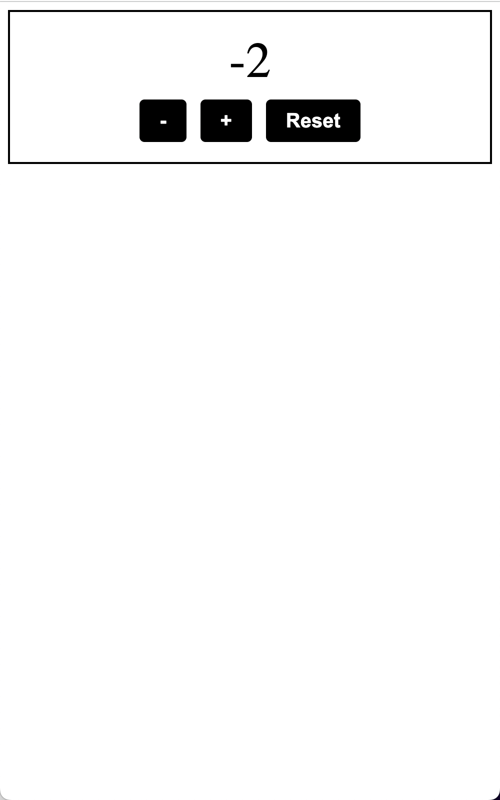
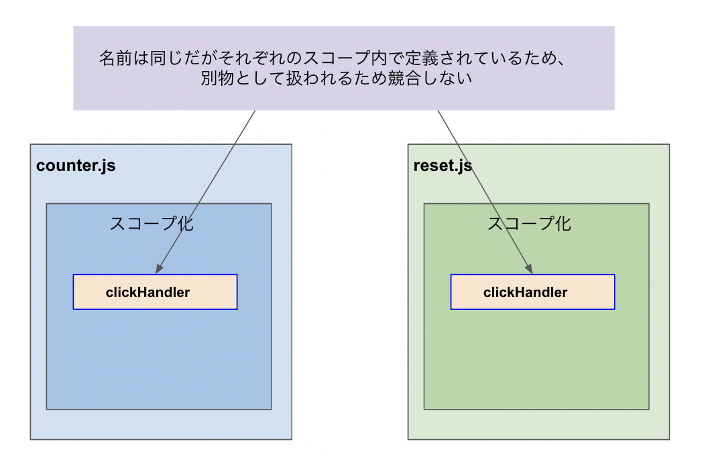

# カウンター・プログラム2の概要
さて、前回のカウンター・プログラムではHTML,CSS,JSを組み合わせてアプリケーションを実装する方法を学びました。
しかしながら、あのプログラムは皆さんにまず仕組みを理解いただくために、あえて仕様を最低限に絞ったり一部手を抜いた書き方をしました。
そこでカウンター・プログラム2では、前回のものを改良し、仕様を充実させたり、見た目を若干装飾したり、よりきれいなコードを書くようにします。

このプログラムの仕様は下記のとおりです。

- Increaseボタンを押すと+1ずつカウントアップされ、数字が画面に表示される
- Decreaseボタンを押すと-1ずつカウントダウンされ、数字が画面に表示される
- Resetボタンを押すと数字が0になる

デモページ： https://seito-developer.github.io/demo-pages/counter2

  
(画面のウィンドウサイズをスマートフォンサイズ程度に縮小して表示しています)

1.ディレクトリの用意, 2.HTML, 3.CSS, 4.JSの順でコーディングしていきます！
また、完成ソースコードはXXXにあるので、こちらも参考にしてください。
<!-- TODO -->

## 1.ディレクトリの用意
まずはフォルダ`counter2`をつくり、その中にHTMLファイルなどを作っていきます。

```
/counter
├── index.html
├── style.css
├── counter.js
└── reset.js
```

## 2.HTML
つづいてHTMLをコーディングしましょう！ `index.html` に下記の要素を記述します。
先述のカウンタープログラムとほぼ同じですが、3か所異なる部分があるので解説していきます。

```html
1 <!DOCTYPE html>
2 <html lang="en">
3 <head>
4     <meta charset="UTF-8">
5     <meta name="viewport" content="width=device-width, initial-scale=1.0">
6     <title>Simple Counter2</title>
7     <link rel="stylesheet" type="text/css" href="./style.css">
8 </head>
9 <body>
10     <div class="counter">
11         <div class="counter-number" id="js-counter">0</div>
12         <button type="button" class="button js-buttton">-</button>
13         <button type="button" class="button js-buttton">+</button>
14         <button type="button" class="button" id="js-reset-buttton">Reset</button>
15     </div>
16     <script src="./counter.js"></script>
17     <script src="./reset.js"></script>
18 </body>
19 </html>
```

### +, - のボタンタグ（12~13行目）
先述のカウンタープログラムでは、カウントアップするボタンしかありませんでしたが、今回はカウントダウンするボタンも追加して2つの`<button>`タグを設置し、テキストも`+`と`-`に変更しています。
またボタン要素が単一でなくなったため、idではなくクラスで`js-buttton`を設定するよう変更しました。

```html
12 <button type="button" class="button js-buttton">-</button>
13 <button type="button" class="button js-buttton">+</button>
```

### リセットのボタンタグ（14行目）
さらに、リセット機能のためのボタンを追加します。
こちらは1つしかない要素なのでidで`js-reset-buttton`を指定します。

```html
14 <button type="button" class="button" id="js-reset-buttton">Reset</button>
```

### JSファイルの読み込み（16~17行目）
最後にJSファイルを読み込みます。
前回はボタンを押したらカウントアップするという、単純な処理1つだけでしたので1ファイルに記述しましたが、今回は仕様が増えたので2つのファイルを用意しました。
このあと、`counter.js`にはカウントアップ・ダウン機能に関する処理、`reset.js`にはリセット機能に関する処理をコーディングします。

```html
16 <script src="./counter.js"></script>
17 <script src="./reset.js"></script>
```

## 3.CSS
つづいてCSSをコーディングしましょう！ `style.css` に下記の要素を記述します。
`.counter`と`.counter-number`は変わらず、`.button`に変更が加わっています。

```css
1  .counter {
2      text-align: center;
3      padding: 20px;
4      border: 2px solid #000;
5  }
6  
7  .counter-number {
8      font-size: 50px;
9      margin-bottom: 10px;
10  }
11  
12 .button {
13     font-size: 20px;
14     padding: 10px 20px;
15     border: 0;
16     background-color: #000;
17     color: #fff;
18     font-weight: bold;
19     cursor: pointer;
20     border-radius: 5px;
21     margin: 0 5px;
22 }
23
24 .button:hover {
25     opacity: 0.8;
26     transition: opacity .25s;
27 }
```

### 全体
追加されたプロパティの意味は下記のとおりです。

- `border`: 要素の枠線を指定するが、0の場合は枠線が表示されない
- `background-color`: 要素の背景色を指定する
- `color`: 要素の文字色を指定する
- `font-weight`: 要素の文字の太さを指定する
- `cursor`: 要素にカーソルを合わせたときのカーソルの形を指定する。（`pointer`は指マーク）
- `border-radius`: 要素の角を丸くする
- `opacity`: 要素の透明度を指定する。初期値は1で、0に近づくほど透明になる。
- `transition`: 任意の要素の変化を滑らかにする。

### ボタンに関するCSS（12 ~ 27行目）
`.button`には`:hover`という疑似クラスを指定しています。疑似クラスとは、要素が特定の状態にあるときにのみ適用されるクラスのことですが、この場合はマウスを要素に乗せたときにのみ適用されるクラスです。`.button:hover`というように、疑似クラスはコロンをつけて指定します。

ここではマウスを要素に乗せたときに、`opacity`を0.8に変更し、`transition`を0.25秒かけて変化させるように指定しているため、なめらかに少し透明になるアニメーションが発生します。

`transition`もショートハンドがあり、`transition: opacity .25s;`は`transition-property: opacity;`, `transition-duration: .25s;`をまとめて指定しています。`s`は秒を表す単位で、`.25s`は0.25秒を表します。

## 4.JS (counter.js)
つづいてJSをコーディングしましょう！まずは`counter.js` に下記の要素を記述します。
ベースは先述のカウンタープログラムと同じですが、仕様が変わったことで加えた部分と、またよりよいコードを書くために工夫を加えた部分があります。

```js
1 (() => {
2     const $counter = document.getElementById('js-counter');
3 
4     const clickHandler = (e) => {
5         const $targetButton = e.currentTarget;
6         let currentCount = parseInt($counter.textContent);
7        if($targetButton.textContent === "+"){
8             $counter.textContent = currentCount + 1;
9         } else {
10             $counter.textContent = currentCount - 1;
11         }
12     }
13 
14     for (let index = 0; index < document.getElementsByClassName('js-buttton').length; index++) {
15        document.getElementsByClassName('js-buttton')[index].addEventListener('click', (e) = clickHandler(e))
16     }
17 })();
```

今回は処理が複雑化したので、処理順にそって説明するために下部の記述から順に解説します。

### クラス要素に対してイベントを設定（14 ~ 16行目）
前回のカウンター・プログラムでは、ボタンがカウントアップするための要素1つだけだったので、1つのボタン(id="js-buttton")だけにクリックイベントを指定するシンプルな記述でした。
今回はボタンが2つありクラスを指定しているため、2つボタンすべてのクリックイベントで関数を指定する必要があります。

```js
14 for (let index = 0; index < document.getElementsByClassName('js-buttton').length; index++) {
15      document.getElementsByClassName('js-buttton')[index].addEventListener('click', (e) = clickHandler(e))
16 }
```

まずクラス名でHTML要素を取得するには`getElementsByClassName`を使用します。
`getElementsByClassName`で取得したHTMLは複数扱いになるため、IDとは異なり配列として取得されます。
試しにconsole.logで取得した値を出力してみるとよりわかりやすいでしょう。下記のように表示されるはずです。

```js
const $buttons = document.getElementsByClassName('js-buttton');
console.log($buttons);
```
```js
// `$buttons`の中身
// HTMLCollection(2)[button.button.js-button, button.button.js-button]
```

配列扱いなので、ボタン要素それぞれを指定するには後ろに`[番号]`を使い、配列の呼び出し方を指定する必要があります。
（番号は0から数えることを思い出してください！）

```js
// 0番目のjs-butttonボタン
document.getElementsByClassName('js-buttton')[0].addEventListener('click', (e) = clickHandler(e))

// 1番目のjs-butttonボタン
document.getElementsByClassName('js-buttton')[1].addEventListener('click', (e) = clickHandler(e))
```

ただしこれだとほぼ同じような記述が続いてしまい煩雑なので、ループ文を使ってまとめます。

```js
14 for (let index = 0; index < document.getElementsByClassName('js-buttton').length; index++) {
15      document.getElementsByClassName('js-buttton')[index].addEventListener('click', (e) = clickHandler(e))
16 }
```

また、`addEventListener`での`clickHandler`の指定の仕方が前のカウンター・プログラムと異なることに注目してください。

Before
```js
.addEventListener('click', clickHandler)
```

After
```js
.addEventListener('click', (e) = clickHandler(e))
```

前回と違い、今回`clickHandler`は引数を1つ持てるようにしており、`addEventListener`から`e`という引数を渡しています。
これはクリック時に発生したクリックイベントそのもののオブジェクトを意味しており、それを`clickHandler`関数の引数に渡しています。
イベントオブジェクトのオブジェクトを引数で渡す場合には慣例で`e`や`event`などといった名前をつけることが多いです。

ところで、クリックイベントそのもののオブジェクトとはなんでしょう？実際に`console.log`で確認してみると、下記のような情報が取得できるはずです。

```js
const clickHandler = (e) => console.log(e)

for (let index = 0; index < document.getElementsByClassName('js-buttton').length; index++) {
    document.getElementsByClassName('js-buttton')[index].addEventListener('click', (e) => clickHandler(e))
}
```

```js
// eの中身
// PointerEvent {
    // isTrusted: true
    // altKey: false
    // ... 一部省略
    // clientX: 112
    // clientY: 115
    // ... 一部省略
// }
```

このようにクリックイベントはたくさんの情報を持っています。
たとえばプロパティ`clientX`と`clientY`は、クリックされた位置（Webページ上でのX座標・Y座標位置）の値を返します。（あまり使う機会はないですが）

重要なのは、この中にある`currentTarget`というプロパティです。これはクリックされた単独のHTML要素を返します。
つまり今回のケースでいうと、ボタン要素は2つありますが、クリックされたボタンHTML要素のみを返します。これによって、要素が複数あってもクリックイベント時にクリックされた要素だけをピンポイントで指定し、その要素に対しなにか処理を行う...といった操作ができます。

例えば下記のように`console.log`で中身を覗く記述を書いた上で"-"ボタンをクリックしてみると、コンソールで"-"ボタン要素が取得できるはずです。

```js
const clickHandler = (e) => console.log(e.currentTarget);
for (let index = 0; index < document.getElementsByClassName('js-buttton').length; index++) {
    document.getElementsByClassName('js-buttton')[index].addEventListener('click', (e) => clickHandler(e))
}
```
```js
// e.currentTargetの中身
// <button type="button" class="button js-buttton">-</button>
```

---

【コラム】
`console.log`はデバッグだけでなく、学習する上でも強力なメソッドです。
これを活用することで、都度値の中身が参照できるので、プログラムの構造を知ったり、オブジェクトがどのようなプロパティ・メソッドを持っているかをチェックすることができます。
ぜひ積極的に使っていきましょう！

---

### クリックイベント時の処理（4 ~ 12行目）
今回は記述が比較的長いので無名関数ではなく、`clickHandler`という名前で関数を定義します。
先の説明であったように、クリックイベントを渡せるよう引数を1つもたせ、`e.currentTarget`を取得します。
その後、条件文（if/else）を指定し、ボタン要素が持つテキストを見て、"+"ならカウントを+1し、"-"ならカウントを-2する処理を記述します。

```js
4 const clickHandler = (e) => {
5     const $targetButton = e.currentTarget;
6     let currentCount = parseInt($counter.textContent);
7    if($targetButton.textContent === "+"){
8         $counter.textContent = currentCount + 1;
9     } else {
10         $counter.textContent = currentCount - 1;
11     }
12 }
```

### カウンター要素の取得（2行目）
この部分は特に変更ありません。

```js
2 const $counter = document.getElementById('js-counter');
```

### スコープ化（1~17行目）
ここでは前回のカウンター・プログラムとは異なり、コード全体をスコープ化してます。
どういうことか？まず、1,17行目に注目してください。

```js
1 (() => {
    ...
17 })();
```

これは即時実行関数と呼ばれる関数の書き方で、関数全体を`()`で囲み、後尾にさらに`()`をつけることで実現できます。（英語表記でIIFE = Immediately Invoked Function Expression とも呼ぶ）
関数は通常、定義した後に呼び出さないと実行されませんが，即時実行関数は定義されるとすぐに実行される関数です。

通常の関数
```js
const foo = () => { ... } //この時点では実行されない
foo(); //呼び出すことで実行される
```

即時実行関数
```js
(() => { //定義してすぐに実行される
    ...
})();
```

なぜこのような関数式で全体をわざわざ囲っているかというと、スコープをつくるためです。
スコープとは、変数や関数が有効な範囲のことです。スコープを使うことで、変数や関数がスコープの外で意図せず使用されることを防ぐことができます。（Chapter 5.8参照）

前のカウンター・プログラムは1ファイルしかなかったので変数や関数名が衝突する心配はありませんでしたが、今回は2ファイルあり記述も増えました。
後述しますが、実際`counter.js`にも`reset.js`にも`clickHandler`という同じ名前の関数が存在しています。
スコープ化することで、それぞれの変数名や関数名をスコープ内に閉じ込めているため、これら`clickHandler`は競合することなくそれぞれのファイルで使うことが出来ます。
（異なるファイルで同じ変数や関数を使いたい場合はどうすればいいの？と思われる方がいるかもしれません。鋭いですね！その方法についてはChapter 7で解説します。）



また通常の関数の書き方だと全体を囲んだ後に呼び出す記述を別途書く必要がありスマートでないため、即時実行関数にしています。

## 5.JS (reset.js)
さいごに、もう一つのJSファイルを用いてリセット機能を実装しましょう！`reset.js` に下記の要素を記述します。

```js
1 (() => {
2     const $counter = document.getElementById('js-counter');
3 
4     const clickHandler = () => {
5         $counter.textContent = 0;
6     }
7 
8     document.getElementById('js-reset-buttton').addEventListener('click', clickHandler)
9 })();
```

この命令はとてもシンプルで、ボタン要素`js-reset-buttton`がクリックされたらカウンターのテキストの値を0にする処理を行っているだけです。
その他のクリックイベントやスコープなどの記述は`counter.js`同様です。

## 6.動作確認
それでは実際に動作させてみましょう！
CursorでGo Liveを起動させ、ブラウザで表示されたページを確認してみてください。