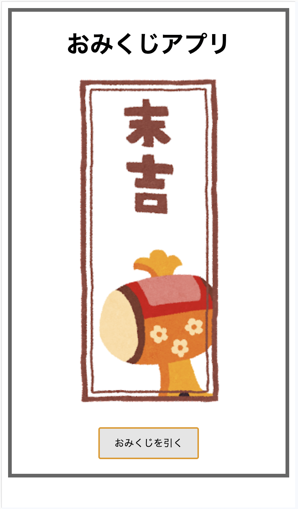

# おみくじ・アプリの概要
続いてWebブラウザ上で動く、簡易的なおみくじのアプリを作ってみましょう。
おみくじアプリの仕様は下記のとおりです。

- ボタンを押すとおみくじ画像のスロットが回る
- 3秒間回った後、大凶〜大吉までの7つの中からランダムに1つが選ばれ止まる

デモページ：https://seito-developer.github.io/demo-pages/omikuji

  
  
(画面のウィンドウサイズをスマートフォンサイズ程度に縮小して表示しています)

前のタイマー同様、1.ディレクトリの用意と画像の用意, 2.HTML, 3.CSS, 4.JSの順でコーディングしていきます！
また、完成ソースコードはXXXにあるので、こちらも参考にしてください。
<!-- TODO -->

## 1.ディレクトリの用意と画像の用意
まずはフォルダ`omikuji`をつくり、その中にHTMLファイルや画像を保存するためのフォルダを作っていきます。

```
/omikuji
├── index.html
├── style.css
├── script.js
└── /images
```

つづいて画像を用意します。
デモではフリー素材の画像サイト『いらすとや』さん（https://www.irasutoya.com/）の画像を使用させていただいています。
こちらの画像を利用いただくか、ご自身で任意の画像をご用意ください。
なおこうした素材サイトが提供されている画像を使う際は、Webサイトに記載されている利用規約に即した使い方を心がけましょう。
（『いらすとや』さんの規約は比較的制限が少なめで、規約さえ守れば商用利用でも無料で利用可とされていますが、そのままの二次配布はNG、1つの制作物にたいして使用できるのは20点までなどの規約があります）

画像は初期表示のおみくじ、およびおみくじの結果7パターンを含む8つの画像を用意し、下記のように名前をつけました。

```
/images
├── omikuji.png
├── omikuji-1.png
├── omikuji-2.png
├── omikuji-3.png
├── omikuji-4.png
├── omikuji-5.png
├── omikuji-6.png
└── omikuji-7.png
```

## 2.HTML
つづいてHTMLをコーディングしましょう！ `index.html` に下記の要素を記述します。

```html
1 <!DOCTYPE html>
2 <html lang="ja">
3 <head>
4     <meta charset="UTF-8">
5     <meta name="viewport" content="width=device-width, initial-scale=1.0">
6     <title>おみくじアプリ</title>
7     <link rel="stylesheet" type="text/css" href="./style.css">
8 </head>
9 <body>
10     <div class="omikuji">
11         <h1 class="omikuji-heaadline">おみくじアプリ</h1>
12         <div class="omikuji-result">
13             
14         </div>
15         <button type="button" class="omikuji-button" id="js-button">おみくじを引く</button>
16     </div>
17     <script src="./script.js"></script>
18 </body>
19 </html>
```

これまで通りの雛形、CSSやJSを読み込む記述の説明は割愛します。ポイントとなるのは10 ~ 16行目です。

### おみくじ画像とボタン要素の設置（10~16行目）
10, 16行目ではおみくじの大枠となる要素を`<div>`でコーディングし、クラスに`omikuji`を付与します。

```html
<div class="omikuji">
    ...
</div>
```

11行目では見出し1の要素を`<h1>`でコーディングし、クラスに`omikuji-headline`を付与します。

```html
<h1 class="omikuji-heaadline">おみくじアプリ</h1>
```

12 ~ 14行目ではおみくじの結果を表示する要素を`<div>`でコーディングし、クラスに`omikuji-result`を付与します。
また、画像要素を``でコーディングし、`id`に`js-result`、`src`属性には初期表示のおみくじ画像のパスを指定します。

```html
<div class="omikuji-result">
    
</div>
```

15行目ではおみくじを引くボタンを`<button>`でコーディングし、クラスに`omikuji-button`、`id`に`js-button`を付与します。

```html
<button type="button" class="omikuji-button" id="js-button">おみくじを引く</button>
```

## 3.CSS
つづいてCSSをコーディングしましょう！ `style.css` に下記の要素を記述します。
今回新たに登場するプロパティや値はありません。

```css
1 .omikuji {
2     text-align: center;
3     padding: 20px;
4     border: 5px solid #666;
5 }
6 .omikuji-result {
7     font-size: 24px;
8     margin-bottom: 20px;
9 }
10 .omikuji-heaadline {
11     margin: 0 0 20px;
12 }
13 .omikuji-button {
14     padding: 10px 20px;
15     cursor: pointer;
16 }
```

## 4.JS
さいごにJSをコーディングしましょう！ `script.js` に下記の要素を記述します。

```js
1 (() => {
2     const DURATION = 3000;
3     const SLOT_TIME = 100;
4     const omikujiArray = [
5         './images/omikuji-7.png',
6         './images/omikuji-6.png',
7         './images/omikuji-5.png',
8         './images/omikuji-4.png',
9         './images/omikuji-3.png',
10         './images/omikuji-2.png',
11         './images/omikuji-1.png'
12     ];
13     const $result = document.getElementById('js-result');
14 
15     const getRandomNumber = (argMin, argMax) => {
16         const min = Math.ceil(argMin);
17         const max = Math.floor(argMax);
18         return Math.floor(Math.random() * (max - min) + min);
19     }
20 
21     const playOmikuji = () => {
22         const slotAnimationTimer = setInterval(() => {
23             const randomKey = getRandomNumber(0,6);
24             $result.setAttribute("src", omikujiArray[randomKey]);
25         }, SLOT_TIME);
26 
27         setTimeout(() => {
28             clearInterval(slotAnimationTimer);
29             const randomKey = getRandomNumber(0,6);
30             $result.setAttribute("src", omikujiArray[randomKey]);
31         }, DURATION);
32     };
33 
34     document.getElementById('js-button').addEventListener('click', playOmikuji);
35 })();
```

このコードでの実行順は下記のとおりです。

### スコープ化（1~35行目)
まず、これまで同様1,35行目では即時関数を用いてスコープを閉じ込めます。

```js
1 (() => {
    ...
35 })();
```

### 2~13行目
2~13行目では各種変数を定義します。変数の意味はそれぞれ下記のとおりです。
- `DURATION`: おみくじのスロットが回る時間の定数を格納
- `SLOT_TIME`: おみくじのスロットが回り前の画像から次の画像に切り替わるまでの間隔時間の定数を格納
- `omikujiArray`: おみくじの結果画像1~7までのパスをまとめた配列を格納
- `$result`: おみくじの結果画像を表示する要素(id`js-result`)を格納

```js
2 const DURATION = 3000;
3 const SLOT_TIME = 100;
4 const omikujiArray = [
5     './images/omikuji-7.png',
6     './images/omikuji-6.png',
7     './images/omikuji-5.png',
8     './images/omikuji-4.png',
9     './images/omikuji-3.png',
10     './images/omikuji-2.png',
11     './images/omikuji-1.png'
12 ];
13 const $result = document.getElementById('js-result');
```

### ランダムにおみくじ画像を選ぶ処理（15~19行目）
15~19行目では、引数に指定した最小値から最大値までの間でランダムな整数を返す関数`getRandomNumber`を定義します。
ここでは`Math.random()`という乱数を返すメソッドを使用しました。（MathはChapter5.10で登場した標準組み込みオブジェクトですが、これにはさまざまなプロパティやメソッドが含まれており、それらを使うことで複雑な計算処理を簡単に行うことができます。）

`Math.random()`はその性質から、「ランダムに何かをする」という処理によく使われます。
ただし、`Math.random()`は0以上1未満のランダムな細かい数値(0.29487189905210776 など)しか返ってこないため、範囲を指定しかつ整数を返すようにするには少し工夫が必要です。
この関数では引数2つを受け取り、それぞれ最小値と最大値として、`Math.random()`の返り値を最小値以上最大値未満の範囲に収めるようにしています。
また、`Math.floor()`は引数に指定した数値の小数点以下を切り捨てた整数に変換する組み込み関数です。これを利用して、`Math.random()`の返り値を整数に変換しています。

```js
15 const getRandomNumber = (argMin, argMax) => {
16     const min = Math.ceil(argMin);
17     const max = Math.floor(argMax);
18     return Math.floor(Math.random() * (max - min + 1) + min);
19 }
```

### おみくじをひく処理（21~32行目）
21~32行目ではおみくじを引く処理を行う関数`playOmikuji`を定義します。

```js
21 const playOmikuji = () => {
    ...
32 };
```

#### おみくじスロットを回す処理（22~25行目）
この関数では、おみくじのスロットが回るアニメーションを再現するために、`setInterval()`という組み込み関数を使用しています。
`setInterval()`は引数に指定した関数を、第2引数に指定した時間間隔で繰り返し実行する関数です。
ここでは、`setInterval()`の第1引数に無名関数を指定しています。

無名関数の中では先程定義した関数`getRandomNumber`を呼び出し、0~6までのランダムな値を取得しています。
それを用いて配列`omikujiArray`からランダムな画像のパスを取得し、画像要素の`src`属性を書き換える処理を行っています。

```js
22 const slotAnimationTimer = setInterval(() => {
23     const randomKey = getRandomNumber(0,6);
24     $result.setAttribute("src", omikujiArray[randomKey]);
25 }, SLOT_TIME);
```

また第2引数にはSLOT_TIME(=100)を指定していますが、`setInterval`に限らず多くの場合JSのプログラム上の時間指定はミリ秒で行います。今回は100ミリ秒なので、0.1秒ごとに第1引数に指定した関数が実行されます。（すなわち、0.1秒間隔で画像スロットが回ります）

#### おみくじスロットを回す処理（27~31行目）
27~31行目では、`setTimeout()`という組み込み関数を使用しています。これは`setInterval()`の兄弟のようなもので、`setInterval()`が繰り返し処理を実行するのに対し、`setTimeout()`は指定した時間後に1回だけ処理を実行する関数です。

ここでは第1関数にDURATION(=3000ミリ秒)が指定されているので、3秒後に第1引数に指定した関数が実行されます。
第1引数には無名関数が指定されており、3行だけシンプルな命令が書かれています。

```js
28 setTimeout(() => {
29     clearInterval(slotAnimationTimer);
30     const randomKey = getRandomNumber(0,6);
31     $result.setAttribute("src", omikujiArray[randomKey]);
32 }, DURATION);
```

30~31行目は先程と同じく、ランダムなおみくじ画像を取得・設定する処理ですが、29行目の`clearInterval()`に注目してください。
`clearInterval()`は引数に指定した`setInterval()`を停止し、タイマーをリセットさせることができる関数です。
このコードでは、22行目で前もって`slotAnimationTimer`という変数に`setInterval()`を格納しているため、`clearInterval(slotAnimationTimer)`とすることで、おみくじのスロットが回転して3秒後に、スロットを停止させています。

### 34行目
最後に、34行目ではボタン要素("#js-button")のクリックイベントに`playOmikuji`関数を実行するように設定しています。
これにより、おみくじを引くボタンがクリックされたときに`playOmikuji`関数が実行され、スロットが開始されます。

```js
34 document.getElementById('js-button').addEventListener('click', playOmikuji);
```

## 5.動作確認
それでは実際に動作させてみましょう！
CursorでGo Liveを起動させ、ブラウザで表示されたページを確認してみてください。