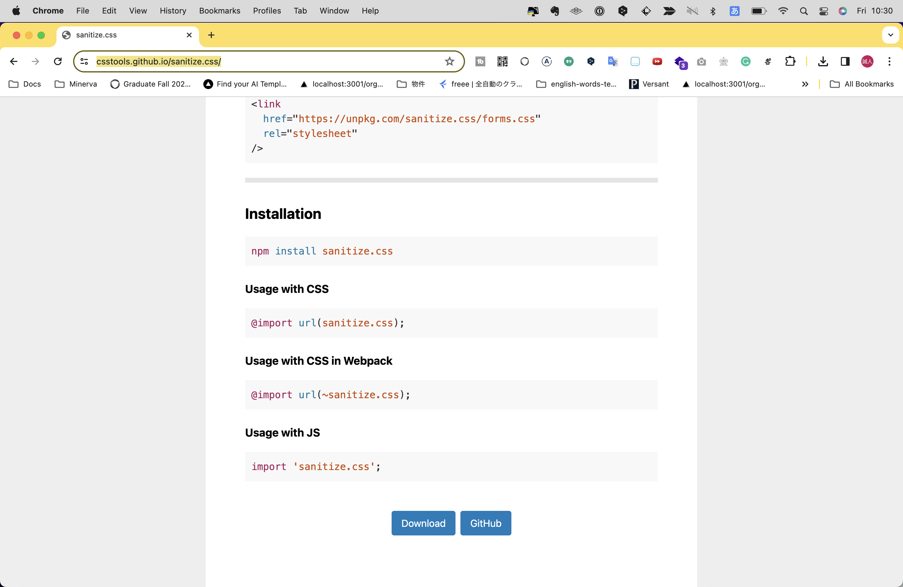

# HTML,CSS, JSの初期化
さて、Viteでのセットアップが完了したので、次回は実際にアプリケーションを開発するためのコードを書いていきましょう！
JSやバックエンドの実装の前に、まずはHTMLとCSSでのコーディングを行なっていきます。
Viteはデフォルトだと不要なダミーのコードが多くあるので、まずはそれらを消してまっさらな状態（初期化）を作ります。

## JSファイルの初期化
まずJSですが、`counter.js`は不要なので削除します。
また`main.js`には下記のような記述がありますが、これらは全部消してください。
```js
import './style.css'
import javascriptLogo from './javascript.svg'
import viteLogo from '/vite.svg'
import { setupCounter } from './counter.js'

document.querySelector('#app').innerHTML = `
... 略
```

## CSSファイルの初期化
続いてCSSを初期化します。
`style.css`には下記のような記述がありますが、これらは全部消してください。

```css
:root {
  font-family: Inter, system-ui, Avenir, Helvetica, Arial, sans-serif;
  line-height: 1.5;
  font-weight: 400;

  color-scheme: light dark;
  color: rgba(255, 255, 255, 0.87);
  background-color: #242424;

  font-synthesis: none;
  ... 略
```

つづいて、Chapter 3.6でご紹介したように、ブラウザ間のデフォルトCSSを初期化するために`sanitize`を導入します。
公式サイトのページ最下部にある「Download」ボタンからCSSファイルをダウンロードしたら、プロジェクト内のディレクトリ直下に保存し、`index.html`の`<head>`内に読み込ませます。

https://csstools.github.io/sanitize.css/



```
./
├── /node_modules
├── /public
├── .gitignore
├── counter.js
├── index.html
├── javascript.svg
├── main.js
├── package-lock.json
├── package.json
├── style.css
└── sanitize.css ← 追加
```

## HTMLファイルの初期化
`index.html`は下記のような記述があります。

```html
1 <!doctype html>
2 <html lang="en">
3   <head>
4     <meta charset="UTF-8" />
5     <link rel="icon" type="image/svg+xml" href="/vite.svg" />
6     <meta name="viewport" content="width=device-width, initial-scale=1.0" />
7     <title>Vite App</title>
8   </head>
9   <body>
10     <div id="app"></div>
11     <script type="module" src="/main.js"></script>
12   </body>
13 </html>
```

このうち、まず`<title>`タグの下にCSSを読み込む記述`<link rel="stylesheet" href="./style.css">`を足してください。
また、`sanitize.css`を読み込む記述`<link rel="stylesheet" href="./sanitize.css">`を加えます。
さいごに、`<div id="app"></div>`は削除し、最終的には下記のようになります。

```html
1 <!doctype html>
2 <html lang="en">
3   <head>
4     <meta charset="UTF-8" />
5     <link rel="icon" type="image/svg+xml" href="/vite.svg" />
6     <meta name="viewport" content="width=device-width, initial-scale=1.0" />
7     <title>Vite App</title>
      <link rel="stylesheet" href="./sanitize.css">  <!-- 追記 -->
8     <link rel="stylesheet" href="./style.css">  <!-- 追記 -->
9   </head>
10   <body>
11     <!-- #appを削除 -->
12     <script type="module" src="/main.js"></script>
13   </body>
14 </html>
```

CSSの読み込み順に注意してください！CSSの適応順を意識し、`sanitize.css`が先、`style.css`が後です。(Chapter 3.5参照)
これでHTML,CSS,JSの準備が整いました。

## Webフォントの導入
デフォルトのフォントだと見た目がチープに見えるので、ここにChapter 3.6で紹介したWebフォントを導入してみたいと思います。
今回は比較的かんたんに利用できる「Google Fonts + 日本語」を使い、おしゃれなサイトでよく使われる「Noto Sans JP」を適応させたいと思います。

まずは「Google Fonts + 日本語」のサイトにアクセスします。
https://googlefonts.github.io/japanese/


ページ下部の方にスクロールすると、「Noto Sans JP」のセクションがありますので、そこに記載のHTMLとCSSをコピーします。


```html
<link href="https://fonts.googleapis.com/css?family=Noto+Sans+JP" rel="stylesheet">
```

```css
.wf-notosansjapanese { font-family: "Noto Sans JP"; }
```

このHTMLは「Noto sans JP」のフォントデータを読み込む記述です。これを`index.html`の`<head>`内で、CSSを読み込む前に追記します。

```html
<head>
  <meta charset="UTF-8" />
  <link rel="icon" type="image/svg+xml" href="/vite.svg" />
  <meta name="viewport" content="width=device-width, initial-scale=1.0" />
  <title>Vite App</title>
  <link href="https://fonts.googleapis.com/css?family=Noto+Sans+JP" rel="stylesheet"> <!-- 追記 -->
  <link rel="stylesheet" href="./sanitize.css">
  <link rel="stylesheet" href="./style.css">
</head>
```

CSSについては、このクラス`.wf-notosansjapanese`は不要ですが、プロパティ値`font-family: "Noto Sans JP";`はこのまま流用できます。
`style.css`を開き、Webページ全体に適応されるよう`body`に対して指定しましょう。
また、万が一フォントデータが読み込めなかったときのバックアップで`Noto Sans JP`のあとにいくつかシステムフォントを追記します。

```css
body {
  font-family: "Noto Sans JP", Helvetica, arial, sans-serif;
}
```

これでWebフォントが適応されました。
試しにテストとして、`index.html`内に適当なテキストを入力してみてください。微妙にフォントが変わっていることが確認できるはずです。

Noto Sans JP適応前


Noto Sans JP適応後
