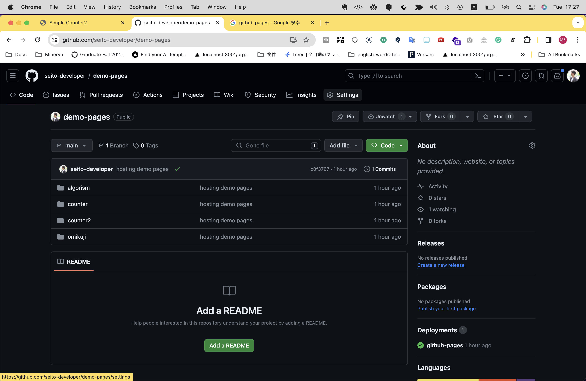
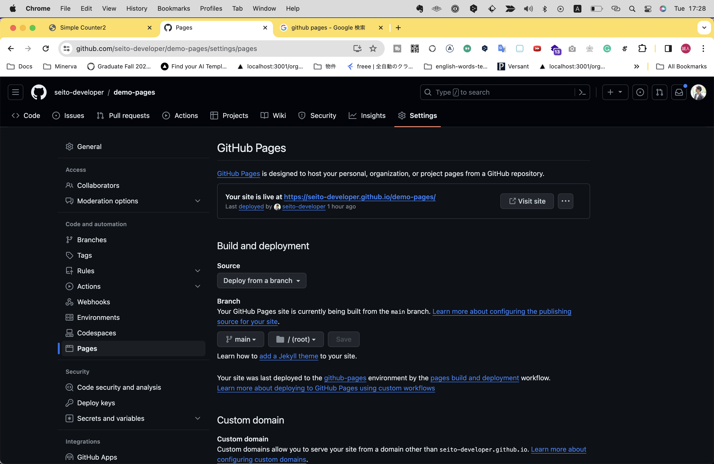
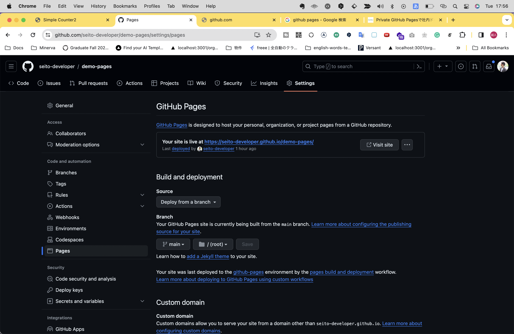

# ホスティング
せっかくWebサイトやWebアプリケーションを作ったなら、ネット上に公開して自分以外のユーザーにもアクセスしてほしいと誰もが思うことでしょう。
そのようにアプリケーションをサーバー上で利用可能な状態にすることを、ホスティングといいます。

ここでは簡易的にできるホスティングの方法を2種類お伝えしましょう。

## GitHubを利用するケース
バックエンドを伴わないHTML,CSS,JSから構成される静的なWebページであれば、GitHubの機能である __GitHub Pages__ を利用することですぐに公開することができます。

GitHub Pagesを利用するには、前提としてGitHubのリポジトリにホスティングしたいWebサイトやアプリケーションのデータが格納されていることが前提となります。

1. 対象のリポジトリページにアクセスし、「Settings」タブを選択

2. 左サイドメニューから「Pages」を選択

3. 「Branch」セクションにあるプルダウンメニューから任意のブランチ（通常は`main`）を選択し、「Save」をクリック（その他の設定はデフォルトのままでOK）

これだけでホスティングが完了します！
ホスティングには数分かかる場合があるので、都度リロードしましょう。
しばらくすると下記のような画面に変わるので、その後「Visit site」ボタンをクリックするとホスティングされたページに遷移することが出来ます。

GitHub Pagesでホスティングすると、URLの構造は`https://ユーザー名.github.io/リポジトリ名/`のようになります。（例： https://seito-developer.github.io/demo-pages/）
このURLを直接アドレスバーに入力しても同様にアクセスできます。

なお、GitHub Pagesでホスティングするには、あらかじめリポジトリの設定がPublicになっている必要があります。
Privacyで設定してしまった場合には、リポジトリのページで「Settings」タブを選択後、ページ下部の「Dangerous Zone」セクション内で、「Change repogitory visibility」から「Change visibility」をクリック→「Change to Public」を選択で変更できます。
ただしこのセクション周りは「Dangerous Zone」とあるように、リポジトリの設定を大きく変えてしまうことができる設定周りなので、取り扱いには注意しましょう！

また、Privateリポジトリのままホスティングすることも可能ですが、その場合は有料プランにアップグレードする必要があります。

## 注意
ディレクトリ構造