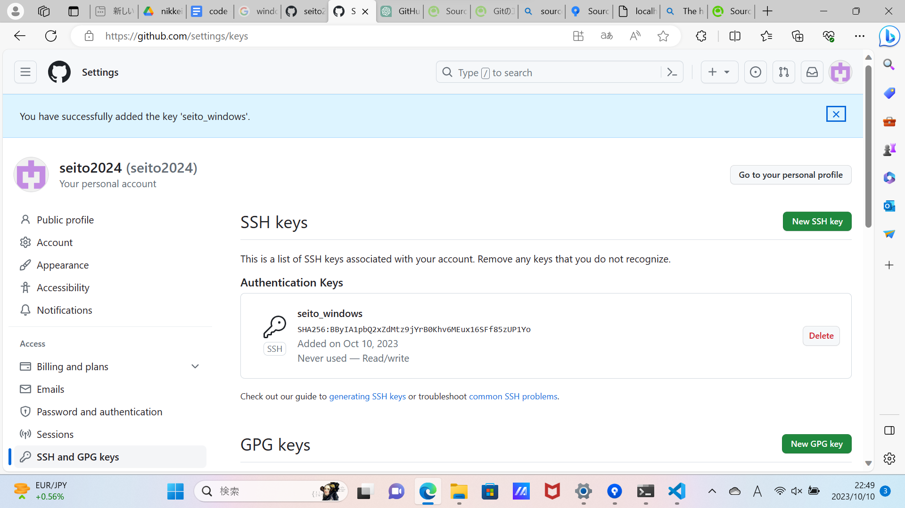

## Git
Gitは、分散型バージョン管理システム（後述）の一つであり、主にソフトウェア開発におけてファイルやデータの変更履歴を管理するためのツールです。無料のオープンソースなので誰でも気軽に利用可能ですが、多くの企業でも採用されているプロフェッショナルなソフトウェアです。
現状多くのシステム開発の現場ではGitを前提にプロジェクトが進むため、これを扱えないとプロジェクトにそもそも関われない機会も珍しくありません。Gitは商業的なチーム開発はもちろん趣味の個人開発でも有用で、わずかな学習時間と引き換えに爆発的な生産性を獲得することができます！

### Gitのメリット
Gitの主要な特徴としては下記のような性質が挙げられます。

バージョン管理することによる生産性のアップ
リスクを分散してバックアップを複数保有できる
GitHubとの連携によるオープンソースへの参画

#### 1.バージョン管理することによる生産性のアップ
バージョン管理とは、ゲームで例えるならセーブポイントのようなものです。例えば皆さんがWeb上で動くオセロゲームの開発を始めたとしましょう。1日40行程度開発を続けて3日が経過したとします。ところが4日目、特定のマスにオセロが置けなくなるというバグに見舞われました！

どこで実装を間違えたのでしょう...昨日書いたコードが原因でしょうか？しかし気づいてなかっただけで、もしかしたら一昨日の時点でこのバグはあったかもしれません。では一昨日のコードでしょうか？それとも...。コードもこれまでに10行ほど書いたので、どこが悪さをしているのかを調べるにも時間がかかります。このようなケースでは、結局一から書き直す方が早いと判断するかもしれません。

しかしGitを使っていれば話は別です！バージョン管理により皆さんは任意のタイミングでセーブポイントを記録しておくことができます。事前に1日目、2日目、3日目でセーブポイントを設けていれば、簡単にそのときの状態に戻すことができます。それぞれのセーブポイントまで戻って状況を確認すると、2日目は動いていたが3日目の時点でバグが確認できました。つまり原因は3日目に書いたコード(101~150 行)のいずれかにあると特定できるわけです。

{Gitがある場合・ない場合の図}
{セーブポイントのイメージ図}

#### 2.リスクを分散してバックアップを複数保有できる
分散型...の話をする上で重要なリポジトリの概念についてまずお話しましょう。リポジトリとは直訳すると貯蔵庫や倉庫といった意味で、データを保管しておく場所のことを指します。そしてGitを使うと、ローカルリポジトリとリモートリポジトリという2つのリポジトリを操作することになります。ローカルはネットワークを通さず直接操作できる環境下のマシン、リモートはネットワークを通して直接操作できない環境下にあるマシンを指します。
要するに、ローカルリポジトリとは自分のPC内に作られるリポジトリのことで、リモートリポジトリとはGitHub（後述）など第三者のサービス上に作られるリポジトリのことを意味します。GItを開始するとこのような2つのリポジトリを作成し、両方にデータを保存することになります。また複数人のチーム間で作業する場合はチームメンバーの数だけローカルリポジトリが増えます。
このようにデータの保管場所を分散されることにより、どこかのリポジトリが何らかの理由で利用できなくなっても他のリポジトリが生きていればバックアップをとることができます。

{リモートリポジトリとローカルリポジトリの図}

#### 3.GitHubとの連携によるオープンソースへの参画
GitHubとはGitHub社が展開するWebプラットフォームで、Gitの技術を中心とした様々な機能を利用することができるサービスです。例えば先に述べたリモートリポジトリはこのGitHubでアカウントを作ることにより作成することができます。
またリモートリポジトリは公開範囲を設定することができるため、自分が実装したプログラムを世界中の開発者に向けて公開したり、他の開発者が公開したプログラムを利用させてもらったり、またそうしたプログラムに参画しコードを書くことで他の開発者コミュニティの一員として貢献することもできます。
こうした取り組みのことをオープンソース活動、それによって無償で公開・提供されているプログラムのことはオープンソースソフトウェア(OSS)と呼ばれており、開発者たちの間では日常的なものとなっています。
前の章で、「エンジニアがプログラミングを行う際、1から100まで自分だけで実装することはない。すでにあるプログラムを使わせてもらったり組み合わせたりしながら行う」とお話しましたが、これはまさしくオープンソースのことを指していました！
ちなみに、GitHub以外にもGitLabやBitbucketなど類似のサービスはありますが、無償プランガあることやシェア率の高さから本稿ではGitHubの利用を推奨します。

### Gitのセットアップ

さて、ではここからは実際にGitを使ってみましょう！
まずは各種セットアップを行い皆さんの環境でGitの操作が行えるようにしていきます。

Gitのインストールにはいくつか方法がありますが、今回はもっとも簡単な方法を紹介します！
それはSourceTreeというデスクトップアプリをインストールする方法です。

```
【コラム】
Gitは実は現役エンジニアでもCLIとGUIどちらを使うか意見がよく割れるため、Gitのチュートリアルを探すとGUIで説明しているリソースとCLIで説明しているリソースと混在しています。
GUIは操作が直感的で視覚的にもわかりやすい利点がある反面、操作できる範囲に若干の制限があります。またSourceTreeの場合は稀に特有のエラーが出ることがあります。
CLIは操作の制限がなく特有のエラーもないですが、とっつきづらさがあります。
どちらも操作できることが望ましいですが、初めのうちはCLIが操作できないことで困る場面は少ないでしょうから、わかりやすさ優先でまずはGUI(SourceTree)でもGitに慣れることをオススメします。
```

### GitHubへのアカウント登録
まずはGitHubへのアカウント登録を行います。
下記のURLにアクセスし、右上の「Sign upボタン」をクリックしてください。その後会員登録を進めます。
https://github.com/

"GitHub公式"

任意のEmail, password, usernameを設定します。
「メールでGitHubからの情報を受け取るか？」はどちらでもかまいませんので、y or n(Yes or Noの意味)のいずれか入力します。

"GitHubへの登録画面1"

ページ下部の「Verify」ボタンをクリックするとセキュリティ認証のために、画像を使った少々分かりづらい問題が出題されますが、頑張ってクリアしてください。
すべての項目が要件を満たされたらページの最下部おボタン「Subit」をクリックします。

"GitHubへの登録画面2"

問題なければ「Create Account」ボタンが表示されるのでこちらもクリックします。

"GitHubへの登録画面3"

すると二段階認証を求められます。
登録したメール宛に二段階認証のメールが届くので、そちらに記載の番号を入力します。

"２段階認証"
"２段階認証のメール"

認証が通ると「Welcome to GitHub」という画面に遷移します。
ここからはアンケートが始まります。答えてもいいですが、ページ最下部の「Skip personalization」をクリックして終わらせてしまっても問題ありません。

"アンケートページ"

下記のようなページに遷移します。これにてアカウント作成は完了です！

```
【コラム】
GitHubにはライトモード／ダークモードといって見た目の配色を2種類に切り替えることができます。
そのため多くの教材ではGitHubのWebページの見た目が違って見えることがありますが、そのような設定があるだけでレイアウトや機能には差はありません。
```

### SourceTreeのセットアップ
次にSourceTreeのセットアップを行いましょう！
SourceTreeとはAtlassian社が開発しているGitの操作が行うためのGUIで、無料で使うことができます。

SourceTreeをインストールするとGitも一緒にインストールされるので、Gitを別途手動でインストールする必要がなくすぐにGitを利用できます。またWindows, macOSどちらでも利用することができます。

まずは公式サイト(https://www.sourcetreeapp.com/)にアクセスし、`Download For Mac OS X(またはWindows)`ボタンをクリックしてください。利用規約やプライバシーポリシーに同意するかどうかのホップアップ画面が表示されたらチェックすると、インストーラーがダウンロードできます。

"公式サイト"
"利用規約やプライバシーポリシーに同意するかどうかのホップアップ画面"

インストーラーのダウンロードが終わったらこれを起動します。この後の流れはWindowsとMacで異なるのでそれぞれ解説します。

#### Windows
次のステップ「Registration」では下記のような画面が表示されます。BitbucketというAtlassian社のサービスアカウントと連携するかどうかを聞かれますが、本書は利用しないので何も選択せずに右下の`スキップ(Skip)`をクリックします。

"Registration"

次のステップ「ツールをインストール」では下記のような画面が表示されますが、Mercurialは使う予定がないのでGitにだけチェックが入っていればOKです。右下の`次へ(Continue)`をクリックします。

"ツールをインストール"

続いて「Preferences」ではユーザー名とメールアドレスを入力し、`次へ(Continue)`をクリックします。
ここで入力する値は任意のものでOKですが、GitHubに登録したアカウント名とメールアドレスで使用したのと同じものを入力します。

"Preferences"

またこのとき、`SSHキーを読み込みますか？`というホップアップ画面が表示されますが、これはあとで行うので今は「いいえ」で閉じてください。

"SSHキーを読み込みますか？"

下記のような画面が表示されたらインストールが完了です。

"インストール完了"

#### macOS
次のステップ「Account」では下記のような画面が表示されます。BitbucketというAtlassian社のサービスアカウントと連携するかどうかを聞かれますが、本書は利用しないので何も選択せずに右下の`次へ(Continue)`をクリックします。

"Account"

続いて「Preferences」ではユーザー名とメールアドレスを入力します。
ここで入力する値は任意のものでOKですが、GitHubに登録したアカウント名とメールアドレスで使用したのと同じものを入力します。

"Preferences"

下記のような画面が表示されたらインストールが完了です。

"インストール完了"

<!-- 名前をSeito Horiguchiに統一 -->


の指示に従い、操作を行うとSourceTreeとGitがインストールされます。
SourceTreeを開くと下記のような画面が映ります。ほとんど何も表示されていないですが、この時点でインストール自体は完了です。

"初期状態のSourceTree画面"

### SSHキーのセットアップとアカウント連携
続いてSSH接続を行うためのSSHキーの作成〜設定を行います。

SSH（Secure Shell）接続とは、インターネット上でデータの送受信を安全に行うための通信方式の1つです。
データの送受信時に暗号化を行い、さらにアクセスできるPCを制限することでより強いセキュリティを担保します。

SSHキーとは鍵と錠前のようなもので、コンピュータ同士がお互いを信頼するための「合言葉」のようなものです。
SSHキーを作成すると、そのキーを持っているコンピューター同士はお互いを信頼し、データの送受信を行うことができます。

SSHキーには「公開鍵」と「秘密鍵」の2つがあり、ここではこれらを作成・設定する手順を解説します。

- 公開キー（公開される鍵）:これは「錠前」のようなもので、他の人に知られても大丈夫な部分です。サーバーにこの公開キーを登録します。
- 秘密キー（秘密にする鍵）:これは「鍵」のようなもので、絶対に他の人に知られてはいけません。自分のパソコンにこの秘密キーを保存します。

#### Windows

コマンドラインを開き、コマンド`ssh-keygen -t rsa -b 4096 -C "{メールアドレス}"`を実行します。

実行例
```
ssh-keygen -t rsa -b 4096 -C "nikkei_bp@gmail.com"
```

その後、ファイルの保存先やパスフレーズ（パスワードのようなもの）の有無など聞かれますが、すべてデフォルトのままでいいのでEnterキーのみを数回押してください。下記のような表示になればSSHキーの作成成功です。

```
C:\Users\seito>ssh-keygen -t rsa -b 4096 -C "nikkei_bp@gmail.com"
Generating public/private rsa key pair.
Enter file in which to save the key (C:\Users\seito/.ssh/id_rsa):
Created directory 'C:\\Users\\seito/.ssh'.
Enter passphrase (empty for no passphrase):
Enter same passphrase again:
Your identification has been saved in C:\Users\seito/.ssh/id_rsa
Your public key has been saved in C:\Users\seito/.ssh/id_rsa.pub
The key fingerprint is:
SHA256:Ngy/YLzKhS7yxdb5ALJgtHhngb/trDw39vecMoI4L7w nikkei_bp@gmail.com
The key's randomart image is:
+---[RSA 4096]----+
|                 |
|   .             |
| .. . .          |
|o .. o +         |
|ooo = + S        |
|.o * B = o       |
|  ..*.B..        |
|. .**==o. +. .   |
| o..EX+ooo ++    |
+----[SHA256]-----+
```

すると`\Users\{user}/.ssh/`ディレクトリに`id_rsa`（秘密鍵）と`id_rsa.pub`（公開鍵）というファイルが作成されます。

"id_rsa（秘密鍵）とid_rsa.pub（公開鍵）"

続いてSourceTreeを開き、メニューから`ツール -> SSHキーを追加`を選択し、先程作成した`id_rsa`を選択します。

"ツール -> SSHキーを追加"

つづいて、SourceTreeのメニューから`ツール -> オプション`を選択し、`認証タブ`を開きます。
アカウント見出しの付近に`追加`という表記があるので、こちらをクリックします。

"オプション -> 認証タブ"

すると`ホスティングアカウントを設定`という画面が表示されるので、下記のように設定します。
- ホスティングサービス：GitHub
- 優先するプロトコル：SSH
- 認証：OAuth

その上で、`OAuthトークンを読み込み`をクリックします。するとWebブラウザでGitHubのログイン画面が立ち上がりますので、ログインしてください。

"GitHubのログイン画面"

`Authorize SourceTreeForWindows`という画面が表示されるので、`Authorize atlassian`ボタンをクリックして認証を許可します。

"Authorize SourceTreeForWindows"

認証が完了するとSourceTreeの画面に戻った際に「認証に成功」のメッセージにチェックが付いた状態になるので、OKをクリックします。

"認証に成功"

認証タブにGitHubアカウントが登録され、下記のように表示されます。「OK」をクリックしてオプション画面を閉じてください。

"アカウント認証が完了"

これで秘密鍵の登録とSourceTreeとGitHubの連携が完了しました！
最後にGitHubに公開鍵を設定します。

さきほど作成した`id_rsa.pub`をVSCodeなどのテキストエディタで開き、中身をコピーします。id_rsa(秘密鍵)ではないので注意してください。
中身は大変長い記述になっているかと思いますが、下記のような形式で`ssh-rsa`から始まり`{設定したメールアドレス}`で終わっています。

``
ssh-rsa ... {メールアドレス}
``

コピーしたらGitHubの`SSH and GPH keys`ページ(https://github.com/settings/keys)にアクセスし、`New SSH key`ボタンをクリックします。

"SSH and GPH keys"

すると`Add new SSH Key`という画面が表示されるので、`Title`に任意の名前を入力し、`Key`に先程コピーした公開鍵を貼り付けます。タイトルにはお使いのマシン名などわかりやすいかつ適当なものを入力すると良いでしょう。

"Add new SSH Key"

最後に`Add SSH key`ボタンをクリックして登録を完了します。

"公開鍵の登録が完了"

#### macOS
ターミナルを開き、コマンド`ssh-keygen -t rsa -b 4096 -C "{メールアドレス}"`を実行します。

実行例
```
ssh-keygen -t rsa -b 4096 -C "nikkei_bp@gmail.com"
```

その後、ファイルの保存先やパスフレーズ（パスワードのようなもの）の有無など聞かれますが、すべてデフォルトのままでいいのでEnterキーのみを数回押してください。下記のような表示になればSSHキーの作成成功です。

```
ssh-keygen -t rsa -b 4096 -C "nikkei_bp@gmail.com"
Generating public/private rsa key pair.
Enter file in which to save the key (/Users/seito/.ssh/id_rsa): 
Created directory '/Users/seito/.ssh'.
Enter passphrase (empty for no passphrase): 
Enter same passphrase again: 
Your identification has been saved in /Users/seito/.ssh/id_rsa
Your public key has been saved in /Users/seito/.ssh/id_rsa.pub
The key fingerprint is:
SHA256:IWjKI5Kf3VxALFC5mup2hsSP0rcVHlIEmjvjTxXrbBQ nikkei_bp@gmail.com
The key's randomart image is:
+---[RSA 4096]----+
|  .oo+o          |
|   oo+.          |
|  o ooE .        |
| o +.. * .       |
|= Bo. * S        |
|.*o* X +         |
|.oB o O          |
|o+.*.o           |
|+.o.o.           |
+----[SHA256]-----+
```

すると`\Users\{user}/.ssh/`ディレクトリに`id_rsa`（秘密鍵）と`id_rsa.pub`（公開鍵）というファイルが作成されます。

"id_rsa（秘密鍵）とid_rsa.pub（公開鍵）"

続いてSourceTreeを開き、メニューから`Preferences -> Accountsタブ`を選択したあと、左下にある`Add...`ボタンをクリックします。

"Accountsタブ"

すると下記のような画面が表示されるので、以下のように設定します。
- Host: GitHub
- Auth Type: OAuth
- Protocol：SSH

"SSHとアカウント設定"
その上で、`Connect Account`をクリックします。するとWebブラウザでGitHubのWebページが立ち上がり、SourceTreeとの連携を許可するかどうかの聞かれますので、Sign inして承認してください。

"SourceTreeとの連携許可を聞かれるGitHubのWebページ"

これを承認すると自動で`Username`にGitHubアカウントのユーザー名が入力されます。`Save`をクリックしてアカウントの追加を完了します。

"Usernameの自動登録"

これで秘密鍵の登録とSourceTreeとGitHubの連携が完了しました！下記のようにユーザーが追加されていることを確認してください。

"ユーザーが追加された状態"

```
【コラム】
リモートリポジトリのURLにはSSHのほか、HTTPSというものが選べるようになっています。
こちらは接続できるマシンの制限をかけない分SSHよりも設定が簡単ですが、2021年以降GitHubではHTTPS接続だと一部の機能制限がかかるようになり、とても不便になりました。
そのため本書ではSSH接続を前提とした解説を行っています。
```

### Gitでサンプルのプロジェクトを管理

<!-- TODO:Windows版のスクショ必要？ -->
さて、セットアップが完了したのでここからはいよいよGitの操作に入ります！
Gitの操作には一般的にはCLIを用いた操作を行う方も多いですが、わかりやすさを優先してここではGUIのSourceTreeを用いて勧めていきます。

#### 1. リモートリポジトリ作成
まずはリモートリポジトリを作成しましょう。
左メニューにある「Create repogitory」ボタン、または右上のヘッダーにある「＋」ボタンから「New Repogitory」メニューを選択します。

"リポジトリを作成するページへ"

すると「Create a new repository」というページに進みます。リポジトリ名を「git-sample」とし、`Initialize this repository with a README`にチェックを入れます。
公開設定にPublic/Privateいずれかがありますが、これを設定するとPrivateなら他者のアクセスを禁止、Publicなら誰でもそのリポジトリのページを閲覧することができます。（※アクセスできるだけで、コードを勝手に改変されたりすることはありません。）
個人で使う分にはどちらでも構いません。誰かと一緒に勉強する場合はとくにPublicの方が使い勝手が良いでしょう。
仕事で用いる場合はPrivateに設定するべきです。
その他の設定は変えずにページ右下にある"Create repository"ボタンをクリックします。

"Create a new repository"

するとリモートリポジトリが作成され、下記のような画面に遷移します。
これが今作成したgit-sampleリポジトリのWebページとなります。今後データを更新すると、このページも更新されていきます。

"Create a new repository"

右上の「Code」ボタン → HTTPSタブをクリックすると、リモートリポジトリのURLが表示されるのでこれをコピーしておきます。

"リモートリポジトリのURL"

#### 2.ローカルリポジトリへクローン
続いて、`Git Clone`と呼ばれる操作を行います。
クローンとは、指定したリモートリポジトリを元にコピーし、ローカルリポジトリを作成する操作です。
これを行うことで、リモートとローカルリポジトリ双方のデータを同期させデータの送受信が可能になります！

まずはローカルリポジトリを指定するディレクトリを作るべく、任意の場所に空のディレクトリを作成しましょう。
わかりやすいようにリモートリポジトリ名と合わせて、デスクトップに"git-sample"という名前のディレクトリを作成しました。

"デスクトップにディレクトリを作成"

次にSourceTreeを起動し、`File` -> `New` -> `Clone from URL`を選択します。

"File -> New"
"Clone from URL"

その後、ソースURLに先程GitHubでからコピーしたリモートリポジトリのURLを入力します。
また`Destinction Path`の右側に三点リーダーのボタンがあるので、それをクリックします。
するとクローン先のローカルリポジトリを選ぶためのウィンドウが表示されるので、先程作成した"git-sample"ディレクトリを選択します。
※ディレクトリ内が空であることを確認してください！何かしらのファイルやディレクトリが既にあるとクローンができません。

"ローカルリポジトリのディレクトリを指定"

その後、`Clone`ボタンを押してください。
クローンが成功した場合は下記のような画面になっているかと思います。

"クローン成功時の画面"

### GitとSourceTreeを体感してみよう

ここまできたらGitで実際にバージョン管理ができる状態です。
試しに適当なデータを作って操作を行いながら主要な操作方法を学びましょう！

その前にまず、軽くGitの便利さを体感していただきたいと思います。一旦下記の操作を行ってみてください。

まず、`git-sample`ディレクトリの中を見てください。
GitHubでリモートリポジトリを作成時に`Initialize this repository with a README`にチェックを入れたので、`README.md`というファイルの存在が確認できるかと思います。
（もしチェックを入れ忘れて存在しない場合は`README.md`という名前で新規にファイル作成いただければOKです。）

```
【コラム】
READMEとはそのリポジトリの説明書のようなファイルで、ここにそのリポジトリがどんなプリジェクトなのか？どう扱うのか？といった情報を記載して使います。
主にチーム開発において、他のメンバーとの情報共有のために使われるため、個人的なプロジェクトにおいては使用しませんが、後の操作方法の説明にも絡んできますので
```

```
【コラム】
`md`という拡張子はマークダウンファイルを意味します。
マークダウンは簡単な記号を用いつつ文書を書く形式で、これに対応したソフトウェアなら記号を認識して装飾を当ててくれます。
たとえば`#`と`半角スペース`を先頭につけると見出し1と認識されます。
あるいは`-`と`半角スペース`を先頭につけると順番なしリストと認識されます。
GitHub以外にもノートアプリやブログ投稿で使うエディタなど様々なアプリケーションがマークダウンに対応しているため、読みやすく使い勝手のいいフォーマットとして使われています。
```

例）
```
# 見出し1
## 見出し2

- リスト1
- リスト1
- リスト3
```

このファイルを開いて、何かしらの変更を加えてみてください。
例えば、`git-sample`という名前でリポジトリを作成した場合、中を開くと1行だけ`# git-sample`と記述があるかと思いますので、試しに削除し保存してみましょう。（これは重要ではないデータなので自由に変えてしまってOK）

するとSourceTreeがデータの更新を認識し、画面が下記のように切り替わるはずです。

"SourceTreeがデータの更新を認識"

では続いて試しに、`README.md`に`Hello World`と文字を入力し保存してみてください。
するとまたSourceTreeがデータの更新を認識し、今度は画面が下記のように切り替わるはずです。

"SourceTreeがデータの更新を認識2"

右側の画面に注目してください。ファイルの変更された行にプラス／マイナスのいずれかとハイライトが付いています。
- プラス(+) & 緑色：追記または変更された部分
- マイナス(-) & 赤色：削除された部分
このように、GitおよびSourceTreeを使用すると変更された箇所が視覚的にすぐわかるようになります。

### SourceTreeによるGit操作
GitにもSourceTreeにも多くの機能があり、初学者のうちは混乱の元になりがちです。
そこで今回はなるべく優先度の高い操作に説明を絞り、最低限抑えておきたいポイントを紹介したいと思います。
まずは下記の図表でSourceTreeでできることの全体像をざっくりご紹介します。
一部まだ出てきていない用語が登場しますが、すべて順を追って説明するのでご安心ください。

"SourceTreeの画面"

- A. commit, pull, pushといったGit操作を行うボタン
- B. Workspace(E)が切り替わる。File statusは変更されたファイルの差分の詳細, Historyは変更履歴を確認するメニュー
- C.ローカルリポジトリに存在しているブランチ。デフォルトではmainのみある。（初期では表示されていないかもしれないが、カーソルをあてると表示される）
- D.リモートリポジトリに存在しているブランチ
- E-1(File status). 変更されたファイルの差分の詳細が確認できる画面。左側に変更されたファイルの一覧、右側に変更箇所が表示される。変更されたファイルの先頭にはそれぞれどのような変更がなされたかの記号が表示される（...:変更、?:新規追加、-:削除、の意味）
- E-2(History). リポジトリの全変更履歴が確認できる画面。画面の上半分では全体の変更履歴、下半分ではカーソルが当たっている部分の変更履歴の詳細が確認できる。
- F.commitのメッセージ入力・実行を行うインターフェース

#### 1. 対象のファイルを指定
変更を記録したい対象としたいファイルにチェックを入れます。
今回の場合はファイルも変更したファイルも`README.md`1つしかないのでこれしか選択肢がありませんが、実際の開発では複数のファイルがあるでしょうから、その中から対象としたいファイルのみにチェックを入れることになります。

#### 2. 変更履歴のメッセージ文を入力
次に、この変更が具体的に __どういう変更なのか__ を説明するためのメッセージを入力します。
このメッセージは後から変更履歴を確認する際に表示されるため、変更内容が一目でわかるようになるように工夫しましょう！
実際の開発では「○○のバグを修正」「△△の機能を追加」など、変更内容がわかりやすいように記述します。
今回の場合は単なるテストのため、`テスト`とだけ入力して右下のCommitボタンを押してみましょう。

#### 3. リモートリポジトリへの反映
最後に、ローカルリポジトリの変更をリモートリポジトリに反映させます。
この操作を行うことで、ローカルリポジトリのデータが同期され、リモートリポジトリにも変更履歴が記録されます！

SourceTreeの画面を確認してください。1,2ができていれば、図のように「Push」ボタンの右上に「1」という数字が表示されているはずです。

"「Push」ボタンの右上に「1」という数字が表示される"

この状態で「Push」ボタンを押すと、さらに下記のようなホップアップ画面が表示されます。
`main`ブランチにチェックが入っていることが確認できたら、右下の`OK`ボタンをクリックしてください。

"Pushするブランチを選択"

#### ※余談 Pull

念のため、”プル”という操作についても触れておきます。
プルはプッシュの対になる操作で、リモートリポジトリからローカルリポジトリに変更を反映させる操作です。

想像してみてください。AさんとBさんが同じリポジトリを操作しているとします。
Aさんがリモートリポジトリからローカルリポジトリに変更を反映させた後、Bさんがリモートリポジトリからローカルリポジトリに変更を反映させようとしたとします。
この時、Bさんがリモートリポジトリからローカルリポジトリに変更を反映させると、Aさんが反映させた変更が上書きされてしまいます。
このような状態を防ぐために、Bさんがリモートリポジトリからローカルリポジトリに変更を反映させる前に、Aさんがリモートリポジトリからローカルリポジトリに変更を反映させた変更をローカルリポジトリに反映させる必要があります。
この操作を”プル”と呼びます。

{イメージ図}

基本的に個人かつ一つのPCで操作している場合にはこの操作をすることはありませんが、複数人で開発を行う場合には必要になってきます。
そのため、複数人で開発をしているときはリモートリポジトリが別の人によって更新されている可能性があるので、データをプッシュする前に毎回プルを行うといいでしょう。
（※誤ってプルを行わずにプッシュした場合はGitがエラーを吐くので、その時はプルを行ってからプッシュし直してください。）

### GitとSourceTreeの全体像

以上で一通りGitの操作を体験していただきました。
ここでGitの操作の全体像を整理しておきましょう。また合わせてコマンドラインでの操作も紹介します。
繰り返し作業ができるよう、ぜひ見返しながらイメージをつかんでください。

| 操作名 | コマンド | 内容 |
| ---- | ---- | ---- |
| クローン | git clone {リモートリポジトリのURL} | リモートリポジトリを元にコピーし、ローカルリポジトリを作成・同期する |
| アド（ステージング） | git add {対象ファイル} | コミット対象のファイルを指定する |
| コミット | git commit -m "{コミット文}" | 変更履歴のメッセージ文を入力する |
| プッシュ | git push origin {プッシュするブランチ名} | 変更内容とコミット分をリモートリポジトリへ反映 |
| プル | git pull origin {プルするブランチ名} | リモートリポジトリのデータをローカルリポジトリに反映 |

※RR:リモートリポジトリ, LR:ローカルリポジトリの意味
"全体のワークフロー"
<!-- 元データ）https://www.figma.com/file/Iv78Vu0NVSyU26QWspWMuY/Autoflow-(Community)?type=design&node-id=0%3A1&mode=design&t=yH9owQxCfGkPH4gr-1 -->

<!-- 
TODO: ### その他の操作を加えるべき？

reset
fetch
tag
-->

<!-- 
TODO: ページの内容が変わっても見返せるよう、リファレンスを追加すべき？ 

SourceTree公式
インストール方法、操作方法
https://confluence.atlassian.com/get-started-with-sourcetree

GitHub公式
セットアップ、リポジトリの操作方法
https://docs.github.com/ja/get-started/quickstart

SSHキーの作成方法
https://docs.github.com/ja/authentication/connecting-to-github-with-ssh/generating-a-new-ssh-key-and-adding-it-to-the-ssh-agent

GitHubアカウントへの SSH キーの追加について
https://docs.github.com/ja/authentication/connecting-to-github-with-ssh/adding-a-new-ssh-key-to-your-github-account

--> 